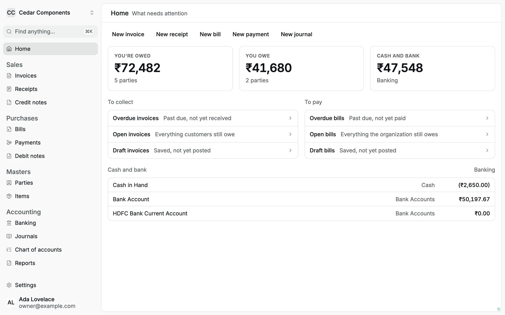
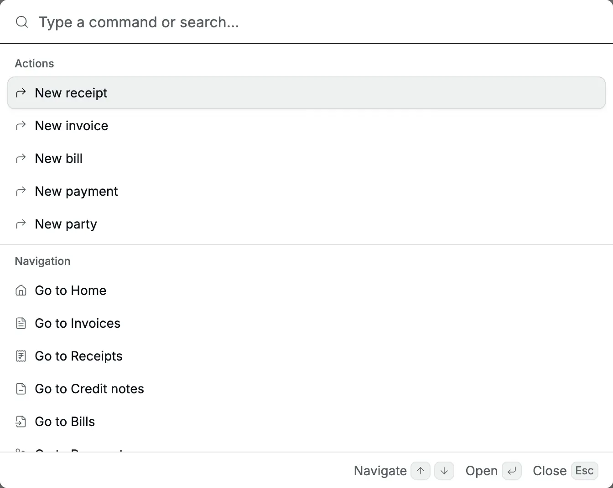
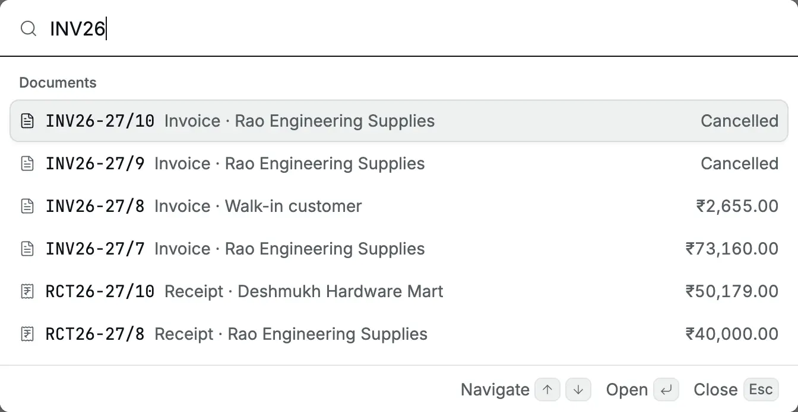
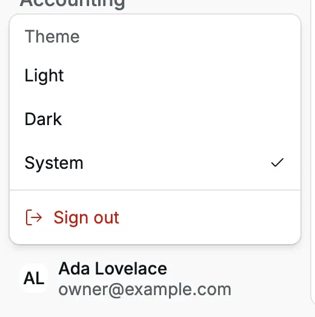
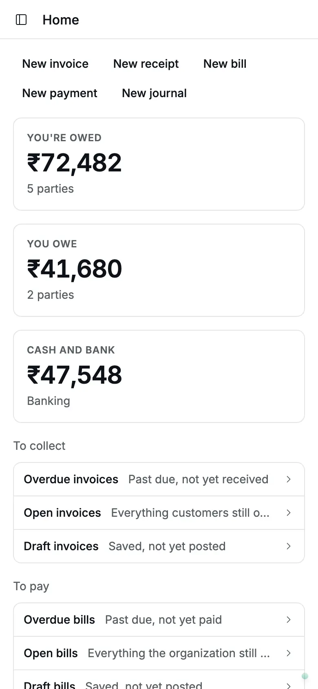
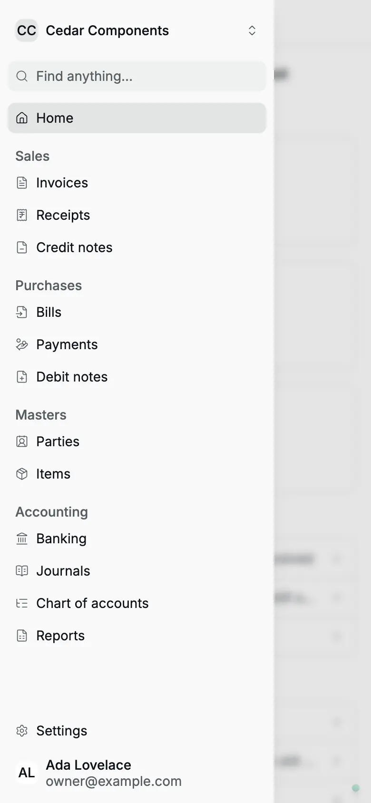

This page shows where things are in Accly Books and the quickest ways to reach
them. What you see depends on your role; see
[Roles and access](/getting-started/roles-and-access).

## The sidebar

<Frame caption="The owner's view of Cedar Components. The sidebar is on the left; Home is open.">
  
</Frame>

From top to bottom, the sidebar has:

1. **The organization switcher**: the current organization's name. See
   [Switch organization](#switch-organization).
2. **Find anything… ⌘K**: opens the [command palette](#the-command-palette).
3. **Home**.
4. Four groups of registers (a register is the list of one kind of record):

   | Group          | Pages                                                                                                                                                                    |
   | -------------- | ------------------------------------------------------------------------------------------------------------------------------------------------------------------------ |
   | **Sales**      | [Invoices](/glossary#invoice) (bills to customers), [Receipts](/glossary#receipt) (money in), [Credit notes](/glossary#credit-note) (reductions to what a customer owes) |
   | **Purchases**  | [Bills](/glossary#bill) (supplier invoices), [Payments](/glossary#payment) (money out), [Debit notes](/glossary#debit-note) (reductions to what you owe a supplier)      |
   | **Masters**    | [Parties](/glossary#party) (customers and suppliers), Items (goods and services you sell or buy)                                                                         |
   | **Accounting** | Banking, [Journals](/glossary#journal) (manual entries for adjustments), [Chart of accounts](/glossary#chart-of-accounts) (the list of every account), Reports           |

5. **Settings**, and your name with the account menu.

Click a group name to fold it away if you never use it. The group opens again
when you go to one of its pages. The sidebar shows only the pages your role can
open, so an operator sees a much shorter list.

## Home

**Home** answers "what needs attention today":

- **New** buttons for the [documents](/glossary#document) (invoices, receipts and the like) you can create: **New invoice**, **New
  receipt**, **New bill**, **New payment** and **New journal**.
- **You're owed**, **You owe** and **Cash and bank**: the totals across all
  parties and money accounts, in rupees.
- **To collect** and **To pay**: links to overdue, open and [draft](/glossary#draft) (saved, not yet final) invoices and
  bills. Each link opens the register with that filter already set.
- **Cash and bank**: each bank and cash account with its balance. Click
  **Banking** to see more.

An operator sees only the **New** buttons and **To collect**. The totals need a
role that can read reports.

## The command palette

Press **⌘K** on a Mac or **Ctrl+K** on Windows, from any page and even while you
type in a form. You can also click **Find anything…** in the sidebar. Press the
same keys again, or **Esc**, to close it.

<Frame caption="The palette before you type: actions first, then pages.">
  
</Frame>

The palette lists, in this order:

| Group             | What it does                                                                                              |
| ----------------- | --------------------------------------------------------------------------------------------------------- |
| **Actions**       | Starts a new receipt, invoice, bill, payment or party. Some pages add their own actions here.             |
| **Navigation**    | **Go to** any page in the sidebar. Type a word such as `audit` or `locks` to find a **Settings** tab too. |
| **Organizations** | **Switch to** another organization you belong to.                                                         |
| **Parties**       | Opens a party by name.                                                                                    |
| **Documents**     | Finds invoices, receipts, bills, payments and credit or debit notes.                                      |

Use **↑** and **↓** to move, **Enter** to open and **Esc** to close.

### Search for a document

Type at least three letters or digits of a document number, a party name or a
reference. The palette shows up to four matches of each document type, with the
party and the amount, or **Cancelled** for a cancelled document.

<Frame caption="Typing INV26 finds the latest invoices and any document whose reference matches.">
  
</Frame>

If the document you want is not among the first four, open its register and use
the search box there. Journals are not searched by the palette: open
**Journals** instead.

## Switch organization

Click the organization name at the top of the sidebar. The menu lists every
organization you belong to, with a tick next to the current one.

<Frame caption="The organization switcher, with Join organization below the list.">
  
</Frame>

- Choose another organization to open the same section there. For example, from
  **Invoices** in Cedar Components you land on **Invoices** in Ridgeview
  Academy. From a single record you land on its register, because a record
  belongs to only one organization.
- **Join organization** opens the **Join** page with your organizations and
  pending invitations (see [Getting started](/getting-started#choose-an-organization)).
- The person who runs the installation also sees **Create organization**.

Each browser tab keeps its own organization, so you can compare two
organizations side by side.

## Theme and sign out

Click your name at the bottom of the sidebar.

<Frame caption="The account menu: theme and sign out.">
  
</Frame>

- **Theme**: **Light**, **Dark** or **System** (follows your computer). The
  choice is kept on that browser.
- **Sign out**: ends your session on this browser.

## On a phone

Below laptop width, the sidebar hides. Tap the panel button at the top left of
any page to open it as a drawer. Tapping a page link closes the drawer; tap
outside it to close it without moving.

<Frame caption="Home on a 390-pixel-wide phone. The panel button is at the top left.">
  
</Frame>

<Frame caption="The navigation drawer on a phone holds the same sidebar.">
  
</Frame>

On a phone, lists show as cards, and the **⋯** button on each card is always
visible. On a computer, the **⋯** button on a list row appears when you point
at the row.

## Related pages

- [Getting started](/getting-started): sign in, invitations and organization addresses.
- [Roles and access](/getting-started/roles-and-access): why some pages are missing.
- [Administration](/administration): members, files and the audit log.
