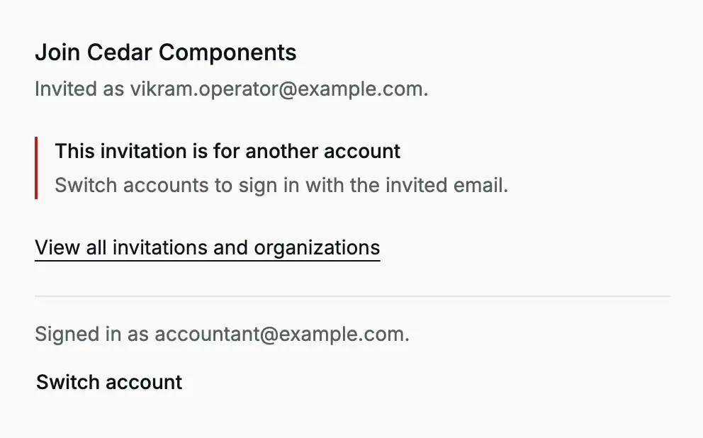
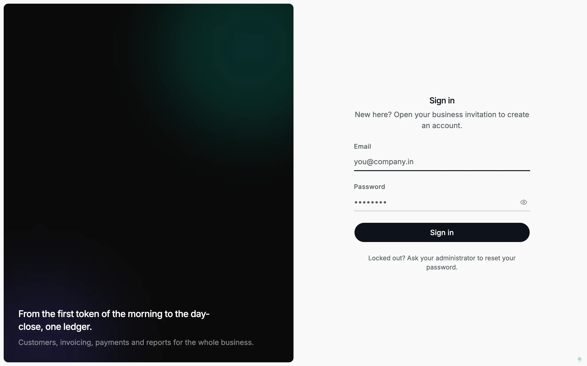
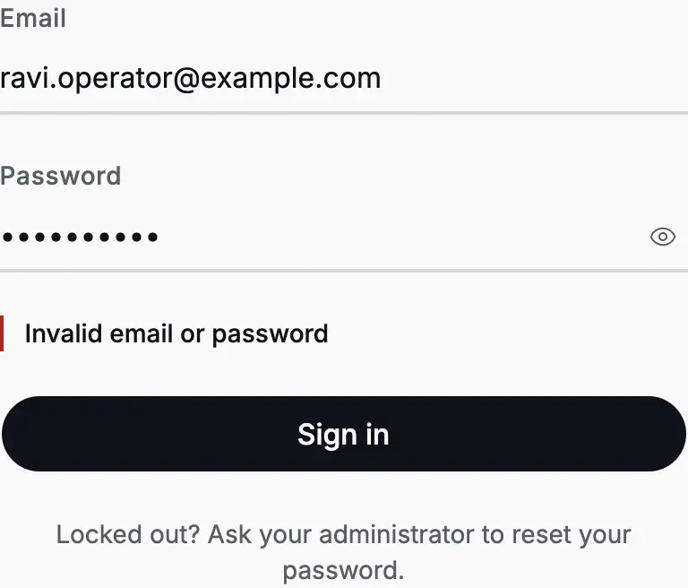
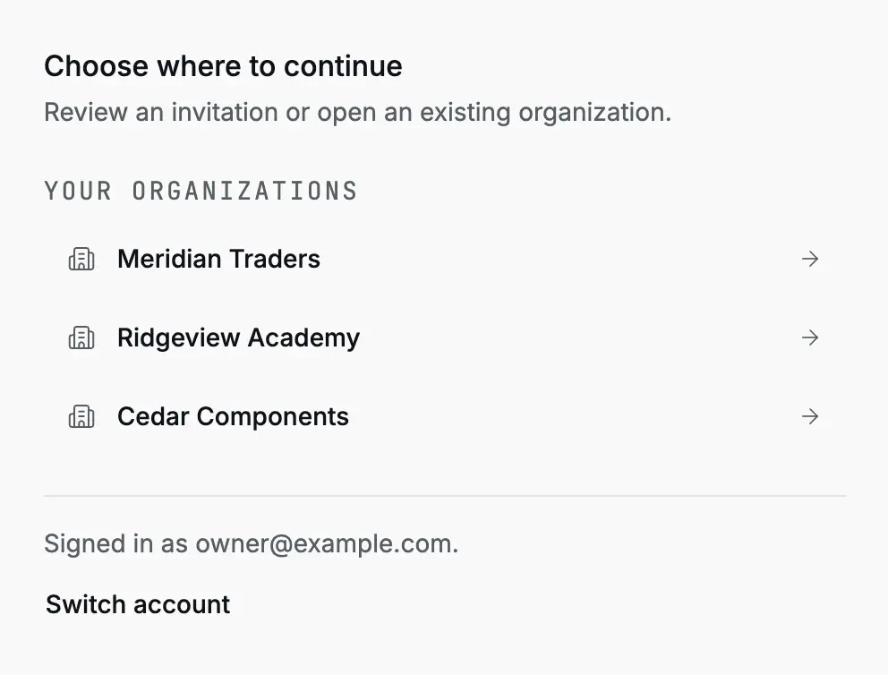
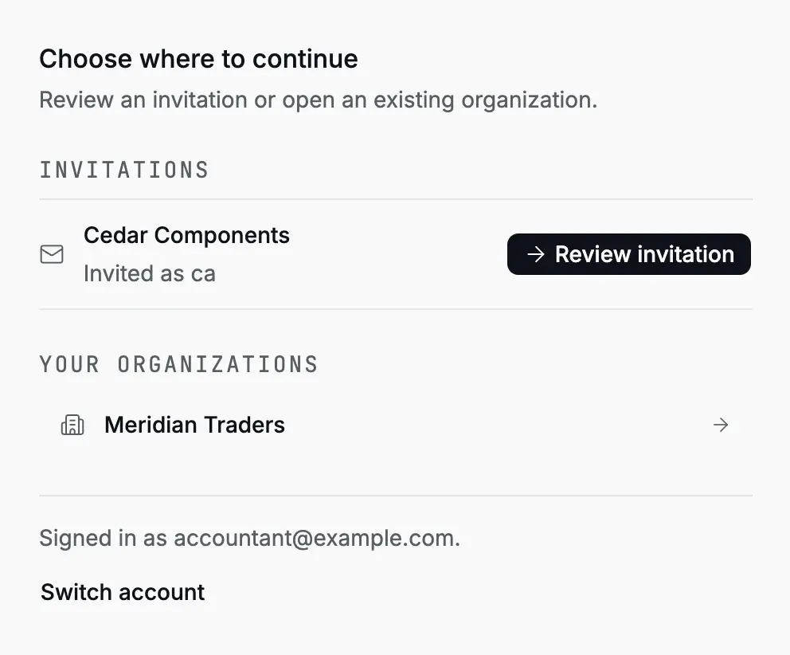

Accly Books keeps the books (the accounting records) of one or more organizations. Each person signs in
with their own account, and an organization's owner decides who can open its
books and what they can do there. This page covers your first sign-in and the
everyday steps around it.

## No public sign-up

There is no "Create account" button on the sign-in page. You get an account in
one of two ways:

- **An invitation from an organization owner.** The owner creates an invitation
  for your email address and sends you the link themselves, for example on
  WhatsApp. Accly Books does not send email.
- **An account made by the person who runs your Accly Books installation.** This
  is rare. It is used for the first owner of a new installation.

If you do not have an invitation link, ask the owner of the organization you
work for. Owners create invitations from **Settings → Members** (see
[Members and invitations](/administration/members)).

## Join from an invitation link

An invitation link looks like
`https://<your-accly-address>/join?invitation=01a10313-…`. It is for one email
address and one organization, and it expires 48 hours after the owner creates
it. Treat it like a temporary password: anyone who has the link and knows the
email address can create the account.

<Steps>
<Step title="Open the link">

The **Join** page shows the organization name and the invited email address,
for example "Join Cedar Components. Invited as priya.accountant@example.com."

</Step>
<Step title="Create your account, or sign in">

If this email address has no Accly Books account yet, enter your **Name** and a
**Password** of at least 8 characters, then click **Create account**.

If the email address already has an account (for example, you already work in
another organization), the page shows the sign-in form instead. Sign in with
your existing password.

<Frame caption="An invitation for an email address that already has an account asks the person to sign in.">
  
</Frame>

</Step>
<Step title="Click Join">

After the account step, the page shows **Join**. Click it. Accly Books adds you
to the organization with the [role](/glossary#roles) the owner chose (owner,
accountant, chartered accountant or operator, each with its own permissions) and opens the organization's
**Home** page.

</Step>
</Steps>

:::tip
Click **Join** straight away, in the same visit. If you close the page before
you click **Join**, open the same invitation link again. See the warning under
[Problems with an invitation](#problems-with-an-invitation).
:::

The [new team member scenario](/scenarios/new-team-member) walks through this
for an accountant and an operator, with screenshots of each step.

### Problems with an invitation

| What you see                                                                                                                  | What it means                                                                                                          | What to do                                                                                                                                        |
| ----------------------------------------------------------------------------------------------------------------------------- | ---------------------------------------------------------------------------------------------------------------------- | ------------------------------------------------------------------------------------------------------------------------------------------------- |
| "Could not open this invitation. This invitation is no longer available. Ask the sender for a new link."                      | The invitation expired, the owner cancelled it, or it was already used.                                                | Ask the owner for a new invitation.                                                                                                               |
| "This invitation is for another account. Switch accounts to sign in with the invited email."                                  | You are signed in with a different email address.                                                                      | Click **Switch account**, then sign in or create the account for the invited email.                                                               |
| "Could not load organizations and invitations. Email verification required to view or list invitations for the session email" | You opened `/join` without the invitation link. Accounts created from an invitation cannot list invitations there yet. | Open the original invitation link again. If you are already a member, go to your organization's address instead, for example `/cedar-components`. |

<Frame caption="An expired, cancelled or already used invitation link.">
  
</Frame>

<Frame caption="The invitation is for vikram.operator@example.com, but the browser is signed in as accountant@example.com.">
  
</Frame>

:::warning
Creating a second account with another email address does not restore an
invitation. An invitation works only for the email address it names.
:::

## Sign in

<Frame caption="The sign-in page. New people start from their invitation link instead.">
  
</Frame>

1. Open your Accly Books address. You see **Sign in**.
2. Enter your **Email** and **Password**, then click **Sign in**.
3. Accly Books opens the first organization you belong to, in alphabetical
   order. If you followed a link to a particular page, it opens that page.

If the email or password is wrong, the page shows "Invalid email or password".

<Frame caption="A wrong password shows one message for both fields, so nobody can learn which email addresses have accounts.">
  
</Frame>

:::note[Forgotten password]
The sign-in page says "Locked out? Ask your administrator to reset your
password." Accly Books has no password reset yet, and an organization owner
cannot reset a password from the app. Contact the person who runs your Accly
Books installation.
:::

A sign-in stays active for about a week on that browser. Sign out on a shared
computer.

## Choose an organization

If you belong to more than one organization, use the organization switcher at
the top of the sidebar to move between them (see
[Finding your way](/getting-started/finding-your-way#switch-organization)).

The **Join** page at `/join` also lists **Your organizations** and any pending
**Invitations** for your email address. Click an organization to open it, or
**Review invitation** to accept one. Open it from **Join organization** in the
organization switcher.

<Frame caption="The Join page lists your organizations. Pending invitations appear above them.">
  
</Frame>

<Frame caption="A pending invitation on the Join page. Click Review invitation, then Join.">
  
</Frame>

## Organization addresses

Every organization has its own permanent address, for example
`https://<your-accly-address>/cedar-components`. Every page of that organization
starts with it: `/cedar-components/receipts`, `/cedar-components/settings/members`.

- You can bookmark a page or send its link to a colleague. The colleague sees
  it only if they are a member of that organization and their role allows it.
- Each browser tab stays in the organization its address names. You can keep
  Cedar Components in one tab and another organization in a second tab.
- The address part (`cedar-components`) never changes, even if the
  organization's name changes.

:::warning
Before you record a [receipt](/glossary#receipt) (money received), upload a file or change a setting, check the
organization name at the top of the sidebar.
:::

If you open the address of an organization you do not belong to, Accly Books
sends you to the **Join** page. It does not say whether that organization
exists.

## Sign out

1. Click your name at the bottom of the sidebar.
2. Click **Sign out**.

Accly Books returns to the sign-in page and clears what it kept in the browser
for your account. On the **Join** page, **Switch account** does the same.

## Next steps

<CardGroup>
  <Card title="Roles and access" href="/getting-started/roles-and-access">
    What an owner, accountant, chartered accountant and operator can do.
  </Card>
  <Card title="Finding your way" href="/getting-started/finding-your-way">
    The sidebar, Home, the command palette and the phone menu.
  </Card>
  <Card title="Members and invitations" href="/administration/members">
    For owners: invite people and manage their roles.
  </Card>
</CardGroup>
