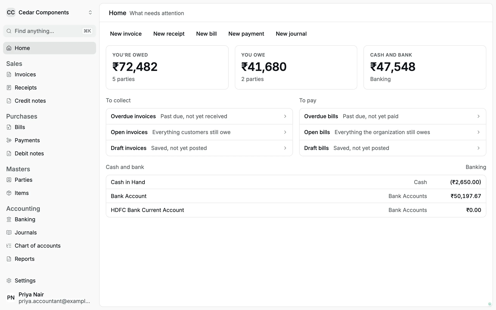
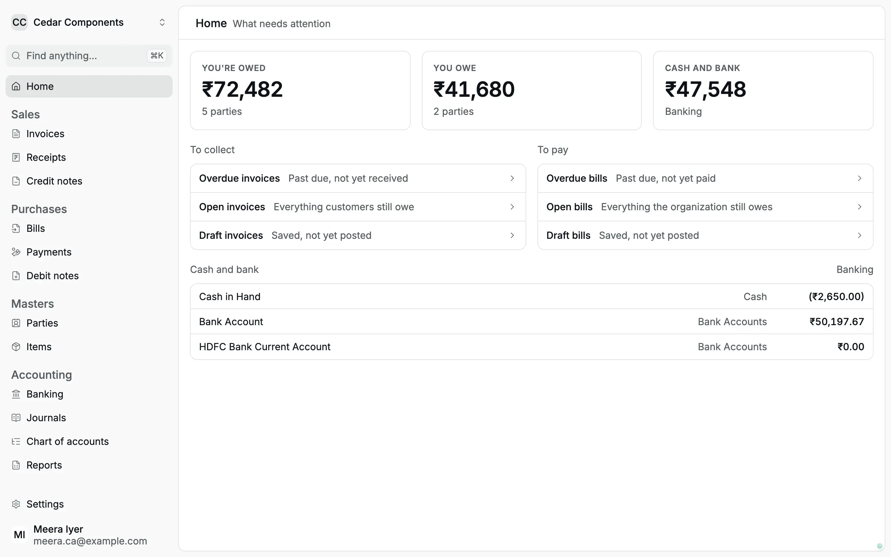
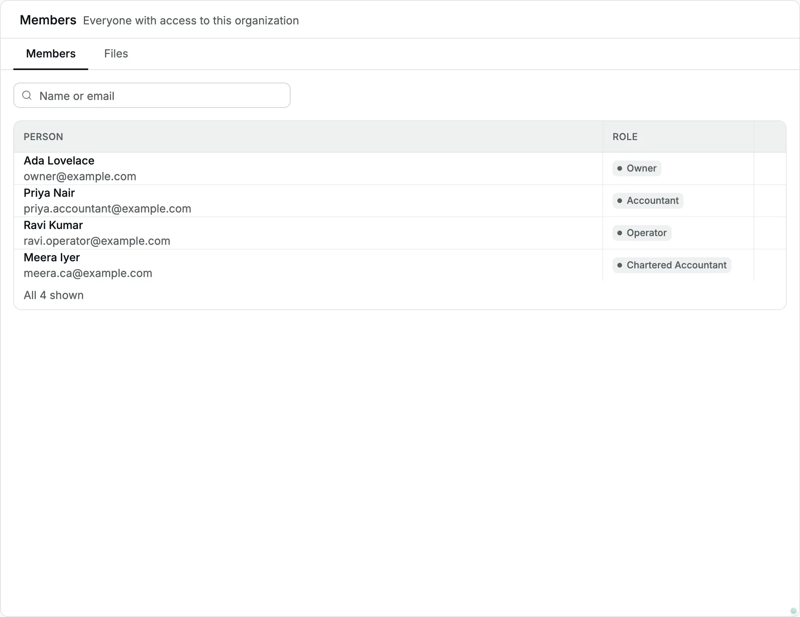

Every member of an organization has a [role](/glossary#roles), a fixed set of permissions. The role decides which pages appear
in the sidebar, which buttons appear on a record, and which requests the server
accepts. Accly Books has four roles:

| Role                     | Typical person                               | In one line                                                                                                                                                                                                                                               |
| ------------------------ | -------------------------------------------- | --------------------------------------------------------------------------------------------------------------------------------------------------------------------------------------------------------------------------------------------------------- |
| **Owner**                | The proprietor, partner or director          | Does everything, and is the only one who manages members, organization settings and files.                                                                                                                                                                |
| **Accountant**           | The in-house accountant                      | Keeps the books: masters (parties, items and accounts), every [document](/glossary#document), [credits](/glossary#credit), [opening balances](/glossary#opening-balance), import and reports. Does not manage members or settings.                        |
| **Chartered Accountant** | Your CA (Chartered Accountant) or audit firm | Reads everything, downloads reports, and closes periods with [locks](/glossary#lock), which stop changes to past dates. Never records or cancels a document.                                                                                              |
| **Operator**             | A billing or front-desk clerk                | Records [invoices](/glossary#invoice) (bills to customers), [receipts](/glossary#receipt) (money in) and [payments](/glossary#payment) (money out) at the desk. Never cancels, creates [parties](/glossary#party) or items, or sees reports and balances. |

The owner picks the role when they invite someone and can change it later (see
[Members and invitations](/administration/members)). A role belongs to one
organization: the same person can be an accountant in one organization and an
owner in another.

## Permission matrix

✓ means the role can do it. A dash means the page or button does not appear for
that role, and the server refuses the request if someone tries it anyway.

A few words used in the tables: a [draft](/glossary#draft) is a saved document
that does not touch the books yet; to [post](/glossary#post) is to make it final
so it enters the books; to [cancel](/glossary#reversal) a posted document adds an
equal and opposite entry, so the original stays visible. A
[bill](/glossary#bill) is a supplier's invoice to you. A
[credit note](/glossary#credit-note) reduces what a customer owes you, and a
[debit note](/glossary#debit-note) reduces what you owe a supplier. To
[apply a credit](/glossary#allocation) is to set an advance or credit note
against a specific invoice or bill.

### Sales and purchases

| Task                                           | Owner | Accountant | Chartered Accountant | Operator |
| ---------------------------------------------- | :---: | :--------: | :------------------: | :------: |
| View invoices and receipts                     |   ✓   |     ✓      |          ✓           |    ✓     |
| Save draft invoices and post invoices          |   ✓   |     ✓      |          —           |    ✓     |
| Record (post) receipts                         |   ✓   |     ✓      |          —           |    ✓     |
| Cancel an invoice or receipt                   |   ✓   |     ✓      |          —           |    —     |
| View payments                                  |   ✓   |     ✓      |          ✓           |    ✓     |
| Record (post) payments                         |   ✓   |     ✓      |          —           |    ✓     |
| Cancel a payment                               |   ✓   |     ✓      |          —           |    —     |
| View bills                                     |   ✓   |     ✓      |          ✓           |    —     |
| Save, post and cancel bills                    |   ✓   |     ✓      |          —           |    —     |
| View credit notes and debit notes              |   ✓   |     ✓      |          ✓           |    —     |
| Post and cancel credit notes and debit notes   |   ✓   |     ✓      |          —           |    —     |
| Apply or reverse a credit on a posted document |   ✓   |     ✓      |          —           |    —     |
| Print or download a document PDF               |   ✓   |     ✓      |          ✓           |    ✓     |

An operator can settle open invoices while recording a receipt (**Against open
items**). Applying an [advance](/glossary#advance) (money received before the
invoice) or a credit note later, from the invoice, needs an
accountant or owner.

### Masters and accounting

| Task                                                                                                     | Owner | Accountant | Chartered Accountant | Operator |
| -------------------------------------------------------------------------------------------------------- | :---: | :--------: | :------------------: | :------: |
| View parties, items and the [chart of accounts](/glossary#chart-of-accounts) (the list of every account) |   ✓   |     ✓      |          ✓           |    ✓     |
| Create and edit parties, items and accounts                                                              |   ✓   |     ✓      |          —           |    —     |
| View **Banking** (bank and cash accounts with balances, [payment methods](/glossary#payment-method))     |   ✓   |     ✓      |          ✓           |    —     |
| Add bank accounts and payment methods                                                                    |   ✓   |     ✓      |          —           |    —     |
| View [journals](/glossary#journal) (manual entries for adjustments)                                      |   ✓   |     ✓      |          ✓           |    —     |
| Post and cancel journals                                                                                 |   ✓   |     ✓      |          —           |    —     |
| View the opening balance                                                                                 |   ✓   |     ✓      |          ✓           |    —     |
| Post and cancel the opening balance                                                                      |   ✓   |     ✓      |          —           |    —     |
| Import a workbook (**Settings → Import**)                                                                |   ✓   |     ✓      |          —           |    —     |

### Reports and balances

| Task                                                                                                                                                                             | Owner | Accountant | Chartered Accountant | Operator |
| -------------------------------------------------------------------------------------------------------------------------------------------------------------------------------- | :---: | :--------: | :------------------: | :------: |
| Home totals (**You're owed**, **You owe**, **Cash and bank**)                                                                                                                    |   ✓   |     ✓      |          ✓           |    —     |
| Party balances and a party's **Ledger** tab ([ledger](/glossary#ledger): every entry for one account or party)                                                                   |   ✓   |     ✓      |          ✓           |    —     |
| [Trial balance](/glossary#trial-balance), [profit and loss](/glossary#profit-and-loss), [balance sheet](/glossary#balance-sheet), account ledger, [day book](/glossary#day-book) |   ✓   |     ✓      |          ✓           |    —     |
| Download reports and party statements (Excel, PDF)                                                                                                                               |   ✓   |     ✓      |          ✓           |    —     |

### Control and administration

| Task                                                                                                                              | Owner | Accountant | Chartered Accountant | Operator |
| --------------------------------------------------------------------------------------------------------------------------------- | :---: | :--------: | :------------------: | :------: |
| View period locks                                                                                                                 |   ✓   |     ✓      |          ✓           |    —     |
| Set or change a lock, grant a [lock exception](/glossary#lock-exception) (a time-limited permission to post into a locked period) |   ✓   |     —      |          ✓           |    —     |
| Edit organization settings (legal name, address, [PAN](/glossary#pan) (Permanent Account Number), document prefixes)              |   ✓   |     —      |          —           |    —     |
| See who is a member                                                                                                               |   ✓   |     ✓      |          ✓           |    ✓     |
| Invite people, see pending invitations, change roles, remove members                                                              |   ✓   |     —      |          —           |    —     |
| View and open files                                                                                                               |   ✓   |     ✓      |          ✓           |    ✓     |
| Upload and delete files                                                                                                           |   ✓   |     —      |          —           |    —     |
| Read the [audit log](/glossary#audit-log) (the record of who did each sensitive action)                                           |   ✓   |     ✓      |          ✓           |    —     |

The roles are fixed. You cannot create a custom role or switch off a single
permission.

## How the app looks for each role

### Owner

The owner sees every sidebar entry, every **New** button on **Home**, and all
seven **Settings** tabs: **Organization**, **Members**, **Opening balance**,
**Import**, **Locks**, **Files** and **Audit**.

### Accountant

The accountant sees the same sidebar and **Home** as the owner. In
**Settings**, the **Organization** tab is missing, and **Members** shows the
team without the **Invite** button or row actions.

<Frame caption="Priya, an accountant, sees the full sidebar and Home with all totals.">
  
</Frame>

<Frame caption="Settings for an accountant: six tabs, and a read-only member list.">
  
</Frame>

### Chartered Accountant

The CA sees every register and report but no **New** buttons on **Home**. On a
document, only **PDF**, **Print** and **Close** appear. In **Settings**, the CA
has **Members**, **Opening balance**, **Locks**, **Files** and **Audit**, and
on **Locks** the CA can change the **Books lock** and the **Tax period lock**.

<Frame caption="Meera, the CA: all registers and totals, but nothing to create.">
  
</Frame>

<Frame caption="The CA closes periods on Settings → Locks.">
  
</Frame>

### Operator

The operator's sidebar has only **Invoices**, **Receipts**, **Payments**,
**Parties**, **Items** and **Chart of accounts**. **Home** shows **New
invoice**, **New receipt** and **New payment** and the invoice lists, but no
money totals. A posted receipt shows **Print**, not **Cancel receipt**.
**Settings** has only **Members** and **Files**.

<Frame caption="Ravi, an operator: desk work only, without balances or reports.">
  
</Frame>

<Frame caption="An operator can print a posted receipt but cannot cancel it.">
  
</Frame>

<Frame caption="Settings for an operator: Members and Files only.">
  
</Frame>

## When an action is not there

- If a page your role cannot open is reached from a bookmark or an old link,
  Accly Books opens **Home** instead. It does not show a message.
- If a screen is out of date (for example, the owner changed your role while
  you were working), the server refuses the request with "You do not have
  permission to do that." Reload the page to see what your role now allows.
- Every refused request is written to the [audit log](/administration/audit-log)
  as a **Permission check** with a **Denied** badge, so the owner can see it.

Ask the owner when you need an action your role does not have. Do not borrow
another person's account: the audit log records who did each sensitive action.

## Related pages

- [Members and invitations](/administration/members): invite people and change roles.
- [Audit log](/administration/audit-log): what is recorded about each person's actions.
- [Hiring an accountant and an operator](/scenarios/new-team-member): a worked example.
