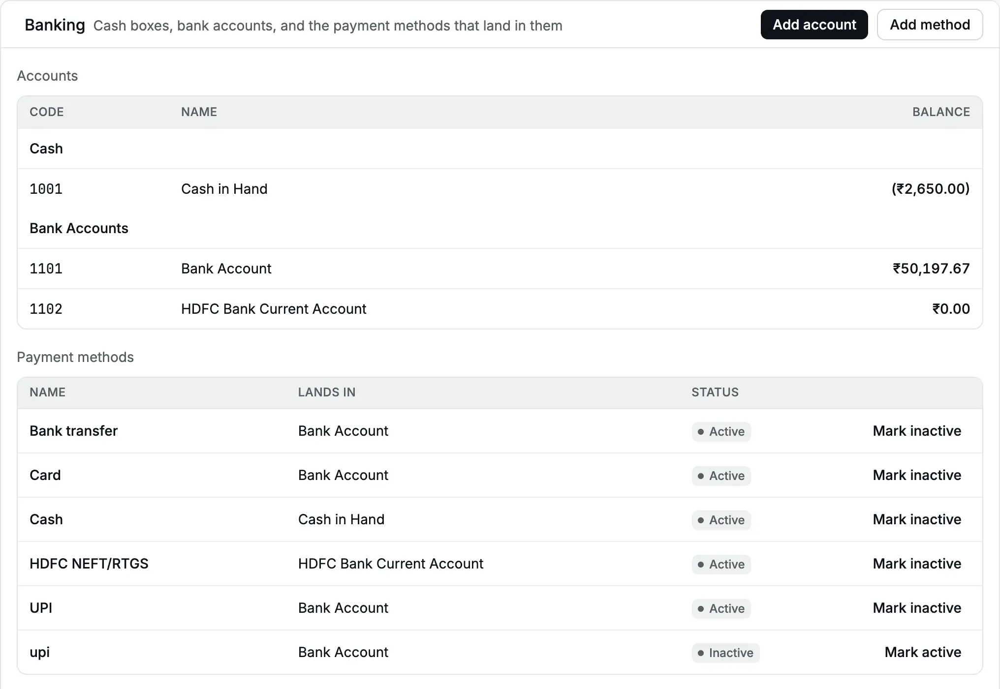
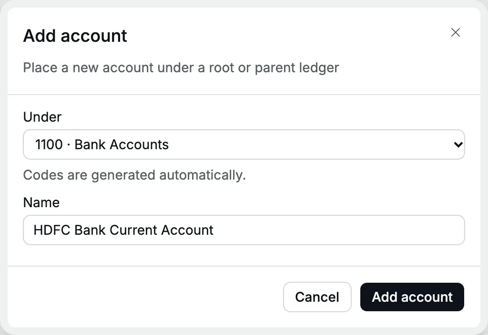
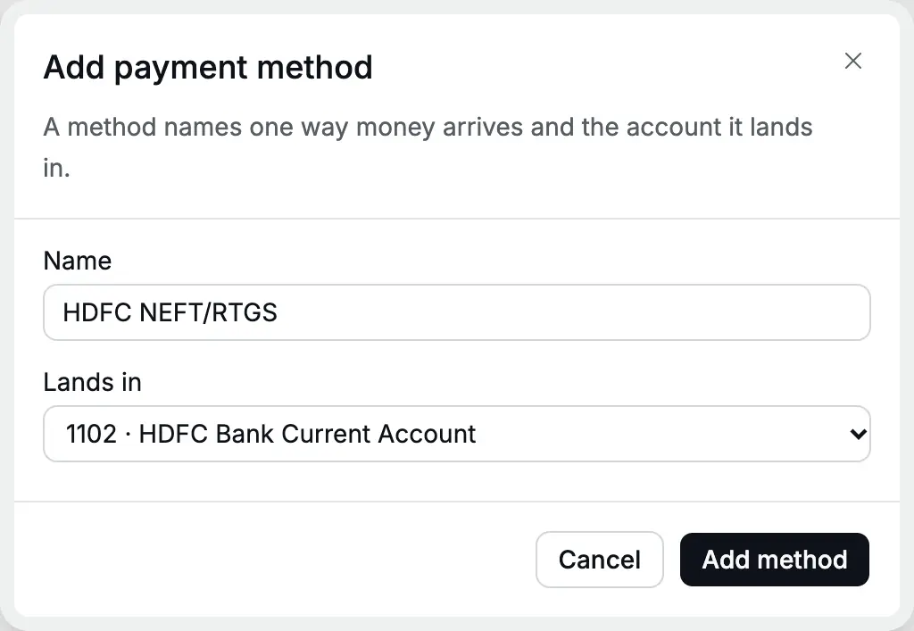

**Banking** lists where your money is kept and the ways it moves. A **money account**
is one cash box or one bank account. A [payment method](/glossary#payment-method) is a
named way money arrives or leaves, such as UPI, NEFT or Cash, and each method posts to
one money account. [UPI and NEFT](/glossary#upi-neft) are the instant-mobile and
bank-transfer systems Indian banks use.

On a [receipt](/glossary#receipt) (money in) or [payment](/glossary#payment) (money out)
you choose only the method. Accly Books then debits or credits the account behind it
([debit and credit](/glossary#debit-credit) are the two equal sides of every entry). So set up one account for each real bank account, then
one method for each way money reaches it.

**Who can do it:** an **Owner** or **Accountant** (see [roles](/glossary#roles)) adds accounts, adds methods and marks
methods inactive. A **Chartered Accountant** can see the page and its balances. An
**Operator** does not see **Banking**, but chooses methods on receipts and payments.

## Read the page

Open **Accounting → Banking**. The page has two tables.

<Frame caption="Banking for Cedar Components: a cash box, two bank accounts and their payment methods.">
  
</Frame>

**Accounts** lists every money account under its group, **Cash** or **Bank
Accounts**, with its **Code**, **Name** and **Balance**. The balance is the sum of
every [posted](/glossary#post) entry to that account dated through today in your organization's time zone,
matching the balance sheet as of today. Future-dated entries count only when their date arrives;
you can still post them without a warning.
It is the book balance, not your bank statement: cheques you have recorded but the
bank has not cleared are included. A balance in brackets, such as (₹2,650.00), is a credit balance, or
[overdrawn](/glossary#overdrawn): the books show more paid out than received. For cash that means an entry is missing or wrongly dated.

**Payment methods** lists each method with the account it **Lands in** and its
**Status**:

| Status               | Meaning                                                                                                                                                      |
| -------------------- | ------------------------------------------------------------------------------------------------------------------------------------------------------------ |
| **Active**           | Offered on receipts and payments                                                                                                                             |
| **Inactive**         | Hidden from new receipts and payments. Past [documents](/glossary#document) keep it                                                                          |
| **Account inactive** | The method is active but its account is inactive, so posting with it is refused. Reactivate the account in the [chart of accounts](/setup/chart-of-accounts) |

A new organization starts with **Cash in Hand** (1001) under Cash, **Bank Account**
(1101) under Bank Accounts, and the methods **Cash**, **UPI**, **Card** and **Bank
transfer**. To give **Bank Account** your bank's name, rename it in the
[chart of accounts](/setup/chart-of-accounts#edit-an-account).

## Add a bank account and its method

Cedar Components opens a current account with HDFC Bank and receives customer NEFT
and RTGS payments there.

<Steps>
  <Step title="Add the account">
    Click **Add account**. **Under** starts on **Bank Accounts**; choose **Cash** for a cash box
    instead. Type the **Name**, for example **HDFC Bank Current Account**. Include the last four
    digits of the account number if you have more than one account with a bank.
  </Step>
  <Step title="Save the account">
    Click **Add account**. Accly Books gives it the next code in the group, here **1102**, and opens
    **Add payment method** straight away.
  </Step>
  <Step title="Name the method">
    **Lands in** already shows the new account. Type the method's **Name**, for example **HDFC
    NEFT/RTGS**.
  </Step>
  <Step title="Save the method">
    Click **Add method**. You see "Payment method added". Both rows now show on the page, as in the
    first picture, and the new account's balance is ₹0.00.
  </Step>
</Steps>

<Frame caption="Add account starts under Bank Accounts.">
  
</Frame>

<Frame caption="The method form opens next, with the new account chosen.">
  
</Frame>

To add another method to an existing account, for example **HDFC cheque**, click
**Add method** and choose the account in **Lands in**. Only active accounts are
offered. A receipt or payment form offers **Add one** under **Payment method** only
when no active method exists at all; otherwise add methods here on **Banking**.

Method names must be unique ignoring case and surrounding spaces: **upi** cannot be
added beside **UPI**. A method name cannot be changed after you save it.

To rename a cash or bank account, open it in the
[chart of accounts](/setup/chart-of-accounts#edit-an-account). The account's code,
payment methods and entries stay the same.

## Opening balance of a bank account

A new account starts at ₹0.00. Bring in the balance on your cutover date with the
[Opening balance](/setup/opening-balance), the [balances you start with](/glossary#opening-balance). Do not post a receipt for it: a receipt
would count the old money as new income or a new advance.

## Mark a method or account inactive

To stop using a method, click **Mark inactive** on its row. It disappears from new
receipts and payments. Click **Mark active** to bring it back.

To close a bank account:

1. Move any remaining balance to another account with a
   [Journal](/accounting/journals) (a manual entry; one between money accounts is a
   [contra](/glossary#contra) entry), so the closed account shows ₹0.00.
2. Mark every method that lands in it inactive.
3. In **Chart of accounts**, open the account and click **Mark inactive**. While an
   active method still uses it, this is refused with "This account is used by the
   active Payment Method "…"."

The account stays on **Banking** with an **Inactive** badge and its balance.

## What happens in the books

A method is a shortcut, not an account. When you post a receipt of ₹20,000 by
**HDFC NEFT/RTGS** from a customer, the [journal entry](/glossary#journal-entry) is
(Accounts Receivable is the [control account](/glossary#control-account) for what customers owe):

| Account                   | Debit      | Credit     |
| ------------------------- | ---------- | ---------- |
| HDFC Bank Current Account | ₹20,000.00 |            |
| Accounts Receivable       |            | ₹20,000.00 |

## Related pages

- [Chart of accounts](/setup/chart-of-accounts): manage a money account alongside your other accounts.
- [Receipts](/sales/receipts) and [Payments](/purchases/payments): choose a method on each.
- [Journals](/accounting/journals): transfer money between your own accounts.
- [Account ledger](/reports/account-ledger): every entry in one bank account.
