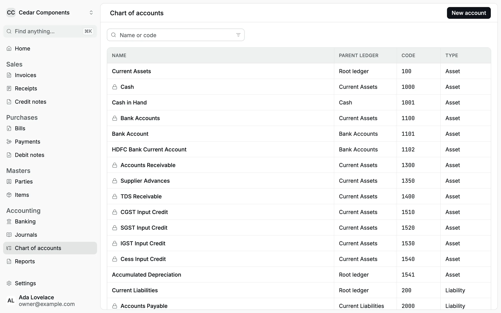
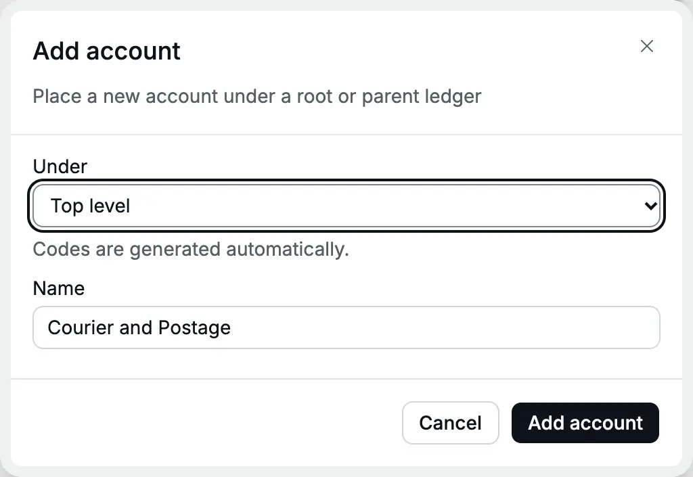
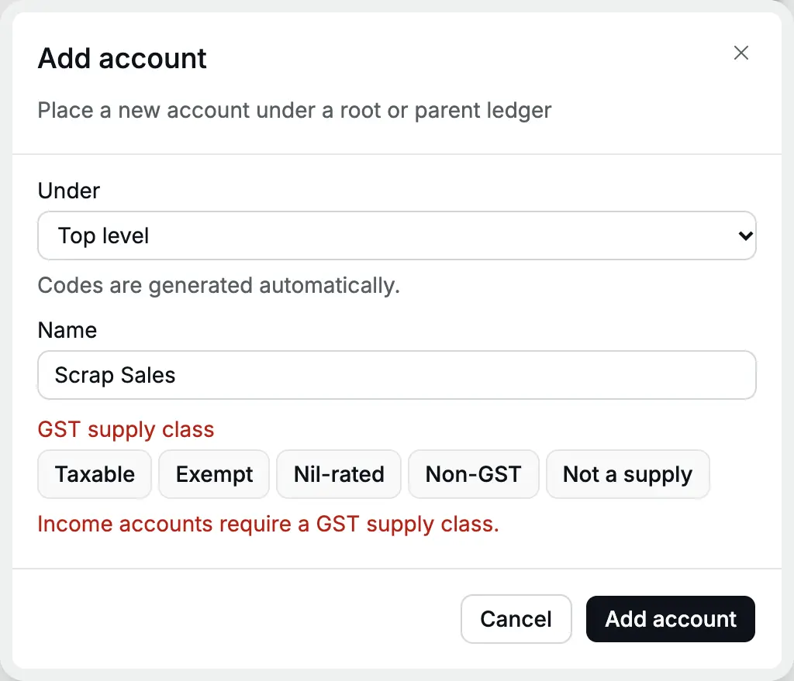
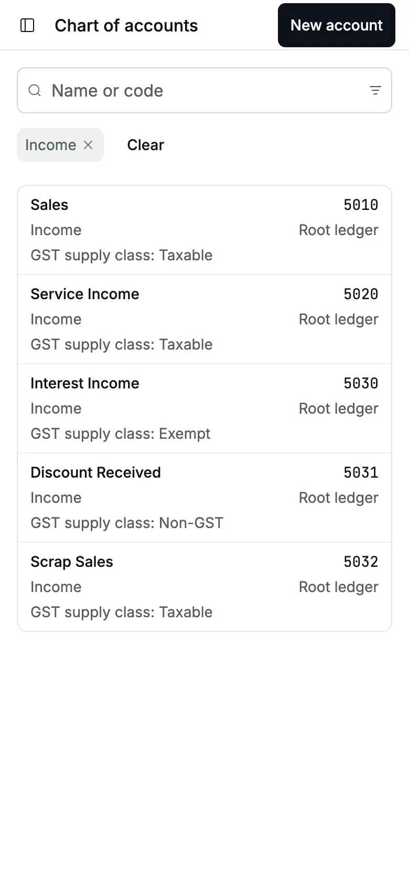
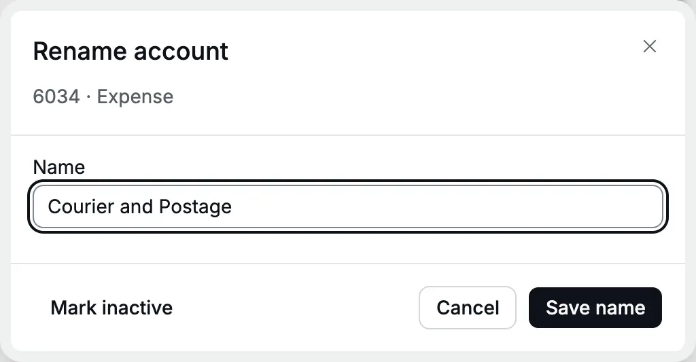
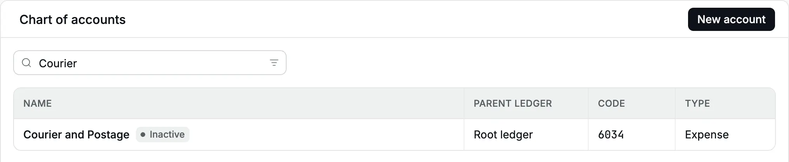

The [chart of accounts](/glossary#chart-of-accounts) is the list of every
[ledger](/glossary#ledger) (the running record of one account) your books post to: cash
and bank, [receivables](/glossary#receivable) (money customers owe you),
[GST](/glossary#gst), capital, sales, expenses. Each [posted](/glossary#post)
[document](/glossary#document) writes to these accounts, and every report is built from
them.

Every organization starts with a ready chart, so you can post on the first day. Add
accounts when your business needs a ledger the chart does not have, for example a
**Courier and Postage** expense or a **Scrap Sales** income.

**Who can do it:** an **Owner** or **Accountant** (see [roles](/glossary#roles)) adds, renames and marks accounts
inactive. A **Chartered Accountant** and an **Operator** can see the chart.

## Read the chart

Open **Accounting → Chart of accounts**. Each row shows the account **Name**, its
**Parent ledger**, its **Code** and its **Type**: Asset, Liability, Equity, Income or
Expense (see [assets, liabilities and equity](/glossary#assets-liabilities-equity)). Search by name or code. The filter icon in the search box filters by
**Type**.

<Frame caption="The chart of accounts of Cedar Components. A lock marks a system account.">
  
</Frame>

There are three kinds of row:

| Kind                                                 | Example                                                | Posts?                              |
| ---------------------------------------------------- | ------------------------------------------------------ | ----------------------------------- |
| **Group** ([group account](/glossary#group-account)) | Current Assets (100), Bank Accounts (1100)             | No. It only collects the rows below |
| **System account**                                   | Accounts Receivable (1300), CGST Output Payable (2210) | Yes, but only from documents        |
| **Account**                                          | Cash in Hand (1001), Professional Fees (6031)          | Yes                                 |

### System accounts

A lock icon marks a [system account](/glossary#system-account): one Accly Books posts
to itself, from the documents you post. Accounts Receivable and Accounts Payable are
[control accounts](/glossary#control-account), totals of every customer's or vendor's
balance:

| System account                                       | Posted by                                                                                                                                                       |
| ---------------------------------------------------- | --------------------------------------------------------------------------------------------------------------------------------------------------------------- |
| Accounts Receivable (1300), Accounts Payable (2000)  | Invoices, bills, receipts, payments, notes, opening items                                                                                                       |
| Customer Advances (2150), Supplier Advances (1350)   | [Advance](/glossary#advance) receipts and payments (money paid before the invoice)                                                                              |
| CGST, SGST, IGST and Cess Output Payable (22xx)      | Invoices and credit notes ([output tax](/glossary#output-tax): GST you collect; see [CGST, SGST and IGST](/glossary#cgst-sgst-igst) and [cess](/glossary#cess)) |
| CGST, SGST, IGST and Cess Input Credit (15xx)        | Bills and debit notes ([ITC](/glossary#itc), input tax credit: GST you paid and may deduct)                                                                     |
| TDS Receivable (1400), TDS Payable (2300)            | Receipts with [TDS](/glossary#tds) (tax deducted at source) deducted, bills with TDS                                                                            |
| Round Off (6900)                                     | Invoices and bills that [round the total](/glossary#round-off) to the rupee                                                                                     |
| Share Capital, Capital Account or Corpus Fund (3000) | Your opening equity; also open to Journals                                                                                                                      |
| Cash (1000), Bank Accounts (1100)                    | Groups that hold your money accounts (see [Banking](/setup/banking))                                                                                            |

You can rename a system account, but you cannot mark it inactive. You cannot pick
**Accounts Payable** ([payable](/glossary#payable)) or an advance account in a [Journal](/accounting/journals)
(a manual [journal](/glossary#journal) entry) or the [Opening balance](/setup/opening-balance)
(the [balances you start with](/glossary#opening-balance)). A Journal can use Accounts Receivable only
with a [party](/glossary#party) (customer or vendor) on the line, and the Opening balance form cannot use it at all.
GST input, output and cess accounts are available in both: use them for
cutover balances, GST payments and input-tax set-off. GST journals change
the ledger balances, not the GST registers; see
[GST settlement journals](/accounting/journals#record-a-gst-payment-or-input-tax-set-off).

### Account codes

Accly Books gives each new account the next free code for its type. You do not type
codes.

| Type      | New codes |
| --------- | --------- |
| Asset     | 1200–1999 |
| Liability | 2000–2999 |
| Equity    | 3001–3999 |
| Income    | 5000–5999 |
| Expense   | 6000–6799 |

A new bank or cash account takes the next code inside its group instead, for example
**1102** under Bank Accounts (1100).

:::note
The code is the next number after the highest code of that type. It does not follow
the parent: a new asset account after **Cess Input Credit (1540)** gets **1541**, even
at the top level. Search by name if the code order looks mixed.
:::

## Add an expense account

Cedar Components starts sending samples by courier and wants the cost in its own
ledger.

<Steps>
  <Step title="Open the form">
    In **Chart of accounts**, click **New account**. The **Add account** panel opens.
  </Step>
  <Step title="Choose where it belongs">
    In **Under**, choose a group, or **Top level** under the type you need. The list is grouped by
    type: choose **Top level** in the **Expense** part. A new organization has no expense groups, so
    most expense accounts go at the top level.
  </Step>
  <Step title="Name it">
    Type **Courier and Postage** in **Name**. Names are unique among active accounts, in any mix of
    capitals.
  </Step>
  <Step title="Save">
    Click **Add account**. You see "Account added". The account appears with code **6034**.
  </Step>
</Steps>

<Frame caption="A new top-level expense account. The code is generated when you save.">
  
</Frame>

:::tip
After you choose an option in **Under**, the box shows only "Top level" or the
group's name, not the type. Open the list again to check that you chose **Top level**
in the right type.
:::

## Add an income account

Cedar Components sells brass scrap from its workshop. Scrap is a taxable supply, so
it needs a taxable income account.

<Steps>
  <Step title="Choose Top level under Income">
    Click **New account**. In **Under**, choose **Top level** in the **Income** part.
  </Step>
  <Step title="Name it">Type **Scrap Sales**.</Step>
  <Step title="Choose the GST supply class">
    For an income account, **GST supply class** appears. Choose **Taxable**.
  </Step>
  <Step title="Save">Click **Add account**. The account gets code **5032**.</Step>
</Steps>

<Frame caption="An income account needs a GST supply class.">
  
</Frame>

If you save an income account without a class, the panel shows "Income accounts
require a GST supply class."

<Frame caption="Saving an income account without a GST supply class.">
  
</Frame>

### GST supply class

The [supply class](/glossary#supply-class) tells Accly Books how GST treats the income in
this account. Every
item takes its GST treatment from its income account.

| Class            | Use it for                                              | Example                                |
| ---------------- | ------------------------------------------------------- | -------------------------------------- |
| **Taxable**      | Supplies that carry GST. Items under it need a GST rate | Sales of valves, installation services |
| **Exempt**       | Supplies exempt from GST                                | School fees, interest on deposits      |
| **Nil-rated**    | Supplies with a GST rate of 0%                          | Fresh vegetables, unbranded grains     |
| **Non-GST**      | Supplies outside GST law                                | Petrol, diesel, liquor for drinking    |
| **Not a supply** | Income that is not a supply at all                      | Insurance claims, discounts received   |

The ready chart sets the class of its income accounts, for example **Sales** is
Taxable and **Interest Income** is Exempt. A trust or society starts with **Fees** as
Exempt; the professional chart's **Rent Received** is Taxable for commercial letting.
You can change the class in **Edit account** before the account's first posting.
Once it has posted entries, mark the account inactive and add a new one if you
chose the wrong class.

If you change an account from Exempt to Taxable, choose a GST rate on each
[item](/setup/items#gst-rate-and-the-income-account) that uses it before invoicing
in a GST-registered organization.

The desktop list does not show the class. Filter by **Type** → **Income** on a phone,
where each card shows "GST supply class: …", or open an item that uses the account.

<Frame caption="On a phone, each income account shows its supply class.">
  
</Frame>

## Edit an account

Click the account's row. The **Edit account** panel shows its code and type. Change
**Name** and click **Save**. You see "Account saved". For an income account, you can
also change **GST supply class** while it has no posted entries. The code, type,
parent and posted entries stay the same, and reports show the new name.

<Frame caption="Edit an account's name, or mark it inactive.">
  
</Frame>

## Mark an account inactive

Mark an account [inactive](/glossary#inactive) when you stop using it. It leaves the pickers on new
documents, but its past entries and balance stay in every report.

1. Click the account's row.
2. Click **Mark inactive**. There is no confirmation. You see "Account marked
   inactive", and the row shows an **Inactive** badge.
3. To use it again, open it and click **Mark active**.

<Frame caption="An inactive account keeps its history and shows a badge.">
  
</Frame>

Rules:

- Groups and system accounts cannot be marked inactive. The button does not show for
  them.
- An income account used by an active item is refused: "This account is used by the
  active Item "…"." Mark the item inactive first, or move it to another account.
- A cash or bank account used by an active [payment method](/glossary#payment-method)
  (a named way money moves, such as UPI) is refused: "This account
  is used by the active Payment Method "UPI"." Mark the method inactive first.
- An account that still has a balance can be marked inactive. Clear an asset or
  liability balance by a [Journal](/accounting/journals) first, so your
  [balance sheet](/glossary#balance-sheet) does not carry a ledger you can no longer post to.
  A Journal cannot use a taxable income account in a GST-registered organization:
  correct such income with a [credit note](/sales/credit-notes), and mark the account
  inactive once you stop invoicing to it.
- A new account can reuse the name of an inactive one.

## What you cannot do

- **Delete an account.** Mark it inactive instead.
- **Add a group.** New accounts always take postings. Put them under an existing
  group or at the top level.
- **Change the type or parent** after you save. Add a new account and mark the old
  one inactive.
- **Change the supply class after a posting.** Add a new account with the correct
  class and mark the old one inactive.

## Related pages

- [Banking](/setup/banking): add a bank or cash account and its payment method.
- [Items](/setup/items): every item names an income account.
- [Opening balance](/setup/opening-balance): carry balances into these accounts.
- [Trial balance](/reports/trial-balance): every account's balance for a period.
