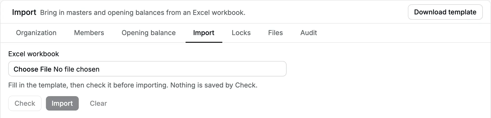
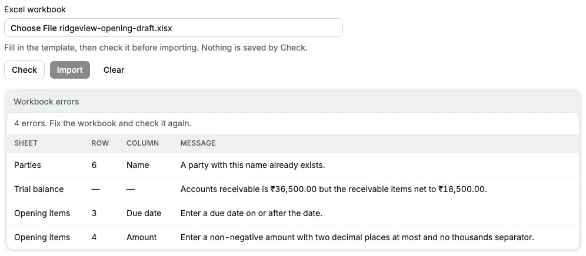
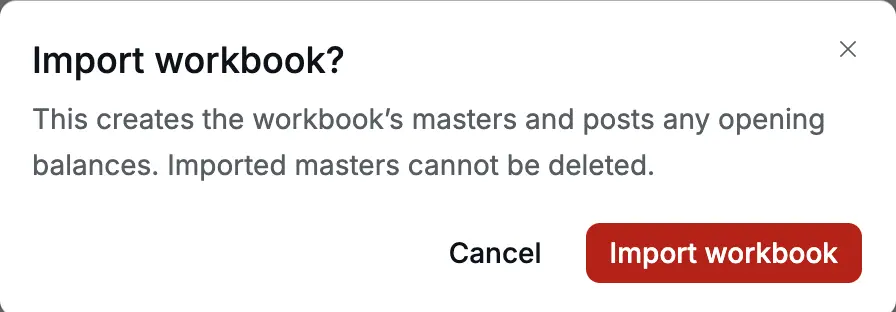
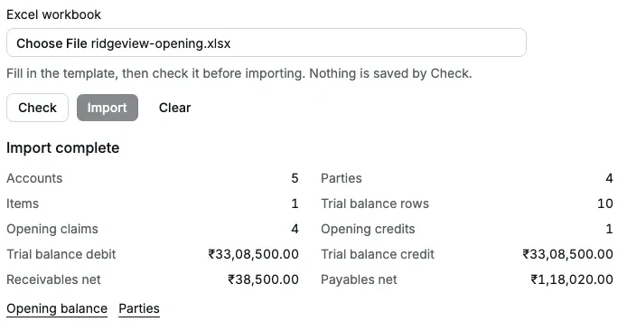

**Settings → Import** moves your starting position from Tally, Excel or another
bookkeeping system in one step. One Excel workbook creates new [accounts](/glossary#account),
[parties](/glossary#party) (customers and vendors) and items, and can
[post](/glossary#post) your [trial balance](/glossary#trial-balance) (every account's
balance on one date) with the unpaid [invoices](/glossary#invoice), unpaid
[bills](/glossary#bill) and unused [credits](/glossary#credit) behind it.

It is for a one-time move. It does not bring in your old transaction history, and it
never updates records that already exist.

**When to use it:** whenever customers or vendors have open balances at cutover, or you
have many [masters](/glossary#masters) (accounts, parties and items) to create. For a few balances with no party balances, the form in
[Opening balance](/setup/opening-balance) (the [balances you start with](/glossary#opening-balance)) is quicker.

**Who can do it:** only an **Owner** or **Accountant** (see [roles](/glossary#roles)). A **Chartered Accountant** or
**Operator** does not see the **Import** tab. Your CA (Chartered Accountant) can still prepare and review the
workbook before an owner or accountant imports it.

## Before you start

- **Agree the cutover date and a balanced trial balance with your CA.** India's
  [financial year](/glossary#financial-year) (FY) runs from April to March. For a fresh start on 1 April 2026, agree
  the closing balances as at 31 March 2026.
- **List each unpaid customer invoice and vendor bill**, with its original reference,
  date, amount still unpaid and, if relevant, due date.
- **List unused credits and unmatched [advances](/glossary#advance) (money paid before the
  invoice) separately for each party.** List only
  credits not already matched to a specific invoice or bill in your old books. If an
  advance was already set off against an invoice, enter only that invoice's remaining
  amount as the claim. Never deduct a credit from an invoice and also list it as a
  credit: that counts it twice.
- **Review the [chart of accounts](/glossary#chart-of-accounts).** Use existing account codes or exact names for
  balances and item income accounts. List only new accounts, parties and items in
  the creation sheets; a name that already exists is an error.
- **Confirm no Opening Balance is posted.** A posted Opening Balance blocks an import
  that contains a trial balance or [opening items](/glossary#opening-item) (unpaid invoices,
  bills and credits from your old books).

## Import in six steps

<Frame caption="Settings → Import before a workbook is chosen.">
  
</Frame>

<Steps>
  <Step title="Download the template">
    Click **Download template**. You get `import-template.xlsx`. Keep its sheet names and the
    headers on row 1 unchanged.
  </Step>
  <Step title="Fill the workbook">
    Fill the sheets described in [Workbook reference](#workbook-reference), with data from row 2.
    Paste values, not formulas. Save it as an Excel workbook (`.xlsx`) of no more than 5 MB, then
    choose it under **Excel workbook**.
  </Step>
  <Step title="Check">
    Click **Check**. Check writes nothing. A valid workbook shows **Ready to import** with the
    record counts, trial balance totals and the net receivables and payables. Compare them with the
    figures your CA approved.
  </Step>
  <Step title="Fix any errors">
    If the workbook has errors, a table lists each with **Sheet**, **Row**, **Column** and
    **Message**. Above 500 errors it says "Showing 500 of N errors"; fix those and check again for
    the rest. After editing in Excel, save, click **Clear**, choose the file again and click
    **Check**.
  </Step>
  <Step title="Import">
    **Import** is available only after a clean Check of the chosen file; choosing another file
    resets it. Click **Import**. The dialog **Import workbook?** says "This creates the workbook's
    masters and posts any opening balances. Imported masters cannot be deleted." Click **Import
    workbook** only when the figures are right.
  </Step>
  <Step title="Verify">
    After **Import complete**, follow the **Opening balance** and **Parties** links. Check the
    posted balances and opening items against your old books before you record new receipts or
    payments.
  </Step>
</Steps>

The import is all or nothing. If any row has an error, nothing is written.

<Frame caption="A first Check of Ridgeview Academy's workbook finds four errors.">
  
</Frame>

<Frame caption="After the fixes: Ready to import, with totals to compare against the CA's figures.">
  
</Frame>

<Frame caption="The confirmation before anything is written.">
  
</Frame>

<Frame caption="Import complete, with links to check the result.">
  
</Frame>

## What the import creates

| From the sheet    | Accly Books creates                                                                                                                           |
| ----------------- | --------------------------------------------------------------------------------------------------------------------------------------------- |
| **Accounts**      | New accounts, with codes given as in the [chart of accounts](/setup/chart-of-accounts#account-codes)                                          |
| **Parties**       | New parties                                                                                                                                   |
| **Items**         | New items                                                                                                                                     |
| **Trial balance** | One posted Opening Balance, numbered `OB` + year, dated on the opening date                                                                   |
| **Opening items** | One opening claim (`OC…`) or opening credit (`OA…`) per row. Each keeps its original date; its party-ledger line is dated on the opening date |

Each opening item keeps its own reference, original date and due date. The
[receivable](/glossary#receivable) and [payable](/glossary#payable) totals post to
**Accounts Receivable** and **Accounts Payable** (the
[control accounts](/glossary#control-account) that total all customers and vendors) as
part of the Opening Balance, and each party's balance comes from its
opening items. See [Opening balance](/setup/opening-balance#opening-items).

<Frame caption="Ridgeview Academy's imported Opening Balance OB24-25/1 as at 31 Mar 2025.">
  
</Frame>

## Workbook reference

Keep the sheets in this order: **Read me**, **Opening**, **Accounts**, **Parties**,
**Items**, **Trial balance**, **Opening items**. Every sheet except **Read me** may
be empty; leave its header row in place. A required column needs a value in each row
you fill.

### Read me

| Cell | Required | Accepted value                        | Example |
| ---- | -------- | ------------------------------------- | ------- |
| B1   | Yes      | The template version; leave it as `1` | `1`     |

The rest of the sheet holds instructions, not records. The label in A1 does not
matter.

### Opening

| Column       | Required                                              | Accepted values                                      | Example      |
| ------------ | ----------------------------------------------------- | ---------------------------------------------------- | ------------ |
| Opening date | When **Trial balance** or **Opening items** have rows | One date, not in the future; enter only one data row | `2026-03-31` |

### Accounts

Only include accounts you need to create.

| Column           | Required                   | Accepted values                                                                                                                         | Example        |
| ---------------- | -------------------------- | --------------------------------------------------------------------------------------------------------------------------------------- | -------------- |
| Name             | Yes                        | A new account name                                                                                                                      | `Tuition Fees` |
| Parent           | Yes                        | An existing active group's code or name, or `Assets`, `Liabilities`, `Equity`, `Income`, `Expenses`; not an account that takes postings | `Income`       |
| GST supply class | For an income account only | `taxable`, `exempt`, `nil`, `nonGst`, `notASupply`; leave blank for other account types                                                 | `exempt`       |

### Parties

Only include parties you need to create.

| Column     | Required                 | Accepted values                                                                                       | Example                               |
| ---------- | ------------------------ | ----------------------------------------------------------------------------------------------------- | ------------------------------------- |
| Name       | Yes                      | A new party name                                                                                      | `Priya`                               |
| Roles      | Yes                      | One or more of `customer`, `vendor`, `tenant`, `donor`, `employee`, `government`, separated by commas | `customer,vendor`                     |
| GSTIN      | No                       | A valid GSTIN; fills the state code and PAN                                                           | Leave blank for an unregistered party |
| PAN        | No                       | A valid [PAN](/glossary#pan) (Permanent Account Number); if GSTIN is supplied, must match it          | `ABCDE1234F`                          |
| State code | Unless supplied by GSTIN | Two-digit GST state code; `7` reads as `07`                                                           | `27` for Maharashtra                  |
| Address    | No                       | Address text                                                                                          | `12 Market Road`                      |
| City       | No                       | City name                                                                                             | `Pune`                                |
| PIN code   | No                       | A valid six-digit Indian PIN code                                                                     | `411001`                              |
| Email      | No                       | A valid email address                                                                                 | `priya@example.com`                   |
| Phone      | No                       | Phone number as text                                                                                  | `9876543210`                          |

### Items

Only include items you need to create.

| Column         | Required               | Accepted values                                                                                                               | Example                                                    |
| -------------- | ---------------------- | ----------------------------------------------------------------------------------------------------------------------------- | ---------------------------------------------------------- |
| Name           | Yes                    | A new item name                                                                                                               | `Tuition`                                                  |
| Income account | Yes                    | Code or name of an active income account that takes postings, not a group or system account; may be created in **Accounts**   | `Tuition Fees`                                             |
| Unit price     | Yes                    | Non-negative rupee amount; zero is allowed                                                                                    | `0`                                                        |
| HSN/SAC        | No                     | Four to eight digits ([HSN or SAC](/glossary#hsn-sac) code)                                                                   | `999293`                                                   |
| Unit           | No                     | Unit text                                                                                                                     | `month`                                                    |
| Tax code       | For taxable items only | A GST rate code effective in your organization, as shown in the **GST rate** column of **Items**; leave blank for other items | `GST18`; leave blank for `Tuition` under an exempt account |

### Trial balance

| Column  | Required               | Accepted values                                                                                | Example                  |
| ------- | ---------------------- | ---------------------------------------------------------------------------------------------- | ------------------------ |
| Account | Yes                    | Code or name of an existing active account that takes postings, or one created in **Accounts** | `1300` or `Cash in Hand` |
| Debit   | One of Debit or Credit | Amount above zero; leave blank or zero if Credit is above zero                                 | `8000`                   |
| Credit  | One of Debit or Credit | Amount above zero; leave blank or zero if Debit is above zero                                  | `5000`                   |

Each row must have exactly one amount above zero. Total debits must equal total
credits ([debit and credit](/glossary#debit-credit), the two equal sides of every entry). **Accounts Receivable** (`1300`) and **Accounts Payable** (`2000`) must also
agree with the opening items (see [Why the party totals must
match](#why-the-party-totals-must-match)).

Do not put [GST](/glossary#gst) or advance accounts in the trial balance. For a legacy GST balance,
create an account that takes postings, such as `GST payable at cutover` under
`Current Liabilities`, and carry the balance there. Agree its later clearance by
[Journal](/accounting/journals) (a manual [journal](/glossary#journal) entry) with your CA. For customer or vendor advances,
include the unused amount as a **Credit** in **Opening items** and in the net control
balance. If your organization has a [GSTIN](/glossary#gstin) (GST registration number), the trial
balance also cannot contain a taxable income account (see [supply class](/glossary#supply-class)); agree another account with your CA.

### Opening items

A **Claim** is an unpaid invoice or bill. A **Credit** is an unused credit or
unmatched advance that can be applied later. Enter the amount still open at cutover,
not an invoice's original total if it has been partly paid.

| Column    | Required | Accepted values                                                                       | Example      |
| --------- | -------- | ------------------------------------------------------------------------------------- | ------------ |
| Party     | Yes      | Name of an existing active party or one created in **Parties**                        | `Priya`      |
| Side      | Yes      | `Receivable` for customer amounts; `Payable` for vendor amounts                       | `Receivable` |
| Type      | Yes      | `Claim` or `Credit`                                                                   | `Claim`      |
| Reference | Yes      | Original reference; the combination of Party, Side, Type and Reference must be unique | `INV-88`     |
| Date      | Yes      | Original date, on or before the opening date                                          | `2026-02-10` |
| Due date  | No       | Claims only; on or after Date; may be after the opening date                          | `2026-03-12` |
| Amount    | Yes      | Rupee amount above zero                                                               | `10000`      |

### Cell, amount and date rules

- Use text, numbers or dates. No formulas, spreadsheet errors or rich-text cells;
  paste values only.
- Amounts may be numeric cells or plain text such as `2000.00`. Use at most two
  decimal places and never a negative amount. In text cells, do not type a rupee
  symbol or thousands separators: use `8000.00`, not `₹8,000.00`.
- Dates may be Excel dates or text in `YYYY-MM-DD` form. Use `2026-03-31`, not an
  ambiguous text date such as `03/04/26`.
- Keep each sheet to at most 5,000 data rows. Fully blank rows are skipped.
- Keep the file at or below 5 MB.

## Why the party totals must match

The trial balance gives one total for all customers and one for all vendors.
**Opening items** explains those totals party by party. Importing both does not count
them twice; they must describe the same balances.

- **Accounts Receivable** (`1300`), debit less credit, must equal receivable claims
  less receivable credits.
- **Accounts Payable** (`2000`), credit less debit, must equal payable claims less
  payable credits.

For example, Priya's unpaid invoice of ₹10,000.00 less her unused advance of
₹2,000.00 gives receivables of **₹8,000.00**. Mehta Traders' unpaid bill of
₹5,000.00, with no unused vendor credit, gives payables of **₹5,000.00**. The trial
balance therefore needs ₹8,000.00 debit in `1300` and ₹5,000.00 credit in `2000`. A
control balance with no matching opening items is refused, even if total debits and
credits agree.

:::warning[Fix row errors before the totals]
When an opening item row has its own error, such as a bad due date or amount, Check
leaves that row out of the item totals. The control-total message then shows a
smaller figure: one bad due date on Kavya Shetty's ₹24,000 claim turned
"receivable items net to ₹38,500.00" into "₹14,500.00". Fix the **Opening items**
errors first, then Check again before you change the trial balance.
:::

## Worked example: start on 1 April 2026

This proprietorship moves its books at the end of financial year 2025–26. The opening
date is **31 March 2026**; new business starts on **1 April 2026**.

[Download the worked-example workbook](/samples/opening-balances-example.xlsx). It is
ready to **Check** in a new proprietorship organization where `Tuition Fees`,
`Priya`, `Mehta Traders` and `Tuition` do not exist and no Opening Balance is posted.
In another organization, first adapt the accounts and figures with your CA.

Blank table cells below mean blank Excel cells. Money cells have no rupee symbol or
thousands separators, so you can paste them into Excel. The opening date is an Excel
date; the opening-item dates are `YYYY-MM-DD` text. In each sheet below, the table
heading is Excel row 1 and data starts on row 2. **Read me** keeps the template's
text, with **B1 = `1`**.

<Accordion>
  <AccordionItem title="Opening, Accounts, Parties and Items">
    **Opening**

    | Opening date |
    | ------------ |
    | 2026-03-31   |

    **Accounts**

    | Name         | Parent | GST supply class |
    | ------------ | ------ | ---------------- |
    | Tuition Fees | Income | exempt           |

    **Parties**

    | Name          | Roles    | GSTIN | PAN | State code | Address | City | PIN code | Email | Phone |
    | ------------- | -------- | ----- | --- | ---------- | ------- | ---- | -------- | ----- | ----- |
    | Priya         | customer |       |     | 27         |         |      |          |       |       |
    | Mehta Traders | vendor   |       |     | 27         |         |      |          |       |       |

    **Items**

    | Name    | Income account | Unit price | HSN/SAC | Unit | Tax code |
    | ------- | -------------- | ---------- | ------- | ---- | -------- |
    | Tuition | Tuition Fees   | 0          |         |      |          |

  </AccordionItem>
  <AccordionItem title="Trial balance and Opening items">
    **Trial balance**

    | Account         | Debit | Credit |
    | --------------- | ----- | ------ |
    | Cash in Hand    | 20000 |        |
    | 1300            | 8000  |        |
    | 2000            |       | 5000   |
    | Capital Account |       | 23000  |

    Debits: ₹20,000.00 + ₹8,000.00 = **₹28,000.00**. Credits: ₹5,000.00 + ₹23,000.00 =
    **₹28,000.00**.

    **Opening items**

    | Party         | Side       | Type   | Reference | Date       | Due date   | Amount  |
    | ------------- | ---------- | ------ | --------- | ---------- | ---------- | ------- |
    | Priya         | Receivable | Claim  | INV-88    | 2026-02-10 | 2026-03-12 | 10000   |
    | Priya         | Receivable | Credit | ADV-3     | 2026-03-01 |            | 2000.00 |
    | Mehta Traders | Payable    | Claim  | B-17      | 2026-03-05 | 2026-04-30 | 5000    |

    `ADV-3` has no due date because it is a credit. `B-17` may be due after cutover; its
    original date is before cutover.

  </AccordionItem>
</Accordion>

### Expected Check summary

| Summary              | Value      |
| -------------------- | ---------- |
| Accounts             | 1          |
| Parties              | 2          |
| Items                | 1          |
| Trial balance rows   | 4          |
| Opening claims       | 2          |
| Opening credits      | 1          |
| Trial balance debit  | ₹28,000.00 |
| Trial balance credit | ₹28,000.00 |
| Receivables net      | ₹8,000.00  |
| Payables net         | ₹5,000.00  |

### What you see after Import

**Parties** shows Priya at **₹8,000.00 Dr** and Mehta Traders at **₹5,000.00 Cr**. Dr
means a net amount due from Priya; Cr means a net amount you owe Mehta Traders.

**Settings → Opening balance** shows **OB25-26/1**, **As at 31 Mar 2026** and
**Total ₹28,000.00**, with these lines:

| Account                    | Debit      | Credit     |
| -------------------------- | ---------- | ---------- |
| Cash in Hand · 1001        | ₹20,000.00 |            |
| Capital Account · 3000     |            | ₹23,000.00 |
| Accounts Receivable · 1300 | ₹8,000.00  |            |
| Accounts Payable · 2000    |            | ₹5,000.00  |

Its **Opening items** table shows:

| Number    | Party         | Type            | Reference | Date        | Due date    | Amount     | Balance    |
| --------- | ------------- | --------------- | --------- | ----------- | ----------- | ---------- | ---------- |
| OC25-26/1 | Priya         | Opening invoice | INV-88    | 10 Feb 2026 | 12 Mar 2026 | ₹10,000.00 | ₹10,000.00 |
| OA25-26/1 | Priya         | Opening credit  | ADV-3     | 1 Mar 2026  | —           | ₹2,000.00  | ₹2,000.00  |
| OC25-26/2 | Mehta Traders | Opening bill    | B-17      | 5 Mar 2026  | 30 Apr 2026 | ₹5,000.00  | ₹5,000.00  |

The opening [ledger](/glossary#ledger) lines (entries in the party's running record) are dated **31 Mar 2026**, so choose **Last year (2025–26)**
in the party **Ledger** to see them:

| Document  | Date        | Particulars              | Debit      | Credit    | Balance       |
| --------- | ----------- | ------------------------ | ---------- | --------- | ------------- |
| OC25-26/1 | 31 Mar 2026 | Opening invoice · INV-88 | ₹10,000.00 |           | ₹10,000.00 Dr |
| OA25-26/1 | 31 Mar 2026 | Opening credit · ADV-3   |            | ₹2,000.00 | ₹8,000.00 Dr  |

For **This year (2026–27)**, Priya's ledger starts with Opening **₹8,000.00 Dr**.

### Settle the balances after cutover

1. **Receive INV-88 in full.** Open **Receipts → New**, choose **Priya**, enter
   **10000** and select **Against open items**. The **Open items** grid lists
   "Opening invoice · OC25-26/1 · INV-88" with Outstanding **₹10,000.00**
   ([outstanding](/glossary#outstanding): still unpaid). Click
   **Fill**, choose the payment method that actually received the money, then
   **Post**. `INV-88` now has Balance **₹0.00**, and Priya's balance is **₹2,000.00
   Cr**, her unused `ADV-3`.
2. **Pay Mehta Traders.** Open **Payments → New**, choose **Mehta Traders**, select
   **Against open items**, enter **5000**, click **Fill** on `B-17`, choose the method
   and **Post**. Mehta Traders' balance is **₹0.00**.
3. **Use ADV-3 on Priya's next invoice.** Post a new invoice for Priya, for example
   **Tuition** at ₹3,000. Open it and choose **More actions** (…) → **Apply credit**.
   Choose "Opening credit · OA25-26/1 · ADV-3"; Amount fills **2000.00** (an
   [allocation](/glossary#allocation) of the credit to the invoice). Click
   **Apply credit**. The invoice shows **Part paid** with Outstanding **₹1,000.00**,
   and Priya's balance is **₹1,000.00 Dr**.

Record receipts and payments on their actual dates. Do not create a second invoice or
bill for the old amounts. Document numbers depend on your prefixes and financial year.

To set an opening credit against an opening invoice instead, use **Apply credit** on
the invoice's row in **Settings → Opening balance** (see [Apply an opening
credit](/setup/opening-balance#apply-an-opening-credit)).

## Common errors and fixes

Any error stops the whole import. After each Excel correction, save, click **Clear**,
choose the file again and click **Check**.

| Error or symptom                                                                               | What it means                                                                          | Fix                                                                                                                |
| ---------------------------------------------------------------------------------------------- | -------------------------------------------------------------------------------------- | ------------------------------------------------------------------------------------------------------------------ |
| "Debits ₹… and credits ₹… differ."                                                             | Total debit is not total credit                                                        | Reconcile the trial balance with your CA. Do not add an unexplained balancing figure                               |
| "Accounts receivable is ₹7,000.00 but the receivable items net to ₹8,000.00."                  | The control total disagrees with the items, even if the trial balance balances         | Correct the control total or the items. Fix any **Opening items** row errors first, as they change the items' net  |
| "Parties · 2 · Name · A party with this name already exists."                                  | Row 2 tries to create an existing party. The import never updates it                   | Remove the creation row and use the existing party's name in Opening items. The same applies to accounts and items |
| "No active account has the code or name …"                                                     | An account or income account cannot be found                                           | Use the correct active code or name, or create it in **Accounts**                                                  |
| "… cannot take an opening balance: choose an active leaf other than a GST or advance account." | The trial balance names a group, a GST or advance account                              | Use a posting account. Carry GST balances in a separate liability or asset account                                 |
| "… is taxable income, which is invoiced: carry its balance in another leaf."                   | Your organization has a GSTIN and the row names a taxable income account               | Agree another account with your CA                                                                                 |
| "No party is named …"                                                                          | The opening item names a party that neither exists nor is in **Parties**               | Correct the spelling or add the party                                                                              |
| "… is inactive: mark it active first."                                                         | The opening item names an inactive party                                               | Mark the party active in **Parties**                                                                               |
| "Enter a due date on or after the date."                                                       | A claim's Due date is earlier than its Date                                            | Correct the dates from the old invoice or bill. Leave Due date blank on credits                                    |
| "Enter a date on or before the opening date."                                                  | An opening item is dated after the opening date                                        | Use the original date; anything after cutover is a new document                                                    |
| "Paste values only: no formulas, errors or formatted text."                                    | A cell holds a formula or another unsupported cell type                                | Replace it with its value using Excel's paste-values option                                                        |
| "Enter a non-negative amount with two decimal places at most and no thousands separator."      | An amount has more than two decimals, is negative, or is text with a separator or ₹    | Type rupees and paise, such as `4000.00`                                                                           |
| "Opening balance OB… is already posted. Cancel it first."                                      | A trial balance or opening items cannot be imported while an Opening Balance is posted | Review the existing Opening Balance. If it is wrong and nothing is applied to its items, cancel it first           |
| "The workbook changed after you chose it. Choose it again."                                    | The file changed on disk after you chose it                                            | Click **Clear**, choose the saved file again and Check                                                             |
| "Choose a workbook of at most 5 MB."                                                           | The file is too large                                                                  | Remove unused sheets, formatting and blank rows                                                                    |

## Undo an import

**Clear** only clears the chosen file and its Check result. It does not undo an
import.

- The Opening Balance and its opening items can be cancelled together from
  [Opening balance](/setup/opening-balance#cancel-the-opening-balance), once no
  receipt, payment or credit is set against them.
- Imported accounts, parties and items cannot be deleted. Mark any you do not need
  inactive.

## Related pages

- [Cut over from Tally](/scenarios/cutover-from-tally): a school's full import, step by step.
- [Opening balance](/setup/opening-balance): the posted entry, opening items and apply credit.
- [Receipts](/sales/receipts) and [Payments](/purchases/payments): settle opening items.
