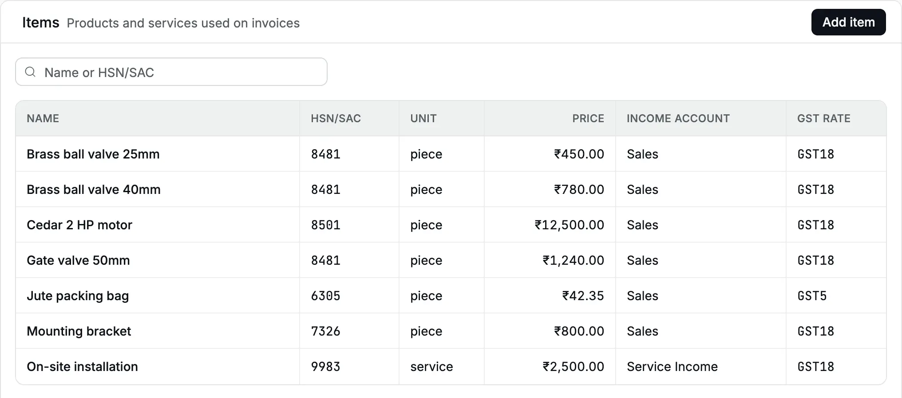
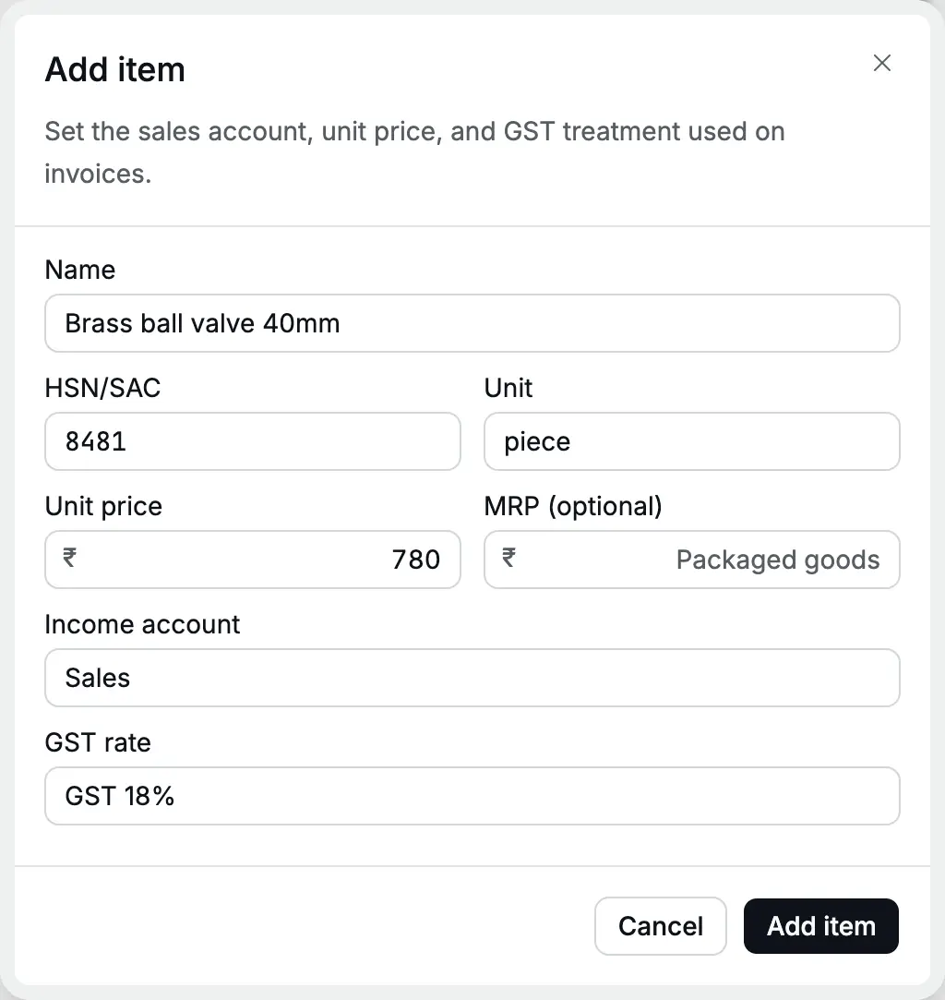

An **item** is a thing you sell: a product such as a brass valve, or a service such as
installation. Every [invoice](/glossary#invoice) line names an item. The item fills the line's
description, [HSN or SAC](/glossary#hsn-sac) code (the GST classification code for goods
or services), unit price and [GST](/glossary#gst) rate, and decides which income [account](/glossary#account) the sale
[posts](/glossary#post) to.

**Who can do it:** an **Owner** or **Accountant** (see [roles](/glossary#roles)) adds and edits items. An
**Operator** and a **Chartered Accountant** see the list, and an operator picks items
on invoices.

## The item list

Open **Masters → Items** ([masters](/glossary#masters) are the lists you set up once and reuse). Each row shows **Name**, **HSN/SAC**, **Unit**, **Price**,
**Income account** and **GST rate**. Search by name or HSN/SAC. An Owner or Accountant clicks a row to edit it; for other
roles the rows are read-only.

<Frame caption="Cedar Components' items: valves, a motor, packing bags and a service.">
  
</Frame>

## Add an item

Cedar Components adds a larger valve to its range: **Brass ball valve 40mm**, HSN
8481, sold at ₹780 a piece plus 18% GST.

<Steps>
  <Step title="Open the form">Click **Add item**. The **Add item** panel opens.</Step>
  <Step title="Name it">
    Type **Brass ball valve 40mm** in **Name**. This is the description printed on the invoice.
  </Step>
  <Step title="Add HSN/SAC and unit">Type **8481** in **HSN/SAC** and **piece** in **Unit**.</Step>
  <Step title="Set the price">
    Type **780** in **Unit price**. This is the price before GST. Leave **MRP** (maximum retail
    price) empty unless the item is packaged goods with a printed MRP.
  </Step>
  <Step title="Choose the income account">
    In **Income account**, type and choose **Sales**. Because Sales is a taxable account, **GST
    rate** appears.
  </Step>
  <Step title="Choose the GST rate">Choose **GST 18%**.</Step>
  <Step title="Save">
    Click **Add item**. You see "Item added", and the item is ready for invoices.
  </Step>
</Steps>

<Frame caption="A taxable product: HSN 8481, ₹780 a piece, Sales account, GST 18%.">
  
</Frame>

## The fields

| Field              | Required                         | What it does                                                                                                 |
| ------------------ | -------------------------------- | ------------------------------------------------------------------------------------------------------------ |
| **Name**           | Yes                              | Up to 120 characters. Unique in the organization, in any mix of capitals                                     |
| **HSN/SAC**        | No                               | 4 to 8 digits. HSN for goods (8481 for valves), SAC for services (9983 for installation, 9992 for education) |
| **Unit**           | No                               | Up to 20 characters, such as piece, kg, hour, month or term                                                  |
| **Unit price**     | Yes                              | Price before GST, in rupees and paise. Zero is allowed for an item you always price on the invoice           |
| **MRP (optional)** | No                               | Maximum retail price for packaged goods. Above zero when filled                                              |
| **Income account** | Yes                              | An active income account, not a group or system account. Sets where the sale posts and the GST treatment     |
| **GST rate**       | Only under a **Taxable** account | The rate charged on the invoice. Shown only when the income account is Taxable                               |

### Goods and services

Accly Books does not store a goods-or-services flag. The **HSN/SAC** code and the
income account show which it is: Cedar Components keeps goods under **Sales** and
services such as **On-site installation** (SAC 9983) under **Service Income**.

:::note[HSN on invoices]
GST rules require HSN or SAC on [tax invoices](/glossary#tax-invoice) (the GST invoice a
registered seller issues). The rule depends on your turnover in the previous financial
year: up to ₹5 crore, 4 digits on invoices to registered buyers (B2B); above ₹5 crore,
6 digits on every tax invoice. Check the rule for your business with your CA. Accly
Books does not make the field required, so fill it for every taxable item.
:::

### GST rate and the income account

The item's GST treatment comes from its income account's **GST supply class**
([supply class](/glossary#supply-class): taxable, exempt, nil-rated and so on; see
[Chart of accounts](/setup/chart-of-accounts#gst-supply-class)):

- Under a **Taxable** account, the item needs a GST rate. Without one, saving shows
  "Choose a GST rate for a taxable item."
- Under an **Exempt**, **Nil-rated**, **Non-GST** or **Not a supply** account, the item
  has no rate and its invoices charge no GST. If you switch the account to a
  non-taxable one, the rate is cleared.

The rate list shows only rates in force today: **GST 5%**, **GST 12%**, **GST 18%**
and **GST 40%**. There is no 0% rate: use a **Nil-rated** income account instead.
Whether the invoice charges CGST and SGST or IGST ([central and state, or integrated
GST](/glossary#cgst-sgst-igst)) depends on the [place of supply](/glossary#place-of-supply),
the state where GST treats the sale as made, not on the item.

## Edit an item

Click the item's row. Change any field and click **Save item**. The change applies to
new invoices. Posted invoices keep the name, price and rate they were posted with.

## Mark an item inactive

Open the item and click **Mark inactive**. It leaves the item picker on new
invoices; past invoices still show it. The list shows it greyed with an **Inactive**
badge. Click **Mark active** to restore it.

An income account cannot be marked inactive while an active item uses it.

## Common errors

| Message                                                                  | What to do                                                                                                                                              |
| ------------------------------------------------------------------------ | ------------------------------------------------------------------------------------------------------------------------------------------------------- |
| "An item with that name already exists."                                 | Names compare without case: **brass ball valve 25MM** clashes with **Brass ball valve 25mm**. Edit the existing item or add a size or grade to the name |
| "Use a 4 to 8 digit HSN/SAC code"                                        | Type digits only, 4 to 8 of them                                                                                                                        |
| "Choose a GST rate for a taxable item."                                  | Choose a rate, or choose a non-taxable income account                                                                                                   |
| "Choose an active income account that is not a group or system account." | Choose another account, or add one in the chart of accounts                                                                                             |
| "Enter an MRP above zero, or leave it empty"                             | Clear the MRP or type the printed price                                                                                                                 |

## Related pages

- [Chart of accounts](/setup/chart-of-accounts): add an income account and set its GST class.
- [Invoices](/sales/invoices): each invoice line is an item.
- [Import opening balances](/setup/import-opening-balances): create many items from Excel.
