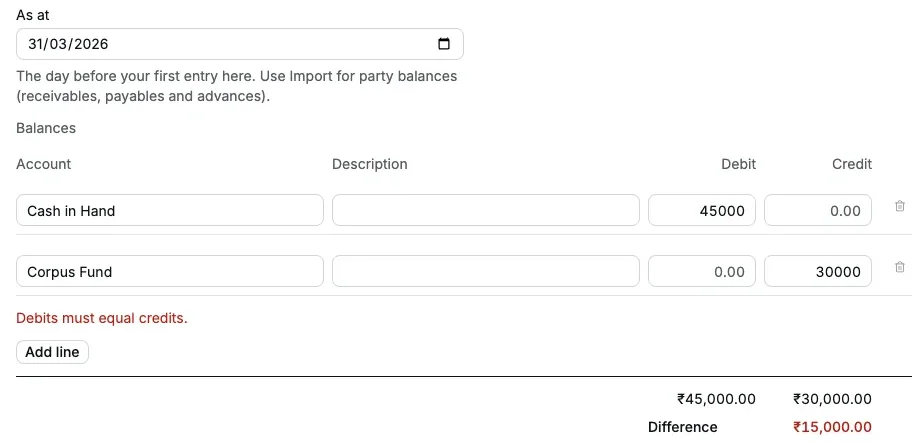
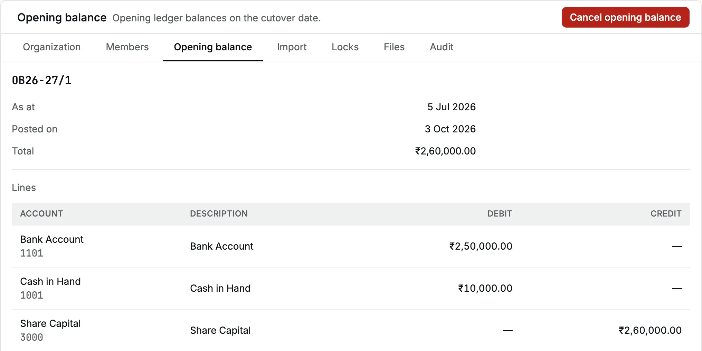
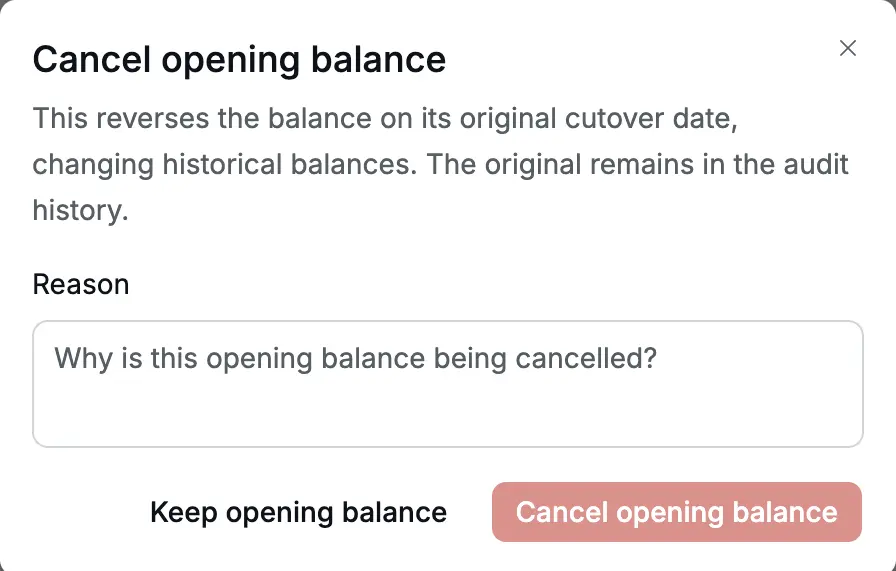

The [opening balance](/glossary#opening-balance) carries your old books into Accly Books
on one date, the **cutover date**. It is a single balanced
[journal entry](/glossary#journal-entry): what you held in cash and bank, the
assets you own, what you owe, and your capital. From the next day you record new
business as [documents](/glossary#document) such as invoices and receipts.

An organization has at most one [posted](/glossary#post) Opening Balance. It has two ways in:

| Way                                                        | Use it when                                                                                                                                                        |
| ---------------------------------------------------------- | ------------------------------------------------------------------------------------------------------------------------------------------------------------------ |
| **The form** on **Settings → Opening balance** (this page) | No customer or vendor owes or is owed money at cutover, and you have a few balances to type                                                                        |
| **[Import](/setup/import-opening-balances)** from Excel    | You have unpaid [invoices](/glossary#invoice), unpaid [bills](/glossary#bill) or [advances](/glossary#advance), or a long [trial balance](/glossary#trial-balance) |

The form cannot carry customer or vendor balances. If any [party](/glossary#party) owes you or you owe
any party at cutover, use the import, which posts the balance together with the
[opening items](/glossary#opening-item) behind it: each unpaid invoice, bill or unused
credit from your old books.

**Who can do it:** an **Owner** or **Accountant** (see [roles](/glossary#roles)) posts and cancels the opening
balance. A **Chartered Accountant** can see it. An **Operator** does not see this tab.

## Choose the cutover date

**As at** is the last day of your old books, the day before your first entry in Accly
Books. For a fresh start on 1 April 2026, enter **31 Mar 2026**. For a mid-year start
on 1 October 2026, enter **30 Sep 2026**.

- The date cannot be in the future.
- It cannot fall in a [locked](/glossary#lock) period (see [Locks](/accounting/locks)).
- Accly Books refuses new documents dated on or before a posted Opening Balance's
  cutover date. Opening items imported with it keep their legacy dates.
- It also refuses an Opening Balance dated on or after an ordinary document you
  have already posted. Choose a cutover date before those documents; the opening
  balance and its imported opening items are exempt from this comparison.

## Enter balances with the form

A small trust starts its books on 1 April 2026. Its CA (Chartered Accountant) has agreed these closing
balances as at 31 March 2026:

| Account      | Debit      | Credit     |
| ------------ | ---------- | ---------- |
| Cash in Hand | ₹45,000.00 |            |
| Corpus Fund  |            | ₹45,000.00 |

<Steps>
  <Step title="Open the form">
    Go to **Settings → Opening balance**. If no opening balance is posted, the form opens.
  </Step>
  <Step title="Set the date">Enter the cutover date in **As at**, here **31/03/2026**.</Step>
  <Step title="Enter the lines">
    For each balance, choose the **Account** and type the amount in **Debit** or **Credit** ([debit
    and credit](/glossary#debit-credit), the two equal sides of every entry), never both. Add a
    **Description** if useful. Click **Add line** for more rows; the form takes up to 100.
  </Step>
  <Step title="Check the totals">
    Under the lines, **Difference** must be ₹0.00. Total debits must equal total credits.
  </Step>
  <Step title="Post">
    Click **Post opening balance** (or <kbd>⌘</kbd>/<kbd>Ctrl</kbd> + <kbd>Enter</kbd>). You see
    "Opening balance posted", and the page shows the posted entry.
  </Step>
</Steps>

If the totals differ, posting stops with "Debits must equal credits." and the
**Difference** shows in red. Find the missing balance with your CA. Do not add a
balancing line to an unexplained account.

<Frame caption="A typing slip: ₹45,000 of debits against ₹30,000 of credits, so the form will not post.">
  
</Frame>

### Which accounts you can use

The **Account** list offers active accounts that take postings, such as cash and bank
accounts, fixed assets, loans, capital, and income and expense accounts. It leaves
out:

- **Accounts Receivable**, **Accounts Payable** and the advance accounts (the
  [control accounts](/glossary#control-account) that total what customers owe you and what
  you owe vendors). Party
  balances come only from [Import](/setup/import-opening-balances).
- The **GST input and output accounts** ([ITC](/glossary#itc), the GST you paid and may
  claim, and [output tax](/glossary#output-tax), the GST you collect). For an old GST balance, add an account such
  as **GST payable at cutover** under Current Liabilities, carry the balance there, and
  clear it later by [Journal](/accounting/journals) (a manual [journal](/glossary#journal)
  entry) with your CA.
- **Taxable income accounts** (see [supply class](/glossary#supply-class)), when your
  organization has a [GSTIN](/glossary#gstin), its GST registration number. At a mid-year
  cutover, carry year-to-date taxable sales in another income account your CA agrees.

[Groups](/glossary#group-account) and [inactive](/glossary#inactive) accounts are never offered.

## What happens in the books

The opening balance posts as **OB** plus the financial year of its date, for example
**OB24-25/1** for 31 Mar 2025. Each line debits or credits its account on the cutover
date. On the page you see the number, **As at**, **Posted on**, **Total** (the sum of
the debits), and the **Lines** with **Account**, **Description**, **Debit** and
**Credit**.

<Frame caption="Cedar Components' posted opening balance and its As at date.">
  
</Frame>

In reports:

- [Trial balance](/reports/trial-balance) (every account's balance) and
  [Balance sheet](/reports/balance-sheet) ([balance sheet](/glossary#balance-sheet): what you
  own and owe on a date)
  dated on or after the cutover include the opening figures.
- For the financial year that contains the cutover date, the trial balance shows the
  opening lines as that year's **Debit** and **Credit**, not as **Opening**. From the
  next year, they are part of **Opening**.
- Income and expense balances in a mid-year opening balance count in that year's
  [Profit and loss](/reports/profit-and-loss) ([P&L](/glossary#profit-and-loss), income less
  expenses for a period).

## Opening items

When you import, the opening balance also shows an **Opening items** table: each
unpaid invoice (**Opening invoice**), unpaid bill (**Opening bill**) and unused credit
or advance (**Opening credit**) behind the receivable and payable totals.

<Frame caption="Ridgeview Academy's opening items. Kavya Shetty's invoice and credit are already settled (Balance ₹0.00).">
  
</Frame>

| Column        | Meaning                                                                   |
| ------------- | ------------------------------------------------------------------------- |
| **Number**    | `OC…` for an opening claim (invoice or bill), `OA…` for an opening credit |
| **Party**     | The customer or vendor                                                    |
| **Type**      | Opening invoice, Opening bill or Opening credit                           |
| **Reference** | The number in your old books, such as FEE/24-25/0587                      |
| **Date**      | The original date in your old books                                       |
| **Due date**  | The original due date, if any                                             |
| **Amount**    | What was open at cutover                                                  |
| **Balance**   | What is still open now                                                    |

On a narrow screen some columns hide; the **Number**, **Party**, **Date**, **Amount**
and **Balance** stay.

Opening items behave like invoices and bills:

- An opening invoice appears in the **Open items** of a [receipt](/sales/receipts)
  for that customer. An opening bill appears in a [payment](/purchases/payments) to
  that vendor.
- The party [ledger](/glossary#ledger) shows each item on the cutover date, with its old reference.

## Apply an opening credit

Kavya Shetty owed ₹24,000 in school fees at cutover (opening invoice OC24-25/2), and
had paid a ₹4,000 advance that was not yet set off (opening credit OA24-25/1). Set the
advance against the invoice (an [allocation](/glossary#allocation): recording which
invoice a credit settles):

<Steps>
  <Step title="Find the invoice">
    In **Opening items**, find the opening invoice and click **Apply credit** on its row. The button
    shows only on opening invoices and bills that still have a balance.
  </Step>
  <Step title="Choose the credit">
    In **Credit**, choose the party's credit, here "Opening credit · OA24-25/1 · ADV/24-25/0091".
    **Amount** fills with the smaller of the credit and the invoice's balance, ₹4,000.00.
  </Step>
  <Step title="Apply">
    Click **Apply credit**. You see "Credit applied". The invoice's **Balance** drops to ₹20,000.00
    and the credit's to ₹0.00.
  </Step>
</Steps>

<Frame caption="Applying Kavya Shetty's ₹4,000 opening credit to her opening invoice.">
  
</Frame>

Applying a credit posts nothing to the ledger: the party's balance was already net of
the credit. It only records which invoice the credit settles. To undo it, see
[Apply credit](/sales/apply-credit). You can also apply an opening credit to a new
invoice or bill for the same party from that document's **More actions** (…) →
**Apply credit**.

## Cancel the opening balance

Cancel only when the opening balance is wrong and you will post a correct one.

1. Click **Cancel opening balance** at the top of the page.
2. Type a **Reason**, for example "Trial balance revised by CA on 12 Apr".
3. Click **Cancel opening balance** in the dialog, or **Keep opening balance** to stop.

<Frame caption="Cancelling asks for a reason.">
  
</Frame>

What cancelling does:

- It posts a [reversal](/glossary#reversal) (an equal and opposite entry) on the original cutover date, so balances for that date and
  every later date change. The original stays in the audit history.
- It also cancels every opening item.
- It is refused while any opening item has an active allocation: a receipt, payment
  or applied credit set against it. The message names the items, for example
  "Reverse the allocations of OC24-25/2, OA24-25/1 first." Reverse those allocations
  first.
- It is refused if the cutover date is in a locked period.
- After cancelling, the form opens again so you can post the correct balance, or you
  can import again.

## Common errors

| Message                                                   | What to do                                                                               |
| --------------------------------------------------------- | ---------------------------------------------------------------------------------------- |
| "Debits must equal credits."                              | Make **Difference** ₹0.00                                                                |
| "Enter a debit or a credit"                               | Each line needs one amount, not both and not none                                        |
| "Choose the day before your cutover, not a future date."  | Use the last day of your old books                                                       |
| "Taxable income is invoiced, not journaled."              | Your organization has a GSTIN. Carry the balance in a non-taxable account your CA agrees |
| "Opening balance OB… is already posted. Cancel it first." | Only one opening balance can be posted                                                   |
| "Reverse the allocations of … first."                     | Undo receipts, payments or credits set against opening items, then cancel                |

## Related pages

- [Import opening balances](/setup/import-opening-balances): balances with unpaid invoices, bills and advances.
- [Cut over from Tally](/scenarios/cutover-from-tally): a full cutover, start to finish.
- [Balance sheet](/reports/balance-sheet): check the opening figures.
- [Locks](/accounting/locks): lock the period before cutover once it is agreed.
