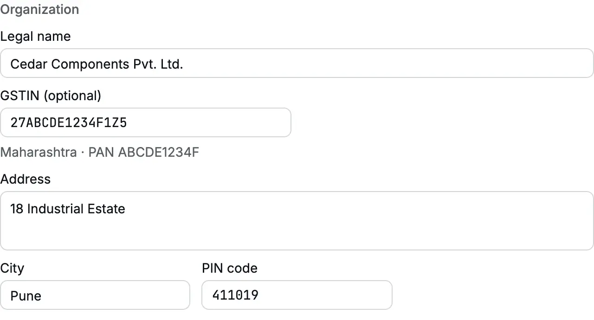
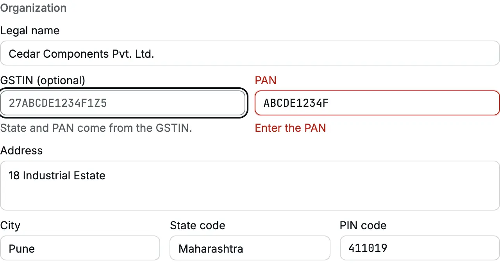
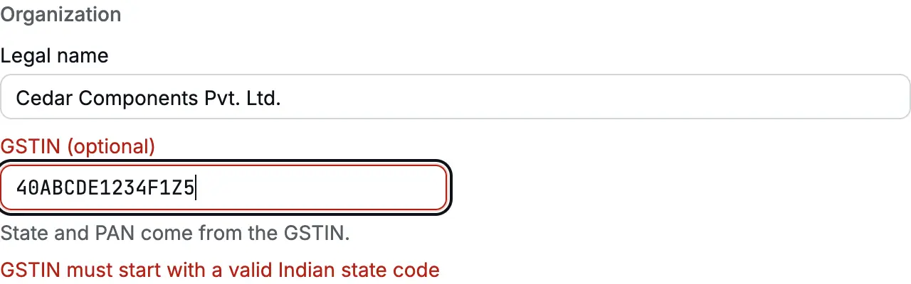
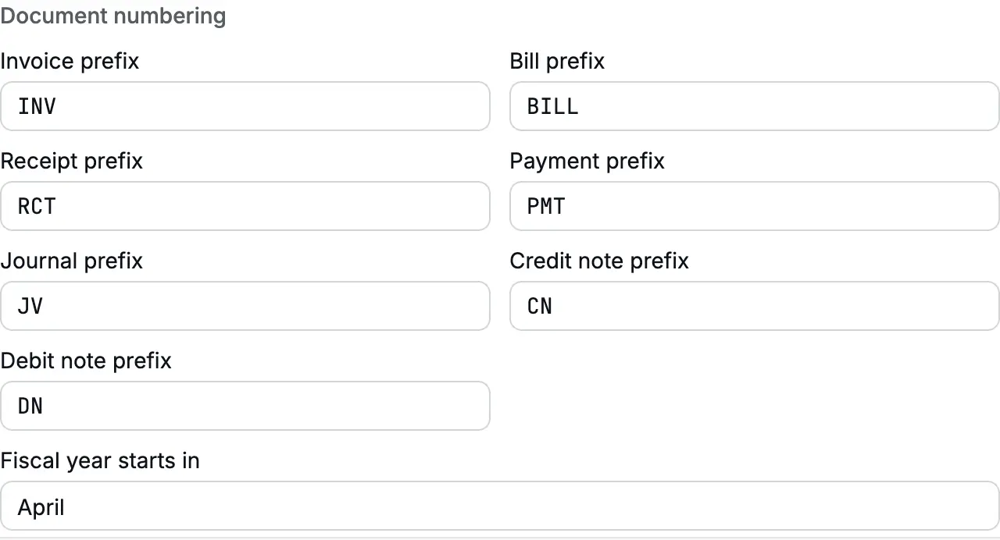

**Settings → Organization** holds your organization's legal identity and how its
[documents](/glossary#document) are numbered. Accly Books prints these details on
[invoices](/glossary#invoice) (sales), [bills](/glossary#bill) (purchases),
[receipts](/glossary#receipt) (money in) and reports. It uses your state and
[GSTIN](/glossary#gstin), your 15-character GST registration number, to decide how
[GST](/glossary#gst) (India's Goods and Services Tax) applies.

You enter these details when you create the organization. Come back here to correct
an address, add a GSTIN after registration, or change a document prefix.

**Who can do it:** only an **Owner** (see [roles](/glossary#roles)) sees this tab and can save it. Other roles do
not see **Organization** under **Settings**.

<Frame caption="Settings → Organization for Cedar Components Pvt. Ltd., a GST-registered company in Pune.">
  
</Frame>

## Legal details

| Field                | What it holds                                                                                                        | What it changes                                                                                                                                                                                                             |
| -------------------- | -------------------------------------------------------------------------------------------------------------------- | --------------------------------------------------------------------------------------------------------------------------------------------------------------------------------------------------------------------------- |
| **Legal name**       | The name as registered, up to 200 characters                                                                         | The name printed on every document and report heading                                                                                                                                                                       |
| **GSTIN (optional)** | Your 15-character GST number, if you are registered                                                                  | Fills **State** and **PAN** from the number. Marks the organization as GST-registered (see below)                                                                                                                           |
| **PAN**              | Your 10-character [PAN](/glossary#pan) (Permanent Account Number, the income-tax ID). Shown only when GSTIN is blank | Required. With a GSTIN, it comes from characters 3 to 12 of the GSTIN                                                                                                                                                       |
| **Address**          | Registered address, up to 500 characters                                                                             | Printed on documents                                                                                                                                                                                                        |
| **City**             | City                                                                                                                 | Printed on documents                                                                                                                                                                                                        |
| **State code**       | Your GST state. Shown only when GSTIN is blank                                                                       | Decides whether a sale is within the state (CGST + SGST) or outside it (IGST); see [CGST, SGST and IGST](/glossary#cgst-sgst-igst), the central, state and integrated GST. With a GSTIN, it comes from its first two digits |
| **PIN code**         | Six-digit Indian PIN code                                                                                            | Printed on documents                                                                                                                                                                                                        |

### How a GSTIN fills State and PAN

When you type a valid GSTIN, the line under the field shows what it found, for example
**Maharashtra · PAN ABCDE1234F**, and the **PAN** and **State code** fields disappear.
Clear the GSTIN to see and edit them again. They keep the values the GSTIN gave them.

<Frame caption="With GSTIN blank, PAN and State code appear and are required.">
  
</Frame>

A GSTIN must have 15 characters in the GST pattern and start with a real state code.
If the first two digits are not a state, **Save settings** shows "GSTIN must start
with a valid Indian state code".

<Frame caption="40 is not a GST state code, so the GSTIN is refused.">
  
</Frame>

:::warning[Check the GSTIN against your certificate]
Accly Books checks the pattern and the state code, but not the last character (the
check digit). A mistyped GSTIN with the right shape is accepted. Copy it from your GST
registration certificate.
:::

### What a GSTIN changes

With a GSTIN, the organization is GST-registered:

- Invoices for items under a **Taxable** income account (its [supply class](/glossary#supply-class),
  which says how GST treats the income) charge GST at the item's rate.
- A [Journal](/accounting/journals) (a manual [journal](/glossary#journal) entry) or the
  [Opening balance](/setup/opening-balance) cannot use a taxable income account. Taxable income comes only from invoices, so
  your GST returns ([GSTR-1 and GSTR-3B](/glossary#gstr)) and books agree.

Without a GSTIN, the organization is unregistered: you can still record sales and
purchases, and the state still decides the [place of supply](/glossary#place-of-supply), the state
where GST says the sale happens.

## Document numbering

Each document type has its own prefix of 1 to 4 letters, digits, `-` or `/`. Accly
Books writes capitals. A posted document's number is the prefix, the
[financial year](/glossary#financial-year) (FY, April to March in India) and a running
number:

| Prefix field           | Default | Example number |
| ---------------------- | ------- | -------------- |
| **Invoice prefix**     | `INV`   | `INV26-27/14`  |
| **Bill prefix**        | `BILL`  | `BILL26-27/3`  |
| **Receipt prefix**     | `RCT`   | `RCT26-27/51`  |
| **Payment prefix**     | `PMT`   | `PMT26-27/8`   |
| **Journal prefix**     | `JV`    | `JV26-27/2`    |
| **Credit note prefix** | `CN`    | `CN26-27/1`    |
| **Debit note prefix**  | `DN`    | `DN26-27/1`    |

<Frame caption="Document numbering and the financial year start.">
  
</Frame>

How numbering works:

- A number is given when a document is **posted** ([post](/glossary#post): written to
  the books), not when an invoice or bill is saved as a [draft](/glossary#draft), an
  unposted copy you can still change. The numbers in each series run without gaps.
- Each financial year starts again at 1: `INV25-26/…` ends on 31 March and
  `INV26-27/1` starts on 1 April.
- The year in the number comes from the document date, not from today.
- If you change a prefix, the next document starts a new series at 1, for example
  `SI26-27/1`. Documents already posted keep their numbers. If you change the
  prefix back, the old series continues where it stopped.
- GST law allows at most 16 characters in an invoice number. When a series would pass
  16 characters, posting stops with "This number series is full at …. Change the
  prefix to start a new series."
- The [Opening Balance](/glossary#opening-balance) uses the fixed prefix `OB`, and
  imported [opening items](/glossary#opening-item) (unpaid invoices, bills and credits
  from your old books) use `OC` (opening claim) and `OA` (opening credit). You cannot change these.

:::tip
Give each document type a different prefix. Your GST returns list invoices, [credit
notes](/glossary#credit-note) and [debit notes](/glossary#debit-note) (documents that
correct an invoice or bill) by number, and two types with the same prefix would print the
same numbers.
:::

## Financial year

**Fiscal year starts in** sets the month your financial year begins. Indian
businesses use **April**, so 2026–27 runs from 1 April 2026 to 31 March 2027. Reports
offer **This year** and **Last year** from this setting, and document numbers carry
the year.

You can change the month only until the first document is numbered. After that, a
save shows "The fiscal year start cannot change after a document is numbered." Choose
the month before you post anything.

## Save your changes

**Save settings** stays grey until you change a field. Click it to save; you see
"Settings saved". Each save is recorded in the [audit log](/glossary#audit-log), the record of who
changed what (see [Audit log](/administration/audit-log)).
Changes apply to documents you post next. Posted documents keep the details they were
posted with.

## Common errors

| Message                                                             | What to do                                                                 |
| ------------------------------------------------------------------- | -------------------------------------------------------------------------- |
| "GSTIN must start with a valid Indian state code"                   | Check the first two digits against your GST certificate                    |
| "Use a valid GSTIN"                                                 | The GSTIN does not have the 15-character GST pattern. Check each character |
| "Enter the PAN"                                                     | With no GSTIN, PAN is required                                             |
| "Use a valid 6-digit PIN code"                                      | Type six digits, not starting with 0                                       |
| "Use 1 to 4 letters, digits, '-' or '/'"                            | Shorten the prefix or remove spaces and other symbols                      |
| "The fiscal year start cannot change after a document is numbered." | Keep the month. Start a new organization if the year really differs        |

## Related pages

- [Chart of accounts](/setup/chart-of-accounts): the next step of setup.
- [Members](/administration/members): invite the people who work in the books.
- [Locks](/accounting/locks): stop changes to a closed period (see [lock](/glossary#lock)).
