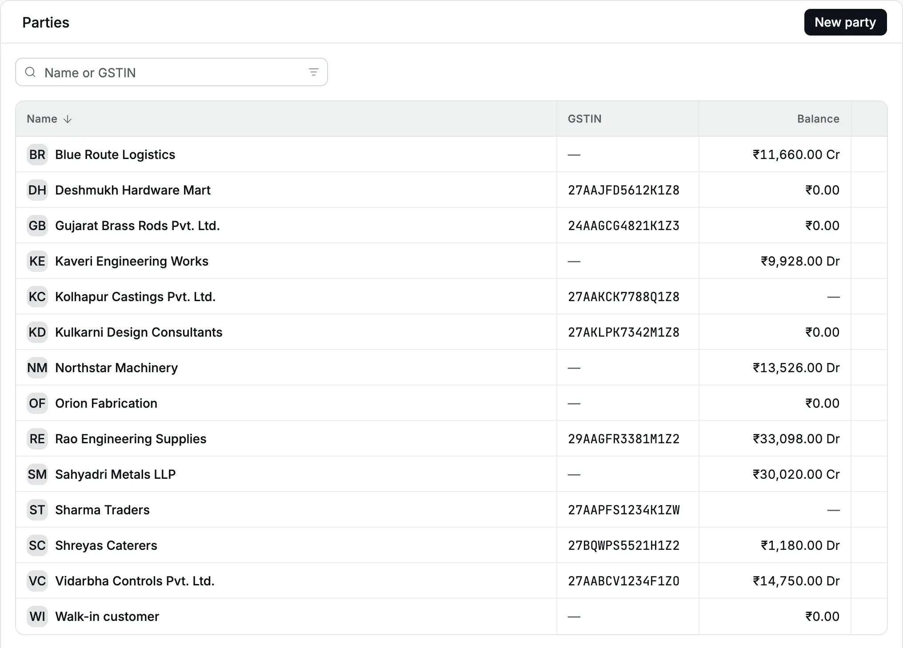
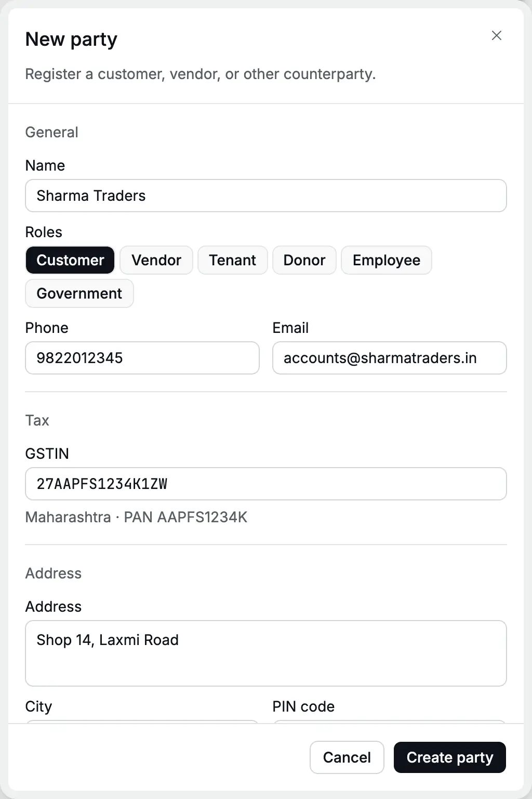
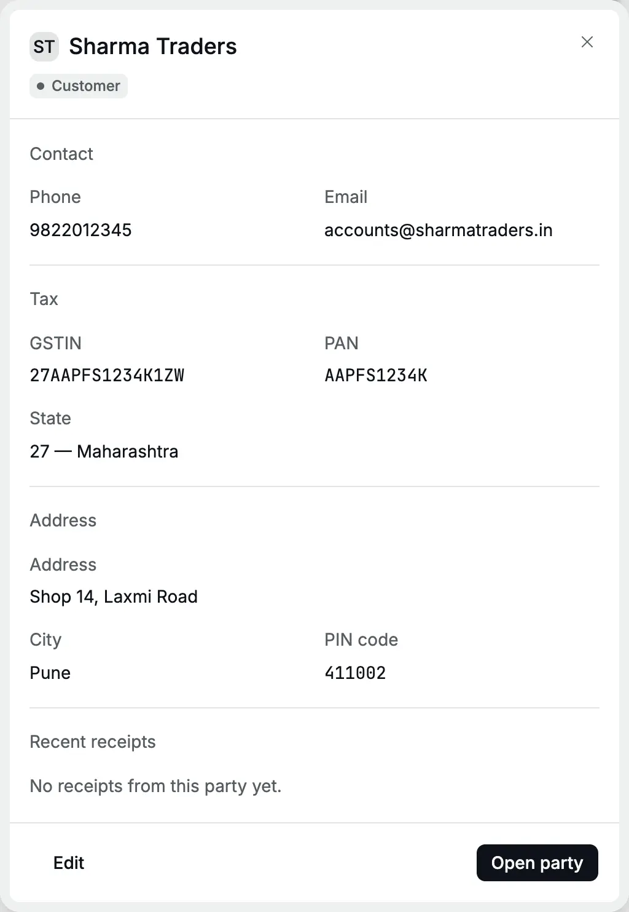
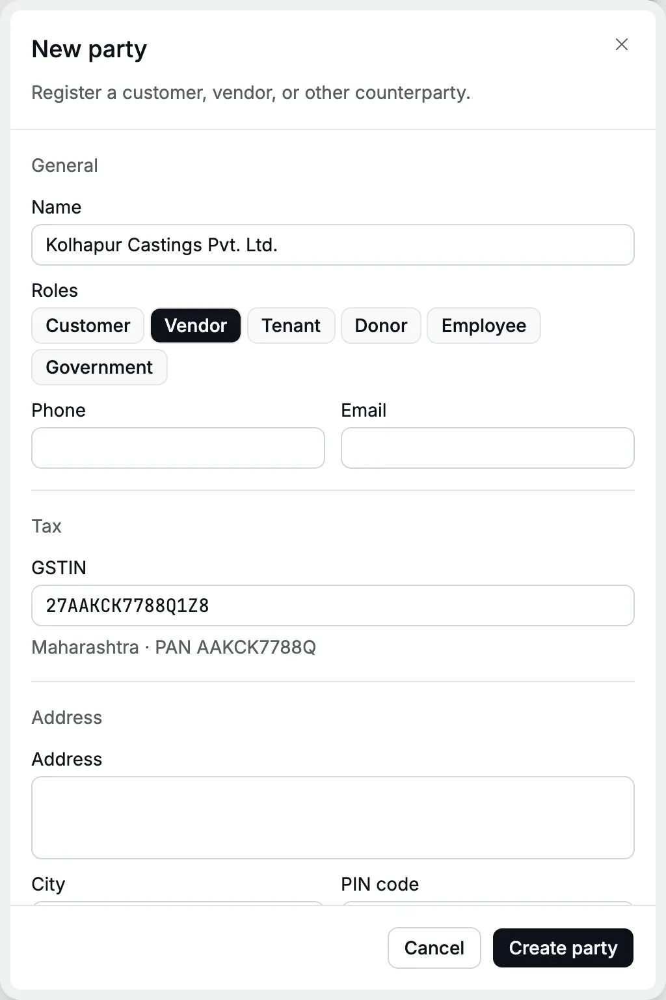
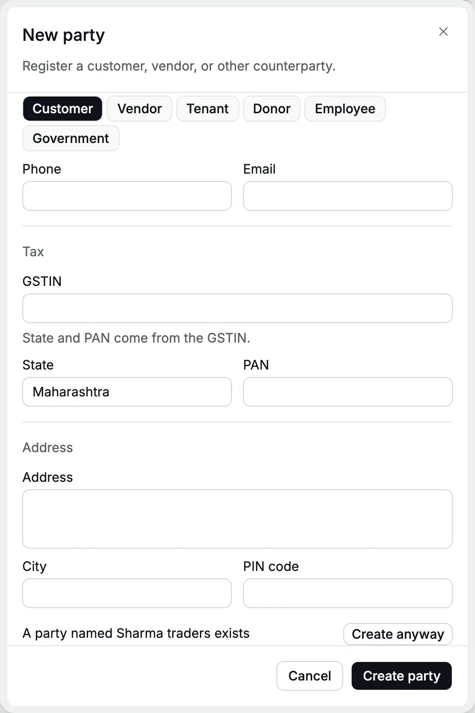
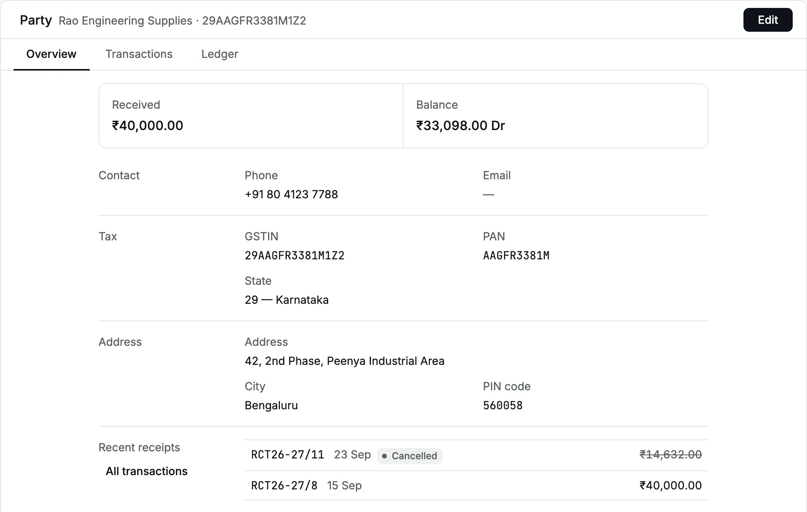
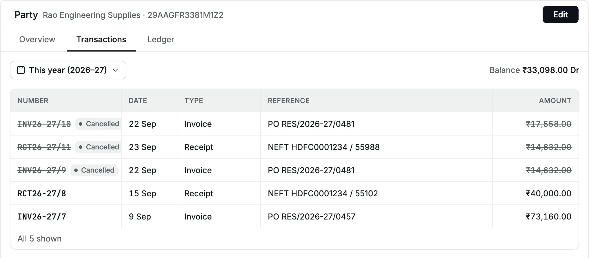
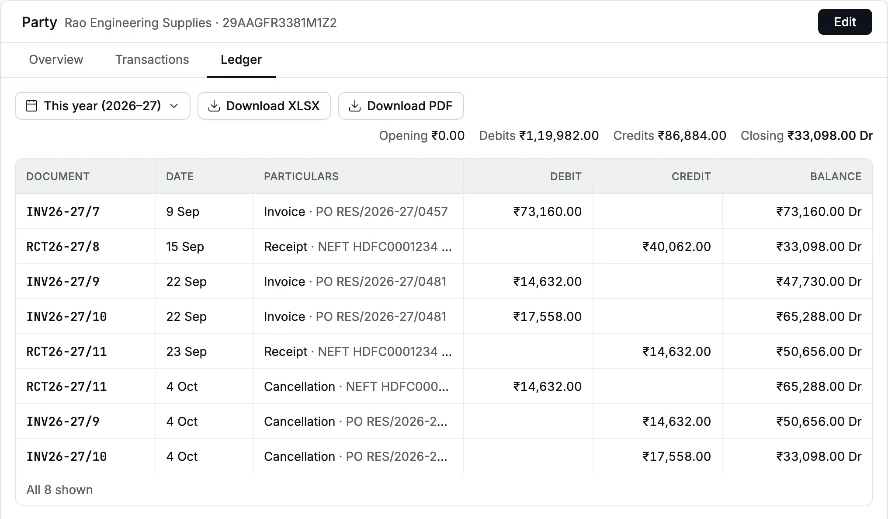
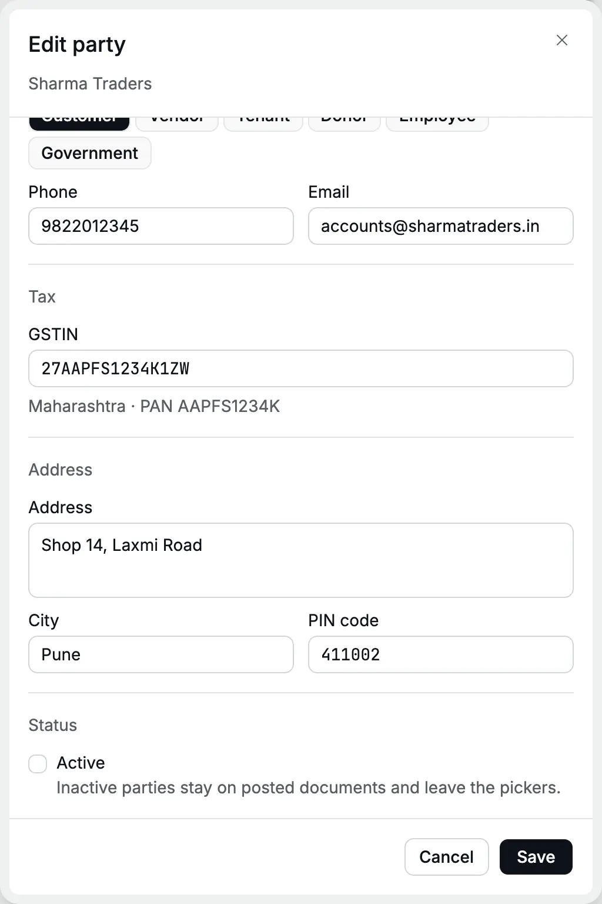
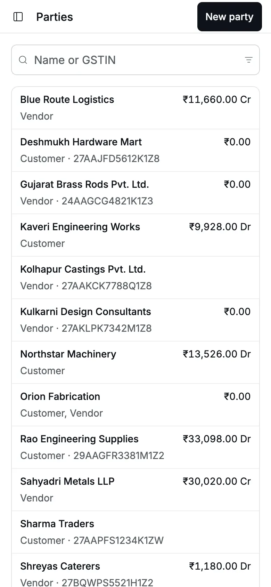

A [party](/glossary#party) is anyone you deal with: a customer, a vendor, a tenant, a donor, an
employee or a government office. [Invoices](/glossary#invoice), [bills](/glossary#bill), [receipts](/glossary#receipt) and
[payments](/glossary#payment) each name a party. Invoices, bills, advances and receipts or
payments against open items make up the party's balance. A **Direct** receipt or payment
can name a party but does not change its balance.

**Who can do it:** an **Owner** or **Accountant** (see [roles](/glossary#roles)) adds and edits parties. An
**Operator** and a **Chartered Accountant** can see them; an operator picks existing
parties on invoices and receipts but cannot add one.

## The party list

Open **Masters → Parties**. Each row shows the **Name**, **GSTIN** ([GSTIN](/glossary#gstin): the 15-character GST
registration number; a dash for an unregistered party) and **Balance**
(Dr and Cr are [debit and credit](/glossary#debit-credit)):

- **Dr**: the party owes you, for example ₹33,098.00 Dr for a customer with unpaid
  invoices.
- **Cr**: you owe the party, or hold its [advance](/glossary#advance) (money paid before the invoice), for example ₹2,44,528.00 Cr for a
  vendor whose bills are unpaid.

Balances include entries dated through today in your organization's time zone,
like the Home totals. Future-dated entries count only when their date arrives.

Search by name or GSTIN. The filter icon offers **Status** (Active or Inactive),
**Role** and **GST** (Registered or Unregistered). Click a column heading to sort. The
**⋯** at the end of a row offers **Open party**, **Edit party**, **View
transactions** and **Copy GSTIN**. Click a name to open a quick look over the list.

<Frame caption="Cedar Components' parties with their GSTIN and balance.">
  
</Frame>

## Add a customer

Cedar Components starts selling to **Sharma Traders**, a registered dealer in Pune.

<Steps>
  <Step title="Open the form">
    Click **New party**. The **New party** panel opens with the role **Customer** already chosen.
  </Step>
  <Step title="Name and contact">
    Type **Sharma Traders** in **Name**. Add the **Phone** and **Email** used for accounts.
  </Step>
  <Step title="Type the GSTIN">
    Type **27AAPFS1234K1ZW** in **GSTIN**. The line under it shows **Maharashtra · PAN AAPFS1234K**:
    the state and [PAN](/glossary#pan) (Permanent Account Number) are filled from the GSTIN, so
    their fields are hidden.
  </Step>
  <Step title="Add the address">
    Type the **Address**, **City** and **PIN code**. They print on invoices.
  </Step>
  <Step title="Save">
    Click **Create party** (or <kbd>⌘</kbd>/<kbd>Ctrl</kbd> + <kbd>Enter</kbd>). The party opens in
    a quick look.
  </Step>
</Steps>

<Frame caption="A registered customer: the GSTIN fills Maharashtra and the PAN.">
  
</Frame>

<Frame caption="The quick look after saving, with Edit and Open party at the bottom.">
  
</Frame>

## Add a vendor

For a supplier, click **Vendor** under **Roles** and click **Customer** to clear it.
Cedar Components buys castings from **Kolhapur Castings Pvt. Ltd.**, GSTIN
27AAKCK7788Q1Z8.

<Frame caption="A vendor: only the Vendor role is pressed.">
  
</Frame>

You can also add a party from the **Party** field of an invoice, bill, receipt or
payment: type a new name and choose the option to create it. A bill or payment starts
the new party as a vendor.

## GSTIN, state and PAN

| Field     | With a GSTIN                                  | Without a GSTIN (unregistered party)                                                     |
| --------- | --------------------------------------------- | ---------------------------------------------------------------------------------------- |
| **State** | Taken from the first two digits; field hidden | Required. Choose the state where the party is                                            |
| **PAN**   | Taken from characters 3 to 12; field hidden   | Optional. Add it for [TDS](/glossary#tds) (tax deducted at source) or high-value parties |

The state matters: it is the default [place of supply](/glossary#place-of-supply) on
invoices and bills, which decides CGST + SGST (same state as you) or IGST (another
state); see [CGST, SGST and IGST](/glossary#cgst-sgst-igst). Cedar Components is
in Maharashtra, so a sale to Sharma Traders charges CGST and SGST, and a sale to Rao
Engineering Supplies in Karnataka charges IGST.

If you clear a GSTIN, the **State** and **PAN** fields come back with the values the
GSTIN gave them. Check them before you save.

A GSTIN must have the 15-character GST pattern and a real state code. Accly Books does
not check the last character (the check digit), so verify the number on the GST
portal or the party's invoice.

## Duplicates

**Same GSTIN.** Only one party can hold a GSTIN. Saving a second party with
27AAPFS1234K1ZW shows "A party with this GSTIN already exists." Use the existing
party. A business with branches in two states has two GSTINs, so two parties.

**Same name (namesake).** Names compare without case and extra spaces. If you save
**Sharma traders** while **Sharma Traders** exists, the party is not saved. A line at
the bottom of the form says "A party named Sharma traders exists" with a **Create
anyway** button.

<Frame caption="The namesake warning sits at the bottom of the form, below the address.">
  
</Frame>

:::warning
When nothing seems to happen after **Create party**, scroll to the bottom of the form:
the namesake warning may be out of view. Click **Create anyway** only for a genuinely
different party, such as two students with the same name. Otherwise, use the existing
party: two records for one customer split their balance.
:::

## Roles

Roles describe the party. They do not limit what you can do with it.

| Role           | Typical use                        |
| -------------- | ---------------------------------- |
| **Customer**   | You invoice them and receive money |
| **Vendor**     | They bill you and you pay them     |
| **Tenant**     | They pay you rent                  |
| **Donor**      | They give donations or grants      |
| **Employee**   | Salary advances and reimbursements |
| **Government** | Tax departments, municipal bodies  |

A party can hold several roles, for example a dealer who both buys from and sells to
you. On an invoice, parties with the **Customer** role are listed first; on a bill,
**Vendor** parties come first. The others are still listed below them.

## The party page

Open a party with **Open party** in the quick look, or **Open party** in the row's **⋯** menu. The page has three tabs.

<Tabs>
  <Tab title="Overview">
    **Received** (total receipts from the party) and **Balance**, then the contact, tax and
    address details and the party's recent receipts.

    <Frame caption="Overview for Rao Engineering Supplies, a customer in Karnataka.">
      
    </Frame>

  </Tab>
  <Tab title="Transactions">
    Every invoice, receipt, bill, payment and note for the party in a period, with its number,
    date, type, reference and amount. Cancelled [documents](/glossary#document) show a **Cancelled** badge.

    <Frame caption="Transactions this year: two invoices and a receipt were cancelled.">
      
    </Frame>

  </Tab>
  <Tab title="Ledger">
    The party's [ledger](/glossary#ledger), a statement for a period: **Opening**, **Debits**, **Credits** and **Closing**,
    then each entry with a running balance. A cancellation shows as its own [reversal](/glossary#reversal) line on
    the day it was cancelled. Download it as XLSX or PDF to send to the party. See
    [Party ledger](/reports/party-ledger).

    <Frame caption="The ledger: invoices debit, receipts and cancellations credit.">
      
    </Frame>

  </Tab>
</Tabs>

An Operator sees the Overview and Transactions; the Ledger tab needs report access.

## Edit a party

Click **Edit** on the party page. Change any field and click **Save**. Saving is
allowed only when you changed something. [Posted](/glossary#post) documents keep the name, address and
GSTIN they were posted with; new documents use the new details.

## Mark a party inactive

In **Edit**, clear **Active** under **Status** ([inactive](/glossary#inactive) records stay but leave the pickers) and click **Save**. The party leaves
the pickers on new documents. Its posted documents and balance stay. Filter the list
by **Status → Inactive** to see inactive parties.

<Frame caption="Clear Active to retire a party. Its posted documents stay.">
  
</Frame>

:::warning[Settle the balance first]
Accly Books lets you mark a party inactive while it still has a balance, without a
warning. You then cannot choose it on a receipt or payment to settle that balance
until you mark it active again. Check that the balance is ₹0.00 first.
:::

## On a phone

The list shows each party as a card with its GSTIN and balance. Tap a card for the
quick look.

<Frame caption="The party list on a phone.">
  
</Frame>

## Common errors

| Message                                           | What to do                                                             |
| ------------------------------------------------- | ---------------------------------------------------------------------- |
| "A party with this GSTIN already exists."         | Use the existing party, or correct the GSTIN                           |
| "A party named … exists"                          | Use the existing party, or click **Create anyway** for a different one |
| "GSTIN must start with a valid Indian state code" | Check the first two digits                                             |
| "Choose a state"                                  | An unregistered party needs a state                                    |
| "Use a valid PAN"                                 | Five letters, four digits, one letter, such as ABCDE1234F              |
| "Use a valid 6-digit PIN code"                    | Six digits, not starting with 0                                        |
| "Choose at least one role"                        | Press at least one role                                                |

## Related pages

- [Invoices](/sales/invoices) and [Bills](/purchases/bills): each names a party.
- [Party ledger](/reports/party-ledger): a statement for any period.
- [Import opening balances](/setup/import-opening-balances): create many parties from Excel.
