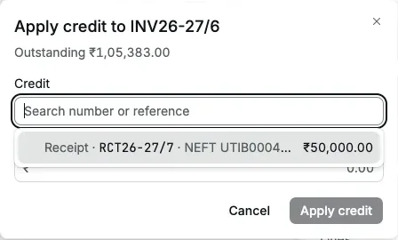
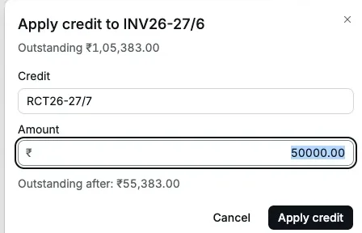
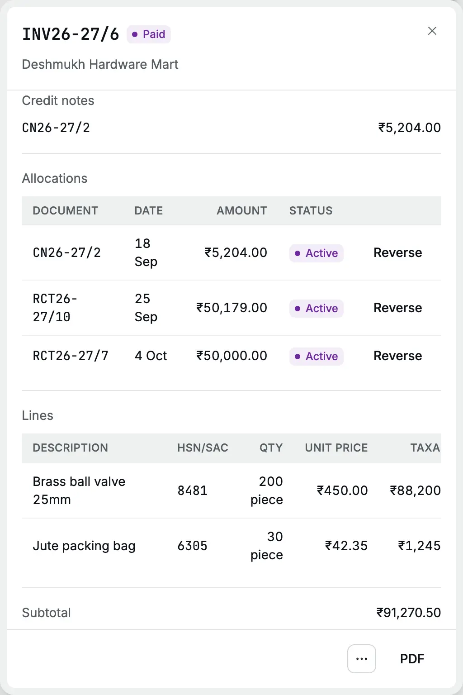
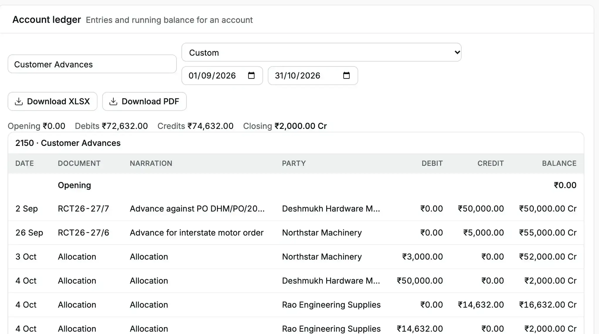
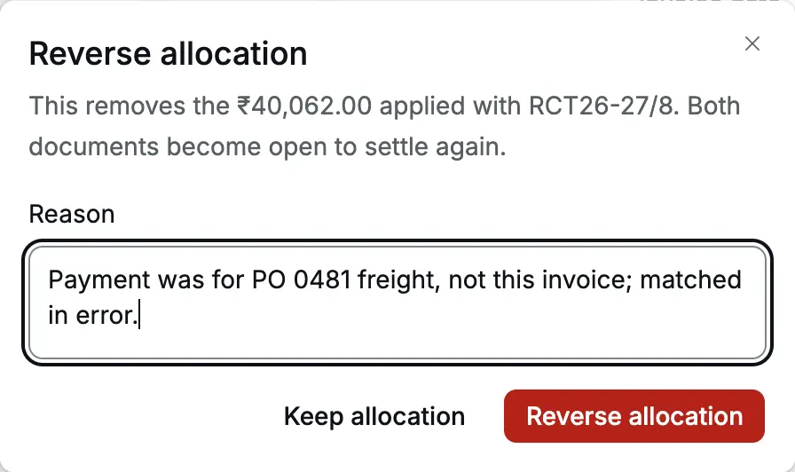

Applying credit matches money or [credit](/glossary#credit) a customer already has with
you to an invoice they owe. Each match is an [allocation](/glossary#allocation). The
customer's total balance does not change; the invoice's [outstanding](/glossary#outstanding)
amount (what is still unpaid) falls, and the credit is used up.

Use it when:

- a customer paid an [**advance**](/glossary#advance) (money before the invoice) before you
  raised the invoice;
- a [**credit note**](/glossary#credit-note) (a document that reduces an invoice) is left
  unapplied, for example after its own invoice was paid;
- a receipt was only partly allocated and the rest sits as an advance;
- an [**opening credit**](/glossary#opening-item) (money a customer paid ahead in your old
  books) should settle a new invoice.

**Who can do it** (see [roles](/glossary#roles))**:** an Owner or Accountant. Operators and Chartered Accountants do not
see **Apply credit** or **Reverse**.

## Apply an advance to an invoice

Deshmukh Hardware Mart paid an advance of ₹50,000 on 2 Sep 2026 (RCT26-27/7).
Cedar Components then raised INV26-27/6 for ₹1,05,383 on 5 Sep.

<Steps>
  <Step title="Open the invoice">
    In **Invoices**, open INV26-27/6 and click **⋯ → Apply credit**. The dialog shows the invoice's
    **Outstanding**.
  </Step>
  <Step title="Choose the credit">
    Click **Credit** to list the customer's unapplied credits: each shows its kind (Receipt, Credit
    Note, Opening credit, Journal), number, reference, date and the unapplied amount. Type part of a
    number or reference to search.
  </Step>
  <Step title="Check the amount">
    **Amount** fills with the smaller of the credit and the invoice's outstanding, here ₹50,000.00.
    Change it to apply only part. **Outstanding after** shows what the invoice will still owe:
    ₹55,383.00.
  </Step>
  <Step title="Apply">
    Click **Apply credit**. The toast reads "Credit applied". The invoice now shows **Part paid**
    and the receipt under **Allocations**.
  </Step>
</Steps>

<Frame caption="The customer's unapplied credits. Only this party's credits are listed.">
  
</Frame>

<Frame caption="₹50,000 of the advance applied; ₹55,383 remains due.">
  
</Frame>

If the customer has nothing to apply, the dialog says "No unapplied credits for this
party." An amount larger than the credit or the outstanding is refused with "Enter no
more than ₹…".

:::warning[The match is dated today]
Applying credit has no date field. The entry is dated the day you apply it. For
Deshmukh, the advance was applied on 4 Oct 2026, so the September [balance sheet](/glossary#balance-sheet) still
shows ₹50,000 as a customer advance and ₹50,000 more in [receivables](/glossary#receivable)
(money customers owe). Apply advances
before you close a month, and before your CA (Chartered Accountant) [locks](/glossary#lock) it.
:::

## Where you see allocations

Every invoice, receipt and credit note lists its matches under **Allocations**, with
the other document, the date, the amount and **Active** or **Reversed**.

<Frame caption="INV26-27/6 is paid by a credit note, a receipt and the applied advance.">
  
</Frame>

A receipt or credit note record shows **Unapplied**: what it still has to give. An
invoice shows **Outstanding**.

## What happens in the books

Applying an **advance receipt** moves the money from the advance account to the
customer's receivable. Both are [control accounts](/glossary#control-account), which hold
one total for all customers. Each line is a [debit or credit](/glossary#debit-credit)
(Dr or Cr), the two equal sides of every entry:

| Account                                      | Debit      | Credit     |
| -------------------------------------------- | ---------- | ---------- |
| Customer Advances (Deshmukh Hardware Mart)   | ₹50,000.00 |            |
| Accounts Receivable (Deshmukh Hardware Mart) |            | ₹50,000.00 |

Applying a **credit note**, an **opening credit** or a [journal](/glossary#journal) credit posts no entry:
the credit is already in Accounts Receivable, and the match only records which
invoice it settles.

In the account [ledger](/glossary#ledger) and the [day book](/glossary#day-book) (the list of
every entry by date), the advance entry shows as **Allocation**.

<Frame caption="The Customer Advances ledger: the advance comes in on 2 Sep and moves to receivables on 4 Oct.">
  
</Frame>

### What the party ledger shows

The [party ledger](/reports/party-ledger) lists [documents](/glossary#document), not matches. Applying
credit adds no line and does not change the balance. For Deshmukh Hardware Mart:

| Document                    | Date   | Debit        | Credit     | Balance       |
| --------------------------- | ------ | ------------ | ---------- | ------------- |
| RCT26-27/7 Advance received | 2 Sep  |              | ₹50,000.00 | ₹50,000.00 Cr |
| INV26-27/6 Invoice          | 5 Sep  | ₹1,05,383.00 |            | ₹55,383.00 Dr |
| CN26-27/2 Credit Note       | 18 Sep |              | ₹5,204.00  | ₹50,179.00 Dr |
| RCT26-27/10 Receipt         | 25 Sep |              | ₹50,179.00 | ₹0.00         |

The matches decide which invoices show as open or overdue, not the party's balance.

## Reverse an allocation

Reverse a match made against the wrong invoice, or before you cancel or amend an
invoice that has matches.

<Steps>
  <Step title="Find the allocation">
    Open the invoice, receipt or credit note. Under **Allocations**, click **Reverse** on the row.
  </Step>
  <Step title="Give the reason">
    The dialog says what will be removed, for example "This removes the ₹40,062.00 applied with
    RCT26-27/8. Both documents become open to settle again." Type the **Reason** and click **Reverse
    allocation**.
  </Step>
</Steps>

<Frame caption="Reversing a receipt matched to the wrong invoice.">
  
</Frame>

The row stays in the list as **Reversed**. The invoice owes the amount again, and
the credit is unapplied again, ready to apply elsewhere.

In the books:

| What you reverse                               | [Reversal](/glossary#reversal) entry dated today                             |
| ---------------------------------------------- | ---------------------------------------------------------------------------- |
| An advance you applied later                   | The applying entry is reversed: Dr Accounts Receivable, Cr Customer Advances |
| A match made when the receipt was posted       | The money becomes an advance: Dr Accounts Receivable, Cr Customer Advances   |
| A credit note, opening credit or journal match | No entry                                                                     |

You cannot reverse the same allocation twice: "This allocation is not active."

## Related pages

- [Receipts](/sales/receipts): advances and partly allocated receipts
- [Credit notes](/sales/credit-notes)
- [Opening balance](/setup/opening-balance) and [import](/setup/import-opening-balances): opening credits
- [Account ledger](/reports/account-ledger)
- [A month of trading](/scenarios/trading-month)
