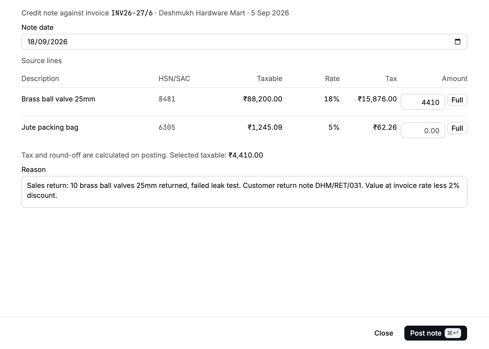
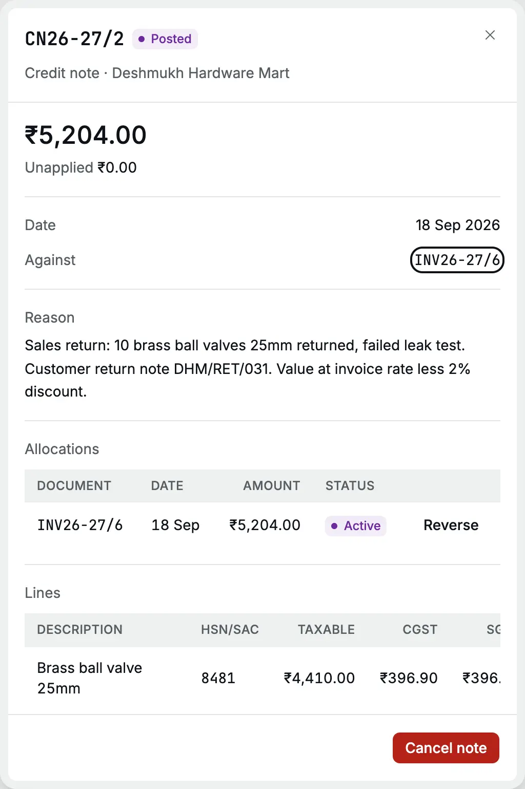
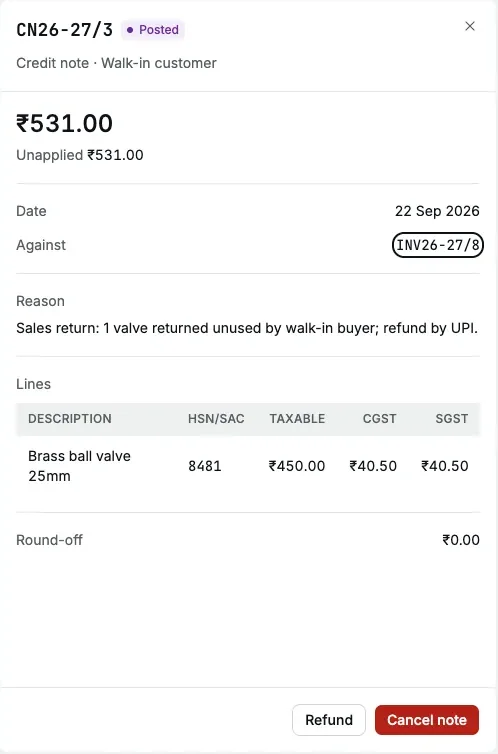

A [credit note](/glossary#credit-note) reduces a [posted](/glossary#post) invoice (one
already recorded in your books). Use it when the customer returns goods, when
you agree a lower price or a post-sale discount, or when you charged too much. It
reverses the income and the [GST](/glossary#gst) (Goods and Services Tax) for the amount
you credit, and lowers what the
customer owes.

Use a credit note when the invoice itself was right but the sale changed afterwards.
If the invoice was wrong from the start, [amend](/sales/invoices#amend) it instead.

**Who can do it** (see [roles](/glossary#roles))**:** an Owner or Accountant posts and cancels credit notes. A Chartered
Accountant can read them. An Operator cannot see credit notes.

## The credit note register

Open **Sales → Credit notes**. The register lists posted and cancelled credit notes
with **Number**, **Type**, **Against** (the invoice), **Party**, **Date**, **Total**,
**Unapplied** and **Status**. **Unapplied** is the part of the note not yet used
against an invoice or refunded, its unapplied [credit](/glossary#credit).

You do not start a credit note from this register. Start it from the invoice it
corrects.

## Post a credit note

On 18 Sep 2026 Deshmukh Hardware Mart returns 10 of the 200 brass ball valves on
INV26-27/6 because they failed a leak test. The invoice price was ₹450 less the 2%
discount, so the taxable value (the value before GST) to credit is 10 × ₹441 = ₹4,410.

<Steps>
  <Step title="Open the invoice">In **Invoices**, open INV26-27/6. Click **⋯ → Credit note**.</Step>
  <Step title="Set the note date">
    **Note date** starts at today. Set the date of the return, 18 Sep 2026. It cannot be before the
    invoice date.
  </Step>
  <Step title="Enter the taxable amount per line">
    **Source lines** lists each line of the invoice with its [HSN or SAC](/glossary#hsn-sac) code
    (the GST classification code), taxable value, GST rate and tax. In **Amount**, type the taxable
    value to credit on each line you are reducing, here **4410** on the valve line. Click **Full**
    to credit a whole line. Leave the other lines empty.
  </Step>
  <Step title="Give the reason">
    Type the **Reason**, for example the customer's return note number and why the goods came back.
    It is saved on the note as its [narration](/glossary#narration) (the note on the entry). The
    [audit log](/glossary#audit-log) records that the note was posted, with its number and invoice,
    but not the reason.
  </Step>
  <Step title="Post">
    Click **Post note**. The toast reads "Credit note posted" and the note opens.
  </Step>
</Steps>

<Frame caption="A sales return of 10 valves: ₹4,410 taxable on the valve line.">
  
</Frame>

### Line rules

- You enter the **taxable value**, not a quantity. Work it out from the quantity and
  the invoice rate after discount.
- The note uses the invoice's own GST rate, [place of supply](/glossary#place-of-supply) and
  [CGST/SGST or IGST](/glossary#cgst-sgst-igst)
  split. You cannot change them.
- The tax is worked out when you post. "Tax and round-off are calculated on posting"
  under the lines shows only the selected taxable value.
- A line cannot be credited beyond what remains of it after earlier credit notes.
  The form shows the line's original taxable value and **Full** fills that, so after
  an earlier partial note type the remaining amount yourself. Otherwise the post is
  refused with "The note exceeds what remains of "Brass ball valve 25mm"."
- Crediting a whole line returns exactly the tax that line still carries, so a full
  return leaves no stray paise.
- The note total is rounded to whole rupees, like an invoice.

## The credit note record

<Frame caption="CN26-27/2 for ₹5,204.00, already applied to INV26-27/6.">
  
</Frame>

The record shows the total, **Unapplied**, the date, **Against** (a link to the
invoice), the reason, the **Allocations** it made, and each line with taxable value,
CGST, SGST, IGST and total.

For CN26-27/2: taxable ₹4,410.00, CGST ₹396.90, SGST ₹396.90, total ₹5,203.80
rounded to **₹5,204.00**.

## Print or download the PDF

Click **PDF** on the record to open the **Credit Note** in a new tab. Use the
browser viewer to print or save it. It shows your organization's and the customer's
names, addresses and GSTINs, the note number and date, the original invoice number
and date, each line's taxable value, GST rate and tax, place of supply, totals,
reason and signature line. If the invoice had a delivery address, the note keeps
that **Ship to** address, state name and code. A cancelled note prints **CANCELLED**.

## Apply to the invoice

When you post a credit note, Accly Books applies it to its own invoice at once (an
[allocation](/glossary#allocation), the match between a credit and an invoice), up to
what the invoice still owes, dated on the note date. You do not need to do anything
else. The invoice shows the note under **Credit notes** and **Allocations**, and its
[outstanding](/glossary#outstanding) amount falls by the amount applied.

If the invoice was already paid, or owes less than the note, the rest stays
**Unapplied**. You can then:

- [apply it](/sales/apply-credit) to another open invoice of the same customer; or
- refund it to the customer.

## Refund the customer

On 20 Sep 2026 a walk-in customer paid ₹2,655 by [UPI](/glossary#upi-neft) (an instant bank payment from a phone) for 5 valves (INV26-27/8). On
22 Sep the customer returns one unused valve. The credit note CN26-27/3 for ₹531.00
(₹450.00 + ₹81.00 GST) stays unapplied, because the invoice is paid.

<Frame caption="An unapplied credit note shows Refund.">
  
</Frame>

<Steps>
  <Step title="Start the refund">
    Open the credit note and click **Refund**. A **New payment** form opens with the customer
    selected and **Against open items → Refund credit notes** already chosen.
  </Step>
  <Step title="Fill the refund">
    Type the **Amount** (₹531), choose the [**Payment method**](/glossary#payment-method) (UPI), and
    click **Fill** on the credit note. Add the UPI reference and the date.
  </Step>
  <Step title="Post">
    Click **Post**. The refund amount must equal what you allocate to the credit notes: "Refund
    amount must equal the allocated credit notes".
  </Step>
</Steps>

## What happens in the books

Each line below is a [debit or credit](/glossary#debit-credit) (Dr or Cr), the two equal
sides of every entry. Accounts Receivable is the [receivable](/glossary#receivable)
account that holds what customers owe.

**Credit note** CN26-27/2 (the reverse of the invoice lines it credits):

| Account                                      | Debit     | Credit    |
| -------------------------------------------- | --------- | --------- |
| Sales                                        | ₹4,410.00 |           |
| CGST Output Payable                          | ₹396.90   |           |
| SGST Output Payable                          | ₹396.90   |           |
| Round Off                                    | ₹0.20     |           |
| Accounts Receivable (Deshmukh Hardware Mart) |           | ₹5,204.00 |

Applying a credit note to its invoice needs no further entry: both sit in Accounts
Receivable.

**Refund** of CN26-27/3:

| Account                                | Debit   | Credit  |
| -------------------------------------- | ------- | ------- |
| Accounts Receivable (Walk-in customer) | ₹531.00 |         |
| Bank Account                           |         | ₹531.00 |

On the [party ledger](/glossary#ledger) the credit note is a credit; the refund is a debit that brings
the balance back to zero.

## Cancel a credit note

Open the note and click **Cancel note**. Give the reason. Cancelling posts a
[reversal](/glossary#reversal) of the note's entry on the note date and reverses its allocations, so the invoice owes the
amount again. Cancel a credit note before you cancel or amend its invoice: the invoice
refuses with "Cancel credit note CN26-27/2 first."
Cancellation is refused if the note date is tax-locked, or books-locked without an exception.

## Common messages

| Message                                          | What to do                                                              |
| ------------------------------------------------ | ----------------------------------------------------------------------- |
| Enter an amount on at least one line             | Type a taxable amount on a line                                         |
| Enter an amount within this line's taxable value | The amount is more than the line's original taxable value               |
| The note exceeds what remains of "…".            | Earlier notes already credited part of this line; type a smaller amount |
| Note total exceeds the source document total.    | Earlier notes already credit most of the invoice                        |
| Date must be on or after the source date         | Move the note date on or after the invoice date                         |

## Related pages

- [Invoices](/sales/invoices)
- [Apply credit](/sales/apply-credit)
- [Payments](/purchases/payments): the same form records refunds
- [Party ledger](/reports/party-ledger)
