An [invoice](/glossary#invoice) records a sale to a customer. It sets what the customer
owes you, and it posts your income and the [GST](/glossary#gst) (Goods and Services Tax)
you collect. Accly Books works out [CGST and SGST, or IGST](/glossary#cgst-sgst-igst)
(central and state GST on a sale within your state, integrated GST on a sale to another
state) from the [place of supply](/glossary#place-of-supply), the state where the sale
is taxed. It prints a PDF to send to the customer.

Use an invoice for every sale of goods or taxable services, on credit or paid at the
counter. To record money before you bill, an [advance](/glossary#advance), use a
[receipt](/sales/receipts) instead.

**Who can do it** (see [roles](/glossary#roles))**:** an Owner, Accountant or Operator creates and posts invoices. Only
an Owner or Accountant can amend or cancel one. A Chartered Accountant can open and
print invoices but cannot change them.

## The invoice register

Open **Sales → Invoices**. The register lists [draft](/glossary#draft) invoices (saved but
not yet in your books), [posted](/glossary#post) ones (recorded in your books) and
cancelled ones, newest document date first. It opens on **This month**.

<Frame caption="The invoice register for September 2026. Cancelled invoices are struck through; the draft shows whatever the period.">
  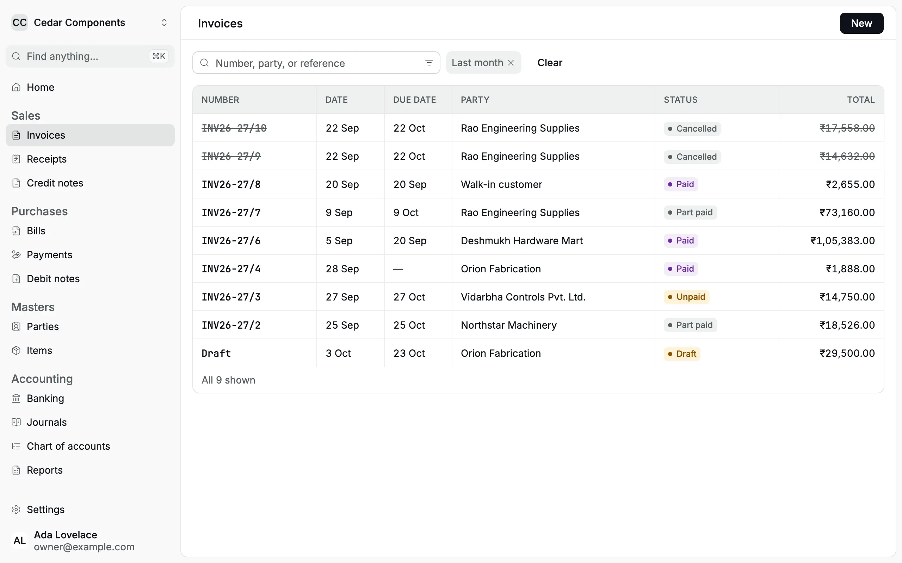
</Frame>

| Column         | Shows                                                                                                                                 |
| -------------- | ------------------------------------------------------------------------------------------------------------------------------------- |
| Number         | The invoice number, or **Draft** before posting                                                                                       |
| Date, Due date | The invoice date and the date payment is due                                                                                          |
| Party          | The customer ([party](/glossary#party)) as printed on the invoice                                                                     |
| Status         | **Draft**, **Unpaid**, **Part paid**, **Paid** or **Cancelled**, plus **Overdue** when the due date has passed and money is still due |
| Total          | The invoice total, after discount, GST and round-off (rounding to whole rupees)                                                       |

To narrow the list:

- Type at least three letters or digits in the search box to find an invoice number,
  a party name or a reference such as a purchase order (PO) number.
- Click the filter icon in the search box to choose a **Date** period or a
  **Status**. **Open** shows posted invoices with money still due. **Overdue**
  shows open invoices whose due date is before today.
- Click **Clear** to remove every filter.

<Frame caption="Status → Open lists every posted invoice that is not fully paid.">
  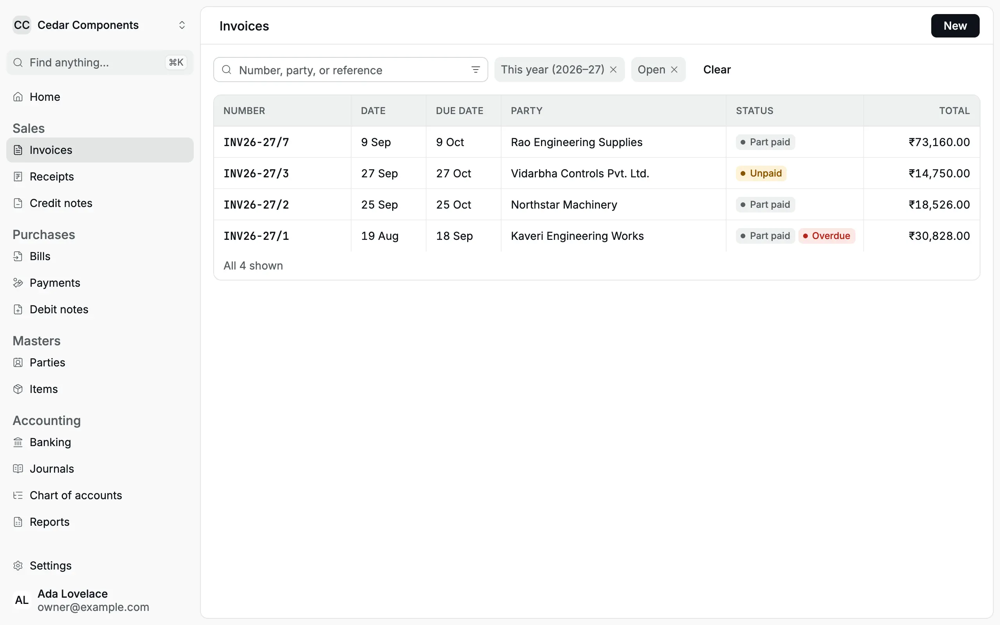
</Frame>

:::note
Drafts always show, whatever date period you choose, so unfinished work is never
hidden. The **Total** column shows the full invoice value. To see the amount still
due, open the invoice: its record shows [**Outstanding**](/glossary#outstanding), the
amount not yet paid.
:::

## Create an invoice

Cedar Components is in Maharashtra. On 5 Sep 2026 it sells 200 brass ball valves at
₹450 and 30 jute packing bags at ₹42.35 to Deshmukh Hardware Mart of Pune, with a 2%
trade discount.

<Steps>
<Step title="Open a new invoice">
In **Invoices**, click **New**. The editor is laid out like the printed invoice:
your organization and **Numbered when posted** at the top, the customer and dates
next, then the lines, then the notes and totals.
</Step>
<Step title="Choose the customer">
In **Bill to**, type part of the party name and choose it. Customers are listed
first. Accly Books shows the party's address, state and [GSTIN](/glossary#gstin) (GST registration number), or **Unregistered**,
under the name. If the address is wrong, click **Edit party** to correct the party
itself.

If the goods go to another address, tick **Ship to a different address**, type the
delivery address and choose **Ship to state**. The invoice then prints both a Bill
to and a Ship to block.

</Step>
<Step title="Check the dates and place of supply">
**Invoice date** starts at today. **Due date** follows the invoice date until you
change it, so set your credit period here, for example 20 Sep 2026 for 15 days.

**Place of supply** fills from the party's state. It decides the tax:

| Place of supply                                                    | Tax on the invoice                |
| ------------------------------------------------------------------ | --------------------------------- |
| Same state as your organization (Maharashtra for Cedar Components) | CGST and SGST, each half the rate |
| Any other state                                                    | IGST at the full rate             |

Accly Books does not change the place of supply when you add a ship-to address. Set
it yourself by the GST place-of-supply rules. For goods delivered to another state,
especially for an unregistered customer, the delivery state can be the place of
supply. Check with your CA when the bill-to and ship-to states differ.

</Step>
<Step title="Add the lines">
Under **Lines**, choose an **Item**. Below the item, Accly Books shows its
[HSN or SAC](/glossary#hsn-sac) code (the GST classification code for goods or services), GST rate and unit, for example "HSN/SAC 8481 · GST 18% · per piece". Enter
the **Qty** (a whole number from 1 to 1,000,000). **Rate** fills from the item; you
can change it for this invoice. Type a **Description** only to print something other
than the item name.

Click **Add item** for each further line. Click the bin icon to remove a line.

</Step>
<Step title="Add a discount, reference and narration">
Under the totals, choose **₹** for a discount amount or **%** for a percentage of the
subtotal, and type it. In **Reference**, type the customer's PO number. Use
**Narration** (a free-text [note](/glossary#narration)) for transport details such as the
lorry receipt (LR) or e-way bill (the GST transport document) number.
</Step>
</Steps>

<Frame caption="The customer, dates and place of supply. The party's state, Maharashtra, makes this an intra-state sale.">
  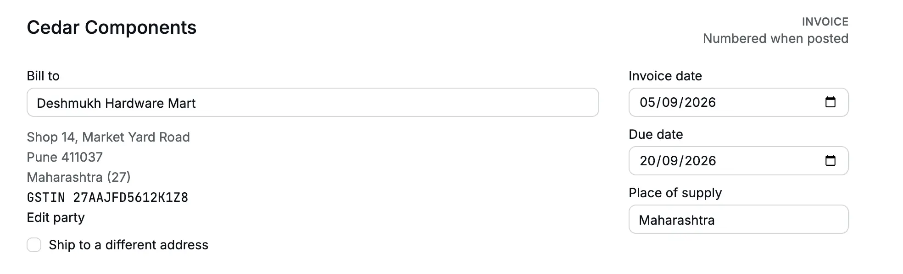
</Frame>

<Frame caption="Lines and totals with a 2% discount. The totals update as you type.">
  
</Frame>

### How the totals are worked out

The totals panel asks the server for the same figures that posting will use, so what
you see is what posts.

| Step                                                              | Deshmukh invoice                                         |
| ----------------------------------------------------------------- | -------------------------------------------------------- |
| Subtotal (quantity × rate)                                        | ₹90,000.00 + ₹1,270.50 = ₹91,270.50                      |
| Discount 2%, shared across the lines in proportion to their value | (₹1,825.41): ₹1,800.00 on the valves, ₹25.41 on the bags |
| Taxable value                                                     | ₹89,445.09                                               |
| CGST: 9% of ₹88,200.00 plus 2.5% of ₹1,245.09                     | ₹7,938.00 + ₹31.13 = ₹7,969.13                           |
| SGST: the same                                                    | ₹7,969.13                                                |
| Round-off to the nearest rupee                                    | (₹0.35)                                                  |
| **Total**                                                         | **₹1,05,383.00**                                         |

Each tax (CGST, SGST, IGST) is rounded to the paisa on its own running total, so the
lines always add up to the invoice tax. The total is then rounded to whole rupees, and
the difference posts to the **Round Off** account.

The discount is a trade discount (a price cut agreed on the invoice), so it lowers the taxable value. It
is not posted to a separate discount account.

### Inter-state example

On 9 Sep 2026 Cedar Components sells 50 gate valves at ₹1,240 to Rao Engineering
Supplies in Bengaluru, Karnataka, delivered to its Doddaballapur site store. Place of
supply is Karnataka, so the invoice carries IGST at 18%.

<Frame caption="An inter-state invoice with a separate ship-to address.">
  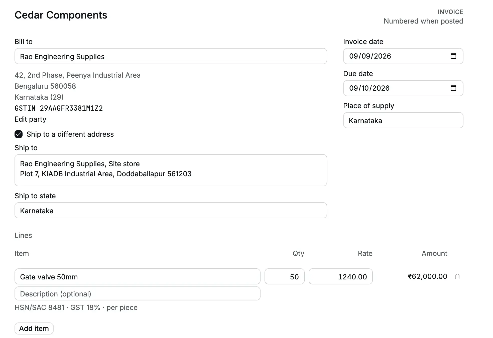
</Frame>

<Frame caption="IGST replaces CGST and SGST: ₹62,000.00 + ₹11,160.00 = ₹73,160.00.">
  
</Frame>

## Save a draft or post

- **Save draft** keeps the invoice without a number and without touching your books.
  The editor stays open on the draft. Payment lines are not saved with a draft.
- **Post** (or <kbd>⌘</kbd>/<kbd>Ctrl</kbd> + <kbd>Enter</kbd>) numbers the invoice,
  posts it to your books and adds it to the customer's balance. The toast says, for
  example, "Invoice INV26-27/6 posted". A new invoice then clears for the next one;
  click **Open** in the toast to see the posted invoice.

### Edit a draft

Open the draft from the register and click **Edit draft**. Change what you need, then
**Save draft** again or **Post**. To delete a draft, click **Discard draft**. This
deletes it at once, with no confirmation.

<Frame caption="A draft has no number. It shows the totals it will post.">
  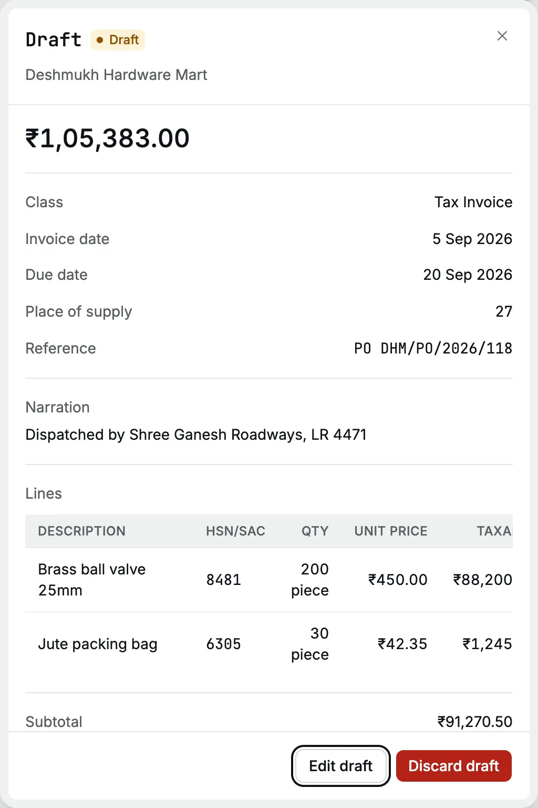
</Frame>

:::warning[Two people on one draft]
If someone else saves the same draft after you opened it, your save is refused with
"This draft changed. Reload it and try again." The editor closes and shows the
current draft, and your unsaved changes are lost. Note them before you reopen the
draft.
:::

## Invoice numbers

An invoice is numbered only when it posts, for example **INV26-27/6**: the prefix
from your organization settings, the [financial year](/glossary#financial-year) (April 2026 to March 2027) and a
running number. Numbers run in the order you post, not by invoice date, and each
financial year starts again at 1. A draft, a discarded draft or a refused post uses
no number. A cancelled invoice keeps its number.

## The invoice record

Click an invoice in the register to open its record on the right. Press the Up or
Down arrow key to step to the previous or next invoice.

<Frame caption="A posted invoice: total, outstanding, class, dates, place of supply and lines.">
  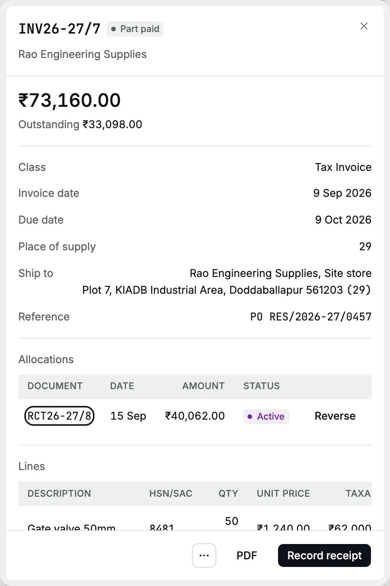
</Frame>

The record shows:

- the total and, once posted, **Outstanding**: what the customer still owes on this
  invoice;
- **Class**: [**Tax Invoice**](/glossary#tax-invoice) when any line carries GST, otherwise
  **Bill of Supply** ([exempt and nil-rated](/glossary#supply-class) items, which carry no GST, or an organization without a GSTIN);
- [**Credit notes**](/glossary#credit-note) posted against it, and
  [**Allocations**](/glossary#allocation): every receipt, credit note or advance matched
  to it (see [Apply credit](/sales/apply-credit));
- each line with taxable value, CGST, SGST, IGST and line total, then the totals.

The footer has:

| Button               | Does                                                                                                              |
| -------------------- | ----------------------------------------------------------------------------------------------------------------- |
| **Record receipt**   | Opens a receipt against this invoice for the outstanding amount (see [Receipts](/sales/receipts#from-an-invoice)) |
| **PDF**              | Opens the printable invoice in a new tab, to print or save                                                        |
| **⋯** (More actions) | **Apply credit**, **Credit note**, **Amend**, **Cancel invoice**                                                  |

<Frame caption="On a phone, the record lists each line as a card.">
  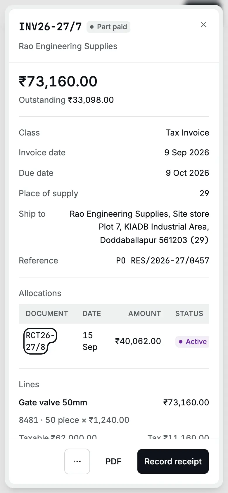
</Frame>

## Print or download the PDF

Click **PDF**. Your browser opens the invoice; use its print or download button.

The heading is **Tax Invoice** when any line carries a GST rate, including mixed
taxable and exempt supplies; otherwise it is **Bill of Supply** for exempt or
nil-rated supplies, or an organization without a GSTIN.

The PDF shows your organization's name, address, GSTIN and [PAN](/glossary#pan) (Permanent Account Number), the Bill to and Ship to
blocks, date, due date, place of supply, reverse charge (No: you, not the buyer, pay this GST), each line with HSN or
SAC, quantity, rate, discount, taxable value, GST rate and tax, the totals, the total
in words, and a signature block. A cancelled invoice prints **CANCELLED**.

<Frame caption="The PDF of INV26-27/6. Its totals match the record line for line.">
  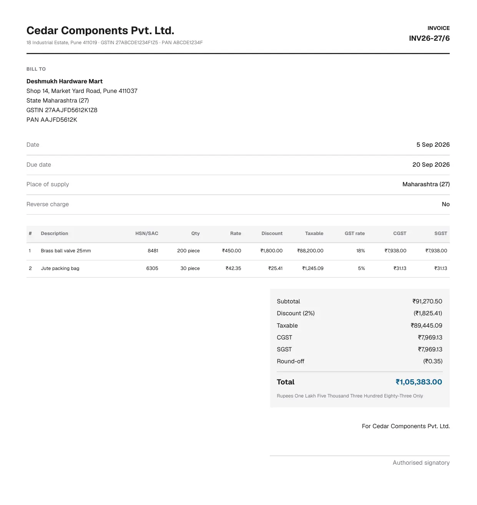
</Frame>

## Counter sale (paid now)

When the customer pays at the counter, a [counter sale](/glossary#counter-sale), record
the payment on the invoice itself.

<Steps>
  <Step title="Fill the invoice">
    Choose the party, for example a **Walk-in customer** party you keep for counter sales, and add
    the lines.
  </Step>
  <Step title="Record the payment">
    Under the totals, click **Record payment**. Choose how the money came in, the [payment
    method](/glossary#payment-method) (**Received by**: Cash, [UPI](/glossary#upi-neft), Card or
    Bank transfer), type the UPI or card **Reference**, and check the **Amount**. It starts at the
    invoice total.
  </Step>
  <Step title="Split if needed">
    If the customer pays part in cash and part by UPI, click **Split payment** and add up to four
    payments. **Balance due** shows what is left on credit.
  </Step>
  <Step title="Post">
    Click **Post**. The toast reads, for example, "Invoice INV26-27/8 posted · ₹2,655.00 received".
    Accly Books posts the invoice and one receipt for each payment, matched to the invoice.
  </Step>
</Steps>

<Frame caption="A counter sale of 5 valves paid by UPI. Balance due ₹0.00.">
  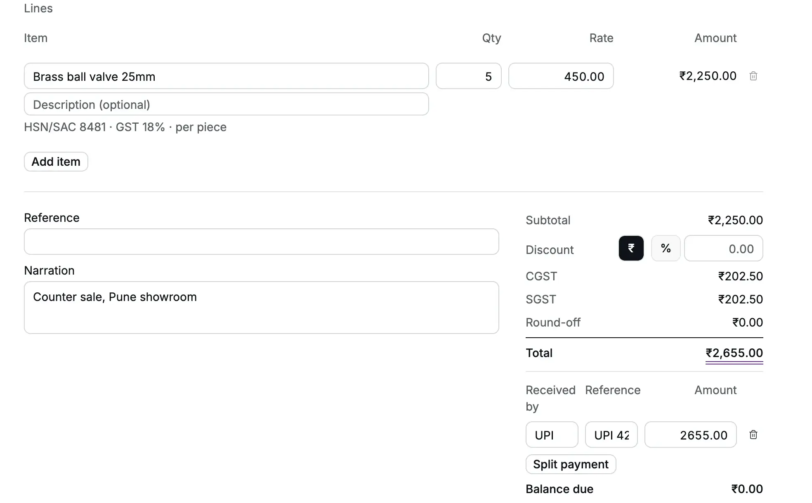
</Frame>

The payments cannot add up to more than the invoice total: "Received cannot exceed
the invoice total". An Operator needs both invoice and receipt posting rights, which
the Operator role has.

## What happens in the books

When you post INV26-27/6, Accly Books writes this entry. Each line is a
[debit or credit](/glossary#debit-credit) (Dr or Cr), the two equal sides of every entry.
Accounts Receivable is the [receivable](/glossary#receivable)
[control account](/glossary#control-account) that holds what all customers owe. The Output
Payable accounts hold the [output tax](/glossary#output-tax), the GST you collect and owe
the government.

| Account                                      | Debit        | Credit     |
| -------------------------------------------- | ------------ | ---------- |
| Accounts Receivable (Deshmukh Hardware Mart) | ₹1,05,383.00 |            |
| Round Off                                    | ₹0.35        |            |
| Sales                                        |              | ₹89,445.09 |
| CGST Output Payable                          |              | ₹7,969.13  |
| SGST Output Payable                          |              | ₹7,969.13  |

Each item credits its own income account (here **Sales**; a service item might credit
**Service Income**). An inter-state invoice credits **IGST Output Payable** instead of
CGST and SGST. A round-off that adds to the total is a credit to Round Off.

The customer's party [ledger](/glossary#ledger) (the running list of its entries) shows the invoice as a debit of ₹1,05,383.00. A counter
sale also posts a receipt: Dr the payment method's bank or cash account, Cr Accounts
Receivable, so the customer's balance returns to zero.

## Correct a posted invoice

A posted invoice is never edited. Choose the correction that matches what happened:

| Situation                                                  | Do this                                                       |
| ---------------------------------------------------------- | ------------------------------------------------------------- |
| Goods came back, or you agreed a lower price               | Post a [credit note](/sales/credit-notes) against the invoice |
| The invoice is wrong (wrong quantity, rate, party or date) | **Amend** it                                                  |
| The sale did not happen                                    | **Cancel** it                                                 |

<Frame caption="More actions on a posted invoice.">
  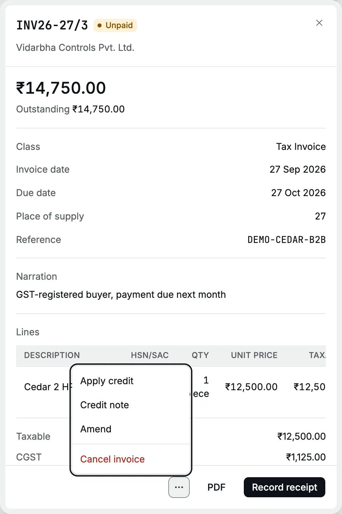
</Frame>

### Amend

Click **⋯ → Amend**, type the reason and click **Amend invoice**. Accly Books cancels
the invoice and opens a copy as a new draft, with the same date, lines and reference.
Fix it and click **Post**. The new invoice gets the next number and its record shows
**Amended from → View original**.

<Frame caption="Amend cancels the invoice and opens an editable copy.">
  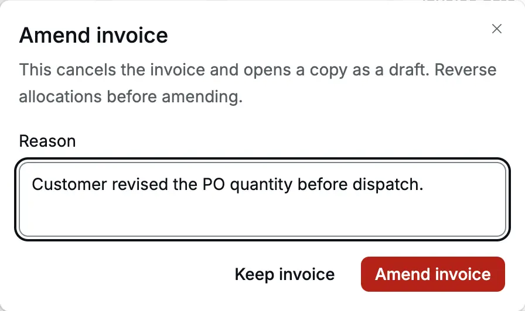
</Frame>

<Frame caption="An amended invoice links back to the original under Amended from. This one, INV26-27/10, was later cancelled too.">
  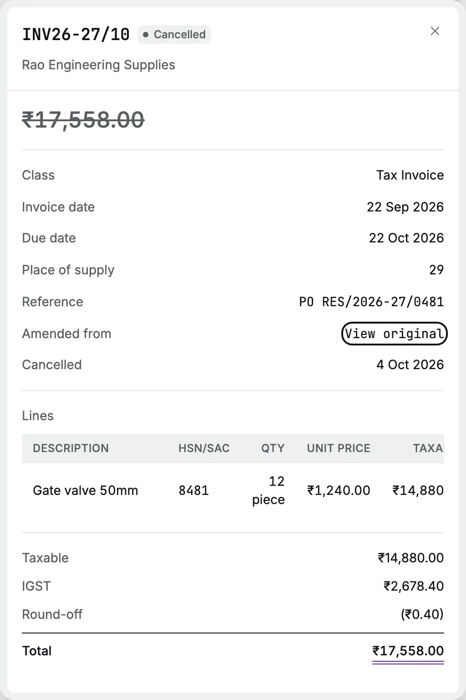
</Frame>

### Cancel

Click **⋯ → Cancel invoice**, type the reason and click **Cancel invoice**. Accly
Books posts a [reversal](/glossary#reversal), an equal and opposite entry, of every line of the original entry and removes the invoice
from the customer's balance. The invoice stays in the register, struck through, with
the date it was cancelled.

<Frame caption="Cancelling asks for a reason. The reversal is posted, nothing is deleted.">
  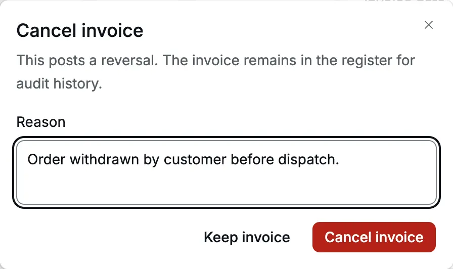
</Frame>

:::warning[The reversal uses the invoice date]
Cancelling or amending reverses the original invoice on its own date, correcting
that period's ledgers. It is refused if the invoice date is tax-locked, or
books-locked without an exception. Correct a filed invoice with a
[credit note](/sales/credit-notes) in an open period instead.
:::

Amend and Cancel appear only when nothing is matched to the invoice. If a receipt,
advance or credit note is matched to it:

1. Cancel any credit note posted against it first. Otherwise the cancel is refused
   with "Cancel credit note CN26-27/2 first."
2. Reverse every other allocation in its **Allocations** list (see
   [Apply credit](/sales/apply-credit#reverse-an-allocation)). Otherwise the cancel
   is refused with "Reverse allocations from RCT26-27/10 first."

## Common messages

| Message                                                                                    | What to do                                                                                                                    |
| ------------------------------------------------------------------------------------------ | ----------------------------------------------------------------------------------------------------------------------------- |
| Choose a party                                                                             | Pick a customer in **Bill to**                                                                                                |
| Use a valid Indian state code                                                              | Choose a **Place of supply** (it fills once a party is chosen)                                                                |
| Choose an item                                                                             | Every line needs an item; remove empty lines                                                                                  |
| Quantity must be from 1 to 1,000,000                                                       | Use a whole number. For part quantities, set the item's unit smaller (for example grams instead of kg)                        |
| Due date cannot be before the invoice date                                                 | Move the due date on or after the invoice date                                                                                |
| Enter a percentage above 0 and up to 100                                                   | Fix the **%** discount                                                                                                        |
| Discount cannot exceed the invoice subtotal.                                               | Lower the discount                                                                                                            |
| An invoice total must be greater than zero.                                                | At least one line needs a price                                                                                               |
| An item has no GST rate effective on the invoice date.                                     | Check the item's GST rate in [Items](/setup/items)                                                                            |
| The tax period is locked through 30 Jun 2026.                                              | The date is in a [locked](/glossary#lock) GST period. Use a later date or ask your CA (see [Period locks](/accounting/locks)) |
| Books are locked through 30 Jun 2026. Ask for an exception to post on or before that date. | The date is in a locked period. Use a later date or ask your CA for an exception                                              |
| Received cannot exceed the invoice total                                                   | Lower the payment amounts                                                                                                     |
| This draft changed. Reload it and try again.                                               | Someone else saved the draft. Reopen it and make your change again                                                            |

## Related pages

- [Receipts](/sales/receipts): collect the money
- [Credit notes](/sales/credit-notes): returns and price reductions
- [Apply credit](/sales/apply-credit): use an advance against an invoice
- [Party ledger](/reports/party-ledger): everything a customer owes
- [A month of trading](/scenarios/trading-month): a worked month of sales
