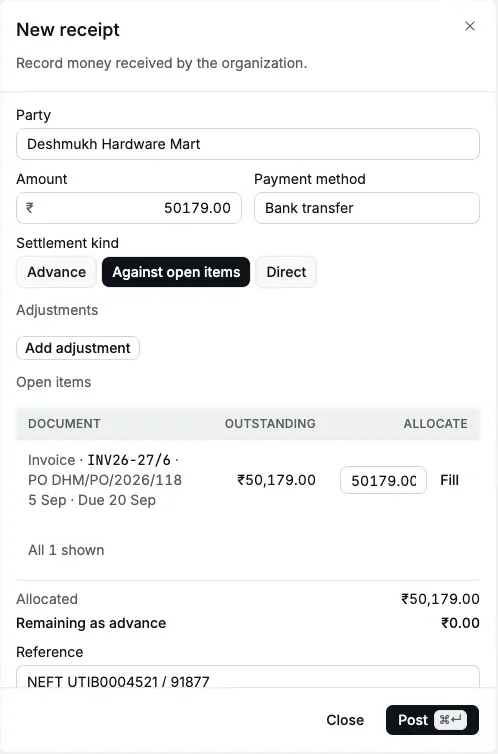
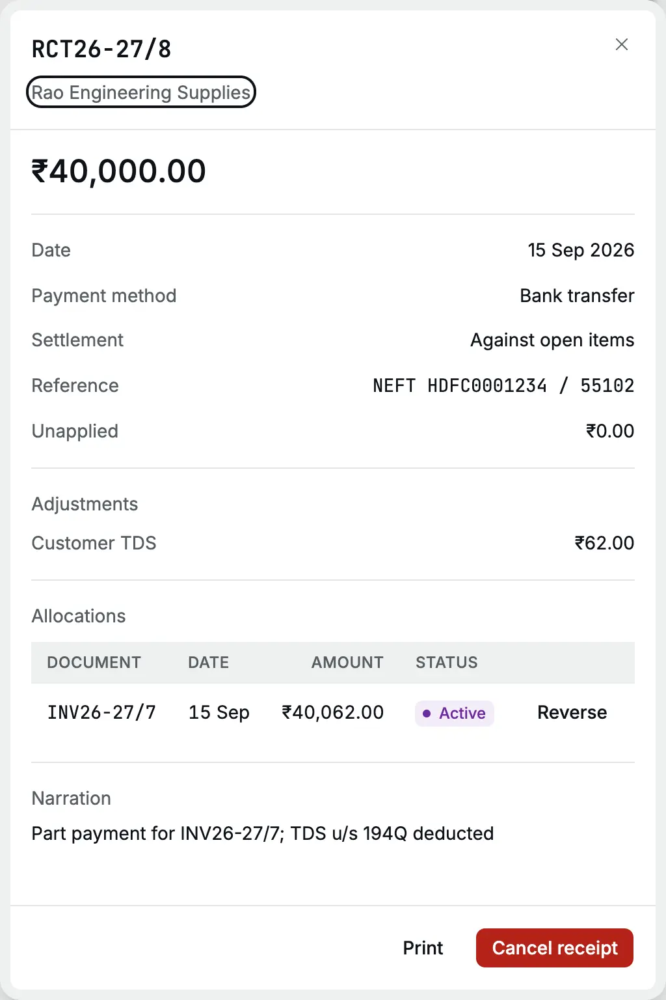
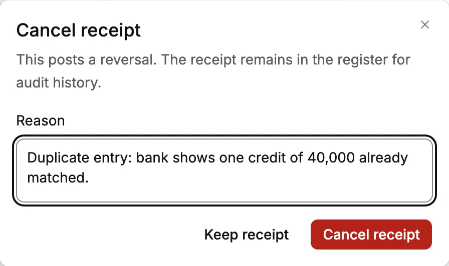

A [receipt](/glossary#receipt) records money that comes in: a customer's
[advance](/glossary#advance) (money paid before you bill), payment for invoices you
raised, or income that has no invoice. It debits the cash or bank account behind the
[payment method](/glossary#payment-method) and credits the customer or the income
([debit and credit](/glossary#debit-credit) are the two equal sides of every entry).

**Who can do it** (see [roles](/glossary#roles))**:** an Owner, Accountant or Operator
[posts](/glossary#post) (records in your books) receipts. Only an Owner or
Accountant can cancel one. A Chartered Accountant can open and print receipts.

## The receipt register

Open **Sales → Receipts**. The register lists receipts newest document date first, with **Number**,
**Date**, **Party**, **Method** and **Amount**. Search by number, party or reference.
The filter icon in the search box offers **Date**, **Payment method**, **State**
(Posted or Cancelled) and **Settlement** (Advance, Against open items or Direct). The
**⋯** at the end of a row offers **Print** and **Copy number**.

## Choose the settlement kind

You choose what the money is for, the [settlement kind](/glossary#settlement-kind).
Accly Books never guesses.

| Kind                   | Use it when                                                                        | What it settles                                                                                                |
| ---------------------- | ---------------------------------------------------------------------------------- | -------------------------------------------------------------------------------------------------------------- |
| **Advance**            | The customer pays before you invoice, for example against a purchase order         | Nothing yet. The money waits as the customer's advance until you [apply it](/sales/apply-credit) to an invoice |
| **Against open items** | The customer pays invoices you have posted                                         | The invoices you choose in **Open items**. Any amount you do not allocate is kept as an advance                |
| **Direct**             | Income with no invoice and no customer balance, such as exempt (GST-free) interest | An income account. No party balance changes                                                                    |

## Record an advance

On 2 Sep 2026 Deshmukh Hardware Mart pays ₹50,000 by [NEFT](/glossary#upi-neft) (a bank transfer) against its purchase order,
before Cedar Components dispatches the goods.

<Steps>
  <Step title="Open a new receipt">
    In **Receipts**, click **New**. The receipt form opens on the right.
  </Step>
  <Step title="Fill the party, amount and method">
    Choose the **Party**, type the **Amount** and choose the **Payment method**, for example **Bank
    transfer**.
  </Step>
  <Step title="Choose Advance and what it is for">
    Leave **Settlement kind** on **Advance**. In **Advance for**, choose **Goods**. Choose **Exempt
    supply** for an advance towards [exempt](/glossary#supply-class) goods or services, which carry
    no GST.
  </Step>
  <Step title="Add the reference and date">
    Type the bank's UTR (the transfer's reference number) or cheque number in **Reference**, a
    **Narration** (a free-text [note](/glossary#narration)) if useful, and the **Date** the money
    arrived.
  </Step>
  <Step title="Post">
    Click **Post** (or <kbd>⌘</kbd>/<kbd>Ctrl</kbd> + <kbd>Enter</kbd>). The toast reads "Receipt
    RCT26-27/7 posted", with a **Print** button. The form clears for the next receipt and keeps the
    date and method.
  </Step>
</Steps>

<Frame caption="An advance of ₹50,000 for goods from Deshmukh Hardware Mart.">
  
</Frame>

:::note[Advances for taxable services]
GST is due when you receive an advance for a taxable service. Accly Books cannot
issue the GST receipt voucher for that yet, so **Taxable service** is refused with "A
taxable service advance needs GST advance documents, which are not available yet."
Ask your CA (Chartered Accountant) how to account for such an advance until then. An advance for goods
carries no GST at receipt (Notification 66/2017-Central Tax).
:::

## Record payment against invoices

On 15 Sep 2026 Rao Engineering Supplies pays ₹40,000 by NEFT towards INV26-27/7 for
₹73,160 and deducts ₹62 [TDS](/glossary#tds) (tax deducted at source, which the customer pays to the
government on your behalf) under [section](/glossary#tds-section) 393(1) Table 8(ii), TDS code 1031 (purchase of goods,
formerly section 194Q): 0.1% of ₹62,000. A buyer deducts this only when its turnover and its
purchases from you cross the legal limits, so Rao has crossed them in this example. Check
with your CA whether it applies to your customers.

<Steps>
  <Step title="Fill the party, amount and method">
    Choose **Rao Engineering Supplies**, type **40000** and choose **Bank transfer**.
  </Step>
  <Step title="Choose Against open items">
    Click **Against open items**. **Open items** lists the customer's posted invoices and [opening
    claims](/glossary#opening-item) (unpaid invoices from your old books) that still have money due.
    If you can read journals, it also lists [journals](/glossary#journal) that left the customer
    owing money. Each row shows its reference, date, due date and
    [**Outstanding**](/glossary#outstanding) (the amount not yet paid).
  </Step>
  <Step title="Add any adjustments">
    Click **Add adjustment** for each deduction the customer made (see [Fees, write-offs and
    TDS](#fees-write-offs-and-tds)). Here: **TDS**, ₹62.
  </Step>
  <Step title="Allocate">
    Type the amount to settle against each invoice in **Allocate**, the
    [allocation](/glossary#allocation) (the match between money and an invoice), or click **Fill**
    to put the rest of the receipt (plus adjustments) on that invoice, up to its outstanding. Here
    **Fill** puts ₹40,062.00 on INV26-27/7.
  </Step>
  <Step title="Check the totals and post">
    Under the table, **Allocated** shows the total you matched. **Remaining as advance** shows what
    is left over; when there are adjustments it reads **Remaining to allocate** and must be ₹0.00.
    Add the reference and date, then click **Post**.
  </Step>
</Steps>

<Frame caption="₹40,000 received plus ₹62 TDS settles ₹40,062 of INV26-27/7.">
  
</Frame>

If you allocate less than the receipt and have no adjustments, the remainder is kept
as an advance. Then choose what it is for in **Advance for**, as for an advance
receipt.

### From an invoice

On a posted invoice that is not fully paid, click **Record receipt**. The receipt
opens with the party, the outstanding amount and the allocation already filled.
Change the amount for a part payment: the allocation follows it. After posting, the
form closes and the invoice shows its new outstanding amount.

<Frame caption="Record receipt on INV26-27/6 fills the balance of ₹50,179.00.">
  
</Frame>

## Fees, write-offs and TDS

Customers often pay a little less than the invoice. Record each difference as an
adjustment so that the invoice is fully settled. You can add up to five.

| Kind          | Use it for                                                                      | Posts to                                                                                      |
| ------------- | ------------------------------------------------------------------------------- | --------------------------------------------------------------------------------------------- |
| **Fee**       | Bank or payment gateway charges deducted from the amount                        | The expense account you choose, for example **Bank Charges**                                  |
| **Write-off** | A small short payment you agree to forgive (a [write-off](/glossary#write-off)) | The expense account you choose, for example **Discount Allowed** or **Bad Debts Written Off** |
| **TDS**       | Tax the customer deducted and will deposit for you                              | **TDS Receivable**                                                                            |

With adjustments, the allocation must equal the money received plus the adjustments:
nothing can be left as an advance.

:::tip
Note the TDS section and rate in **Narration** (for example "TDS code 1031 deducted").
The TDS adjustment records only the amount, and you will need the detail to match
Form 26AS, the tax department's statement of TDS deposited for you.
:::

## Direct income

Choose **Direct** for income that has no invoice, for example interest received. The
**Party** is optional. Choose the **Income account**. If your organization has a
[GSTIN](/glossary#gstin) (GST registration number), a taxable income account is refused with "Taxable income must be invoiced
before it is received." Raise an invoice for taxable sales instead.

## Payment methods

The **Payment method** decides which cash or bank account the money goes to. Cedar
Components has **Cash** (Cash in Hand) and **Bank transfer**, **UPI** and **Card**
(Bank Account). Set them up in [Banking](/setup/banking).

## The receipt record

Click a receipt to open its record: amount, date, method, settlement kind, reference,
**Unapplied** (money not yet matched to an invoice), any **Adjustments**, and the
**Allocations** it made. Click **Print** for the PDF.

<Frame caption="RCT26-27/8: ₹40,000 with ₹62 customer TDS, matched to INV26-27/7.">
  
</Frame>

The PDF is a receipt voucher (the printed proof of payment) with your organization's details, the date, the party,
the method, what it was received towards, the reference, the amount in figures and
words, and the narration. It does not list the invoices settled or the TDS, so add
them to the narration if the customer needs them on the voucher.

## What happens in the books

Customer Advances and Accounts Receivable are [control accounts](/glossary#control-account):
they hold the total that customers have paid ahead and the total they owe.

**Advance** (RCT26-27/7):

| Account                                    | Debit      | Credit     |
| ------------------------------------------ | ---------- | ---------- |
| Bank Account                               | ₹50,000.00 |            |
| Customer Advances (Deshmukh Hardware Mart) |            | ₹50,000.00 |

**Against open items with TDS** (RCT26-27/8):

| Account                                        | Debit      | Credit     |
| ---------------------------------------------- | ---------- | ---------- |
| Bank Account                                   | ₹40,000.00 |            |
| TDS Receivable                                 | ₹62.00     |            |
| Accounts Receivable (Rao Engineering Supplies) |            | ₹40,062.00 |

An unallocated remainder is credited to **Customer Advances**. A fee or write-off
debits its expense account in place of TDS Receivable. A **Direct** receipt credits
the income account you chose.

On the customer's party ledger, a receipt is a credit for the money plus any
adjustments: ₹40,062.00 for RCT26-27/8. Rao Engineering Supplies then owes ₹33,098.00.

## Cancel a receipt

Open the receipt, click **Cancel receipt**, type the reason and click **Cancel
receipt**. Use it when the money never arrived, a cheque bounced, or the receipt was
entered twice.

<Frame caption="Cancelling a duplicate receipt.">
  
</Frame>

Cancelling:

- posts a [reversal](/glossary#reversal), an equal and opposite
  [journal entry](/glossary#journal-entry), of the receipt's entry, so the cash or bank account and the customer
  balance go back;
- reverses every allocation the receipt made, so the invoices it paid are open again
  and show their outstanding amount;
- reverses any entry that moved its money between Customer Advances and Accounts
  Receivable;
- keeps the receipt in the register, marked **Cancelled**, with the cancellation date.

The reversal uses the receipt date, correcting the bank balance from that date.
Cancellation is refused if that date is books-locked without an exception, or
tax-locked for a receipt that belongs in a GST register.

## Common messages

| Message                                                                                    | What to do                                                                                                                     |
| ------------------------------------------------------------------------------------------ | ------------------------------------------------------------------------------------------------------------------------------ |
| Choose a party                                                                             | Advance and Against open items need a party                                                                                    |
| Choose a payment method                                                                    | Pick how the money came in                                                                                                     |
| Choose what the advance is for                                                             | Pick Goods or Exempt supply                                                                                                    |
| Choose what the remaining advance is for                                                   | Part of the receipt is not allocated. Pick what the advance is for, or allocate it all                                         |
| Allocate to at least one document                                                          | Type an amount on an open item, or choose **Advance**                                                                          |
| Enter no more than ₹73,160.00                                                              | An allocation is more than the invoice's outstanding                                                                           |
| Allocated amount cannot exceed the receipt and adjustments                                 | Lower the allocations                                                                                                          |
| Allocate the full receipt and adjustments                                                  | With adjustments, allocate the whole amount                                                                                    |
| Choose an expense account                                                                  | Fee and write-off adjustments need an account                                                                                  |
| Taxable income must be invoiced before it is received.                                     | Use an invoice, or choose an exempt or non-GST income account                                                                  |
| Books are locked through 30 Jun 2026. Ask for an exception to post on or before that date. | Use a date after the lock, or ask your CA for an [exception](/glossary#lock-exception) (see [Period locks](/accounting/locks)) |

## Related pages

- [Invoices](/sales/invoices)
- [Apply credit](/sales/apply-credit): use an advance against a later invoice
- [Credit notes](/sales/credit-notes): refunds
- [Party ledger](/reports/party-ledger)
- [A month of trading](/scenarios/trading-month)
