A [bill](/glossary#bill) records an invoice your supplier sends you: raw material, a
contractor's work, a professional's fee or a new machine. It
[debits](/glossary#debit-credit) the expense or asset [account](/glossary#account) you
choose (every entry has equal debit and credit sides). It takes the
[GST](/glossary#gst) (Goods and Services Tax) as [input tax credit](/glossary#itc) (ITC,
GST you paid that you may set against the GST you collect) when you can claim it. It
keeps back any [TDS](/glossary#tds) (tax deducted at source) you must deduct, and it
credits the supplier with what you owe, your [payable](/glossary#payable).

Book a bill when the supplier's [tax invoice](/glossary#tax-invoice), the GST invoice
that lets you claim credit, reaches you. Use the supplier's own invoice
number and date, so the bill matches the invoice the supplier reports in their GSTR-1, which feeds your
GSTR-2B statement, and the input tax credit you claim in your GSTR-3B (see
[GSTR-1 and GSTR-3B](/glossary#gstr), the monthly GST filings).

**Who can do it:** an Owner or Accountant creates, [posts](/glossary#post) (records for
good) and cancels bills; see [roles](/glossary#roles). A Chartered Accountant (CA) can open
them. An Operator does not see bills.

## The bill register

Open **Purchases → Bills**. The register lists [drafts](/glossary#draft) (saved but not posted) and posted bills, newest document date first,
with **Number**, **Supplier invoice**, **Party** (the [party](/glossary#party), here the
supplier), **Date**, **Due date**, **Status** and
**Total**. It opens on **This month**; remove that chip or choose another period to see
older bills.

Search by bill number, party or supplier invoice number. The filter icon in the search
box offers **Date** and **Status**: **Draft**, **Posted**, **Cancelled**, **Open**
(something still to pay) and **Overdue** (open and past its due date).

The **Documents** and **Total** line counts and sums all matching bills, even
beyond the loaded page. Cancelled bills are included unless you choose another
**Status**. Drafts remain in the register outside the selected period and their
saved totals count too.

<Frame caption="July bills for Cedar Components: three paid, one cancelled duplicate, and a draft.">
  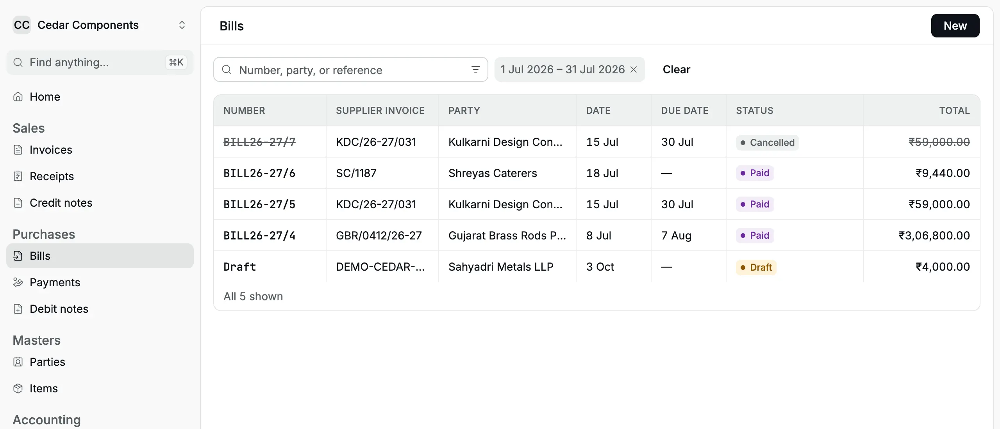
</Frame>

A posted bill shows one of these statuses:

| Status        | Meaning                                                                                           |
| ------------- | ------------------------------------------------------------------------------------------------- |
| **Unpaid**    | Nothing has been paid or applied yet                                                              |
| **Part paid** | Payments, advances or debit notes cover part of it                                                |
| **Paid**      | Nothing is [outstanding](/glossary#outstanding) (left to pay)                                     |
| **Overdue**   | Shown next to Unpaid or Part paid when the due date has passed                                    |
| **Cancelled** | [Reversed](/glossary#reversal); it stays in the register for the [audit log](/glossary#audit-log) |

## Book a bill

On 8 Jul 2026 Gujarat Brass Rods Pvt. Ltd. of Jamnagar invoices Cedar Components for
500 kg of brass rod at ₹520 a kilo: ₹2,60,000 plus 18% IGST ([integrated GST](/glossary#cgst-sgst-igst), charged between
states), invoice
`GBR/0412/26-27`, due in 30 days.

<Steps>
  <Step title="Open a new bill">In **Bills**, click **New**. The **New bill** page opens.</Step>
  <Step title="Choose the supplier">
    In **Party**, type part of the name and choose the supplier. If the supplier is new, choose
    **Create "…"** and complete the party, including its state.
  </Step>
  <Step title="Copy the supplier's invoice details">
    Type the supplier's number in **Supplier invoice number** (up to 40 characters), and their date
    in **Supplier invoice date**. That date is the bill date: the entry posts on it and GST rates
    are those in force on it. Add a **Due date** if the supplier gave credit terms.
  </Step>
  <Step title="Check the place of supply">
    **Place of supply** ([place of supply](/glossary#place-of-supply), the state where the supply is
    delivered) starts at your organization's state. Change it only when the goods or services are
    delivered in another state. When the supplier's state equals the place of supply, the bill takes
    CGST and SGST (central and state GST, half each); otherwise it takes IGST.
  </Step>
  <Step title="Choose a TDS section if you must deduct">
    Leave **TDS section (optional)** empty for goods. A [TDS section](/glossary#tds-section) is the
    part of the Income-tax Act that sets the rate for a kind of payment. For a fee, rent, contract
    or commission, see [Deduct TDS on a bill](#deduct-tds-on-a-bill).
  </Step>
  <Step title="Add the lines">
    For each line, choose the **Account** (an expense or asset account), type a **Description**, the
    **HSN/SAC** if you have it (the [HSN or SAC](/glossary#hsn-sac) code that classifies goods or
    services for GST), the **GST rate** and the **Amount** before GST. Leave **ITC** ticked if you
    can claim the GST as input tax credit. Click **Add line** for more; a bill takes up to 100
    lines.
  </Step>
  <Step title="Save a draft or post">
    Click **Save draft** to keep it without posting, or **Post** (or <kbd>⌘</kbd>/<kbd>Ctrl</kbd> +
    <kbd>Enter</kbd>) to book it. The toast reads "Bill BILL26-27/4 posted" with an **Open** button,
    and the form clears for the next bill.
  </Step>
</Steps>

Posting refuses a supplier invoice number already posted for the same supplier
in the same financial year. It ignores letter case and spaces at either end and
shows the error on **Supplier invoice number**. Drafts can share a number; a
cancelled bill does not reserve it. Another supplier or financial year can use
the same number.

<Frame caption="A bill for brass rod from a Gujarat supplier. Place of supply is Maharashtra, so the bill takes IGST.">
  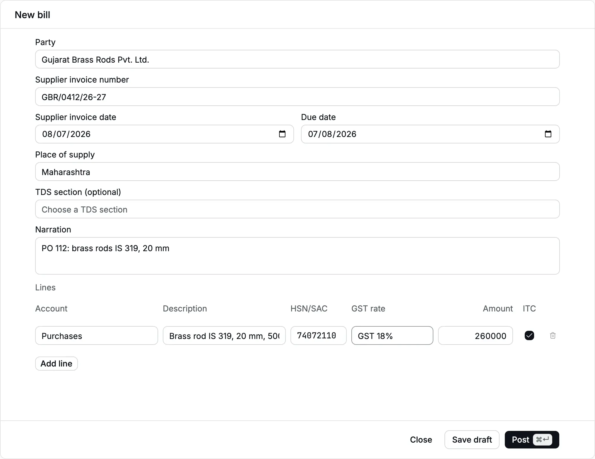
</Frame>

:::note[The form shows totals only after you save]
The new bill form does not show GST, the total or TDS while you type. Click **Save draft**
to see **Saved totals** (taxable value, each GST, round-off and total) and compare them with
the supplier's invoice before you post.
:::

<Frame caption="After Save draft, the saved totals show IGST ₹46,800.00 and a total of ₹3,06,800.00.">
  
</Frame>

### Choosing the account

A line can post only to an active expense or asset account that is not a
[group](/glossary#group-account) (a heading that holds other accounts) or a
[system account](/glossary#system-account) (one Accly Books manages itself, such as Accounts
Payable). Typical choices:

| What you bought                         | Account                                |
| --------------------------------------- | -------------------------------------- |
| Raw material and goods for resale       | **Purchases**                          |
| A consultant's, CA's or lawyer's fee    | **Professional Fees** (create it once) |
| Freight, rent, repairs, office expenses | The matching expense account           |
| A machine, computer or furniture        | The fixed asset account                |

To add an account to your [chart of accounts](/glossary#chart-of-accounts), see
[Chart of accounts](/setup/chart-of-accounts).

### GST and input tax credit

Each line's GST is worked out from the rate you choose and the line amount. The bill
total is rounded to the nearest rupee, and the difference goes to **Round Off**.

The **ITC** box on each line decides where the GST goes:

| ITC box    | Where the GST posts                                    | Use it for                                                                                                                                                     |
| ---------- | ------------------------------------------------------ | -------------------------------------------------------------------------------------------------------------------------------------------------------------- |
| Ticked     | **CGST**, **SGST** or **IGST Input Credit** (an asset) | Inputs, input services and capital goods you use for taxable sales                                                                                             |
| Not ticked | Added to the line's own account, as part of the cost   | Credit blocked under section 17(5) (food and catering, staff welfare, gifts, most motor vehicles), or supplies used for [exempt](/glossary#supply-class) sales |

On 18 Jul 2026 Shreyas Caterers bills ₹8,000 plus 18% GST for a working lunch. Food is
blocked credit, so the line goes to **Staff Welfare** with **ITC** cleared, and the whole
₹9,440 is an expense.

<Frame caption="A catering bill with ITC cleared. The GST becomes part of the Staff Welfare expense.">
  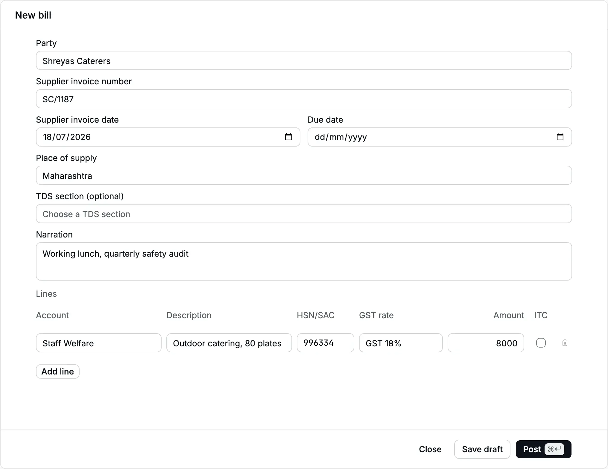
</Frame>

If your organization has no GSTIN in [Organization settings](/setup/organization), the
**ITC** column does not appear and all GST on bills is part of the cost.

## Deduct TDS on a bill

Choose a **TDS section** when the payment is subject to TDS: a professional's fee, rent,
a contractor's work or commission. Accly Books deducts TDS when you book the bill, which
is the earlier of credit or payment for most sections, so you do not deduct it again when
you pay.

If you choose a TDS section while this supplier has an open advance Payment with TDS,
the form warns you that TDS was already deducted. The warning does not block posting:
review the deduction with your accountant because the two entries are not netted.

The sections follow the Income-tax Act, 2025, which applies from 1 April 2026. They use
the new codes, so search by the description, not the old 1961 Act number:

| Payment                               | 1961 Act section | Code and description to choose                      | Rate |
| ------------------------------------- | ---------------- | --------------------------------------------------- | ---- |
| Professional or consultancy fee       | 194J             | **1027** · Professional services…                   | 10%  |
| Technical services                    | 194J             | **1026** · Technical services…                      | 2%   |
| Contractor, individual or HUF         | 194C             | **1023** · Contractor, individual or HUF            | 1%   |
| Contractor, company or firm           | 194C             | **1024** · Contractor, other than individual or HUF | 2%   |
| Rent of land, building or furniture   | 194-I(b)         | **1009** · Rent, land building or furniture         | 10%  |
| Rent of plant or machinery            | 194-I(a)         | **1008** · Rent, plant machinery or equipment       | 2%   |
| Commission or brokerage               | 194H             | **1006** · Commission or brokerage…                 | 2%   |
| Purchase of goods above the threshold | 194Q             | **1031** · Purchase of goods                        | 0.1% |

Confirm the section and rate with your CA. Accly Books does not check thresholds (for
example the ₹50 lakh limit for purchase of goods) or apply the higher no-PAN rate; it
refuses TDS when the party has no [PAN](/glossary#pan) (Permanent Account Number, the
income-tax ID).

On 15 Jul 2026 Kulkarni Design Consultants bills a design review: ₹50,000 plus 18% GST
(₹4,500 CGST and ₹4,500 SGST), invoice `KDC/26-27/031`. Choose **1027 · Professional
services…**.

<Frame caption="The TDS section picker lists sections by their new code and description.">
  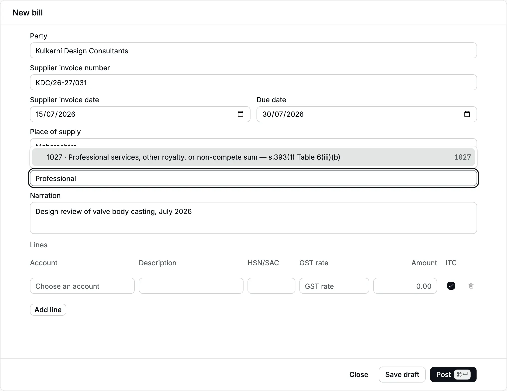
</Frame>

<Frame caption="The consultant's bill with section 1027 and one line to Professional Fees.">
  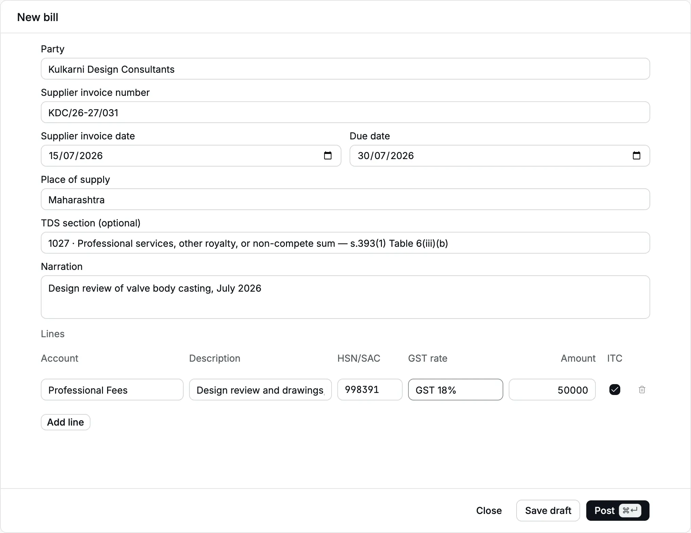
</Frame>

TDS is worked out on the taxable value, not on the GST, and rounded to the nearest
rupee: 10% of ₹50,000 is ₹5,000. On ₹12,345 it would be ₹1,234.50, rounded to ₹1,235.
The bill's record shows **TDS · 1027** ₹5,000.00 and **Payable after TDS** ₹54,000.00.
That is the bill's outstanding amount and what you pay the consultant.

<Frame caption="The consultant's bill: total ₹59,000.00, TDS ₹5,000.00 and Payable after TDS ₹54,000.00. It shows Paid because the ₹54,000 was paid later.">
  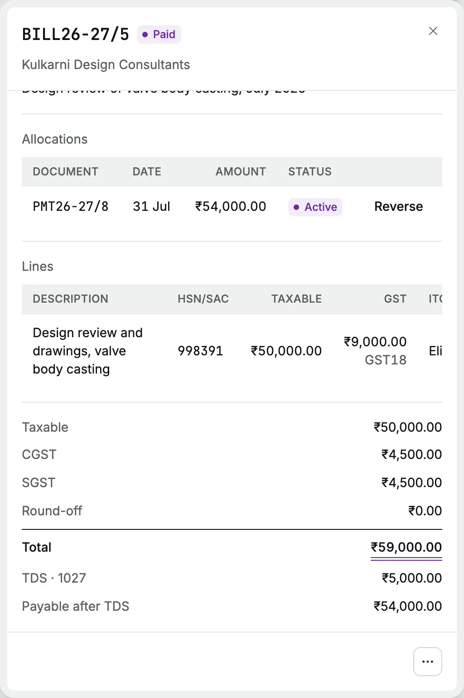
</Frame>

:::warning[Do not deduct TDS twice]
If you deducted TDS on an advance [payment](/purchases/payments#pay-an-advance) to the same
supplier, do not choose a TDS section on the bill for the same amount. Accly Books does not
net the two, and TDS Payable would hold both. Ask your CA to correct it with a
[journal](/glossary#journal), a manual entry for adjustments; see
[Journals](/accounting/journals).
:::

The TDS stays in **TDS Payable** ([TDS Payable](/glossary#tds-payable), the account for tax
you deducted and owe the government) until you deposit it with the government, by the 7th of
the next month. Record the deposit with a [journal](/accounting/journals): Dr **TDS
Payable**, Cr your bank account (Dr and Cr are [debit and credit](/glossary#debit-credit),
the two equal sides of every entry). See the [purchase cycle](/scenarios/purchase-cycle#deposit-the-tds)
for an example. The **TDS register** download under [Reports](/reports) lists every
deduction by section, party and PAN for your TDS return.

## What happens in the books

The brass rod bill, inter-state with input tax credit:

| Account                               | Debit        | Credit       |
| ------------------------------------- | ------------ | ------------ |
| Purchases                             | ₹2,60,000.00 |              |
| IGST Input Credit                     | ₹46,800.00   |              |
| Accounts Payable (Gujarat Brass Rods) |              | ₹3,06,800.00 |

The consultant's bill, intra-state with TDS:

| Account                                        | Debit      | Credit     |
| ---------------------------------------------- | ---------- | ---------- |
| Professional Fees                              | ₹50,000.00 |            |
| CGST Input Credit                              | ₹4,500.00  |            |
| SGST Input Credit                              | ₹4,500.00  |            |
| TDS Payable (Kulkarni Design Consultants)      |            | ₹5,000.00  |
| Accounts Payable (Kulkarni Design Consultants) |            | ₹54,000.00 |

The catering bill, ITC not eligible:

| Account                             | Debit     | Credit    |
| ----------------------------------- | --------- | --------- |
| Staff Welfare                       | ₹9,440.00 |           |
| Accounts Payable (Shreyas Caterers) |           | ₹9,440.00 |

The supplier's balance in the [party ledger](/reports/party-ledger) (the
[ledger](/glossary#ledger), or running record, of one party) rises by the amount
payable: ₹3,06,800.00 for the brass rod and ₹54,000.00 (after TDS) for the consultant.
You can check each entry in the [day book](/reports/day-book) (the
[day book](/glossary#day-book) lists every entry by date).

## The bill record

Click a bill in the register to open its record. It shows the total and **Outstanding**,
the supplier invoice number and date, due date, **Place of supply** (state name and
code, for example Maharashtra (27)), [narration](/glossary#narration) (your note on the entry), the
**Allocations** that settle it ([allocations](/glossary#allocation) match payments and credits
to the bill), the lines and
the totals.

<Frame caption="A posted bill's record. Pay and the ⋯ menu are at the bottom.">
  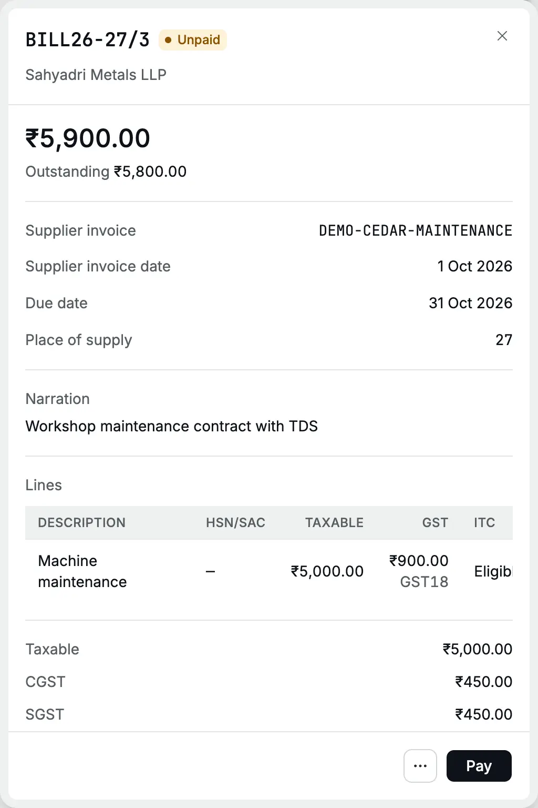
</Frame>

At the bottom:

- **Pay** opens a new payment with this supplier and **Against open items → Bills**
  selected. Enter the amount and allocate it to the bill before posting (see [Payments](/purchases/payments#pay-against-bills)).
- **⋯** opens **Apply credit**, **Debit note**, **Amend** and **Cancel bill**. **Apply credit**
  appears only while something is outstanding. **Amend** and **Cancel bill** appear only when
  no payment, advance or debit note is applied to the bill.

<Frame caption="The ⋯ menu of an unpaid bill.">
  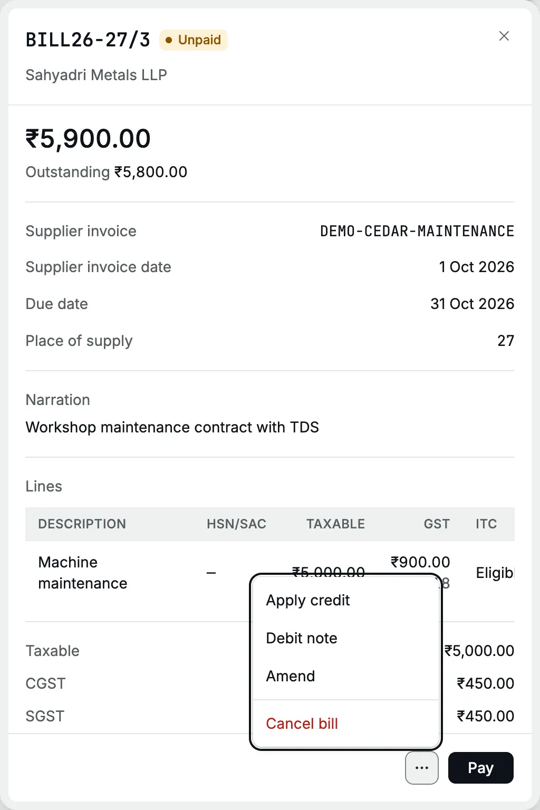
</Frame>

## Apply an advance

When you paid the supplier an [advance](/glossary#advance) (money paid before the bill;
see [Pay an advance](/purchases/payments#pay-an-advance)) before the bill came, set it against the bill:

<Steps>
  <Step title="Open Apply credit">
    Open the bill and choose **⋯ → Apply credit**. The dialog shows the bill's outstanding amount.
  </Step>
  <Step title="Choose the credit">
    In **Credit**, choose the advance payment or an unapplied [credit](/glossary#credit) such as a
    [debit note](/glossary#debit-note) of the same supplier. The **Amount** fills with the smaller
    of the credit and the outstanding amount; lower it to apply part.
  </Step>
  <Step title="Apply">
    Click **Apply credit**. The toast reads "Credit applied" and the allocation appears on the bill.
  </Step>
</Steps>

<Frame caption="Applying Blue Route Logistics' ₹2,500 advance PMT26-27/2 to its freight bill. The brass rod bill took its ₹50,000 advance the same way.">
  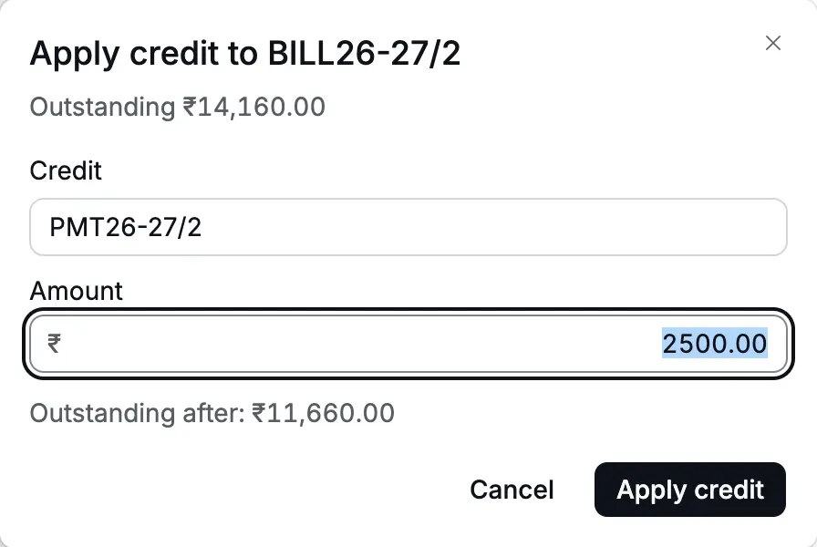
</Frame>

Applying an advance posts Dr **Accounts Payable**, Cr **Supplier Advances**. The
supplier's balance does not change: the money already counted. The entry is dated on the
day you apply it, not on the bill date.

<Frame caption="The brass rod bill after the debit note, the final payment and the advance: Paid. The allocation from the cancelled payment PMT26-27/5 shows Reversed.">
  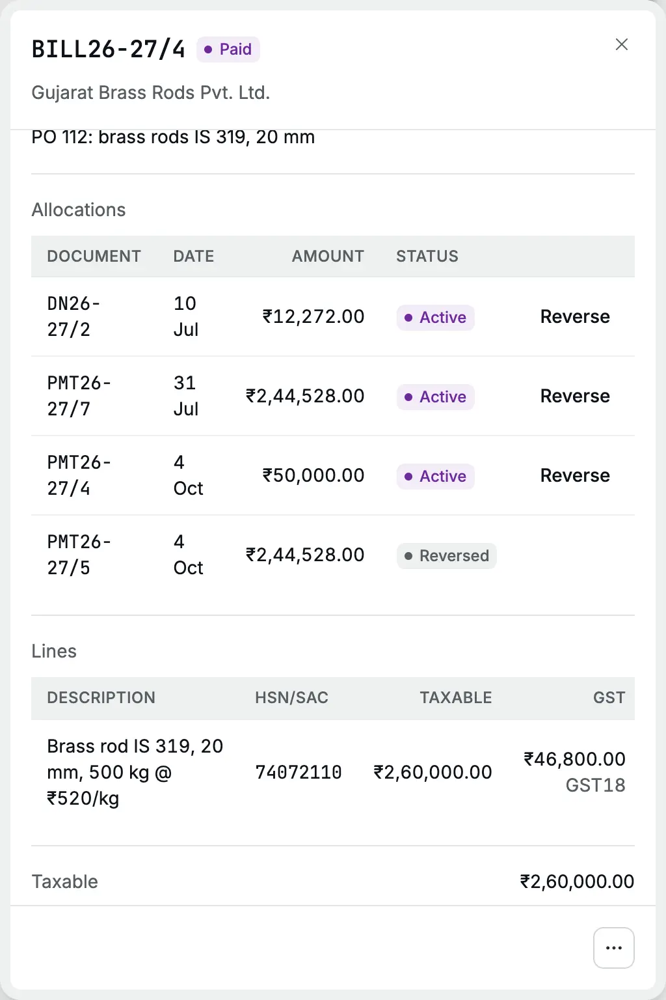
</Frame>

To undo an allocation, click **Reverse** next to it, give a reason and confirm. Both
documents become open to settle again.

## Drafts

A draft has no number and posts nothing. It shows in the register as **Draft**. Open it
and choose **Edit draft** to change it and post it, or **Discard draft** to delete it.
Confirm before deleting; a discarded draft cannot be recovered.

## Correct or cancel a bill

| The mistake                                         | What to do                                                                  |
| --------------------------------------------------- | --------------------------------------------------------------------------- |
| Goods returned, short supply, or a lower price      | Post a [debit note](/purchases/debit-notes) against the bill                |
| Wrong amount, account, GST, TDS or supplier details | **⋯ → Amend**: cancels the bill and opens a new draft with the same details |
| Entered twice, or not your bill at all              | **⋯ → Cancel bill**                                                         |

Before you amend or cancel, reverse every allocation on the bill and cancel any debit
note against it. Otherwise the menu does not offer the action, and the server refuses
with "Reverse allocations from PMT26-27/7 first." or "Cancel debit note DN26-27/2 first."

To cancel, choose **⋯ → Cancel bill**, type the **Reason** and click **Cancel bill**.

<Frame caption="The Cancel bill dialog. The reason is required.">
  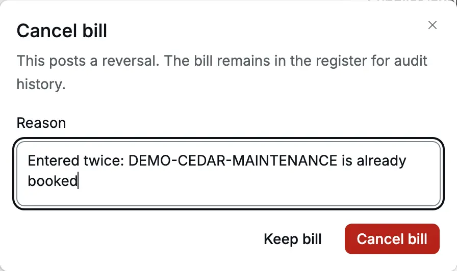
</Frame>

<Frame caption="A cancelled bill keeps its number and details, struck through.">
  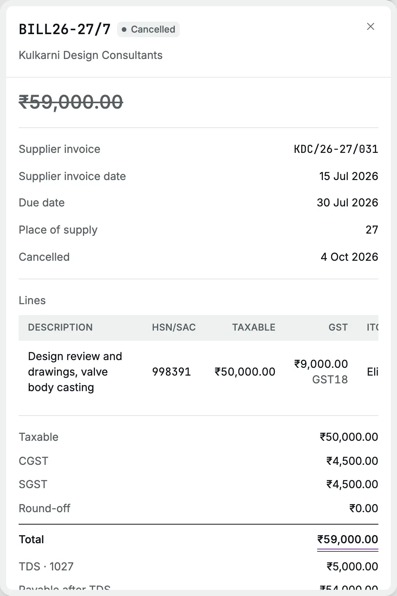
</Frame>

:::warning[A cancellation uses the bill date]
Cancelling reverses every line, including input tax credit and TDS, on the bill's
original date. It corrects that period's ledgers and is refused if the bill date is
tax-locked, or books-locked without an exception. For a filed period, agree a
[debit note](/purchases/debit-notes) in an open period with your CA instead;
see [Locks](/accounting/locks).
:::

Posting refuses a supplier invoice number already posted for the same supplier
and financial year, ignoring letter case and spaces at either end. The error
appears on **Supplier invoice number**; drafts and cancelled bills do not reserve it.

## Common errors

| Message                                                             | What it means and what to do                                           |
| ------------------------------------------------------------------- | ---------------------------------------------------------------------- |
| Enter the supplier invoice number before posting                    | **Supplier invoice number** is empty. A draft can be saved without it  |
| Record the supplier's state before posting a bill.                  | Edit the [party](/setup/parties) and set its state                     |
| Record the party's PAN before deducting TDS.                        | Add the PAN or a GSTIN to the party, or clear the TDS section          |
| Choose a TDS section effective on this date.                        | The section is not in force on the bill date; choose another           |
| Choose a GST rate effective on the bill date.                       | The rate has ended or not started on that date; choose the current one |
| Due date cannot be before the bill date.                            | Correct the due date                                                   |
| TDS must leave a positive amount payable to the supplier.           | The TDS is as large as the bill; check the section and the amounts     |
| A bill total must be greater than zero.                             | Enter a positive amount on at least one line                           |
| Choose active expense or asset leaves that are not system accounts. | A line names a group, income or system account; choose another         |

## Related pages

- [Payments](/purchases/payments): pay the bill, with bank charges or a small write-off
- [Debit notes](/purchases/debit-notes): reduce a bill
- [Purchase cycle](/scenarios/purchase-cycle): a full worked example
- [Account ledger](/reports/account-ledger): check input credit and TDS Payable
