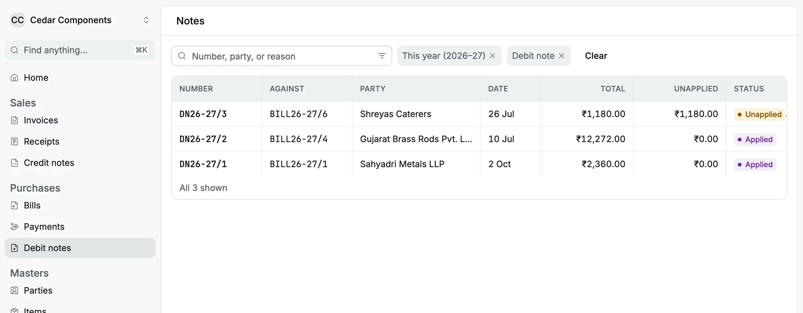
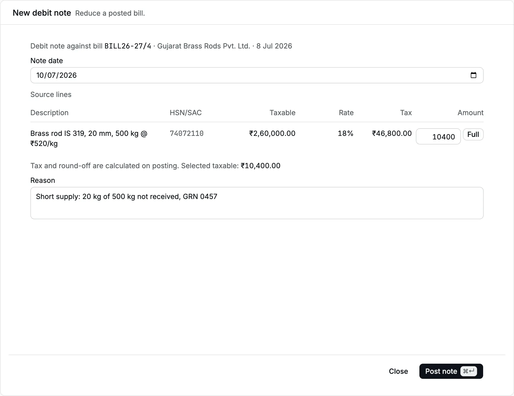
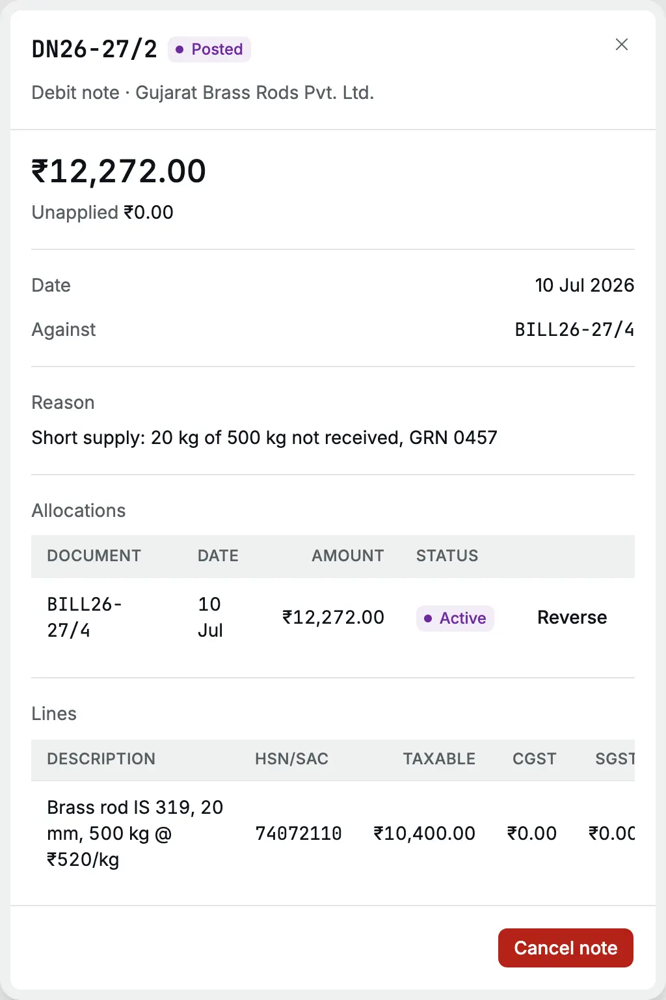
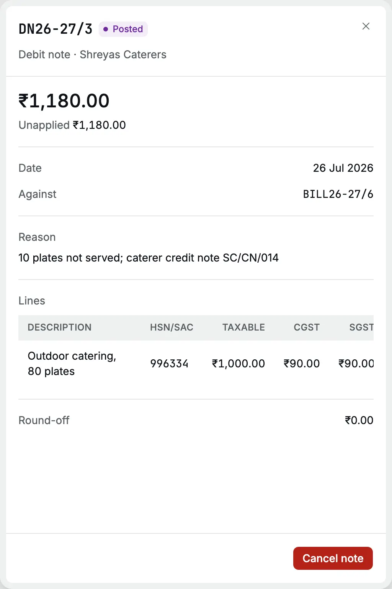

A [debit note](/glossary#debit-note) reduces a [bill](/glossary#bill) you have
[posted](/glossary#post) (recorded for good). Raise one when you send goods back, when
the supplier delivers less than they billed, or when the supplier agrees a lower price
after the bill. It lowers what you owe the supplier, your [payable](/glossary#payable). It takes back the
[input tax credit](/glossary#itc) (ITC, the GST you paid that you may set against GST you
collect) on the reduced amount, and reduces the expense or asset you booked.

Each debit note belongs to one bill. It uses that bill's lines, [GST](/glossary#gst) rates,
[place of supply](/glossary#place-of-supply) (the state where the supply is delivered) and
ITC choice, so the tax on the note always matches the bill.

**Who can do it:** an Owner or Accountant posts and cancels debit notes; see
[roles](/glossary#roles). A Chartered
Accountant can open them. An Operator does not see them.

## The debit note register

Open **Purchases → Debit notes**. The page is titled **Debit notes** and opens filtered to
**Debit note** for this [financial year](/glossary#financial-year) (April to March, unless your
organization starts its year in another month). It lists **Number**, **Against** (the bill),
**Party**, **Date**, **Total**, **Unapplied** and **Status**: **Applied** when the whole
note is set against bills, **Unapplied** when some [credit](/glossary#credit) is left to use, or **Cancelled**.
Search by number, [party](/glossary#party) or reason.

The **Documents**, **Total** and **Unapplied** line covers all matching debit
notes, not just the loaded page. Cancelled notes still count toward the total
when shown, but contribute zero to the unapplied amount.

There is no **New** button here: you raise a debit note from the bill it reduces.

<Frame caption="Debit notes for this year. DN26-27/3 still has ₹1,180.00 unapplied.">
  
</Frame>

## Raise a debit note

On 10 Jul 2026 Cedar Components finds that Gujarat Brass Rods delivered 480 kg of the
500 kg billed on `GBR/0412/26-27`. The supplier agrees to credit 20 kg at ₹520, that is
₹10,400 plus 18% IGST ([integrated GST](/glossary#cgst-sgst-igst), charged between
states).

<Steps>
  <Step title="Open the bill">
    In **Bills**, open the bill and choose **⋯ → Debit note**. The **New debit note** page opens,
    headed with the bill number, supplier and bill date.
  </Step>
  <Step title="Set the note date">
    **Note date** starts at today. Change it to the date of the return or the supplier's credit
    note. It cannot be earlier than the bill date.
  </Step>
  <Step title="Enter the amount for each line">
    **Source lines** lists the bill's lines with their **Remaining taxable** value, GST **Rate** and
    **Tax**. In **Amount**, type the taxable value to take off the line, before GST. **Full** enters
    only the remainder after earlier posted debit notes. Leave a line empty to leave it unchanged.
    The totals preview shows taxable value, GST, round-off and the note total.
  </Step>
  <Step title="Add the supplier's reference and reason">
    If the supplier sent a credit note, enter its number in **Supplier credit note number**
    (optional). Type the **Reason** for what came back or changed. Both show on the record; the
    supplier's number also prints on the PDF.
  </Step>
  <Step title="Post the note">
    Click **Post note** (or <kbd>⌘</kbd>/<kbd>Ctrl</kbd> + <kbd>Enter</kbd>). The toast reads "Debit
    note posted" and the note's record opens.
  </Step>
</Steps>

<Frame caption="₹10,400.00 taken off the brass rod line for a 20 kg short supply.">
  
</Frame>

The preview calculates tax from the bill line's rate: here 18% IGST of ₹10,400 is
₹1,872, so the estimated note total is ₹12,272. Posting recalculates against the
latest source balance.

If the bill deducted TDS, the form also estimates the TDS to reverse from the
selected taxable value. The amount you can apply against the supplier's bill
is the note total **less** that TDS reversal; GST is not part of the TDS base.

For a price reduction, enter the reduction in taxable value on each line it applies to.
For a purchase return, enter the value of the returned quantity.

## Print or download the PDF

Click **PDF** on the note record to open the **Debit Note** in a new tab. Use the
browser viewer to print or save it. It shows your organization's and the vendor's
names, addresses and GSTINs, the note number and date, the original bill number
and date, supplier invoice reference and any supplier credit note number, each line's
taxable value, GST rate and tax, place of supply, totals, reason and signature line.
A cancelled note prints **CANCELLED**.

## What happens in the books

| Account                               | Debit      | Credit     |
| ------------------------------------- | ---------- | ---------- |
| Accounts Payable (Gujarat Brass Rods) | ₹12,272.00 |            |
| Purchases                             |            | ₹10,400.00 |
| IGST Input Credit                     |            | ₹1,872.00  |

When the bill line had **ITC** cleared, the note credits the whole amount, tax included,
back to the line's account. A ₹1,000 note on the Shreyas Caterers lunch bill credits
**Staff Welfare** ₹1,180.

The note appears in the GST inward register as a reduction of the input tax for its
month. Report it as your supplier's [credit note](/glossary#credit-note) in your GST return
([GSTR-3B](/glossary#gstr)).

If the bill deducted TDS, the note also debits **TDS Payable** for the
proportional reversal, leaving a smaller debit to **Accounts Payable**. For
example, a ₹10,000 taxable bill with ₹1,000 TDS and a ₹4,000 taxable return
reverses ₹400 TDS. Any final note returning the remaining taxable value
takes exactly the remaining TDS. The TDS register shows the note's reversed
deduction as a negative amount under the bill's section in the note's period.

## Where the credit goes

When you post, the note is applied to its own bill straight away, up to what is still
[outstanding](/glossary#outstanding) (left to pay) on that bill. The bill's record lists it
under **Allocations**; an [allocation](/glossary#allocation) matches a credit to a bill.

<Frame caption="DN26-27/2 is applied in full to BILL26-27/4, so Unapplied shows ₹0.00.">
  
</Frame>

If the bill was already paid, the credit stays **Unapplied** on the note. You can use
it against the supplier's next bill: open that bill, choose **⋯ → Apply credit** and
pick the debit note in **Credit**. See [Apply an advance](/purchases/bills#apply-an-advance);
debit notes appear in the same list. Or request a refund from the supplier.

<Frame caption="A ₹1,180 debit note on a bill that was already paid stays unapplied.">
  
</Frame>

## When the supplier refunds you

Open a posted debit note with an **Unapplied** balance and click **Refund**. A
**New receipt** form opens with the supplier selected and **Refund supplier** chosen.
Enter the amount received, choose the payment method, and allocate the full amount
to the supplier's unapplied debit notes or payment advances. Click **Post**. The
receipt debits the bank or cash account and credits Payables; it does not record
income again. The note's unapplied balance falls by the allocation. Cancelling the
receipt restores the unapplied credit.

You can also start from **Sales → Receipts** and select **Refund supplier**.

## Limits

- A note can take off at most what is left of each bill line after earlier notes. More
  gives "The note exceeds what remains of "Brass rod IS 319, 20 mm, 500 kg @ ₹520/kg"."
- The notes against a bill cannot add up to more than the bill total.
- The note date cannot be before the bill date: "Note date cannot precede its source
  document."
- On a bill with TDS, the note reverses the corresponding TDS automatically;
  do not post a separate journal for that correction.
- A bill with a posted debit note cannot be cancelled or amended until the note is
  cancelled.

## Cancel a debit note

Open the note and click **Cancel note**. Type the **Reason** and click **Cancel note**.
Cancelling posts the reverse entry ([reversal](/glossary#reversal), an equal and opposite
entry), dated on the note date, and removes the note's allocations, so
the bill's outstanding goes back up. The note stays in the register marked
**Cancelled**. If the bill had TDS, cancelling also reverses the TDS adjustment;
the cancelled note no longer appears as a reversal in the TDS register.
Cancellation is refused if the note date is tax-locked, or books-locked without an exception.

## Related pages

- [Bills](/purchases/bills): the bill a note reduces, and Apply credit
- [Payments](/purchases/payments): pay what is left after the note
- [Purchase cycle](/scenarios/purchase-cycle): a short supply in a full worked example
- [Credit notes](/sales/credit-notes): the same correction on the sales side
