A [payment](/glossary#payment) records money that goes out: settling a supplier's
[bills](/glossary#bill), an [advance](/glossary#advance) before the bill arrives, an expense
with no bill, or a refund to a customer. It credits the bank or cash account behind the
[payment method](/glossary#payment-method) (a named way money moves, tied to one account)
and debits the supplier, the advance or the expense. Debit and credit are the two equal
sides of every entry; see [debit and credit](/glossary#debit-credit).

**Who can do it:** an Owner or Accountant [posts](/glossary#post) (records for good) and
cancels payments of every kind; see [roles](/glossary#roles). An
Operator posts **Advance** and **Direct** payments only, because an Operator cannot see
bills. A Chartered Accountant can open payments.

## The payment register

Open **Purchases → Payments**. The register lists payments newest document date first, with
**Number**, **Date**, **Party** (the [party](/glossary#party) paid), **Kind** and **Amount**. It opens on **This month**.
Search by number, party or reference. The filter icon in the search box offers **Date**,
**State** (Posted or Cancelled) and **Settlement** (Advance, Against open items or
Direct).

The **Documents** and **Total** line covers every matching payment, not only
those loaded on screen. It includes cancelled payments unless **State** is
filtered to **Posted**.

<Frame caption="July payments: an advance, two payments against bills, and a cash payment.">
  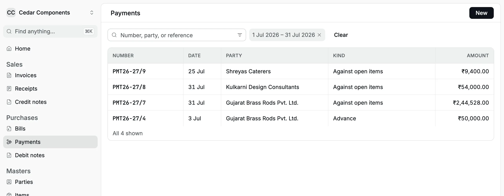
</Frame>

## Choose the settlement kind

The [settlement kind](/glossary#settlement-kind) says what the money is for.

| Kind                   | Use it when                                                                                 | What it does                                                                                          |
| ---------------------- | ------------------------------------------------------------------------------------------- | ----------------------------------------------------------------------------------------------------- |
| **Advance**            | You pay a supplier before the bill, for example against a purchase order                    | Holds the money in **Supplier Advances** until you [apply it](/purchases/bills#apply-an-advance)      |
| **Against open items** | You pay bills you have booked, or refund a customer's [credit notes](/glossary#credit-note) | Settles the bills or credit notes you choose. Anything left over on a bill payment becomes an advance |
| **Direct**             | You pay an expense that has no bill, such as a courier or a bank fee                        | Debits the expense or asset account. No supplier balance changes                                      |

The payment method decides the bank or cash account. To add one, see
[Banking](/setup/banking).

## Pay against bills

On 31 Jul 2026 Cedar Components pays Gujarat Brass Rods the balance of its brass rod
bill: ₹3,06,800 less the ₹50,000 advance and the ₹12,272 debit note, which is
₹2,44,528. The bank also charges ₹17.70 for the NEFT transfer ([NEFT](/glossary#upi-neft), the
bank-to-bank transfer system).

<Steps>
  <Step title="Open a new payment">
    In **Payments**, click **New**. The **New payment** form opens on the right, with the cursor in
    **Party**.
  </Step>
  <Step title="Choose the supplier and the method">
    Choose the **Party**. Check the **Payment method**; **Bank transfer** is the usual default.
  </Step>
  <Step title="Choose Against open items">
    Click **Against open items**, then leave **Pay against** on **Bills**. The **Open bills** grid
    lists the supplier's bills that still have something [outstanding](/glossary#outstanding) (left
    to pay), oldest first, with the supplier's invoice number, bill date and due date.
  </Step>
  <Step title="Type the amount and allocate it">
    Type the **Amount** paid. On each bill row, type the amount to settle in **Allocate** (an
    [allocation](/glossary#allocation) matches money to a bill), or click **Fill** to enter what is
    left of the payment, up to the bill's outstanding amount.
  </Step>
  <Step title="Check the totals">
    Below the grid, **Allocated** shows the total set against bills and **Remaining as advance**
    shows what is left. Any remainder posts as an advance to the supplier.
  </Step>
  <Step title="Add a bank charge if any">
    In **Fee expense account (optional)** choose **Bank Charges** and type the **Fee amount**. The
    fee is paid out of the same bank account on top of the amount; it does not settle the bill.
  </Step>
  <Step title="Add the reference and date, then post">
    Type the UTR (the bank's Unique Transaction Reference) or cheque number in **Reference**, a
    **Narration** (a [narration](/glossary#narration) is your note on the entry), and the **Date**
    the bank paid it. Click **Post** (or <kbd>⌘</kbd>/<kbd>Ctrl</kbd> + <kbd>Enter</kbd>). The toast
    reads "Payment PMT26-27/7 posted". The form clears for the next payment and keeps the party,
    method and date.
  </Step>
</Steps>

<Frame caption="Fill puts ₹2,44,528.00 against the brass rod bill; nothing remains as advance.">
  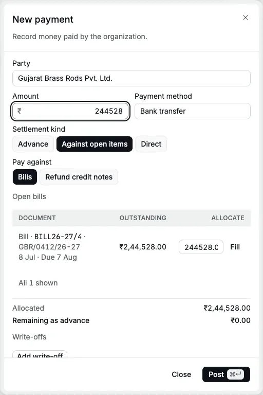
</Frame>

<Frame caption="The same payment with a ₹17.70 bank charge, the UTR and the bank date.">
  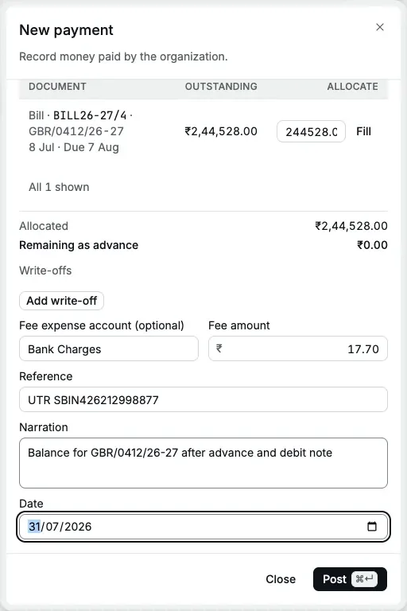
</Frame>

What happens in the books:

| Account                               | Debit        | Credit       |
| ------------------------------------- | ------------ | ------------ |
| Accounts Payable (Gujarat Brass Rods) | ₹2,44,528.00 |              |
| Bank Charges                          | ₹17.70       |              |
| Bank Account                          |              | ₹2,44,545.70 |

The bill's outstanding drops to ₹0.00 and its status becomes **Paid**. The register
and the payment show ₹2,44,528.00; the bank account is credited ₹2,44,545.70 with the
fee.

For a bill with [TDS](/glossary#tds) (tax deducted at source), pay the **Payable after TDS**. The bill already deducted the TDS, so
the payment takes no TDS section: Kulkarni Design Consultants' ₹59,000 bill is settled
with a payment of ₹54,000.

:::tip[Pay from the bill]
**Pay** on a bill's record opens this form with the supplier selected and
**Against open items → Bills** already chosen. Enter the amount and click **Fill**
on the bill to allocate the payment before posting.
:::

### Write off a small difference

When you pay slightly less than the bill and the supplier accepts it,
[write](/glossary#write-off) the difference off (clear it to an income or expense account) so the bill closes. On 25 Jul 2026 Cedar Components pays Shreyas Caterers
₹9,400 in cash for a ₹9,440 bill; the caterer waives ₹40.

<Steps>
  <Step title="Enter the payment">
    Choose the party, **Against open items**, type the **Amount** ₹9,400 and choose the **Cash**
    payment method.
  </Step>
  <Step title="Add the write-off">
    Under **Write-offs**, click **Add write-off**. Choose the **Write-off account**, here **Discount
    Received** (an income account), and type the **Amount**, ₹40. You can add up to five.
  </Step>
  <Step title="Allocate the whole amount">
    Click **Fill** on the bill. With a write-off, the payment plus the write-offs must be allocated
    in full: **Remaining to allocate** must show ₹0.00.
  </Step>
</Steps>

<Frame caption="₹9,400 in cash plus a ₹40 write-off settles the ₹9,440 bill.">
  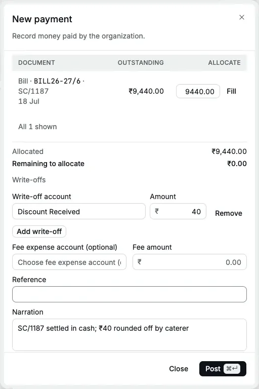
</Frame>

| Account                             | Debit     | Credit    |
| ----------------------------------- | --------- | --------- |
| Accounts Payable (Shreyas Caterers) | ₹9,440.00 |           |
| Cash in Hand                        |           | ₹9,400.00 |
| Discount Received                   |           | ₹40.00    |

A write-off account must be an active income or expense account. A fee account must be
an expense account.

## Pay an advance

On 3 Jul 2026 Cedar Components pays Gujarat Brass Rods ₹50,000 by NEFT against purchase
order 112, before the rods are dispatched.

<Steps>
  <Step title="Fill the party, amount and method">
    Click **New**, choose the **Party**, type the **Amount** and choose the **Payment method**.
  </Step>
  <Step title="Leave the kind on Advance">
    **Settlement kind** starts on **Advance**. Leave **TDS section (optional)** on **No TDS** for
    goods.
  </Step>
  <Step title="Add the reference, narration and date, then post">
    The toast reads "Payment PMT26-27/4 posted".
  </Step>
</Steps>

<Frame caption="A ₹50,000 advance to Gujarat Brass Rods against purchase order 112.">
  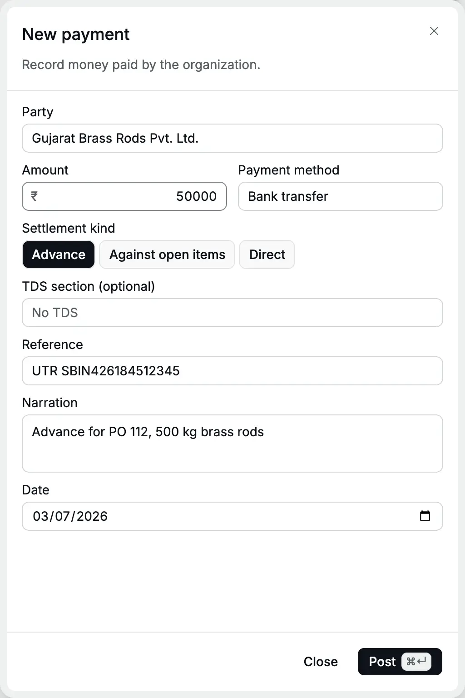
</Frame>

| Account                                | Debit      | Credit     |
| -------------------------------------- | ---------- | ---------- |
| Supplier Advances (Gujarat Brass Rods) | ₹50,000.00 |            |
| Bank Account                           |            | ₹50,000.00 |

The supplier's [party ledger](/reports/party-ledger) (the [ledger](/glossary#ledger), or
running record, of one party) shows ₹50,000.00 Dr: the supplier
owes you goods for it. When the bill arrives, [apply the advance](/purchases/bills#apply-an-advance)
to it.

### TDS on an advance

If TDS applies at the time of payment, for example an advance to a consultant, choose
the **TDS section** (the [TDS section](/glossary#tds-section) sets the rate). The form shows the
section rate and that the party's PAN ([Permanent Account Number](/glossary#pan)) is required.
Type the **gross** amount in **Amount**: Accly Books deducts the TDS from it, pays the
rest from the bank and keeps the TDS in **TDS Payable** ([TDS Payable](/glossary#tds-payable),
what you owe the government). A ₹25,000 advance under 1027 at
10% pays ₹22,500 from the bank and credits ₹2,500 to TDS Payable. **Net paid** shows
₹22,500 before you post.

<Frame caption="On a phone, the TDS section shows its rate below the field.">
  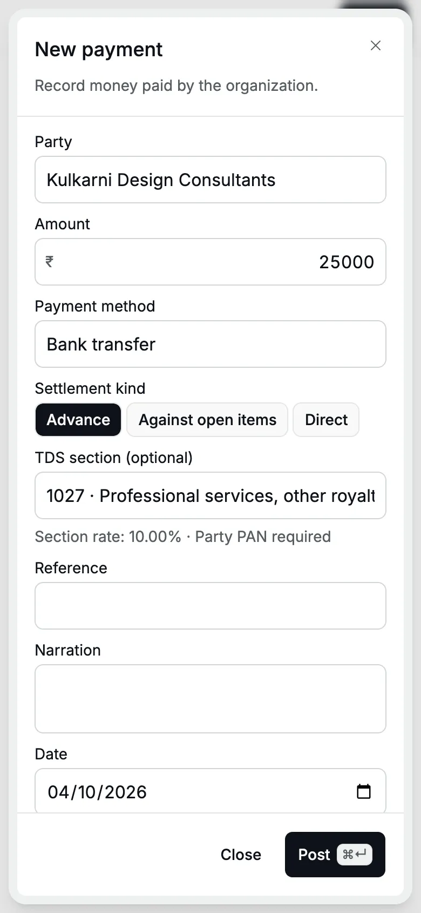
</Frame>

When the consultant's bill later arrives, do not choose a TDS section on it for the same
amount; see [Deduct TDS on a bill](/purchases/bills#deduct-tds-on-a-bill).

## Pay an expense directly

For a payment with no bill and no supplier balance, such as a courier, a parking fee or
a bank charge on its own, choose **Direct**. Choose the **Expense or asset account**; the
**Party** is optional. You can also choose a TDS section. No [input tax credit](/glossary#itc) (ITC, the
[GST](/glossary#gst) you paid that you may set against GST you collect) is taken on a direct
payment: if the expense has a GST invoice you want to claim, book a
[bill](/purchases/bills) and pay it instead.

| Account             | Debit   | Credit  |
| ------------------- | ------- | ------- |
| The expense account | ₹750.00 |         |
| Bank Account        |         | ₹750.00 |

## Refund a customer

When a customer has a [credit note](/sales/credit-notes) that you will pay back rather
than set off, refund it with a payment:

<Steps>
  <Step title="Choose the customer">
    Click **New**, choose the customer as **Party** and click **Against open items**.
  </Step>
  <Step title="Choose Refund credit notes">
    In **Pay against**, click **Refund credit notes**. The grid lists the customer's **Unapplied
    credit notes**.
  </Step>
  <Step title="Allocate the refund">
    Type the **Amount** and allocate it to the credit notes. The amount must equal the total
    allocated exactly. You can also open the credit note and click **Refund**.
  </Step>
</Steps>

<Frame caption="A ₹531 UPI refund of credit note CN26-27/3 to a walk-in customer.">
  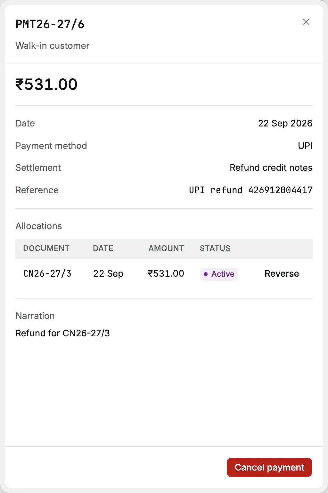
</Frame>

A refund posts Dr **Accounts Receivable** (the customer's [receivable](/glossary#receivable),
what customers owe you), Cr the bank or cash account. It
takes no TDS, write-off or fee.

## The payment record

Click a payment to open its record: amount, date, payment method, settlement, reference,
**Unapplied** (what is left to apply, for an advance), the **Allocations**, any
**Adjustments** (fee or write-off) and the narration.

<Frame caption="The record of a payment against a bill, with its allocation and the bank fee.">
  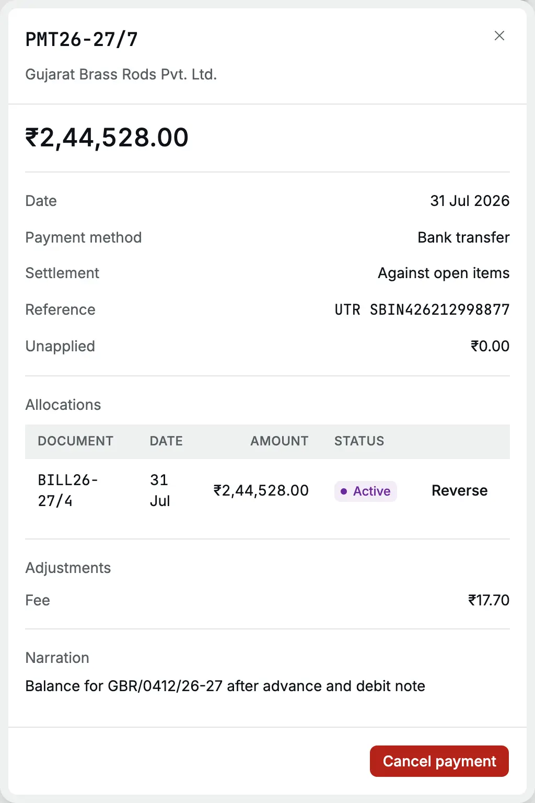
</Frame>

To undo one allocation without cancelling the payment, click **Reverse** next to it,
give a reason and confirm. The amount goes back to the supplier as an advance, ready to
apply elsewhere.

## Cancel a payment

Cancel a payment that was entered twice, to the wrong party or with the wrong date or
amount. Then enter it again correctly.

<Steps>
  <Step title="Open the payment">
    Open the payment from the register and click **Cancel payment**.
  </Step>
  <Step title="Give the reason">
    Type the **Reason**, for example "Wrong date: bank debited this on 31 Jul 2026", and click
    **Cancel payment**. The toast reads "Payment cancelled".
  </Step>
</Steps>

<Frame caption="The reason is required and is kept in the audit log.">
  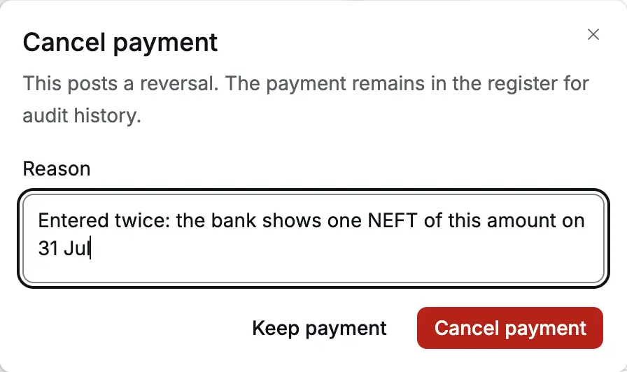
</Frame>

Cancelling posts a [reversal](/glossary#reversal) (an equal and opposite entry) of the payment's entry, fee and write-offs included, dated
on the payment date, and reverses its allocations. The bills it paid become open again.
The payment stays in the register marked **Cancelled**.
A books lock on the payment date requires an exception before you can cancel it.

<Frame caption="A cancelled payment: its allocation to the bill shows Reversed.">
  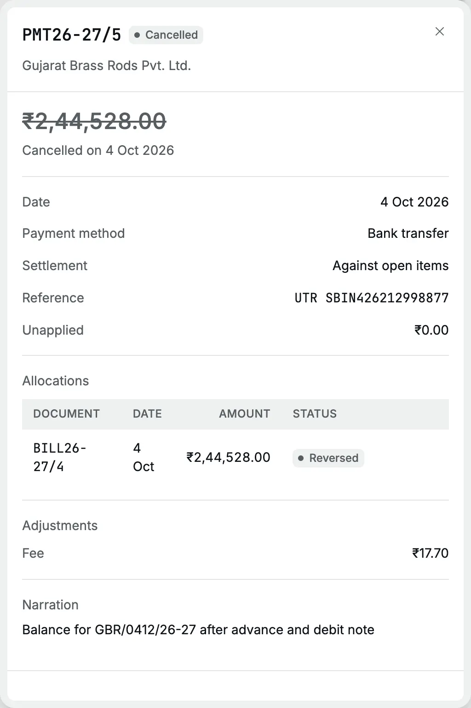
</Frame>

## On a phone

The payment form works the same on a phone. Fields stack in one column, and **Post** and
**Close** stay at the bottom.

<Frame caption="The New payment form on a 390-pixel-wide phone screen.">
  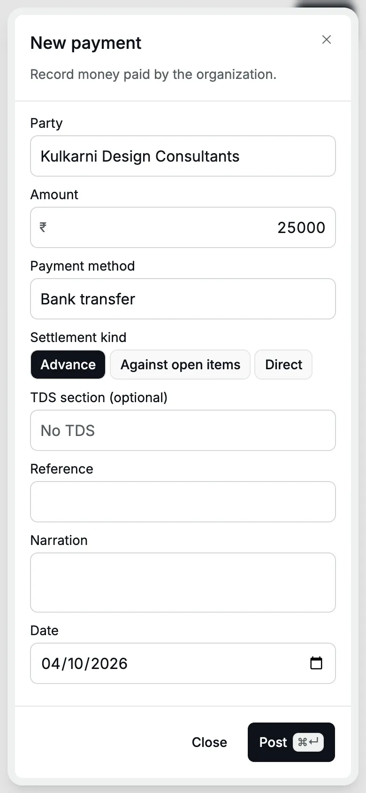
</Frame>

## Common errors

| Message                                             | What it means and what to do                                      |
| --------------------------------------------------- | ----------------------------------------------------------------- |
| Choose a party                                      | **Advance** and **Against open items** need a party               |
| Choose an expense or asset account                  | A **Direct** payment needs the account it pays for                |
| Allocated amount cannot exceed the payment          | The **Allocate** amounts add up to more than the **Amount**       |
| Allocate the full payment including write-offs      | With a write-off, allocate the amount plus the write-offs in full |
| Refund amount must equal the allocated credit notes | For a refund, the **Amount** and the allocations must match       |
| Choose a write-off account                          | A write-off row has an amount but no account                      |
| Choose an expense account and enter a positive fee  | Fill both **Fee expense account** and **Fee amount**, or neither  |
| Choose a party to deduct TDS                        | A **Direct** payment with a TDS section needs the party           |
| Record the party's PAN before deducting TDS.        | Add the PAN or GSTIN to the [party](/setup/parties)               |

## Related pages

- [Bills](/purchases/bills): book what you owe, apply advances
- [Debit notes](/purchases/debit-notes): reduce a bill before you pay it
- [Purchase cycle](/scenarios/purchase-cycle): advance, bills, debit note and payments end to end
- [Party ledger](/reports/party-ledger): check what you owe each supplier
