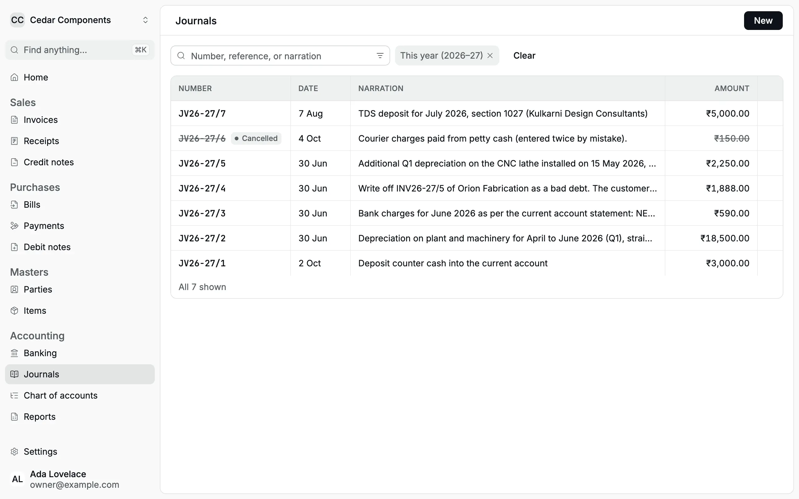
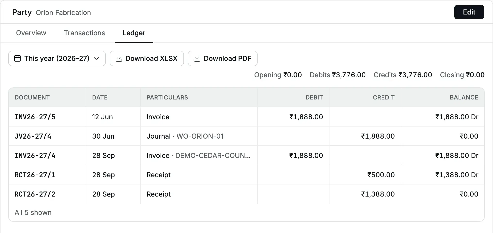
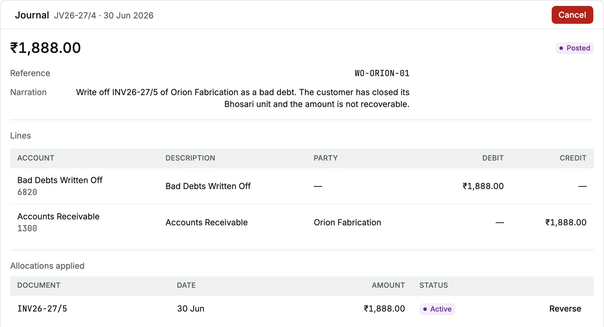
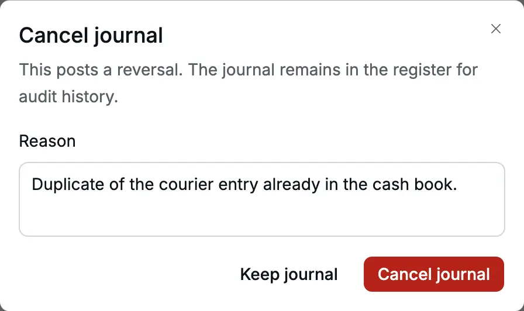
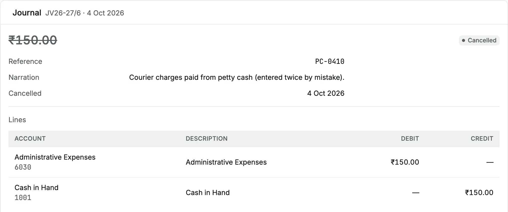
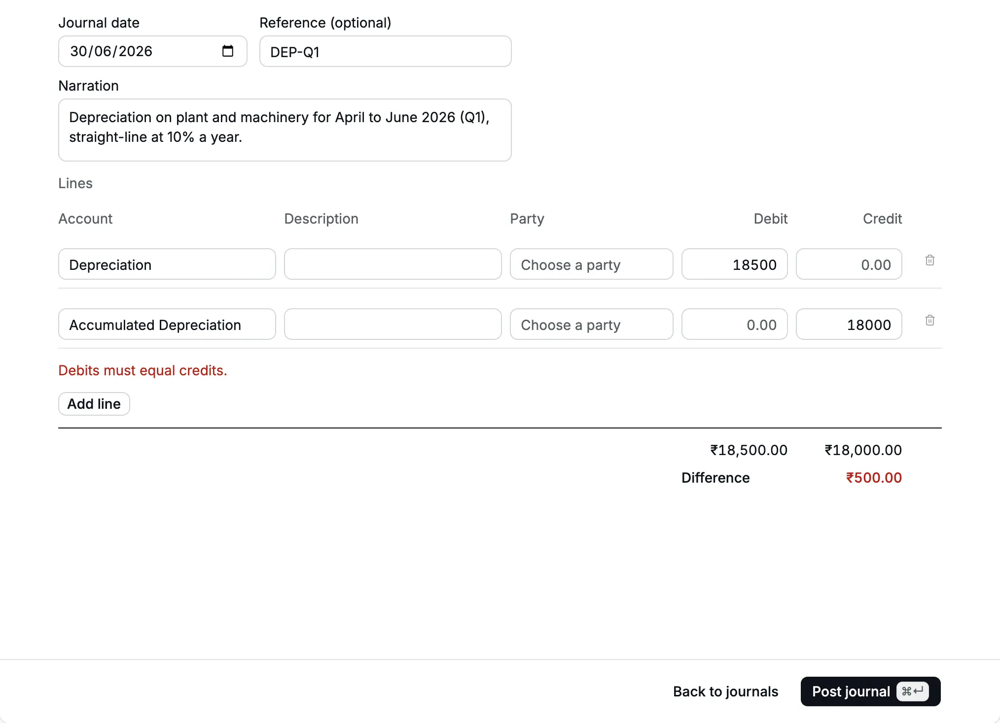
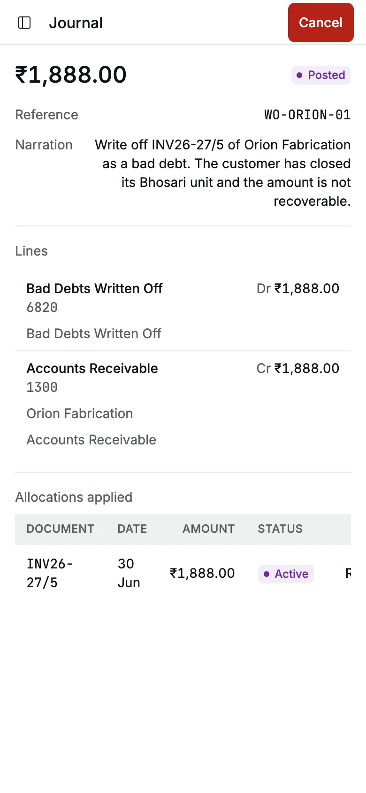

A [journal](/glossary#journal) is a voucher (an accounting entry) you write by hand:
you choose the [accounts](/glossary#account), the debits and the credits. Every entry
has two equal sides: the [debit and credit](/glossary#debit-credit) (Dr and Cr). Use a
journal for entries that no [invoice](/glossary#invoice) (sale),
[bill](/glossary#bill) (purchase), [receipt](/glossary#receipt) (money in) or
[payment](/glossary#payment) (money out) covers. Examples are quarterly
[depreciation](/glossary#depreciation) (the part of an asset's cost used up in the
period), bank charges without [GST](/glossary#gst) (Goods and Services Tax), a cash
deposit into the bank, or a [write-off](/glossary#write-off) of an invoice a customer
will never pay.

**Who can do it:** your [role](/glossary#roles) decides this. An Owner or Accountant [posts](/glossary#post) (writes into the
books for good) and cancels journals. A Chartered Accountant (CA) can open and read
them. An Operator does not see journals.

:::tip[Use the document first]
If a document fits, use it. A sale is an [invoice](/sales/invoices), a vendor's
charge with GST is a [bill](/purchases/bills), money in or out is a
[receipt](/sales/receipts) or a [payment](/purchases/payments). A journal cannot
carry GST, so it is never the place for a taxable sale or purchase (one that
attracts GST).
:::

## The journal register

Open **Accounting → Journals**. The register lists journals with **Number**, **Date**,
**Narration** ([narration](/glossary#narration), the note that explains the entry)
and **Amount** (the debit total). Search by number, reference or narration. The
filter icon offers **Date** and **State** (Posted or Cancelled). By default the
register shows the current [financial year](/glossary#financial-year) (FY), which in
India runs from 1 April to 31 March.

<Frame caption="The journal register for Cedar Components after the April–June close.">
  
</Frame>

Journals are numbered in their own series, for example `JV26-27/4`: the journal
prefix from **Settings → Organization**, the financial year, and the next number.

## Post a journal

On 30 Jun 2026 the accountant of Cedar Components books depreciation for April to
June: ₹18,500 on plant and machinery.

<Steps>
<Step title="Open a new journal">
In **Journals**, click **New**. On the same page you can also press ⌘K (Ctrl+K on
Windows) and choose **New journal**.
</Step>
<Step title="Fill the header">
- **Journal date**: the date the entry belongs to, here `30/06/2026`. It starts on
  today's date.
- **Reference (optional)**: your own voucher or working-paper number, up to 120
  characters, for example `DEP-Q1`.
- **Narration**: why you post the entry, up to 500 characters. It is required, and it
  is what your CA reads in the [day book](/glossary#day-book), the date-wise list of
  every entry.
</Step>
<Step title="Enter the lines">
Each line has an **Account**, an optional **Description**, an optional **Party** (the
customer or vendor, see [party](/glossary#party)), and
an amount in **Debit** or **Credit** (one of the two, never both). Start typing in
**Account** to search; each option shows the account's code. Click **Add line** for more lines; a journal
takes 2 to 100 lines.

Here: line 1 **Depreciation**, Debit `18500`; line 2 **Accumulated Depreciation**,
Credit `18500`.

</Step>
<Step title="Check the totals">
Under the lines, the debit total, the credit total and the **Difference** update as
you type. The difference must be ₹0.00.
</Step>
<Step title="Post">
Click **Post journal** or press ⌘↵ (Ctrl+Enter). The message "Journal JV26-27/2
posted" appears, and the form clears for the next entry with the same date.
</Step>
</Steps>

<Frame caption="A depreciation journal, balanced and ready to post.">
  
</Frame>

What happens in the books:

| Account                                             | Dr         | Cr         |
| --------------------------------------------------- | ---------- | ---------- |
| Depreciation (expense)                              | ₹18,500.00 |            |
| Accumulated Depreciation (asset, reduces the asset) |            | ₹18,500.00 |

The entry appears in the [day book](/reports/day-book), the
[account ledger](/reports/account-ledger) of each account (the
[ledger](/glossary#ledger) is the running record of one account), and the
[trial balance](/reports/trial-balance) on its journal date. The
[trial balance](/glossary#trial-balance) lists every account's balance; its debits
and credits must agree.

:::note
The [chart of accounts](/glossary#chart-of-accounts), the list of all your accounts,
in a new organization has no depreciation accounts. Add
**Depreciation** (expense) and **Accumulated Depreciation** (asset) in
[Chart of accounts](/setup/chart-of-accounts) before the first close.
:::

## The rules a journal follows

- **Debits equal credits.** The debit total must equal the credit total, and each
  side must be more than zero.
- **One side per line.** A line has a debit or a credit, not both.
- **A narration is required.** The reference is optional.
- **Posted journals are never edited.** To change one, cancel it and post a new one.
  See [Cancel a journal](#cancel-a-journal).
- **Locked periods are closed.** A journal dated on or before the books
  [lock](/glossary#lock) (the date through which a period is closed) is refused
  unless you have an [exception](/glossary#lock-exception), a time-limited permission
  to post into the closed period. See [Locks](/accounting/locks).

## Accounts a journal accepts and refuses

The **Account** list shows only the accounts a journal may use.
[Group accounts](/glossary#group-account) such as **Current Assets** only total the
accounts under them, so they never appear. Some rows below are
[system accounts](/glossary#system-account), which Accly Books creates and uses for
its own postings.

| Account                                                                                                                                                                                        | In a journal? | What to use instead                                                                                  |
| ---------------------------------------------------------------------------------------------------------------------------------------------------------------------------------------------- | ------------- | ---------------------------------------------------------------------------------------------------- |
| Your own expense, asset, liability and equity accounts                                                                                                                                         | Yes           |                                                                                                      |
| Cash and bank accounts (a journal with only cash and bank lines is a [contra](/glossary#contra))                                                                                               | Yes           |                                                                                                      |
| [TDS Payable](/glossary#tds-payable) and TDS Receivable (tax deducted at source, [TDS](/glossary#tds)), Round Off, Share Capital (opening equity)                                              | Yes           |                                                                                                      |
| Income accounts that are [exempt, nil-rated](/glossary#supply-class) or outside GST, such as Interest Income                                                                                   | Yes           |                                                                                                      |
| **Accounts Receivable** (what customers owe you, a [control account](/glossary#control-account)), with a party on the line                                                                     | Yes           | See [Party lines](#party-lines-on-accounts-receivable)                                               |
| Taxable income accounts such as **Sales**, when the organization has a [GSTIN](/glossary#gstin) (GST registration number)                                                                      | No            | An [invoice](/sales/invoices), which adds the GST                                                    |
| [CGST, SGST, IGST](/glossary#cgst-sgst-igst) (central, state and integrated GST) and [cess](/glossary#cess) input and output accounts                                                          | No            | The GST comes from invoices, bills and notes                                                         |
| **Accounts Payable** (what you owe vendors, [payable](/glossary#payable)), **Customer Advances**, **Supplier Advances** ([advances](/glossary#advance), money paid before the invoice or bill) | No            | A [payment](/purchases/payments), [debit note](/purchases/debit-notes) or [receipt](/sales/receipts) |
| An archived (switched-off) account                                                                                                                                                             | No            | Restore it in [Chart of accounts](/setup/chart-of-accounts)                                          |

:::warning[No GST settlement journal yet]
Because a journal cannot name a GST account, you cannot yet record the monthly
[GSTR-3B](/glossary#gstr) set-off (the summary return where you deduct the GST you
paid from the GST you collected) and the GST payment in Accly Books. The
[output tax](/glossary#output-tax) and input tax balances stay on the
[balance sheet](/glossary#balance-sheet), the statement of what the business owns
and owes. Agree the treatment with your CA until a GST settlement
document arrives.
:::

The **Party** box on an ordinary line is for reference only: the hint reads "Shown
in the day book only." It does not change any party's balance.

## Bank charges

The June bank statement of Cedar Components shows ₹590 of charges for
[NEFT](/glossary#upi-neft) (bank transfers), SMS alerts and a cheque book. Post a journal dated 30 Jun 2026:

| Account      | Dr      | Cr      |
| ------------ | ------- | ------- |
| Bank Charges | ₹590.00 |         |
| Bank Account |         | ₹590.00 |

:::tip[Bank charges with GST]
Banks charge 18% GST on most fees, here ₹500 plus ₹90. A journal posts the full ₹590
as an expense, so you get no [input tax credit](/glossary#itc) (ITC), the GST you
paid that you may deduct from the GST you collect. To claim the credit, enter the
charges as a [bill](/purchases/bills) from the bank, with the bank's GSTIN.
:::

## Move money between cash and bank

A journal whose lines are all cash or bank accounts is a contra entry. To deposit
₹3,000 of counter cash into the current account: Dr **Bank Account** ₹3,000, Cr
**Cash in Hand** ₹3,000. Cedar Components posted this as JV26-27/1 on 2 Oct 2026.

## Party lines on Accounts Receivable

A line on **Accounts Receivable** changes what a customer owes, so it needs a party.
When you choose that account, the party box turns to **Party (required)** with the
hint "Changes what this party owes".

- A **credit** on Accounts Receivable lowers the customer's balance. The form shows
  the customer's **Open invoices**, so you can settle them in the same journal. Type
  an amount against an invoice, or click **Fill** to allocate as much as fits. To
  [allocate](/glossary#allocation) is to match the credit to a specific invoice. Below
  the grid, **Party allocated** and **Remaining to allocate** keep count.
- Any credit you do not allocate stays as the customer's **open credit**
  ([credit](/glossary#credit), an amount in the customer's favour not yet matched). Settle it
  later from [Apply credit](/sales/apply-credit). It is not an advance and has no
  GST.
- A **debit** on Accounts Receivable raises the customer's balance. It becomes an
  open item that a later [receipt](/sales/receipts) can settle, listed with the
  type **Journal** and no due date.
- One journal can touch several customers. Dr Accounts Receivable for one customer
  and Cr Accounts Receivable for another moves a balance between them; the
  Accounts Receivable total does not change.

Each party line appears in the customer's [party ledger](/reports/party-ledger) on the
journal date.

## Write off a bad debt

Orion Fabrication has ₹1,888.00 [outstanding](/glossary#outstanding) (still unpaid)
on INV26-27/5 of 12 Jun 2026 (two mounting brackets
at ₹800 each plus 18% GST). In June the customer closes its Bhosari unit, and Cedar
Components decides the amount is not recoverable.

<Steps>
  <Step title="Start a journal on the write-off date">
    **Journal date** `30/06/2026`, **Reference** `WO-ORION-01`, and a narration that names the
    invoice and the reason.
  </Step>
  <Step title="Debit the expense">Line 1: **Bad Debts Written Off**, Debit `1888`.</Step>
  <Step title="Credit the customer">
    Line 2: **Accounts Receivable**, **Party** Orion Fabrication, Credit `1888`. The **Open
    invoices** grid lists INV26-27/5 with ₹1,888.00 outstanding.
  </Step>
  <Step title="Allocate to the invoice">
    Click **Fill** on INV26-27/5. **Remaining to allocate** shows ₹0.00.
  </Step>
  <Step title="Post">Click **Post journal**. The invoice is now settled.</Step>
</Steps>

<Frame caption="A bad-debt write-off allocated to Orion Fabrication's invoice.">
  
</Frame>

| Account               | Party             | Dr        | Cr        |
| --------------------- | ----------------- | --------- | --------- |
| Bad Debts Written Off |                   | ₹1,888.00 |           |
| Accounts Receivable   | Orion Fabrication |           | ₹1,888.00 |

Write off the full invoice, GST included. GST law gives no refund of output tax (the
GST you charged on the sale) on a bad debt, so the GST you paid stays paid and the whole amount is the loss.

<Frame caption="Orion Fabrication's ledger: the June invoice and the write-off cancel out.">
  
</Frame>

:::note
When a customer pays part of an invoice and you write off the small rest, use a
[receipt](/sales/receipts) with a write-off line instead. It records the money and
the write-off together.
:::

## The journal record

Click a journal in the register to open its record. The header shows the number and
date, the amount, and **Posted** or **Cancelled**. Below are the **Reference**,
**Narration**, the **Lines** with account, description, party, debit and credit,
and for party lines:

- **Allocations applied**: invoices this journal settled, with **Reverse** on each
  active row.
- **Allocations received**: other documents, such as a receipt, that settled this
  journal's debit.

<Frame caption="The write-off journal with its allocation to INV26-27/5.">
  
</Frame>

To undo one match without cancelling the journal, click **Reverse** and give a
reason. The dialog says "Both documents become open to settle again."

## Cancel a journal

Cancel a journal when it was wrong. The journal stays in the register, struck
through, and Accly Books posts a [reversal](/glossary#reversal): an equal and
opposite entry that cancels the original.

1. Open the journal and click **Cancel**.
2. In **Cancel journal** ("This posts a reversal. The journal remains in the
   register for audit history."), type the reason.
3. Click **Cancel journal**. The message "Journal cancelled" appears and the state
   turns to **Cancelled**.

<Frame caption="Cancelling a duplicate courier entry.">
  
</Frame>

What happens:

- The reversal is dated **today**, not the journal date. A June journal cancelled
  on 4 Oct 2026 still counts in June and is reversed in October. To correct a
  closed month itself, post a correcting journal in that month under an
  [exception](/accounting/locks#let-one-person-post-a-late-correction).
- Invoices the journal settled become open again; their allocations are reversed
  automatically.
- If a receipt or credit note settled this journal's debit, **Cancel** is disabled
  and the record says "Reverse the active allocations received below before
  cancelling this journal." Reverse those first.
- The reason is kept in [Settings → Audit](/administration/audit-log) (the
  [audit log](/glossary#audit-log), the record of sensitive actions) and as the
  narration of the reversing entry. The journal record shows only the cancellation
  date.

<Frame caption="A cancelled journal keeps its lines and shows the cancellation date.">
  
</Frame>

## Common errors

| Message                                                                                          | Why                                                                       | What to do                                                                           |
| ------------------------------------------------------------------------------------------------ | ------------------------------------------------------------------------- | ------------------------------------------------------------------------------------ |
| Debits must equal credits.                                                                       | The totals differ, or one side is zero                                    | Check the **Difference** line and fix an amount                                      |
| Enter a debit or a credit                                                                        | A line has both sides or neither                                          | Clear one side, or remove the empty line                                             |
| Add at least two lines                                                                           | Only one line remains                                                     | Add the other side of the entry                                                      |
| Choose an account                                                                                | A line has no account                                                     | Pick an account or remove the line                                                   |
| Enter a narration                                                                                | The narration is empty                                                    | Say why you post the entry                                                           |
| Choose a party                                                                                   | An Accounts Receivable line has no party                                  | Choose the customer                                                                  |
| Enter no more than ₹…                                                                            | An allocation is more than the invoice's outstanding or the line's credit | Lower the amount                                                                     |
| Taxable income is invoiced, not journaled.                                                       | A taxable income account is on a line                                     | Raise an invoice instead                                                             |
| Choose active leaf accounts; unsupported party control and GST accounts are posted by documents. | A GST, payables, advance, group or archived account                       | Use the document from the table above                                                |
| Books are locked through 30 Jun 2026. Ask for an exception to post on or before that date.       | The journal date is in a locked period                                    | Date it after the lock, or ask the owner or CA for an [exception](/accounting/locks) |

<Frame caption="An unbalanced journal is stopped before it reaches the books.">
  
</Frame>

## On a phone

The register, the form and the record work on a phone. On a narrow screen the record
header shows only "Journal", so check the number in the register before you open it.

<Frame caption="The write-off journal on a phone.">
  
</Frame>

## Related pages

- [Locks](/accounting/locks): close a period and post late corrections.
- [Apply credit](/sales/apply-credit): use a journal's open credit against an
  invoice.
- [Day book](/reports/day-book) and [Trial balance](/reports/trial-balance): check
  what you posted.
- [Closing a quarter](/scenarios/quarter-close): journals and locks in one story.
