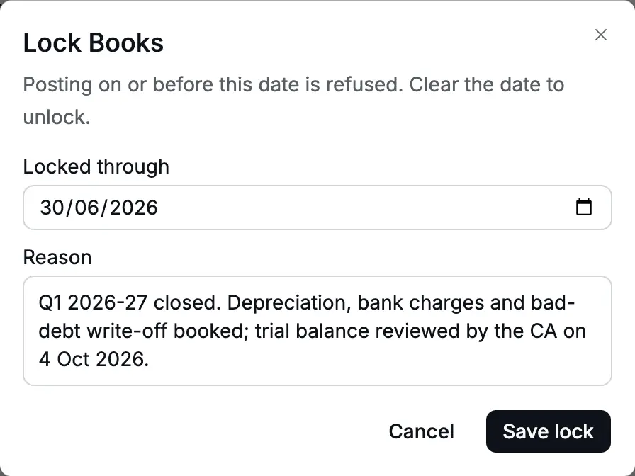
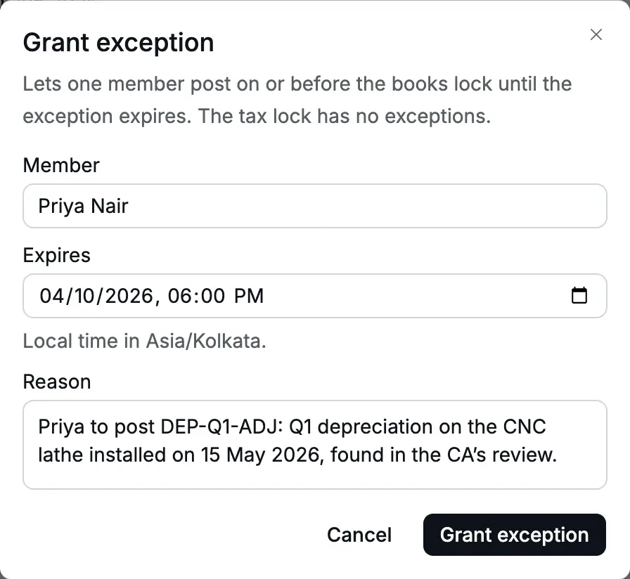
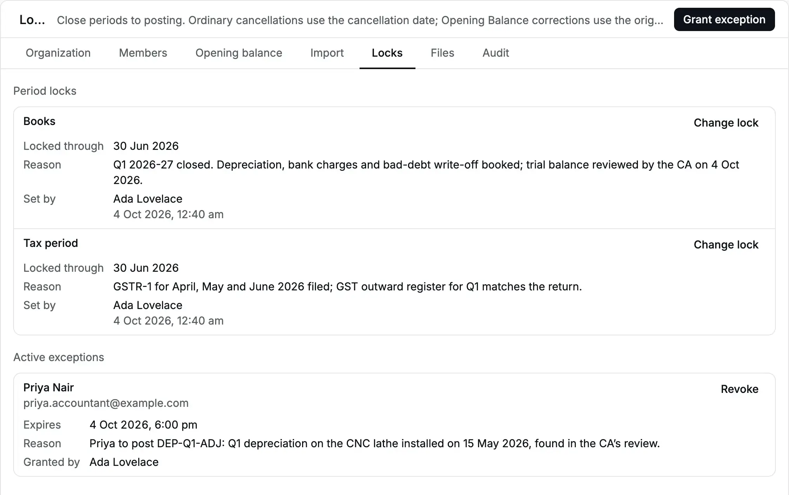
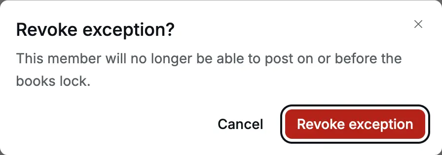
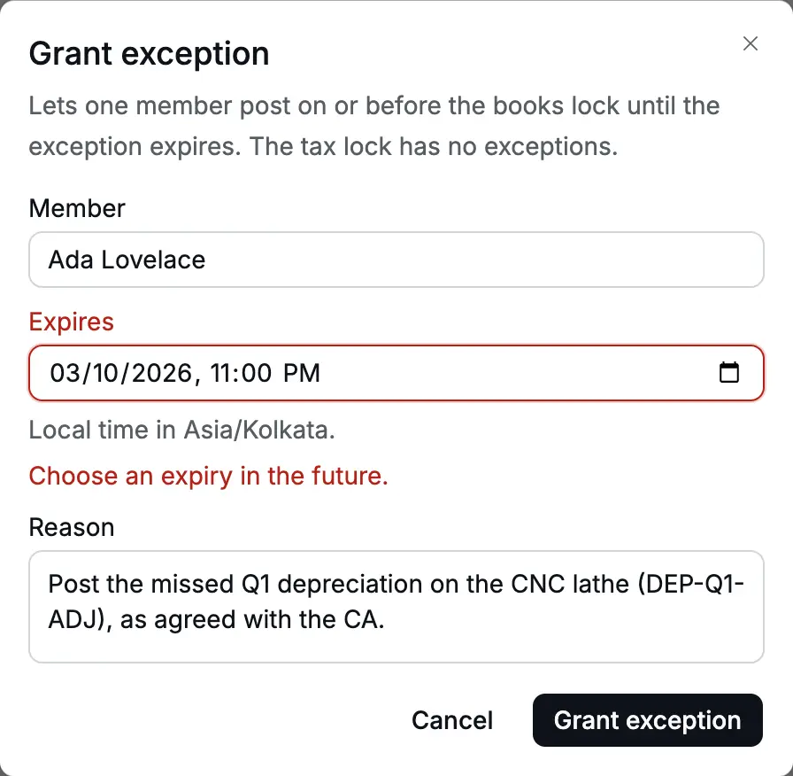
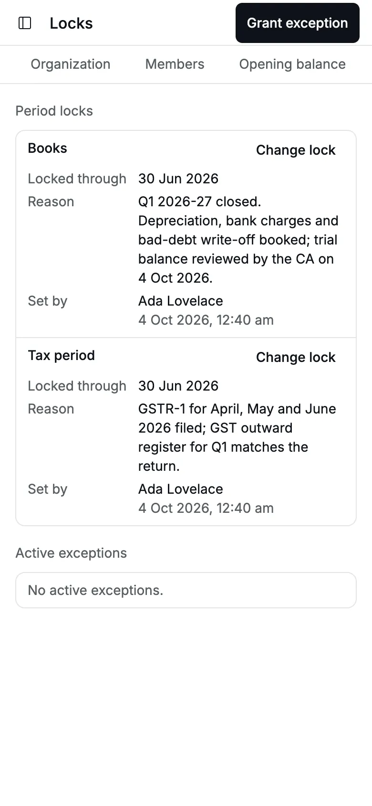

A [lock](/glossary#lock) closes a period: it sets a date on or before which nothing
new can be entered. After your CA (Chartered Accountant) has reviewed the quarter and
you have filed the [GST](/glossary#gst) (Goods and Services Tax) return, you lock the
period so that nobody [posts](/glossary#post) into it by mistake. To post is to write
an entry into the books for good. Accly Books has two locks:

- **Books** stops every posting dated on or before its date.
- **Tax period** stops posting a [document](/glossary#document) (an invoice, bill,
  note or receipt) that belongs in a GST register, dated on or before its date. A GST
  register is the list of sales or purchases that feeds your GST return. Set this lock
  when you file the return for the period.

**Who can do it:** your [role](/glossary#roles) decides this. An Owner or a Chartered
Accountant sets locks and grants
exceptions ([lock exceptions](/glossary#lock-exception), time-limited permissions to
post into a locked period). An Accountant can see the locks but not change them. An Operator does not
see this page.

## The Locks page

Open **Settings → Locks**. **Period locks** shows **Books** and **Tax period**, each
with **Locked through** (or "Not locked"), the **Reason**, and **Set by** with the
date and time of the change. **Active exceptions** lists the people who may post into
the locked books right now.

<Frame caption="Cedar Components after closing April–June 2026: both locks at 30 Jun 2026.">
  
</Frame>

## What each lock blocks

The lock date is inclusive: a lock through 30 Jun 2026 refuses a document dated
30 Jun 2026 and allows one dated 1 Jul 2026.

| Action                                                                                                                                                       | Books lock                                                                      | Tax period lock                                                                                                                                               |
| ------------------------------------------------------------------------------------------------------------------------------------------------------------ | ------------------------------------------------------------------------------- | ------------------------------------------------------------------------------------------------------------------------------------------------------------- |
| Post an [invoice](/glossary#invoice), [bill](/glossary#bill), [credit note](/glossary#credit-note) or [debit note](/glossary#debit-note) dated in the period | Refused                                                                         | Refused, when the organization has a [GSTIN](/glossary#gstin) (GST registration number)                                                                       |
| Post a [receipt](/glossary#receipt) (money in) or [payment](/glossary#payment) (money out) dated in the period                                               | Refused                                                                         | Refused only for a direct receipt to a GST-classified income account when the organization has a GSTIN; other receipts and payments are not in a GST register |
| Post a [journal](/glossary#journal) (a manual entry) dated in the period                                                                                     | Refused                                                                         | Not affected: a journal never carries GST                                                                                                                     |
| Post an [Opening Balance](/glossary#opening-balance) (your balances on the day you start using Accly Books), or import one, dated in the period              | Refused                                                                         | Not affected                                                                                                                                                  |
| Save an invoice or bill [draft](/glossary#draft) (saved but not yet posted) dated in the period                                                              | Allowed                                                                         | Allowed                                                                                                                                                       |
| Post that draft                                                                                                                                              | Refused                                                                         | Refused                                                                                                                                                       |
| Cancel or amend a document                                                                                                                                   | Checked on its original date                                                    | Checked on its original date when it affects tax                                                                                                              |
| Cancel an Opening Balance                                                                                                                                    | Checked on its cutover date                                                     | Not affected                                                                                                                                                  |
| Apply credit or reverse an [allocation](/glossary#allocation) (a match of a payment or credit to an invoice)                                                 | Checked on the later source or target date; reversal uses the allocation's date | Not affected                                                                                                                                                  |

A cancellation posts its [reversal](/glossary#reversal), an equal and opposite entry,
on the original document date. It corrects that period's balances and cannot bypass
a lock by cancelling later. A books lock requires an exception or reopening;
a tax lock must be reopened for documents that affect tax. Opening Balance
corrections follow the same rule on their cutover date.

:::warning[After you file a GST return, use a credit note]
The tax lock stops cancelling or amending an invoice dated in a filed period.
To keep the filed return unchanged, correct the invoice with a
[credit note](/sales/credit-notes) dated in the open period instead.
:::

## Set or change a lock

<Steps>
  <Step title="Open the lock">
    In **Settings → Locks**, click **Change lock** on **Books** or **Tax period**.
  </Step>
  <Step title="Choose the date">
    In **Locked through**, enter the last day of the closed period, for example `30/06/2026` for
    April–June. To unlock, clear the date.
  </Step>
  <Step title="Give the reason">
    **Reason** is required (up to 500 characters). Write what was closed and who reviewed it, for
    example "Q1 2026-27 closed. Trial balance reviewed by the CA on 4 Oct 2026."
  </Step>
  <Step title="Save">
    Click **Save lock**. The message "Books locked through 30 Jun 2026" (or "Tax period locked
    through …") appears. Clearing the date shows "Books unlocked".
  </Step>
</Steps>

<Frame caption="Locking the books through 30 Jun 2026.">
  
</Frame>

You can move a lock earlier to reopen a period, or later to close more. Every change
needs a reason and is recorded.

:::warning
Accly Books accepts a lock date after today. A lock in the future stops all posting
today, including receipts at the counter. Check the year before you save.
:::

If someone else changed the same lock while your dialog was open, saving shows "This
lock changed after you opened it." Close the dialog, read the new lock, and try
again.

## What a user sees when a period is locked

When someone posts a document dated in a locked period, the form keeps their entry
and shows the message under the date:

- Books lock: "Books are locked through 30 Jun 2026. Ask for an exception to post on
  or before that date."
- Tax period lock: "The tax period is locked through 30 Jun 2026."

The tax message comes first when both apply. An exception does not clear it.

<Frame caption="A journal dated 30 Jun 2026 after the books are locked.">
  
</Frame>

## Let one person post a late correction

An exception lets one member post on or before the books lock until a time you
choose. Use it for a correction your CA asks for after the close. The tax lock has no
exceptions: to post a GST document into a filed period you must move the tax lock
itself, which you should do only with your CA.

<Steps>
  <Step title="Open Grant exception">In **Settings → Locks**, click **Grant exception**.</Step>
  <Step title="Choose the member">
    In **Member**, choose the person who will post, for example Priya Nair, the accountant.
  </Step>
  <Step title="Choose when it expires">
    **Expires** is a date and time in the organization's time zone (the hint reads "Local time in
    Asia/Kolkata."), whatever time zone your own computer uses. Keep it short: the end of the
    working day is usually enough.
  </Step>
  <Step title="Give the reason and grant">
    Name the entry and who asked for it, then click **Grant exception**. The message "Exception
    granted" appears.
  </Step>
</Steps>

<Frame caption="An exception for Priya until 6:00 pm on 4 Oct 2026.">
  
</Frame>

The exception appears under **Active exceptions** with the member, **Expires**,
**Reason** and **Granted by**. Until it expires, that member can post any document
dated on or before the books lock. Nobody else can.

<Frame caption="The active exception on the Locks page.">
  
</Frame>

When the time passes, the exception stops working by itself and leaves the list. The
next posting into the locked period is refused again with the books message.

To end it early, click **Revoke** and confirm **Revoke exception?** ("This member
will no longer be able to post on or before the books lock."). The message "Exception
revoked" appears.

<Frame caption="Revoking an exception before it expires.">
  
</Frame>

:::note
An exception opens every date before the lock, for every document type the member can
post. The form does not tell the member that they are posting under an exception.
Grant it for the shortest time that works, and revoke it as soon as the correction
is posted.
:::

## Lock history

The Locks page shows only the current lock for each kind, with its reason and who
set it. The full history is in [Settings → Audit](/administration/audit-log), the
[audit log](/glossary#audit-log) that records every sensitive action:

| Audit action           | Details                                         |
| ---------------------- | ----------------------------------------------- |
| Period lock changed    | kind (general or tax), the new date, the reason |
| Lock exception granted | the member, the expiry, the reason              |
| Lock exception revoked | the exception                                   |

Expired exceptions do not appear on the Locks page; their grant stays in the audit
log.

## Common errors

| Message                                                                                    | Where                              | What to do                                                                |
| ------------------------------------------------------------------------------------------ | ---------------------------------- | ------------------------------------------------------------------------- |
| Books are locked through 30 Jun 2026. Ask for an exception to post on or before that date. | Any document form                  | Date the document after the lock, or ask the owner or CA for an exception |
| The tax period is locked through 30 Jun 2026.                                              | Invoice, bill, note or GST receipt | Post it in the open period, usually as a credit or debit note             |
| Choose an expiry in the future.                                                            | Grant exception                    | Pick a later time; the server's clock decides                             |
| Choose a local time that exists in Asia/Kolkata                                            | Grant exception                    | Pick another time (applies only in zones with daylight saving)            |
| Choose a member                                                                            | Grant exception                    | Pick the person who will post                                             |
| This lock changed after you opened it.                                                     | Change lock                        | Reopen the dialog and review the new date                                 |
| This exception is not active.                                                              | Revoke                             | It already expired or was revoked; refresh the page                       |

<Frame caption="An expiry in the past is refused.">
  
</Frame>

## On a phone

The Locks page works on a phone; the settings tabs scroll sideways.

<Frame caption="The Locks page on a phone.">
  
</Frame>

## Related pages

- [Journals](/accounting/journals): the adjusting entries you post before a close.
- [Trial balance](/reports/trial-balance): the report your CA reviews before you
  lock.
- [Audit log](/administration/audit-log): the history of every lock and exception.
- [Closing a quarter](/scenarios/quarter-close): the full close for April–June 2026.
