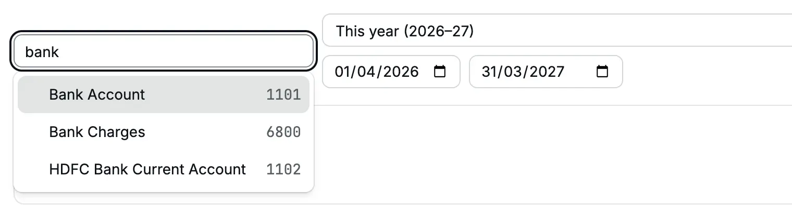

The account [ledger](/glossary#ledger) lists every entry in one [account](/glossary#account) for a period, oldest first, with
a running balance. Use it to check a bank account against the bank statement, to see
what makes up a balance, or to find one entry.

**Question it answers:** what went into and out of this account, and what is its
balance after each entry?

**Who can open it:** Owner, Accountant and Chartered Accountant.

## Open an account ledger

<Steps>
  <Step title="Open the report">
    Click **Reports**, then **Account ledger**. The page says "Choose an account to view its
    ledger."
  </Step>
  <Step title="Choose the account">
    Click **Choose an account** and type part of the name, for example "bank". The list shows
    posting accounts (accounts that take entries) with their codes.
    [Groups](/glossary#group-account), the headings that hold accounts, are not in the list. An
    archived account shows "Inactive".
  </Step>
  <Step title="Choose the period">
    The period starts as **This year**. Choose another preset or type the dates.
  </Step>
</Steps>

<Frame caption="Choose a posting account by name or code.">
  
</Frame>

You can also open the ledger by clicking an account name in the
[trial balance](/reports/trial-balance), the [profit and loss](/reports/profit-and-loss)
or the [balance sheet](/reports/balance-sheet).

## Read the ledger

<Frame caption="Accounts Receivable of Cedar Components from 1 Apr 2026 to 4 Oct 2026.">
  
</Frame>

The line above the table sums up the period:

| Figure      | Meaning                                                       |
| ----------- | ------------------------------------------------------------- |
| **Opening** | The balance before the **From** date, from every earlier line |
| **Debits**  | The total debited in the period                               |
| **Credits** | The total credited in the period                              |
| **Closing** | Opening + Debits − Credits, shown Dr or Cr                    |

The table heading shows the account code and name. The columns are:

| Column                | Meaning                                                                             |
| --------------------- | ----------------------------------------------------------------------------------- |
| **Date**              | The document date                                                                   |
| **Document**          | The document number. Click it to open the document.                                 |
| **Narration**         | The [narration](/glossary#narration), the short note typed on the document          |
| **Party**             | The [party](/glossary#party) (customer or vendor) on this line, if the line has one |
| **Debit**, **Credit** | The amount of this line ([debit and credit](/glossary#debit-credit))                |
| **Balance**           | The running balance after this line, Dr or Cr                                       |

The first row is **Opening** and the last row is **Closing**.

In the example, Accounts Receivable starts at ₹0.00. In the year so far, invoices add
₹3,11,063.00. Receipts, [credit notes](/glossary#credit-note), allocations and a bad-debt [write-off](/glossary#write-off) (journal
JV26-27/4 for Orion Fabrication) take off ₹2,37,761.00. The closing balance is
₹73,302.00 Dr, the same figure as on the balance sheet.

### Special lines

| Line                        | What it means                                                                                                                                                                                                                                                                                                          |
| --------------------------- | ---------------------------------------------------------------------------------------------------------------------------------------------------------------------------------------------------------------------------------------------------------------------------------------------------------------------- |
| "Reversal of RCT26-27/5"    | The document was cancelled. The [reversal](/glossary#reversal) is dated the day of cancellation and undoes the original line.                                                                                                                                                                                          |
| "Allocation" with no number | An [allocation](/glossary#allocation): an [advance](/glossary#advance) or credit was applied to an invoice or bill. It moves the amount between accounts, for example from Customer Advances to Accounts Receivable. It has no document of its own, so it has no link. Open the party's invoice to see the allocation. |

The reason you type when you cancel a document does not appear in the ledger. Find it
in the [audit log](/administration/audit-log), the record of sensitive actions ([audit log](/glossary#audit-log)).

## Long ledgers

The ledger loads the first lines at once and the rest as you scroll. The summary line
is complete from the start, but the **Closing** row at the bottom shows only when the
last line has loaded. The footer reads "All … shown" at that point.

## Open the document

Click the number in **Document**. The document opens in a panel over its register, for
example the invoice over the **Invoices** list. Close the panel to return; use the
browser's back button to return to the ledger.

<Frame caption="INV26-27/1 opened from the ledger.">
  
</Frame>

## Check a bank account

1. Open the ledger for the bank account, for example **1101 Bank Account**, for the
   month of the bank statement.
2. Compare **Opening** with the statement's opening balance and **Closing** with its
   closing balance.
3. Tick each line against the statement. A line in the ledger but not in the statement
   is usually a cheque not yet presented or a deposit in transit.

The ledger closing as of today equals the balance in **Banking**, unless a document is
dated after today. Banking includes such documents; the ledger stops at **To**.

## Download

- **Download XLSX** saves the ledger with Date, Document, Type, Narration, Party,
  Debit, Credit and **Balance (Dr +)**: a debit balance is positive and a credit
  balance is negative. The first row is the opening balance and the last is the
  closing balance. It holds up to 1,00,000 lines.
- **Download PDF** opens the ledger in a new tab. It holds up to 5,000 lines.

Until you choose an account, **Download XLSX** is greyed out and **Download PDF** is
hidden. For a longer period, the download
shows "This report exceeds 5,000 lines; choose a shorter period." Download one month
at a time.

## Common questions

**"Choose a posting account, not a group."** You opened a link with a group account.
Choose an account inside the group.

**The Party column is empty on cash and bank lines.** The party sits on the other
line of the entry, for example on Accounts Receivable or the income account. Read the
**Narration**, or open the [day book](/reports/day-book) for all lines of the entry.

## Related pages

- [Trial balance](/reports/trial-balance)
- [Day book](/reports/day-book)
- [Banking](/setup/banking)
- [Apply credit](/sales/apply-credit)
