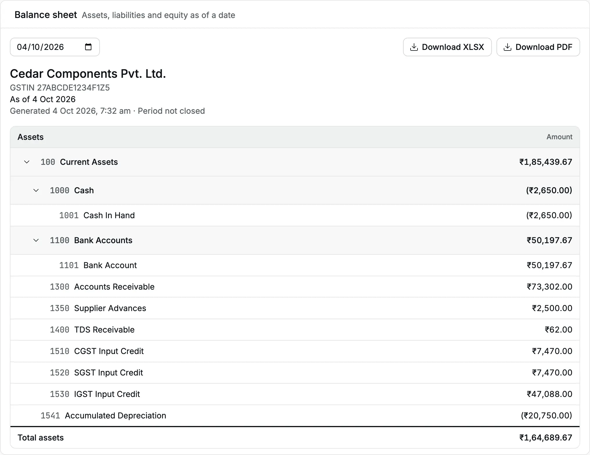
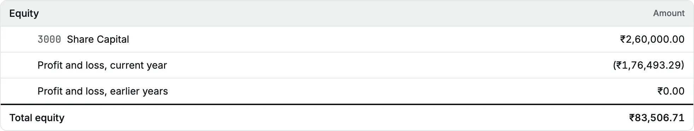
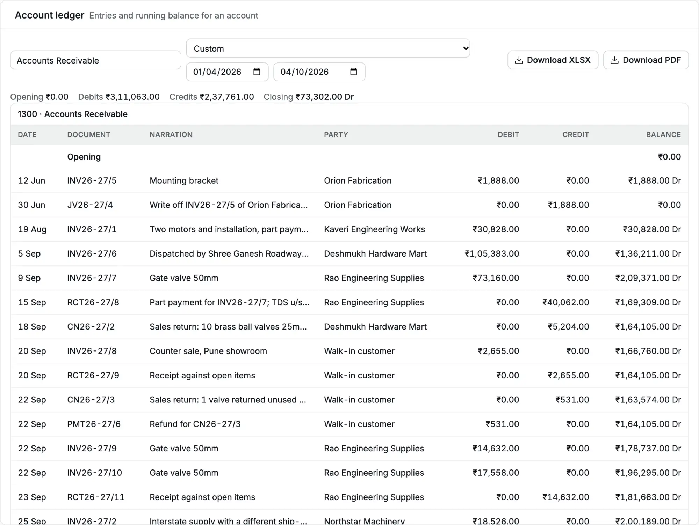
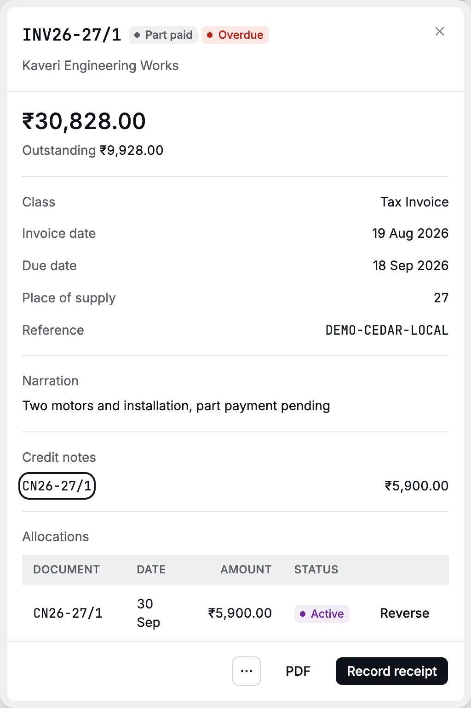
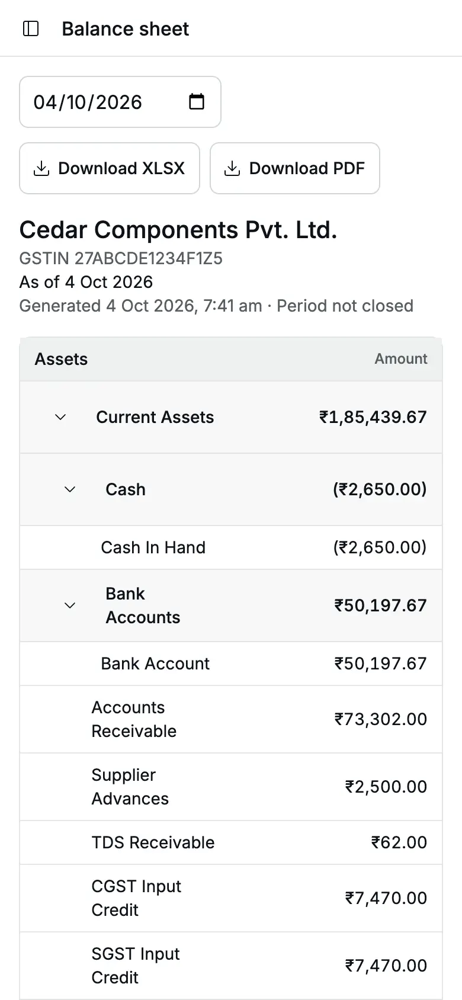

The [balance sheet](/glossary#balance-sheet) shows what the business owns (assets), what it owes (liabilities)
and the owners' share (equity) on one date. Assets always equal liabilities plus
equity.

**Question it answers:** what is the financial position of the business on this date?

**Who can open it:** Owner, Accountant and Chartered Accountant.

## Open the balance sheet

<Steps>
  <Step title="Open the report">
    Click **Reports**, then **Balance sheet**. It opens as of today.
  </Step>
  <Step title="Choose the date">
    Type or pick a date in the date box, or choose **Today**, **End of last month**, **End of last
    quarter** or **End of last financial year** from the as-of presets. A custom date stays selected
    in the date box.
  </Step>
  <Step title="Check the totals">
    **Total assets** at the end of Assets equals **Total liabilities + equity** at the bottom of the
    page.
  </Step>
</Steps>

<Frame caption="Balance sheet of Cedar Components as of 4 Oct 2026.">
  
</Frame>

## Read the statement

The balance sheet adds up every [posted](/glossary#post) line from the first entry in your books to the
date you chose. It has three sections:

| Section         | Account type                                                                                                                                                                                    | Amount                                                           |
| --------------- | ----------------------------------------------------------------------------------------------------------------------------------------------------------------------------------------------- | ---------------------------------------------------------------- |
| **Assets**      | Asset accounts: cash, bank, [receivables](/glossary#receivable), [advances](/glossary#advance) to suppliers, [input GST](/glossary#itc)                                                         | Debits less credits ([debit and credit](/glossary#debit-credit)) |
| **Liabilities** | Liability accounts: [payables](/glossary#payable), customer advances, [output GST](/glossary#output-tax), [TDS payable](/glossary#tds-payable) (tax deducted at source, owed to the government) | Credits less debits                                              |
| **Equity**      | Equity accounts such as Share Capital, plus two worked-out rows                                                                                                                                 | Credits less debits                                              |

Accounts appear under the [groups](/glossary#group-account) (headings that hold accounts) of your [chart of accounts](/setup/chart-of-accounts),
with a subtotal on each group. Click the arrow next to a group to collapse it. Accounts
with a zero balance do not appear.

A balance on the "wrong" side stays in its section as a negative figure in brackets.
An overdrawn bank account or a cash account that went below zero shows as a negative
asset. Accly Books does not move it to liabilities.

## The two profit rows in Equity

Accly Books does not post a closing entry at year end. The balance sheet works out the
profit each time instead:

| Row                                | Meaning                                                                                                                                                          |
| ---------------------------------- | ---------------------------------------------------------------------------------------------------------------------------------------------------------------- |
| **Profit and loss, current year**  | Income less expenses from the start of the [financial year](/glossary#financial-year) that contains the date (1 April for most Indian businesses) up to the date |
| **Profit and loss, earlier years** | Income less expenses before that year began: the profit you carried forward                                                                                      |

**Total equity** is the equity accounts plus these two rows.

<Frame caption="The Equity section with the current-year and earlier-year profit rows.">
  
</Frame>

**Profit and loss, current year** equals the net profit of the
[profit and loss](/reports/profit-and-loss) from the start of the financial year to the same date. On
4 Oct 2026 both show a loss of (₹1,76,493.29) for Cedar Components.

If you post income or expense balances in your [Opening Balance](/glossary#opening-balance) (the balances brought in from your old books), they count in the
financial year of the Opening Balance date.

## The totals always agree

In the example:

| Line                                                                 | Amount       |
| -------------------------------------------------------------------- | ------------ |
| Total assets                                                         | ₹1,64,689.67 |
| Total liabilities                                                    | ₹81,182.96   |
| Total equity (₹2,60,000.00 capital − ₹1,76,493.29 current-year loss) | ₹83,506.71   |
| Total liabilities + equity                                           | ₹1,64,689.67 |

There is no "difference" line. Every posted document balances, so the two totals
always agree. If they ever disagreed, the page would show "Could not load balance
sheet" instead of a wrong statement. Tell your administrator at once.

## Drill down: balance, ledger, document

<Steps>
  <Step title="Click an account">
    Click an account name, for example **Accounts Receivable**. Group names are not links.
  </Step>
  <Step title="Read its ledger">
    The [account ledger](/reports/account-ledger), the [ledger](/glossary#ledger) of that account,
    opens from the first day of that financial year to the balance-sheet date. Its **Closing**
    equals the balance-sheet row.
  </Step>
  <Step title="Open the document">
    Click a document number in the ledger, for example **INV26-27/1**. The invoice opens in a panel
    over its register.
  </Step>
</Steps>

<Frame caption="From the balance sheet, Accounts Receivable opens its ledger for the year so far.">
  
</Frame>

<Frame caption="Clicking INV26-27/1 opens the invoice with its credit note and allocations.">
  
</Frame>

:::tip
The ledger opens from the start of the financial year, but its **Opening** line carries every earlier balance,
so the closing still equals the balance-sheet figure.
:::

## On a phone

On a phone the statement keeps its groups. Codes are hidden, and long names wrap.

<Frame caption="The balance sheet on a phone. Cash In Hand shows a negative balance in brackets.">
  
</Frame>

## Download

- **Download XLSX** saves the statement with Assets, Liabilities and Equity, groups
  indented, both profit rows, and the totals.
- **Download PDF** opens the statement as of the chosen date, with codes, in a new tab.

## Common questions

**The balance sheet shows "No account balances as of this date."** The date is before
the first posted entry. Choose a later date.

**Home shows a different cash total.** Home and **Banking** include documents dated
after today. The balance sheet stops at its date. See [Reports](/reports).

**The statement says "Period not closed" for last year.** Accly Books has no year-end
close. A [lock](/glossary#lock) ([Locks](/accounting/locks)) stops changes to a period, but the header still says
"Period not closed".

## Related pages

- [Profit and loss](/reports/profit-and-loss)
- [Account ledger](/reports/account-ledger)
- [Banking](/setup/banking)
- [Opening balance](/setup/opening-balance)
