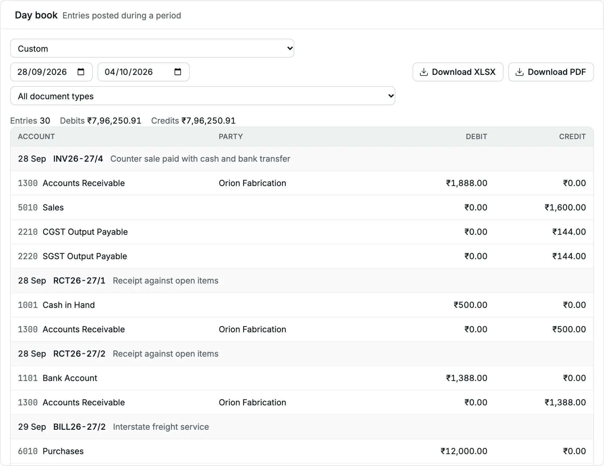

The [day book](/glossary#day-book) lists every [journal entry](/glossary#journal-entry) (one balanced set of debit and credit lines) in a period, in date order, with all its
lines. Use it at day close to check what was [posted](/glossary#post) today, or to review one kind of
document, such as all [receipts](/glossary#receipt) of the week.

**Question it answers:** what was posted in this period, and to which accounts?

**Who can open it:** Owner, Accountant and Chartered Accountant.

For a day-close breakdown by **Payment method** (name, receipt count and amount),
open **Sales → Receipts** and set **From** and **To** to the same date. Filter
**State** to **Posted** to exclude cancelled receipts. The day book's debit
and credit totals are accounting entries, not a breakdown of receipt methods.

## Open the day book

<Steps>
  <Step title="Open the report">Click **Reports**, then **Day book**. It opens for **Today**.</Step>
  <Step title="Choose the period">
    Choose **This month** or another preset, or type the **From** and **To** dates.
  </Step>
  <Step title="Filter by document type (optional)">
    In **All document types**, choose **Receipts**, **Payments**, **Invoices**, **Bills**, **Credit
    notes**, **Debit notes**, **Journals**, **Opening balances** or **Allocations**. A
    [journal](/glossary#journal) is a manual entry; an [allocation](/glossary#allocation) applies an
    advance or credit to an invoice or bill.
  </Step>
</Steps>

<Frame caption="The day book of Cedar Components from 28 Sep to 4 Oct 2026.">
  
</Frame>

## Read the day book

The line above the table sums up the period:

| Figure      | Meaning                                               |
| ----------- | ----------------------------------------------------- |
| **Entries** | The number of journal entries                         |
| **Debits**  | The total of all debit lines                          |
| **Credits** | The total of all credit lines; always equal to Debits |

Each entry starts with a shaded heading row: the date, the document number (a link to
the document) and the [narration](/glossary#narration). A reversal names the original
document and cancellation reason; an allocation names its source and target documents,
and links to the source. The rows below it are the entry's lines:

| Column                | Meaning                                                             |
| --------------------- | ------------------------------------------------------------------- |
| **Account**           | Account code and name                                               |
| **Party**             | The [party](/glossary#party) on the line, if any                    |
| **Debit**, **Credit** | The amount of the line ([debit and credit](/glossary#debit-credit)) |

For example, receipt RCT26-27/2 from Orion Fabrication on 28 Sep 2026 shows two lines:

| Account                  | Party             | Debit     | Credit    |
| ------------------------ | ----------------- | --------- | --------- |
| 1101 Bank Account        |                   | ₹1,388.00 | ₹0.00     |
| 1300 Accounts Receivable | Orion Fabrication | ₹0.00     | ₹1,388.00 |

The **Total** row at the bottom repeats the debit and credit totals. It shows once the
last entry has loaded.

### Which date an entry uses

The day book uses the document date, not the time you posted it. A bill you post today
with yesterday's date appears in yesterday's day book.

A cancellation is its own entry, a [reversal](/glossary#reversal), dated on the original document date, with a narration
such as "Reversal of RCT26-27/5: Duplicate receipt". Its lines mirror the original.
Cancelling a receipt from last week places both entries in last week's day book.

An **Allocation** entry reads "Allocation: source number → target number". It records
an advance or credit note applied to an invoice or bill, links to its source document,
and moves the amount between two accounts of the same party.

## Day close

At the end of the day:

1. Open the day book for **Today**.
2. Choose **Receipts** in the document type list. Check each receipt against the
   counterfoils or the receipt book.
3. Open the [account ledger](/reports/account-ledger) (the [ledger](/glossary#ledger) of one account) for **Cash in Hand** for **Today**
   and compare **Closing** with the cash in the drawer.
4. Repeat for **Payments** if you paid out money.

The day book has no total per [payment method](/glossary#payment-method) (cash, UPI, card and so on). To total today's [UPI](/glossary#upi-neft) or card
collections, filter the **Receipts** register by payment method, or open the ledger of
the bank account that the method lands in.

## Download

- **Download XLSX** saves one row per line, with Date, Document, Type, Kind, Account
  code, Account, Party, Debit, Credit and Narration. **Type** uses readable names
  (for example "Debit note") and **Kind** reads "Posted" or "Cancellation". The
  document type filter applies. It holds up to 1,00,000 lines.
- **Download PDF** opens the day book in a new tab. It holds up to 5,000 lines.

On a busy day the PDF can exceed its limit. The new tab then shows only the text "This
report exceeds 5,000 lines; choose a shorter period." Choose a shorter period or a
document type, or download the XLSX.

## Common questions

**The day book says "No entries posted in this period."** Nothing is dated in the
period. Check **To**; the day book opens on today's date.

**I cannot see why a receipt was cancelled.** Check its reversal narration for the
reason. The [audit log](/administration/audit-log) also records the cancellation.

## Related pages

- [Account ledger](/reports/account-ledger)
- [Receipts](/sales/receipts)
- [Journals](/accounting/journals)
- [School fees scenario](/scenarios/school-fees)
