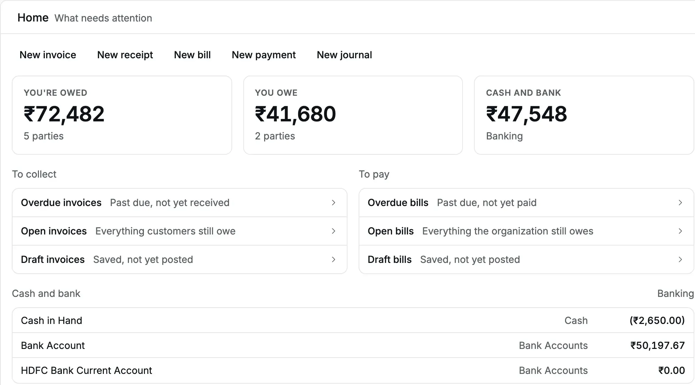
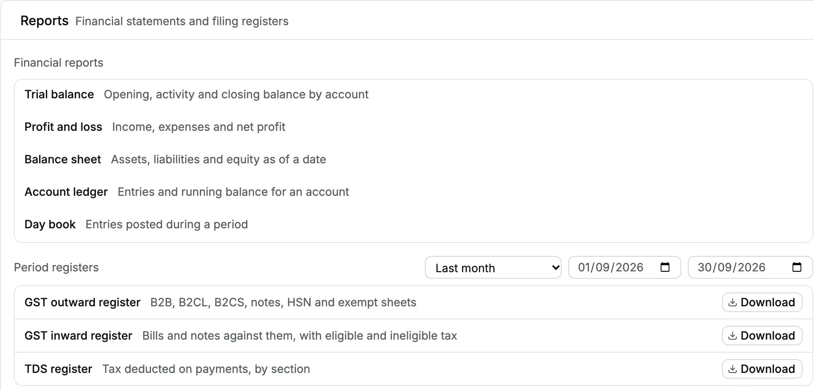

Accly Books builds every report from the [posted](/glossary#post) entries in your books: documents you have saved for good, which change the accounts. Nothing is
copied or summarised in advance, so a [receipt](/glossary#receipt) (money you received) that you post now shows in every report
the next time you open it.

This section explains each report: the question it answers, how to choose its dates,
how to read each column, and how to download it.

## Three kinds of report

| Kind               | Reads                                                                                                  | Reports                                                                                                                                                                                                 |
| ------------------ | ------------------------------------------------------------------------------------------------------ | ------------------------------------------------------------------------------------------------------------------------------------------------------------------------------------------------------- |
| Accounting reports | The [journal entry](/glossary#journal-entry) lines behind each posted [document](/glossary#document)   | [Trial balance](/reports/trial-balance), [Profit and loss](/reports/profit-and-loss), [Balance sheet](/reports/balance-sheet), [Account ledger](/reports/account-ledger), [Day book](/reports/day-book) |
| Party report       | Each [party's](/glossary#party) statement lines                                                        | [Party ledger](/reports/party-ledger)                                                                                                                                                                   |
| Filing registers   | Posted [invoices](/glossary#invoice), [bills](/glossary#bill), notes and [payments](/glossary#payment) | [GST](/glossary#gst) outward register, GST inward register, [TDS](/glossary#tds) (tax deducted at source) register                                                                                      |

The accounting reports always agree with each other. The [trial balance](/glossary#trial-balance), the [profit and
loss](/glossary#profit-and-loss) and the [balance sheet](/glossary#balance-sheet) read the same lines, so when you post a document, all
three change together.

## Home

**Home** is the first page after you sign in. It shows what needs attention today.

<Frame caption="Home for Cedar Components: what customers owe, what the business owes, and the money in hand.">
  
</Frame>

| Part of Home                                                 | What it shows                                                                                                                                                                      |
| ------------------------------------------------------------ | ---------------------------------------------------------------------------------------------------------------------------------------------------------------------------------- |
| New invoice, New receipt, New bill, New payment, New journal | Shortcuts to the forms you are allowed to use                                                                                                                                      |
| **You're owed**                                              | The total of every party balance that is Dr ([debit](/glossary#debit-credit): the party owes you), in whole rupees, and the number of those parties                                |
| **You owe**                                                  | The total of every party balance that is Cr (credit: you owe the party, or you hold its [advance](/glossary#advance), money paid before the sale), and the number of those parties |
| **Cash and bank**                                            | The total in all cash and bank accounts, with a link to **Banking**                                                                                                                |
| **To collect**                                               | Links to overdue, open and [draft](/glossary#draft) (saved, not yet posted) invoices                                                                                               |
| **To pay**                                                   | Links to overdue, open and draft bills                                                                                                                                             |
| **Cash and bank** list                                       | Each cash and bank account with its balance. An archived account still shows while it holds money.                                                                                 |

Home nets each party's position. If Northstar Machinery owes ₹18,526.00 on an invoice
and has paid an advance of ₹5,000.00, Home counts Northstar once, as ₹13,526.00 under
**You're owed**.

:::note
The Home figures include every posted document, also those dated after today. The
balance sheet stops at the date you choose. If you post a document with a future date,
for example a post-dated cheque, Home and the balance sheet for today show different
figures until that date.
:::

## The Reports hub

Open **Reports** in the sidebar. The hub lists the reports your role can open.

<Frame caption="The Reports hub: financial reports at the top, filing registers below with their period.">
  
</Frame>

**Financial reports** opens each accounting report on its own page. The
[party ledger](/reports/party-ledger), a [ledger](/glossary#ledger) (running list of entries) for one customer or vendor, is not in this list. Open it from the party's
page: **Parties**, the party name, then the **Ledger** tab.

**Period registers** builds the GST and TDS workbooks for one period:

| Register             | Contents                                                                                                                                                                                                                       |
| -------------------- | ------------------------------------------------------------------------------------------------------------------------------------------------------------------------------------------------------------------------------ |
| GST outward register | B2B (sales to GST-registered buyers), B2CL and B2CS (large and small sales to consumers), notes, [HSN](/glossary#hsn-sac) (product code) and [exempt](/glossary#supply-class) sheets, for your [GSTR-1](/glossary#gstr) return |
| GST inward register  | Bills and the notes against them, with eligible and ineligible tax ([input tax credit](/glossary#itc), the GST you may deduct)                                                                                                 |
| TDS register         | Tax deducted on payments, by [section](/glossary#tds-section) of the Income-tax Act                                                                                                                                            |

The period starts on **Last month**, because you file returns for the month just
closed. Choose another period, or type the dates, then click **Download** next to the
register. The button reads **Building…** until the file is ready.

## Choose the dates

Every report with a period has the same controls:

- A period list: **Today**, **This month**, **Last month**, **This year (2026–27)** and
  **Last year (2025–26)**. A year is your [financial year](/glossary#financial-year) (FY), April to March.
- Two date boxes, **From** and **To**. Both dates are included in the report.
- When the dates match no preset, the list shows **Custom**.

If **To** is before **From**, the report shows "The end date must not be before the
start date." and nothing loads until you correct a date.

The dates stay in the page address. Bookmark the page or send its link to a colleague
in the same organization, and the report opens with the same period.

## Downloads

| Report                         | XLSX                      | PDF                    |
| ------------------------------ | ------------------------- | ---------------------- |
| Trial balance                  | Yes                       | Yes                    |
| Profit and loss                | Yes                       | Yes                    |
| Balance sheet                  | Yes                       | Yes                    |
| Account ledger                 | Yes, up to 1,00,000 lines | Yes, up to 5,000 lines |
| Day book                       | Yes, up to 1,00,000 lines | Yes, up to 5,000 lines |
| Party ledger (party statement) | Yes, up to 1,00,000 lines | Yes, up to 5,000 lines |

**Download XLSX** saves a workbook. Its first four rows hold your legal name, the report
title, the period and "Generated … · period not closed". Amounts are numbers, so you
can add and filter them in Excel.

**Download PDF** opens the PDF in a new browser tab. Use the viewer's download or print
button to keep it. Each page repeats the header, and the footer numbers the pages.

When a period holds more lines than the limit, the download stops with "This report
exceeds 1,00,000 lines; choose a shorter period." (XLSX) or "This report exceeds 5,000
lines; choose a shorter period." (PDF). Nothing is cut off. Choose a shorter period, for
example one month, and download each part.

## "Period not closed"

Every report header says **Period not closed**. Accly Books does not close a financial
year with a closing entry. Instead, the balance sheet works out the profit of the
current year and of earlier years each time you open it. A [lock](/glossary#lock) ([Locks](/accounting/locks))
stops new postings in a period, but the header still says "Period not closed".

## Who can see reports

| Role                 | Accounting reports | Party ledger | Filing registers | XLSX downloads |
| -------------------- | ------------------ | ------------ | ---------------- | -------------- |
| Owner                | Yes                | Yes          | Yes              | Yes            |
| Accountant           | Yes                | Yes          | Yes              | Yes            |
| Chartered Accountant | Yes                | Yes          | Yes              | Yes            |
| Operator             | No                 | No           | No               | No             |

An operator does not see **Reports** in the sidebar, the **Ledger** tab on a party, or
the three figures on Home. A Chartered Accountant (CA) is your outside auditor or tax adviser. See [roles](/glossary#roles) and [Roles and access](/getting-started/roles-and-access).

## Large books

The interactive reports stay quick on large books. Ridgeview Academy holds about
1,05,000 entries, and the trial balance, profit and loss and balance sheet for the
whole year each answer in under a second. The account ledger and the day book load
the first lines at once and add more as you scroll. The footer counts what has loaded, for
example "100 shown", and says "All … shown" when the last line is on screen.

Downloads of long periods take longer. A year of Ridgeview's HDFC bank account, about
35,000 lines, took from 3 to 19 seconds as XLSX. A year of Ridgeview's day book has
more than 1,00,000 lines, so it is too large to download; download it a month at a
time.

## Reports in this section

<CardGroup>
  <Card title="Trial balance" href="/reports/trial-balance">
    Opening, debits, credits and closing for every account.
  </Card>
  <Card title="Profit and loss" href="/reports/profit-and-loss">
    Income, expenses and net profit for a period.
  </Card>
  <Card title="Balance sheet" href="/reports/balance-sheet">
    Assets, liabilities and equity on a date.
  </Card>
  <Card title="Account ledger" href="/reports/account-ledger">
    Every entry in one account, with a running balance.
  </Card>
  <Card title="Day book" href="/reports/day-book">
    Every entry posted in a period, with all its lines.
  </Card>
  <Card title="Party ledger" href="/reports/party-ledger">
    One customer's or vendor's statement of account.
  </Card>
</CardGroup>
