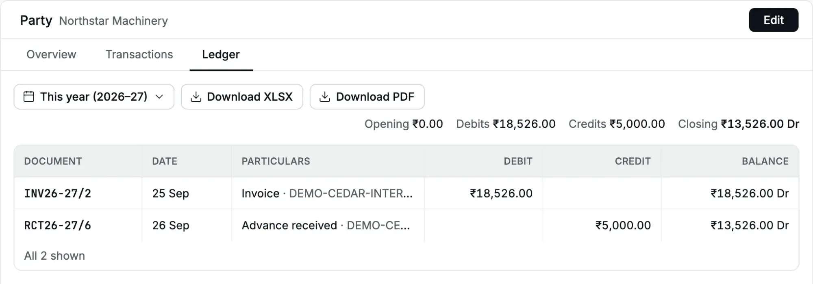

The party [ledger](/glossary#ledger) is the statement of account for one [party](/glossary#party), a customer or vendor. It lists every [invoice](/glossary#invoice),
[bill](/glossary#bill), [receipt](/glossary#receipt), [payment](/glossary#payment), note and cancellation for the party, with a running balance.
Send it to a customer to confirm what they owe, or to a vendor to agree your
balances.

**Question it answers:** what does this party owe us, or what do we owe them, and how
did the balance build up?

**Who can open it:** Owner, Accountant and Chartered Accountant. An operator (the desk role, see [roles](/glossary#roles)) does not
see the **Ledger** tab.

## Open a party ledger

<Steps>
  <Step title="Find the party">
    Click **Parties** and click the party's name. The **Balance** column on the list already shows
    each party's closing balance.
  </Step>
  <Step title="Open the Ledger tab">Click **Ledger**. It opens for **This year**.</Step>
  <Step title="Choose the period">
    Click the period button and choose a preset, **All time**, or **Custom range…**.
  </Step>
</Steps>

<Frame caption="Northstar Machinery owes ₹13,526.00 after an invoice and an advance.">
  
</Frame>

## Read the ledger

The figures above the table sum up the period:

| Figure      | Meaning                                                                                                         |
| ----------- | --------------------------------------------------------------------------------------------------------------- |
| **Opening** | The balance before the start date. It shows only when the period has a start date; **All time** has no opening. |
| **Debits**  | Everything that increased what the party owes you                                                               |
| **Credits** | Everything that reduced it, or increased what you owe the party                                                 |
| **Closing** | The balance at the end of the period                                                                            |

| Column                | Meaning                                                                                                                                                                                                             |
| --------------------- | ------------------------------------------------------------------------------------------------------------------------------------------------------------------------------------------------------------------- |
| **Document**          | The document number. Click the row to open the document.                                                                                                                                                            |
| **Date**              | The document date                                                                                                                                                                                                   |
| **Particulars**       | The kind of document, for example Invoice, Receipt, Credit Note, Bill or Payment, followed by its reference. A receipt or payment kept as an advance reads "Advance received". A cancellation reads "Cancellation". |
| **Debit**, **Credit** | The amount                                                                                                                                                                                                          |
| **Balance**           | The running balance                                                                                                                                                                                                 |

**Dr** ([debit](/glossary#debit-credit)) means the party owes you. **Cr** means you owe the party, or you hold the
party's [advance](/glossary#advance), money paid before the sale.

For a Bill with TDS, **Particulars** shows the bill's gross, the TDS deducted and
the net payable, for example "Bill ₹10,000.00 − TDS ₹100.00 = ₹9,900.00 to pay".
The Credit column and running balance use the net payable: gross minus TDS. A cancellation shows the reversed gross and TDS alongside its
reversed net balance.

In the example, Cedar Components invoices Northstar Machinery ₹18,526.00 on
25 Sep 2026 (an interstate supply with [IGST](/glossary#cgst-sgst-igst), the GST on sales between states). Northstar had paid ₹5,000.00 in advance on
26 Sep 2026. The ledger nets the two: Northstar owes ₹13,526.00 Dr.

### One balance for both sides

A party that is both your customer and your vendor has one ledger. Invoices and
payments to the party are debits; bills and receipts from the party are credits. The
closing balance is the net amount.

### Advances and allocations

An advance shows as a credit when you receive it. When you later apply the advance (an [allocation](/glossary#allocation)) to
an invoice, the ledger does not change: the party's net balance stays the same. The
allocation shows in the [account ledger](/reports/account-ledger) and the
[day book](/reports/day-book), where it moves the amount from Customer Advances to
Accounts Receivable.

### Cancelled documents

A cancelled document stays in the ledger on its date. A second row, "Cancellation",
reverses it (a [reversal](/glossary#reversal)) on that same original date.

## How it agrees with the books

The party ledger reads its own statement lines, not the journal. The figures still
agree:

- A party's closing balance equals the total of that party's lines in four accounts:
  **Accounts Receivable**, **Customer Advances**, **Accounts Payable** and **Supplier
  Advances**, the [control accounts](/glossary#control-account) that sum all parties. Check it in the [account ledger](/reports/account-ledger), where each
  line names its party.
- The total of all party balances equals Accounts Receivable plus Supplier Advances,
  less Customer Advances and Accounts Payable, in the
  [trial balance](/reports/trial-balance).
- **You're owed** and **You owe** on Home add up the Dr and the Cr party balances.

On 4 Oct 2026 Cedar Components' parties net to ₹30,802.00 Dr. The trial balance gives
the same figure: Accounts Receivable ₹73,302.00 Dr plus Supplier Advances ₹2,500.00 Dr,
less Customer Advances ₹2,000.00 Cr and Accounts Payable ₹43,000.00 Cr. On Home,
**You're owed** ₹72,482 less **You owe** ₹41,680 gives the same ₹30,802.

## Download a statement

- **Download PDF** opens the party statement in a new tab. It shows your legal name and
  [GSTIN](/glossary#gstin) (GST number), the period, and the party's name, address and state code, then every line with
  its date, document, particulars, debit, credit and balance. Send it to the party. It
  holds up to 5,000 lines; above that it shows "This report exceeds 5,000 lines; choose
  a shorter period." Choose a shorter period, or download the XLSX, which holds up to
  1,00,000 lines.
- **Download XLSX** saves the same statement as a workbook, with the party's name,
  GSTIN, address and state code at the top. For a bill with TDS, the column **Bill
  amount before TDS** holds the gross. It needs the export grant.

For **All time**, the statement runs up to today and its Opening row shows ₹0.00. The
screen hides the Opening figure for **All time**.

## Common questions

**The ledger says "No ledger entries".** Nothing was posted for this party in the
period. [Draft](/glossary#draft) invoices and bills do not appear until you post them.

**The closing balance differs from the invoice's outstanding.** The ledger nets
advances and [credit notes](/glossary#credit-note) that are not yet applied to the invoice. Use
[Apply credit](/sales/apply-credit) to match them.

## Related pages

- [Parties](/setup/parties)
- [Receipts](/sales/receipts) and [Payments](/purchases/payments)
- [Apply credit](/sales/apply-credit)
