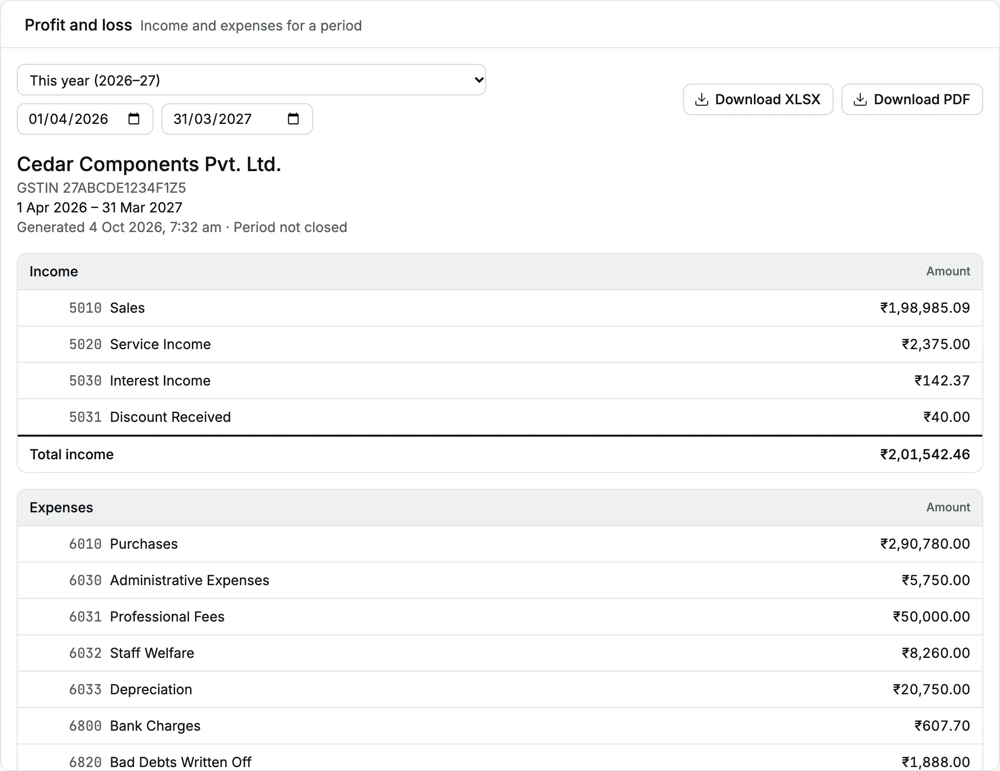

The [profit and loss](/glossary#profit-and-loss) (P&L) statement shows what the business earned and spent in a period,
and the difference: the net profit or the net loss.

**Question it answers:** did the business make money in this period, and where did it
come from and go?

**Who can open it:** Owner, Accountant and Chartered Accountant.

## Open the profit and loss

<Steps>
  <Step title="Open the report">
    Click **Reports**, then **Profit and loss**. The report opens for **This year**, the [financial
    year](/glossary#financial-year) from 1 April to 31 March.
  </Step>
  <Step title="Choose the period">
    Choose **This month**, **Last month**, **This year** or **Last year**, or type the **From** and
    **To** dates. Both dates are included.
  </Step>
  <Step title="Read the result">
    Read **Total income**, **Total expenses** and the last line, **Net profit** or **Net loss**.
  </Step>
</Steps>

<Frame caption="Profit and loss of Cedar Components for the financial year 2026–27, generated on 4 Oct 2026.">
  
</Frame>

## Read the statement

The header names your organization, its [GSTIN](/glossary#gstin) (GST registration number), the period, the time the report was
generated and **Period not closed**.

| Section                       | What it holds                                                         | How the amount is worked out                                               |
| ----------------------------- | --------------------------------------------------------------------- | -------------------------------------------------------------------------- |
| **Income**                    | Every income [account](/glossary#account) with movement in the period | Credits less debits ([debit and credit](/glossary#debit-credit))           |
| **Expenses**                  | Every expense account with movement in the period                     | Debits less credits                                                        |
| **Net profit** / **Net loss** | Total income less total expenses                                      | Shown as **Net loss** with the figure in brackets when expenses are larger |

Accounts appear under the [groups](/glossary#group-account) (headings that hold accounts) of your [chart of accounts](/setup/chart-of-accounts).
A group shows the total of the accounts under it. Click the arrow next to a group to
collapse or expand it. Accounts and groups with no movement in the period do not
appear.

An amount in brackets is negative. A net loss shows in brackets, and so does an
expense account whose credits are larger than its debits in the period.

For Cedar Components from 1 Apr 2026 to 4 Oct 2026:

| Line                    | Amount             |
| ----------------------- | ------------------ |
| Sales                   | ₹1,98,985.09       |
| Service Income          | ₹2,375.00          |
| Interest Income         | ₹142.37            |
| Discount Received       | ₹40.00             |
| **Total income**        | **₹2,01,542.46**   |
| Purchases               | ₹2,90,780.00       |
| Administrative Expenses | ₹5,750.00          |
| Professional Fees       | ₹50,000.00         |
| Staff Welfare           | ₹8,260.00          |
| Depreciation            | ₹20,750.00         |
| Bank Charges            | ₹607.70            |
| Bad Debts Written Off   | ₹1,888.00          |
| Round Off               | ₹0.05              |
| **Total expenses**      | **₹3,78,035.75**   |
| **Net loss**            | **(₹1,76,493.29)** |

Expenses are larger than income, so the last line reads **Net loss**. Purchases of
stock still on the shelf count as expenses here, because Accly Books does not track
stock or value closing stock (the goods unsold at the end of the period). **Bad Debts Written Off** is a [write-off](/glossary#write-off): an invoice you gave up collecting.

The same (₹1,76,493.29) appears on the [balance sheet](/reports/balance-sheet) of that day
as **Profit and loss, current year**.

## What the statement includes

- Only [posted](/glossary#post) documents. [Draft](/glossary#draft) invoices and bills (saved, not yet posted) are not in the books.
- Sales and purchases at their taxable value. [Output GST](/glossary#output-tax) (tax you charge) and eligible [input GST](/glossary#itc) (tax you may reclaim) sit in
  the tax accounts on the balance sheet, not in the profit and loss.
- A sales return ([credit note](/glossary#credit-note)) as a debit to Sales, so it reduces income.
- A cancelled document in two places: the original on its own date and the [reversal](/glossary#reversal) (the undoing entry) on
  the date of cancellation. If you cancel in October a receipt dated in September, the
  September figure keeps the income and October shows it as negative income.

:::note
The statement is titled "Profit and loss". It follows your chart of accounts and does
not claim the Schedule III format of the Companies Act (the legal layout for company accounts). Your CA (Chartered Accountant) can map the XLSX to
Schedule III for filing.
:::

## Drill down

Click any account name. The [account ledger](/reports/account-ledger) opens for that
account and the same period. Group names are not links; expand the group and click an
account inside it.

## Download

- **Download XLSX** saves the statement with income, expense and total rows, groups
  indented, and a last row **Net profit / loss**.
- **Download PDF** opens a PDF with the same header and lines.

## Common questions

**The statement says "No income or expense activity in this period."** No posted
document in the period touches an income or expense account. Check the dates.

**Income looks negative for a month.** A large cancellation in that month reverses
income posted in an earlier month. Open the [day book](/reports/day-book) for the
month and filter by document type to find the reversals.

## Related pages

- [Balance sheet](/reports/balance-sheet)
- [Trial balance](/reports/trial-balance)
- [Credit notes](/sales/credit-notes)
