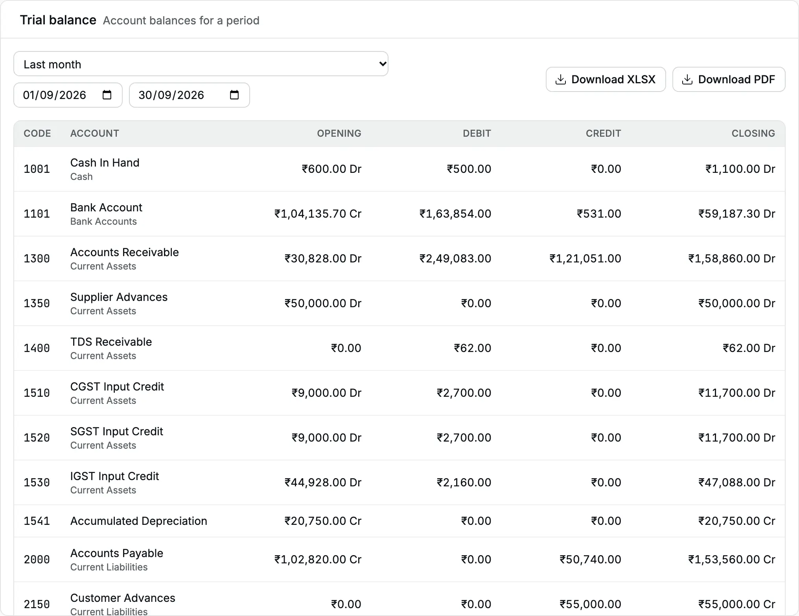
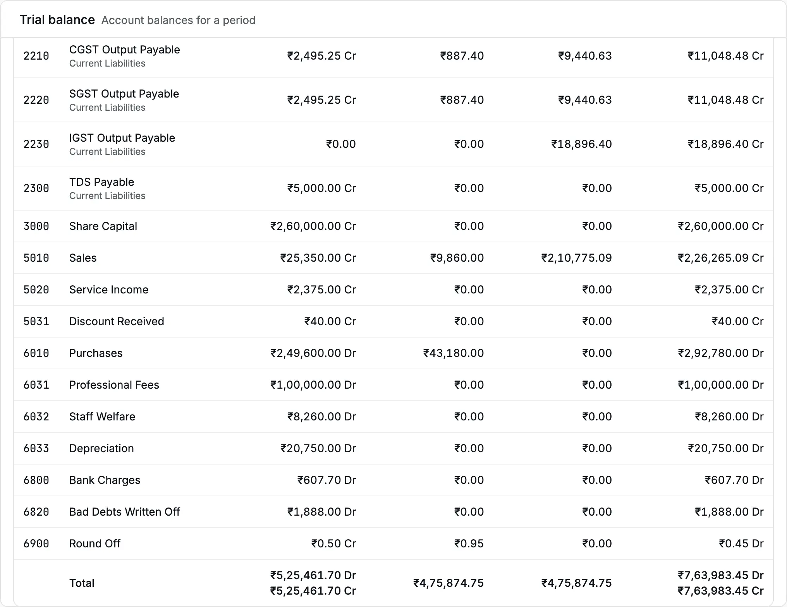
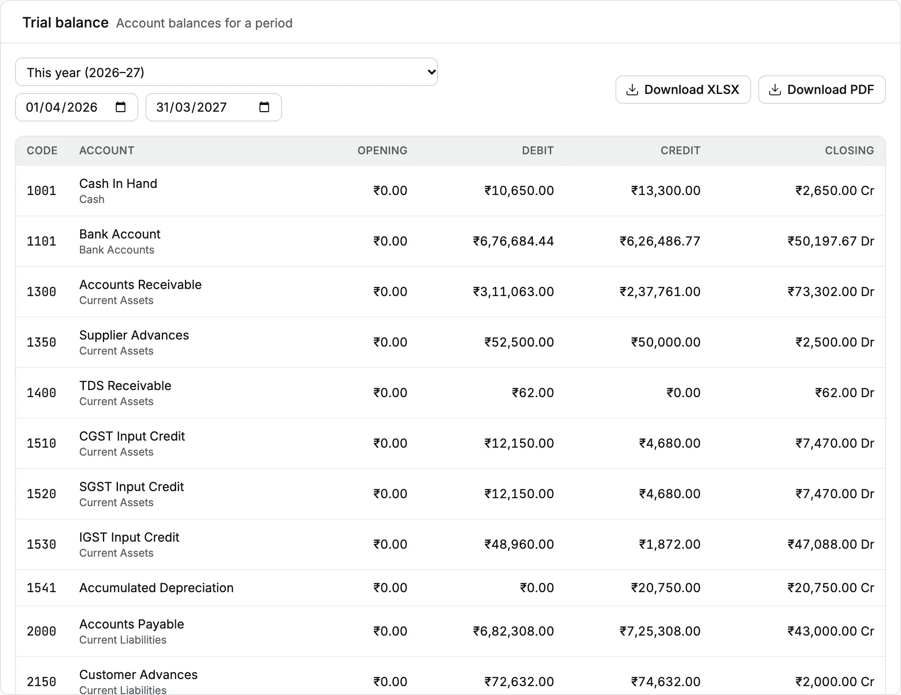
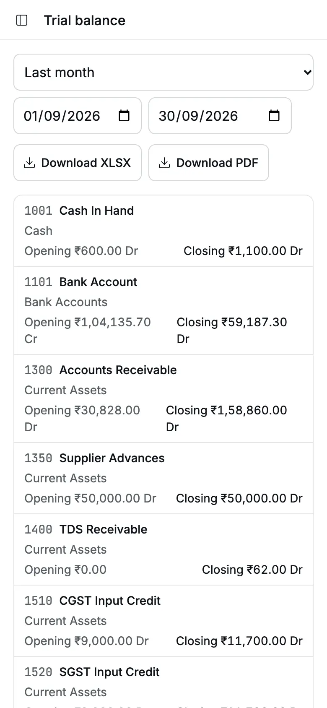

The [trial balance](/glossary#trial-balance) lists every [account](/glossary#account) that has a balance or a movement in the period.
For each account it shows the opening balance, the [debits and credits](/glossary#debit-credit) (the two equal sides of every entry) in the period,
and the closing balance. Debits always equal credits, so the trial balance is the
first report to open when you close a month or hand the books to your CA (Chartered Accountant).

**Question it answers:** do the books balance, and what is the balance of each account?

**Who can open it:** Owner, Accountant and Chartered Accountant. **Download XLSX**
needs the export grant, which these three roles hold.

## Open the trial balance

<Steps>
  <Step title="Open the report">
    Click **Reports**, then **Trial balance**. The report opens for **This year**, your [financial
    year](/glossary#financial-year): 1 April to 31 March, or the twelve months from the start month
    your organization chose.
  </Step>
  <Step title="Choose the period">
    Choose a preset from the period list, or type the **From** and **To** dates. For a month-end
    review of September, choose **Last month** in October, or type 1 Sep 2026 and 30 Sep 2026.
  </Step>
  <Step title="Read the totals">
    Scroll to the **Total** row. Opening, period and closing totals each balance.
  </Step>
</Steps>

<Frame caption="Trial balance of Cedar Components for September 2026.">
  
</Frame>

## Read each column

| Column      | Meaning                                                                                                                                                                                                                     |
| ----------- | --------------------------------------------------------------------------------------------------------------------------------------------------------------------------------------------------------------------------- |
| **Code**    | The account code from the [chart of accounts](/glossary#chart-of-accounts), the list of all your accounts. Rows sort by code.                                                                                               |
| **Account** | The account name. The smaller line below it names its [group](/glossary#group-account), a heading that holds accounts, for example "Current Assets". "· Inactive" follows an archived account.                              |
| **Opening** | The balance before the **From** date: every line dated earlier, the [Opening Balance](/glossary#opening-balance) (balances brought in from your old books) included. Dr when debits are larger, Cr when credits are larger. |
| **Debit**   | The total of debits dated inside the period.                                                                                                                                                                                |
| **Credit**  | The total of credits dated inside the period.                                                                                                                                                                               |
| **Closing** | Opening plus debits minus credits, shown Dr or Cr.                                                                                                                                                                          |

Only posting accounts (leaf accounts that take entries) appear, never groups. An account with no opening balance and no
movement in the period does not appear.

In the September example, **Accounts Receivable** (the [receivable](/glossary#receivable) control account: what customers owe) opens at ₹30,828.00 Dr (the invoice
of 19 Aug to Kaveri Engineering Works). In September Cedar Components invoices
₹2,49,083.00 and collects or credits ₹1,21,051.00, so the closing balance is
₹30,828.00 + ₹2,49,083.00 − ₹1,21,051.00 = ₹1,58,860.00 Dr.

**Bank Account** opens September at ₹1,04,135.70 Cr: on 1 Sep the books show the bank
overdrawn. A balance on the unusual side keeps its Dr or Cr label, so check such a
line first when you review a month.

## The Total row

<Frame caption="The Total row: the opening, period and closing totals each balance.">
  
</Frame>

The **Total** row shows two figures under **Opening** and **Closing**: the sum of all
Dr balances and the sum of all Cr balances. Under **Debit** and **Credit** it shows the
total movement in the period.

| Total   | September 2026                             |
| ------- | ------------------------------------------ |
| Opening | ₹5,25,461.70 Dr and ₹5,25,461.70 Cr        |
| Period  | ₹4,75,874.75 debit and ₹4,75,874.75 credit |
| Closing | ₹7,63,983.45 Dr and ₹7,63,983.45 Cr        |

Every posted document balances, so these pairs are always equal. Accly Books never
shows a "difference" row. If the totals ever disagreed, the report would not load and
would show "Could not load trial balance". Tell your administrator at once, because it
means a data error.

## Opening balances and the financial year

The opening is the running total of every earlier line. It does not restart when
a new financial year begins. Income and expense accounts therefore carry an opening into a new financial
year. For example, the trial balance for 1 Sep to 30 Sep shows **Sales** with an
opening of ₹25,350.00 Cr, the sales from 1 April to 31 August.

When you open the trial balance for **This year** and your Opening Balance is dated
inside the year, the Opening column shows ₹0.00 and the Opening Balance appears in the
Debit and Credit columns. For example, an opening of Share Capital ₹2,60,000.00
dated inside the selected financial year appears as a credit in the period. To see
it as an opening, start the period after the Opening Balance date.

<Frame caption="The trial balance for a financial year containing the Opening Balance date.">
  
</Frame>

## Drill down to the entries

Click an account name. The [account ledger](/reports/account-ledger), the [ledger](/glossary#ledger) of one account, opens for the same
account and the same period. Its closing balance equals the trial balance's
**Closing** for that account. From the ledger, click a document number to open the
document.

## Cancelled documents

When you cancel a document, Accly Books keeps the original entry and posts a
[reversal](/glossary#reversal), an equal and opposite entry, on that same document date.
Both entries appear in the original month's trial balance and cancel out, even if
you cancel later. A locked original date blocks cancellation unless the applicable
lock is reopened or a books-lock exception applies.

## On a phone

On a narrow screen each account is a card with its code, name, group, opening and
closing balance. The debit and credit columns are not shown. Use a computer or the
download when you need them.

<Frame caption="The trial balance on a phone shows opening and closing balances.">
  
</Frame>

## Download

- **Download XLSX** saves a file named like
  `trial-balance-2026-04-01-to-2026-06-30.xlsx`. It has separate columns for
  Opening Dr, Opening Cr, Debit, Credit, Closing Dr and Closing Cr, a **Group** column,
  and a Total row.
- **Download PDF** opens the PDF in a new tab. Each line shows the account and its
  group, then the same five amounts as the screen.

Both carry your legal name, GSTIN (in the PDF), the period and the time it was
generated.

## Common questions

**An account I expected is missing.** It has no opening balance and no entries in the
period. Widen the period, or open the [account ledger](/reports/account-ledger) for it.

**The trial balance does not show an organization header.** The
screen shows only the table. The PDF and the XLSX carry the full header.

**A document posted today is not in the report.** Check its date. The trial balance
reads the document date, not the day you posted it.

## Related pages

- [Profit and loss](/reports/profit-and-loss) and [Balance sheet](/reports/balance-sheet)
- [Opening balance](/setup/opening-balance)
- [Locks](/accounting/locks)
