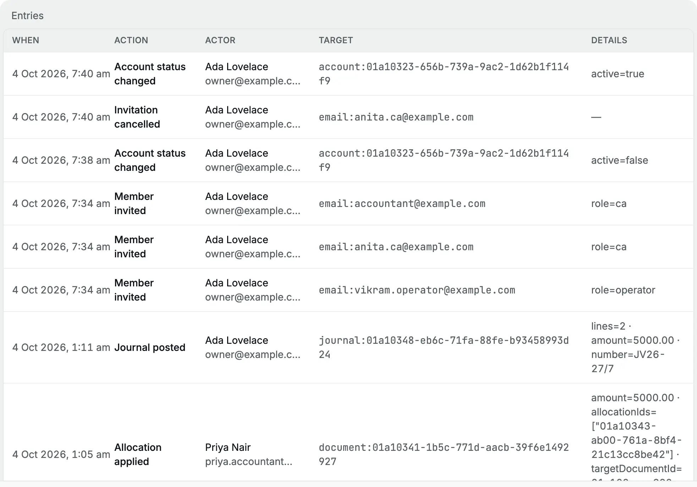
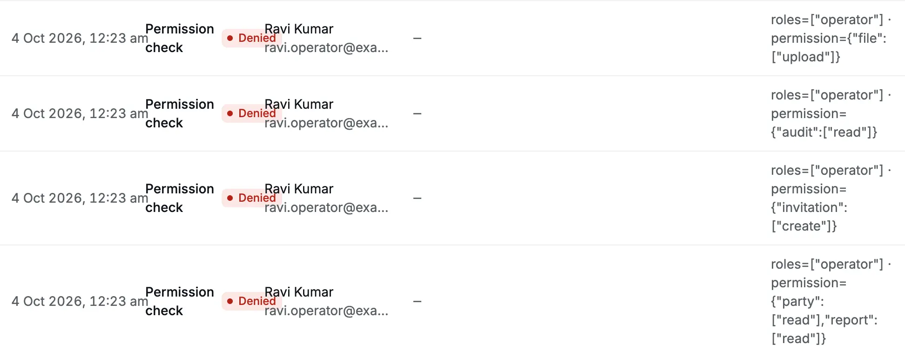

**Settings → Audit** is the organization's [audit log](/glossary#audit-log), its
record of sensitive actions: who [posted](/glossary#post) (made final) or
[cancelled](/glossary#reversal) a [document](/glossary#document) such as an invoice
or receipt, who changed a [lock](/glossary#lock) (a date before which nobody can
post) or a member's [role](/glossary#roles), who
deleted a file, and every request the app refused because the person's role did
not allow it. Use it to answer "who did this, and when?".

- **Who can read it:** **Owner**, **Accountant** and **Chartered Accountant**.
  An operator does not see the **Audit** tab.
- **Nobody can edit or delete entries.** Entries stay even after the person who
  made them is removed from the organization.

The audit log is not the business history. For what a document says, open the
document; for balances, use the [reports](/reports). The log tells you who
acted.

<Frame caption="The audit log, newest entry first.">
  
</Frame>

## What is recorded

| Area                  | Entries (as the **Action** column shows them)                                                                                                                                                                                                                                                                                                                  |
| --------------------- | -------------------------------------------------------------------------------------------------------------------------------------------------------------------------------------------------------------------------------------------------------------------------------------------------------------------------------------------------------------- |
| Documents             | **Invoice posted**, **Receipt posted**, **Bill posted**, **Payment posted**, **Credit note posted**, **Debit note posted**, **Journal posted**, **Opening balance posted**, and the same with **cancelled**. **Invoice amended** and **Bill amended** when a posted invoice or bill is cancelled and reopened as a [draft](/glossary#draft), an unposted copy. |
| Credits               | **Allocation applied**, **Allocation reversed** (an [allocation](/glossary#allocation) sets an advance or credit note against an invoice or bill)                                                                                                                                                                                                              |
| Import                | `import.commit` when a workbook is imported (shown as the code)                                                                                                                                                                                                                                                                                                |
| Locks                 | **Period lock changed**, **Lock exception granted**, **Lock exception revoked** (a [lock exception](/glossary#lock-exception) lets one person post into a locked period for a limited time)                                                                                                                                                                    |
| Settings and accounts | **Settings updated**, **Organization created**, **Account status changed**                                                                                                                                                                                                                                                                                     |
| Members               | **Member invited**, **Invitation cancelled**, **Member role changed**, **Member removed**                                                                                                                                                                                                                                                                      |
| Files                 | **File deleted**; **File opened**, **File uploaded** or **File deleted** with **Denied** when someone tries to reach a file of another organization                                                                                                                                                                                                            |
| Refusals              | **Permission check** with a **Denied** badge, every time the server refuses an action because of the person's role                                                                                                                                                                                                                                             |

## What is not recorded

- Reading or opening pages, reports and documents, and downloads.
- Sign-ins and sign-outs.
- Saving a draft invoice or bill.
- Creating or editing parties, items and accounts (archiving an account is
  recorded).
- Accepting an invitation. The log shows **Member invited**, but not when the
  person joined. Check **Settings → Members** to see who has joined.
- Uploading a file.

## Read an entry

Each row has five columns:

| Column      | What it shows                                                                                                     |
| ----------- | ----------------------------------------------------------------------------------------------------------------- |
| **When**    | Date and time in the organization's time zone, for example "4 Oct 2026, 12:49 am".                                |
| **Action**  | What happened, in words. A **Denied** badge marks a refused request.                                              |
| **Actor**   | The person's name and email. If their account no longer exists, an internal id.                                   |
| **Target**  | The record acted on, as `type:id`, for example `receipt:01a10335-916a-…` or `email:priya.accountant@example.com`. |
| **Details** | The facts saved with the action, as `name=value` pairs.                                                           |

The **Details** column is usually the one to read. For example:

| Action              | Details                                                                                    | Meaning                                                                                                                           |
| ------------------- | ------------------------------------------------------------------------------------------ | --------------------------------------------------------------------------------------------------------------------------------- |
| Receipt posted      | `amount=14632.00 · number=RCT26-27/11 · settlementKind=against · allocatedAmount=14632.00` | Receipt RCT26-27/11 for ₹14,632.00, settled fully against open invoices ([settlement kind](/glossary#settlement-kind) `against`). |
| Payment posted      | `tds=0.00 · amount=531.00 · number=PMT26-27/6 · settlementKind=against`                    | Payment PMT26-27/6 of ₹531.00, no [TDS](/glossary#tds) (tax deducted at source) withheld.                                         |
| Period lock changed | `kind=tax · reason=GSTR-1 for April, May and June 2026 filed… · lockedThrough=2026-06-30`  | The tax period lock moved to 30 Jun 2026, with the reason given.                                                                  |
| Member role changed | `role=accountant`                                                                          | The member's new role.                                                                                                            |

To find the document, search its number from **Details** in the
[command palette](/getting-started/finding-your-way#the-command-palette).

:::note
Member entries name the member by an internal id (`member:01a10333-…`), not by
name. To see who it was, compare the time with the **Member invited** entries
and the member list. After a removal, the id no longer leads to anyone.
:::

### Refused requests

A **Permission check** row with **Denied** means someone asked the server to do
something their role does not allow. **Details** shows their role and what they
tried, for example `roles=["operator"] · permission={"file":["upload"]}`: an
operator tried to upload a file.

<Frame caption="Refused requests from Ravi, an operator: uploading a file, reading the audit log, inviting someone and reading party balances.">
  
</Frame>

The normal screens hide actions a role cannot take, so a refusal usually means
an out-of-date screen after a role change, an old bookmark, or someone trying
the system on purpose. One or two after a role change are normal. Many in a row
are worth a conversation.

## Find an entry

The log lists every entry, newest first, and loads more as you scroll. It has no
filter or search. To find an entry, scroll to the date, or use your browser's
find (**⌘F** or **Ctrl+F**) for a document number or email address on the rows
already loaded.

## Related pages

- [Members and invitations](/administration/members): the member actions recorded here.
- [Files](/administration/files): file deletions.
- [Period locks](/accounting/locks): lock changes and exceptions.
- [Handover](/administration/handover): reviewing the log before a handover.
