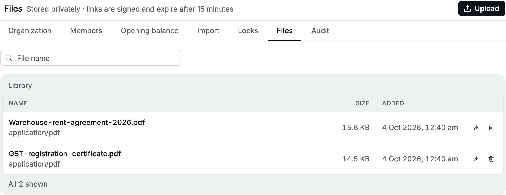
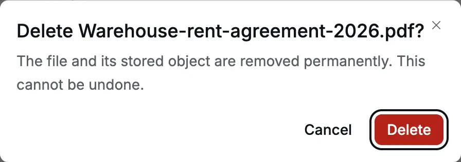

**Settings → Files** is a private library for papers that support the books:
the [GST](/glossary#gst) (Goods and Services Tax) registration certificate, a rent agreement, a loan sanction letter, a
bank statement your CA (Chartered Accountant) asked for. Files belong to one organization and nobody
outside it can open them.

- **Who can use it:** everyone in the organization can see the list and open a
  file. Only an **Owner** can upload or delete.
- **When to use it:** when a paper should stay with the books and be easy for
  your accountant or CA to find.

<Frame caption="The Files library with two documents.">
  
</Frame>

## Upload a file

1. Open **Settings → Files**.
2. Click **Upload** and choose one file from your computer or phone.
3. The button shows **Uploading…** while the file is sent. When it finishes, a
   message says, for example, "Uploaded GST-registration-certificate.pdf", and
   the file appears at the top of the list.

The list shows each file's name, type, uploader's name, size and the date and
time it was added. If the uploader's account has been deleted, it shows
**Former member**. Any file type is accepted. Upload one file at a time.

If the upload fails, the message says why. A file over the size limit set for
your installation shows "File too large. Maximum allowed size is … bytes."

:::tip
Name files before you upload them so the name says what they are, for example
`Warehouse-rent-agreement-2026.pdf`. The list has no description or folder, and
the search box finds files by name only.
:::

## Attach a file to a record

Accly Books cannot attach a file to an [invoice](/glossary#invoice), [bill](/glossary#bill)
(a supplier's invoice), [receipt](/glossary#receipt) or [party](/glossary#party)
(customer or supplier) yet.
Files live only in the library. Until attachments exist, put the document number
in the file name, for example `BILL26-27-6-Shreyas-Caterers.pdf`, so you can
find it with the search box.

## Open a file

Click the download button (the arrow) on the file's row. The file opens in a new
browser tab, or downloads if the browser cannot show it.

### Files are private

Files are never public. When you click download, Accly Books creates a signed
link for that one file that **expires after 15 minutes**. After that the link
stops working, and you click download again to get a new one.

:::warning
While it lasts, a signed link opens the file for anyone who has it. Do not paste
it into a chat, an email or a ticket. To share a file, add the person to the
organization or send the file itself.
:::

## Delete a file

1. Click the bin button on the file's row.
2. Read "The file and its stored object are removed permanently. This cannot be
   undone." and click **Delete**.

<Frame caption="Deleting a file asks for confirmation.">
  
</Frame>

Successful uploads and deletions are written to the
[audit log](/administration/audit-log) (the record of sensitive actions) as
**File uploaded** and **File deleted**. The original file name appears in
**Target** and **Details**. Hover over **Target** to see the stored reference
(`file:<organization id>/<id>/<sanitized name>`). Failed or unfinished uploads
are not recorded as successes.

## When there are no files

A new organization shows "No files yet".

## Related pages

- [Roles and access](/getting-started/roles-and-access): who can upload and delete.
- [Audit log](/administration/audit-log): uploads, deletions and refused attempts.
- [Handover](/administration/handover): which files to collect before a handover.
