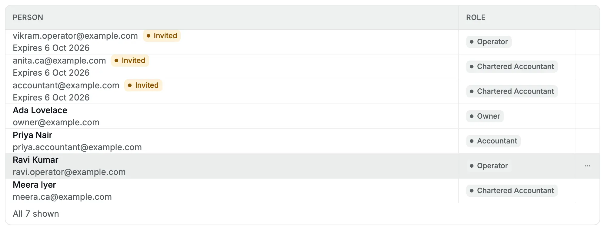
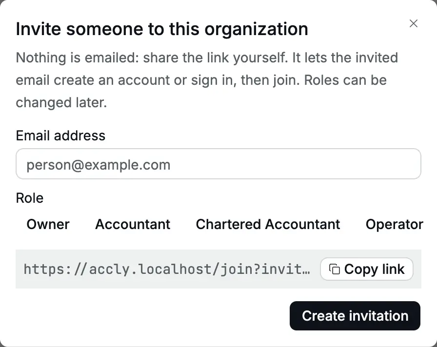
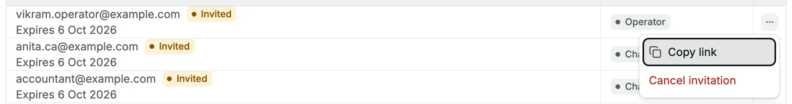
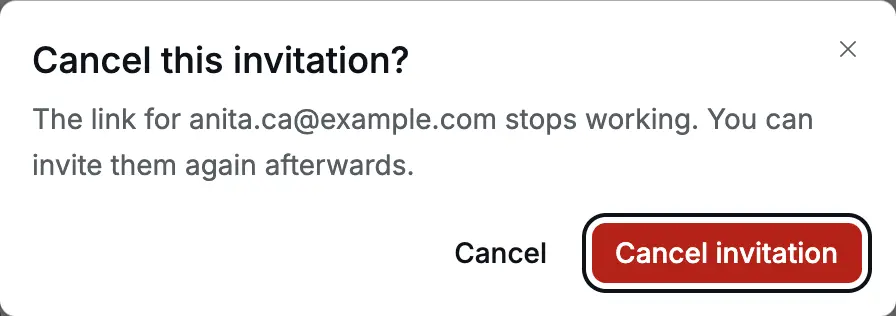
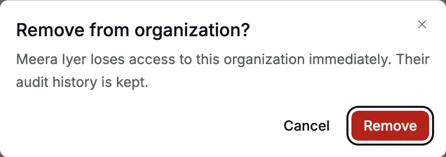
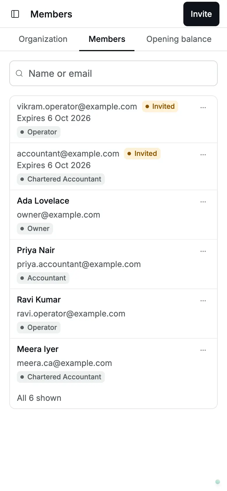

**Settings → Members** lists everyone who can open this organization's books,
with their [role](/glossary#roles), the set of permissions they have. The owner uses it to bring people in, change what they can do,
and take access away.

- **Who can use it:** everyone sees the member list. Only an **Owner** sees the
  **Invite** button, pending invitations and the row actions.
- **When to use it:** when someone joins or leaves, when a person's job
  changes, or when you change your CA (Chartered Accountant).

Read [Roles and access](/getting-started/roles-and-access) first to choose the
right role.

<Frame caption="The member list for an owner: pending invitations, marked Invited, sit above the current members.">
  
</Frame>

## Invite someone

Accly Books does not send email. You create an invitation and send the link
yourself.

<Steps>
<Step title="Open the invitation form">

Go to **Settings → Members** and click **Invite**.

</Step>
<Step title="Enter the email address and role">

Enter the person's **Email address** and choose a **Role**: **Owner**,
**Accountant**, **Chartered Accountant** or **Operator**. For example,
Cedar Components invites priya.accountant@example.com as **Accountant**.

<Frame caption="Inviting Priya as an accountant.">
  
</Frame>

</Step>
<Step title="Create the invitation">

Click **Create invitation**. A message confirms "Invitation created for
priya.accountant@example.com", and the link appears in the form.

<Frame caption="After Create invitation, the link appears in the form, ready to copy.">
  
</Frame>

</Step>
<Step title="Send the link">

Click **Copy link** and send it to that person directly, for example on
WhatsApp or by your own email. They open it, create an account (or sign in)
and click **Join**. See [Getting started](/getting-started#join-from-an-invitation-link)
for their side.

</Step>
</Steps>

The form stays open and clears, so you can invite the next person. The link
from the previous invitation disappears when you create the next one. You can
copy it again from the list.

:::warning[The link is a key]
Anyone who has the link can create the account for that email address. Send it
only to the person invited, and cancel the invitation if the link reaches
someone else.
:::

:::note[Inviting from a phone]
On a narrow phone screen, the **Operator** button can be hidden past the right
edge of the form. Invite operators from a computer or tablet.
:::

### If the invitation cannot be created

| Message                           | Cause                                                                                                                                                                               | What to do                                                                                                                                                                                                                                           |
| --------------------------------- | ----------------------------------------------------------------------------------------------------------------------------------------------------------------------------------- | ---------------------------------------------------------------------------------------------------------------------------------------------------------------------------------------------------------------------------------------------------- |
| "Enter a valid email address"     | The email box is empty or not an email address.                                                                                                                                     | Correct it.                                                                                                                                                                                                                                          |
| "Select a role"                   | No role is chosen.                                                                                                                                                                  | Click a role.                                                                                                                                                                                                                                        |
| "Could not create the invitation" | The email address already has a pending invitation to this organization, or the person is already a member. The same message appears when the connection drops or the server fails. | Check the list first. If the person is already invited, copy the existing link, or cancel that invitation and invite again. To change a member's role, use [Change a role](#change-a-role). If neither applies, check your connection and try again. |

<Frame caption="A second invitation for the same email address fails while the first is pending.">
  
</Frame>

## Pending invitations

Invitations not yet accepted appear at the top of the list with an **Invited**
badge, the role, and the date they expire. An invitation expires **48 hours**
after you create it.

- **Copy the link again:** point at the invitation row, click **⋯**, then
  **Copy link**.
- **Cancel an invitation:** click **⋯**, then **Cancel invitation**, then
  confirm **Cancel invitation**. The link stops working at once. You can invite
  the same email again afterwards.

<Frame caption="The actions for a pending invitation.">
  
</Frame>

<Frame caption="Cancelling an invitation asks for confirmation.">
  
</Frame>

An invitation that expires disappears from the list without notice. If the
person did not join in time, invite them again; the old link already shows
"This invitation is no longer available".

Only owners see pending invitations. Other members see only the people who
have joined.

## Change a role

1. Point at the member's row and click **⋯**.
2. Under **Change role**, click the new role. The current role is greyed out.

The change saves at once with the message "Role updated". There is no
confirmation step, so take care with **Owner**: an owner can do everything,
including removing you.

<Frame caption="The member menu: change role or remove.">
  
</Frame>

The person's next action uses the new role. If they have the app open, their
menus update when they reload the page.

## Remove a member

1. Point at the member's row and click **⋯**.
2. Click **Remove from organization**.
3. Read the confirmation, for example "Meera Iyer loses access to this
   organization immediately. Their audit history is kept.", and click **Remove**.

<Frame caption="Removing a member asks for confirmation.">
  
</Frame>

Removal takes effect on the person's next request. If they still have a page
open, it shows "You do not have access to this organization." Their account
stays, and so do the documents they recorded and their audit entries. They can
come back only through a new invitation.

## The organization always keeps an owner

Accly Books does not let the last owner leave. If you are the only owner and
try to remove yourself or change your own role, the app shows "Could not update
the roster" and nothing changes. To hand the organization over, first invite
the new owner, then change or remove your own membership. See
[Handover](/administration/handover).

## Search the list

Type part of a name or email address in **Name or email**. The search also
finds pending invitations by email.

On a phone, each member is a card, and the **⋯** button is always visible.

<Frame caption="The member list on a phone.">
  
</Frame>

## What is recorded

Each invitation, cancelled invitation, role change and removal is written to
the [audit log](/administration/audit-log), the record of sensitive actions
([glossary](/glossary#audit-log)), with the owner who did it.

## Related pages

- [Roles and access](/getting-started/roles-and-access): what each role can do.
- [Getting started](/getting-started): the invited person's side of the link.
- [Hiring an accountant and an operator](/scenarios/new-team-member): a worked example.
