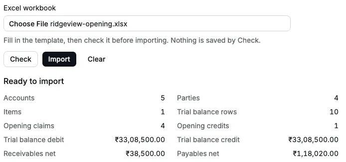
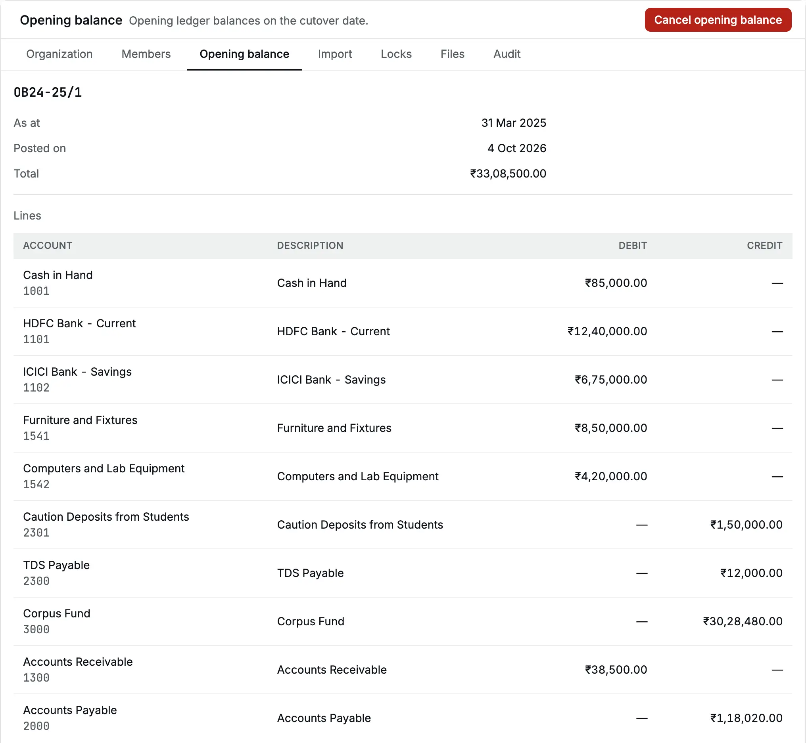
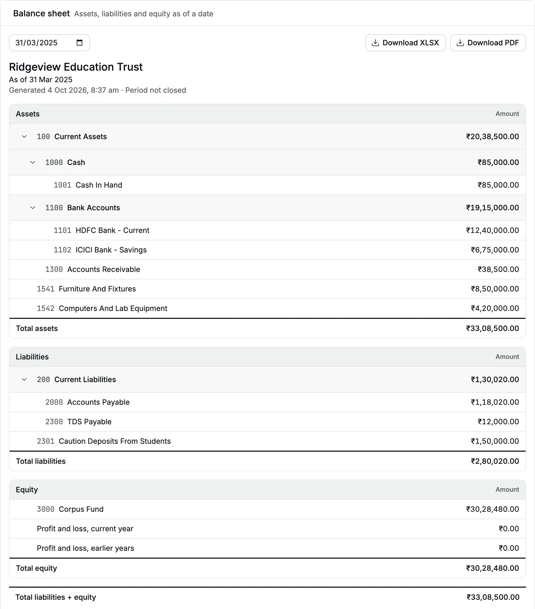
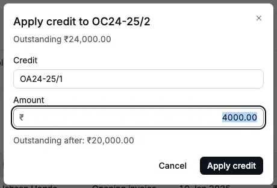
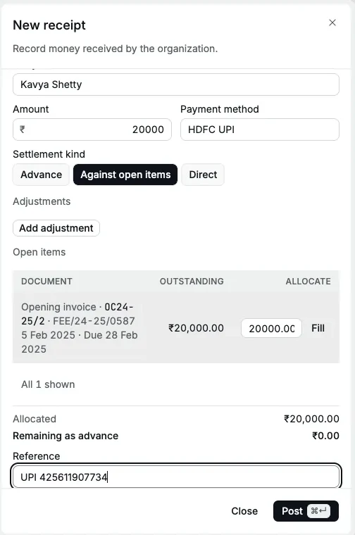
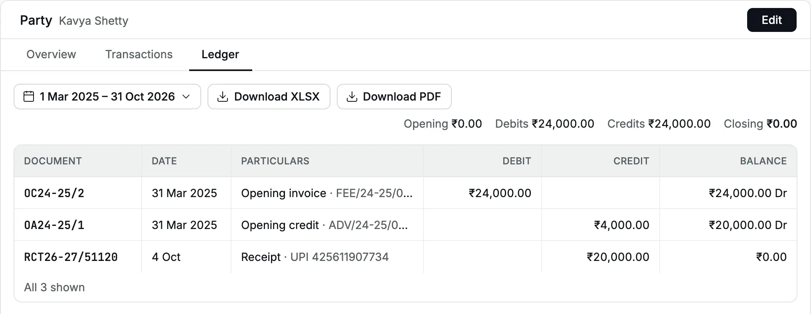
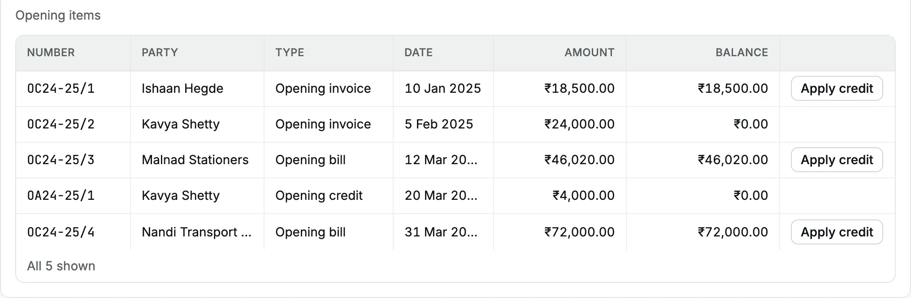

Ridgeview Education Trust runs Ridgeview Academy in Bengaluru. It is not registered
for [GST](/glossary#gst) (India's Goods and Services Tax): school fees are
[exempt](/glossary#supply-class). Until March 2025 its accountant kept the books in
Tally. From 1 April 2025, the start of
[financial year](/glossary#financial-year) 2025–26, the school works in
Accly Books.

This scenario follows the move from start to finish: agree the figures with the CA (Chartered Accountant),
fill one workbook, check it, fix the errors, import, and settle the first
[opening invoice](/glossary#opening-item) (an invoice still unpaid at cutover) with a
[receipt](/glossary#receipt). The same steps work for a business; only the accounts differ.

**Who does it:** the school's **Owner** or **Accountant** imports (see [roles](/glossary#roles)). The **Chartered
Accountant** agrees the trial balance and reviews the result.

## 1. Agree the closing position with the CA

In Tally, the accountant prints the [trial balance](/glossary#trial-balance) (every
account's balance on one date) as at **31 Mar 2025** and the
[outstanding](/glossary#outstanding) (still unpaid) reports for fees
[receivable](/glossary#receivable) and bills [payable](/glossary#payable). The CA agrees these
figures:

| Account                        | Debit             | Credit            |
| ------------------------------ | ----------------- | ----------------- |
| Cash in Hand                   | ₹85,000.00        |                   |
| HDFC Bank - Current            | ₹12,40,000.00     |                   |
| ICICI Bank - Savings           | ₹6,75,000.00      |                   |
| Furniture and Fixtures         | ₹8,50,000.00      |                   |
| Computers and Lab Equipment    | ₹4,20,000.00      |                   |
| Sundry Debtors (fees due)      | ₹38,500.00        |                   |
| Sundry Creditors               |                   | ₹1,18,020.00      |
| Caution Deposits from Students |                   | ₹1,50,000.00      |
| TDS Payable                    |                   | ₹12,000.00        |
| Corpus Fund                    |                   | ₹30,28,480.00     |
| **Total**                      | **₹33,08,500.00** | **₹33,08,500.00** |

Behind Sundry Debtors and Sundry Creditors (Tally's names for what customers owe you and
what you owe vendors), the outstanding reports list:

| Party                    | What                               | Reference      | Date        | Due         | Amount     |
| ------------------------ | ---------------------------------- | -------------- | ----------- | ----------- | ---------- |
| Ishaan Hegde             | Fees due, term 3                   | FEE/24-25/0412 | 10 Jan 2025 | 31 Jan 2025 | ₹18,500.00 |
| Kavya Shetty             | Fees due, term 3                   | FEE/24-25/0587 | 5 Feb 2025  | 28 Feb 2025 | ₹24,000.00 |
| Kavya Shetty             | Transport advance, not yet set off | ADV/24-25/0091 | 20 Mar 2025 | —           | ₹4,000.00  |
| Malnad Stationers        | Bill for notebooks                 | MS/24-25/318   | 12 Mar 2025 | 11 Apr 2025 | ₹46,020.00 |
| Nandi Transport Services | Bill for March bus hire            | NTS-0325       | 31 Mar 2025 | 15 Apr 2025 | ₹72,000.00 |

The receivables agree: ₹18,500 + ₹24,000 − ₹4,000 = **₹38,500**. The payables agree:
₹46,020 + ₹72,000 = **₹1,18,020**. Do this check before you open Excel. A difference
here is a question for the CA, not for the import.

:::tip[A mid-year cutover]
To move on another date, such as 30 September, agree the trial balance on that date.
It then also holds the year's income and expenses so far. Put them in the trial
balance under their income and expense accounts. If your organization has a [GSTIN](/glossary#gstin) (GST registration number), a
taxable income account cannot take an [opening balance](/glossary#opening-balance): carry year-to-date taxable
sales in a separate income account your CA agrees, and file GST returns ([GSTR-1 and GSTR-3B](/glossary#gstr)) for
the months before cutover from your old books.
:::

## 2. Fill the workbook

The accountant opens **Settings → Import**, clicks **Download template**, and fills
each sheet. Tally [ledger](/glossary#ledger) names become Accly Books [accounts](/glossary#account):

- **Accounts**: five new accounts. Furniture and Fixtures and Computers and Lab
  Equipment under **Assets**, Caution Deposits from Students under **Liabilities**,
  Transport Fees under **Income** with [supply class](/glossary#supply-class) **exempt**, and Electricity Charges under
  **Expenses**.
- **Parties** ([parties](/glossary#party): customers and vendors): the two parents and two vendors. Malnad Stationers has GSTIN
  29AAFFM4417C1ZI, so its state and [PAN](/glossary#pan) (Permanent Account Number) come from it. Nandi Transport Services is
  unregistered, so its row has PAN AQCPN5521K and state code `29`.
- **Items**: **Bus transport - per term** under Transport Fees, ₹9,500, [SAC](/glossary#hsn-sac) 9992 (the GST code for education services), unit
  `term`, no tax code (the account is exempt).
- **Opening**: `2025-03-31`.
- **Trial balance**: the ten rows above. Sundry Debtors becomes `1300` (Accounts
  Receivable) and Sundry Creditors becomes `2000` (Accounts Payable), the
  [control accounts](/glossary#control-account) for customers and vendors. Existing
  accounts are named as they appear in the chart, such as `HDFC Bank - Current`.
- **Opening items**: the five rows above, with Side `Receivable` or `Payable` and Type
  `Claim` or `Credit`.

See the [workbook reference](/setup/import-opening-balances#workbook-reference) for
every column.

## 3. Check, and fix the errors

The accountant chooses the file and clicks **Check**. The first draft has three
row errors:

| Error                                                                   | Cause                                                               | Fix                                          |
| ----------------------------------------------------------------------- | ------------------------------------------------------------------- | -------------------------------------------- |
| Parties · 6 · Name · "A party with this name already exists."           | Varun Shetty is already a party in the school's books               | Delete the row; existing parties need no row |
| Opening items · 3 · Due date · "Enter a due date on or after the date." | Kavya's due date was typed as 28 Jan, before the 5 Feb invoice date | Correct it to `2025-02-28`                   |
| Opening items · 4 · Amount · "Enter a non-negative amount …"            | The advance was typed as `₹4,000`                                   | Type `4000.00`                               |

While opening-item rows have errors, Check holds back control-account mismatch
messages because their totals are incomplete. After fixing those rows and checking
again, it reports that Accounts Receivable is ₹36,500.00 but receivable items net to
₹38,500.00. Correct `1300` to `38500` and Corpus Fund to `3028480`, then Check again.

The accountant saves the workbook, clicks **Clear**, chooses it again and clicks
**Check**. This time it shows **Ready to import**:

<Frame caption="Ready to import: the totals match the CA's figures.">
  
</Frame>

| Summary              | Value         | Agrees with        |
| -------------------- | ------------- | ------------------ |
| Accounts             | 5             | Accounts sheet     |
| Parties              | 4             | Parties sheet      |
| Items                | 1             | Items sheet        |
| Trial balance debit  | ₹33,08,500.00 | CA's trial balance |
| Trial balance credit | ₹33,08,500.00 | CA's trial balance |
| Receivables net      | ₹38,500.00    | Sundry Debtors     |
| Payables net         | ₹1,18,020.00  | Sundry Creditors   |

## 4. Import

The accountant clicks **Import**, reads **Import workbook?**, and clicks **Import
workbook**. The toast says "Workbook imported" and the page shows **Import
complete**.

**Settings → Opening balance** now shows **OB24-25/1**, **As at 31 Mar 2025**, **Total
₹33,08,500.00**, with ten lines and five opening items:

<Frame caption="The posted opening balance and its lines.">
  
</Frame>

| Number    | Party                    | Type            | Amount     |
| --------- | ------------------------ | --------------- | ---------- |
| OC24-25/1 | Ishaan Hegde             | Opening invoice | ₹18,500.00 |
| OC24-25/2 | Kavya Shetty             | Opening invoice | ₹24,000.00 |
| OC24-25/3 | Malnad Stationers        | Opening bill    | ₹46,020.00 |
| OA24-25/1 | Kavya Shetty             | Opening credit  | ₹4,000.00  |
| OC24-25/4 | Nandi Transport Services | Opening bill    | ₹72,000.00 |

The new accounts got codes after the existing ones: Furniture and Fixtures **1541**,
Computers and Lab Equipment **1542**, Caution Deposits from Students **2301**,
Transport Fees **5041**, Electricity Charges **6021**.

## 5. Confirm the balance sheet

Open **Reports → Balance sheet** (the [balance sheet](/glossary#balance-sheet): what you own
and owe on a date) and set the date to **31/03/2025**. It shows total
assets **₹33,08,500.00** and total liabilities plus equity **₹33,08,500.00**:
liabilities ₹2,80,020.00 (payables ₹1,18,020.00, TDS ₹12,000.00, caution deposits
₹1,50,000.00) and Corpus Fund ₹30,28,480.00. The CA ticks it against Tally's balance
sheet.

<Frame caption="The balance sheet as at 31 Mar 2025 matches the CA's figures.">
  
</Frame>

Once the CA agrees, [lock](/glossary#lock) the period up to 31 Mar 2025 in
[Locks](/accounting/locks), so nothing is posted into the old year by mistake.

## 6. Settle an opening invoice

Kavya Shetty's parent pays the balance of term 3 fees by [UPI](/glossary#upi-neft). First,
set her old transport [advance](/glossary#advance) against the invoice (an
[allocation](/glossary#allocation)), then record the payment.

:::note[About the dates in this example]
In a real cutover this payment would arrive in April 2025, a few weeks after
cutover, and you would date the receipt on the day the money came in. The example
receipt below was recorded on 4 Oct 2026, the day these screens were captured, so
the receipt and ledger show that date. Accly Books does not care how long an opening
invoice stays open: the steps are the same whether the parent pays in a week or a
year and a half later.
:::

### Apply the advance

In **Settings → Opening balance**, the accountant clicks **Apply credit** on
**OC24-25/2**, chooses "Opening credit · OA24-25/1 · ADV/24-25/0091", keeps the
amount **4000.00** and clicks **Apply credit**. OC24-25/2 now has Balance
**₹20,000.00**; the credit has ₹0.00.

<Frame caption="The ₹4,000 advance is set against the ₹24,000 opening invoice.">
  
</Frame>

### Record the receipt

<Steps>
  <Step title="Open a new receipt">
    **Sales → Receipts → New**. Choose **Kavya Shetty**, type **20000** and choose **HDFC UPI**.
  </Step>
  <Step title="Allocate to the opening invoice">
    Click **Against open items**. The grid lists "Opening invoice · OC24-25/2 · FEE/24-25/0587" with
    Outstanding **₹20,000.00**. Click **Fill**. **Allocated** is ₹20,000.00 and **Remaining as
    advance** is ₹0.00.
  </Step>
  <Step title="Post">
    Type the UPI reference and click **Post**. The toast says "Receipt RCT26-27/51120 posted".
  </Step>
</Steps>

<Frame caption="The receipt settles the ₹20,000 left on the opening invoice.">
  
</Frame>

The receipt posts this [journal entry](/glossary#journal-entry)
([debit and credit](/glossary#debit-credit) are its two equal sides):

| Account             | Debit      | Credit     |
| ------------------- | ---------- | ---------- |
| HDFC Bank - Current | ₹20,000.00 |            |
| Accounts Receivable |            | ₹20,000.00 |

### Confirm the party balance

Open **Masters → Parties → Kavya Shetty → Ledger** and choose a period from 1 Mar 2025
to the receipt date:

| Document       | Date        | Particulars                      | Debit      | Credit     | Balance       |
| -------------- | ----------- | -------------------------------- | ---------- | ---------- | ------------- |
| OC24-25/2      | 31 Mar 2025 | Opening invoice · FEE/24-25/0587 | ₹24,000.00 |            | ₹24,000.00 Dr |
| OA24-25/1      | 31 Mar 2025 | Opening credit · ADV/24-25/0091  |            | ₹4,000.00  | ₹20,000.00 Dr |
| RCT26-27/51120 | 4 Oct 2026  | Receipt · UPI 425611907734       |            | ₹20,000.00 | ₹0.00         |

<Frame caption="Kavya Shetty's ledger closes at ₹0.00.">
  
</Frame>

Both opening lines carry the cutover date, 31 Mar 2025, not their original dates;
the opening items table keeps the original dates. Applying the credit added no
ledger line: Kavya's balance was already net of the advance. In **Opening items**,
OC24-25/2 and OA24-25/1 both show Balance **₹0.00**.

<Frame caption="Opening items after settlement: Kavya's invoice and credit are at ₹0.00.">
  
</Frame>

## Where the school stands

| Check                              | Result                                                   |
| ---------------------------------- | -------------------------------------------------------- |
| Balance sheet at 31 Mar 2025       | ₹33,08,500.00 on both sides, as agreed with the CA       |
| Receivables left from the old year | Ishaan Hegde, OC24-25/1, ₹18,500.00                      |
| Payables left from the old year    | Malnad Stationers ₹46,020.00, Nandi Transport ₹72,000.00 |
| Kavya Shetty                       | ₹0.00                                                    |

The vendor bills are paid the same way, with a [payment](/purchases/payments) against
open items.

## Related pages

- [Import opening balances](/setup/import-opening-balances): the workbook and every error.
- [Opening balance](/setup/opening-balance): the posted entry, opening items and cancelling.
- [Receipts](/sales/receipts): receive money against open items.
- [Balance sheet](/reports/balance-sheet) and [Party ledger](/reports/party-ledger).
- [School fees](/scenarios/school-fees): the school's daily fee collection.
