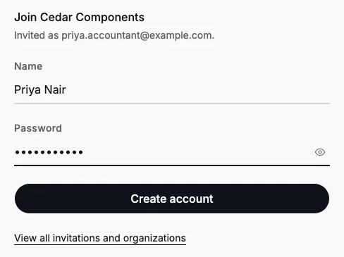
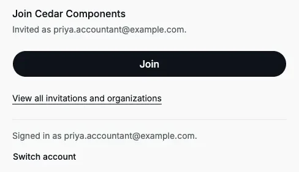
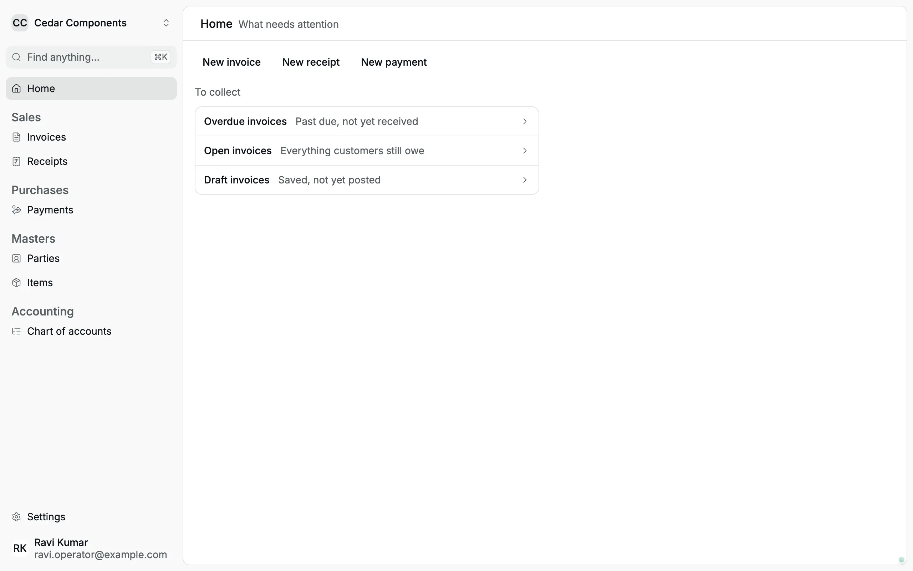
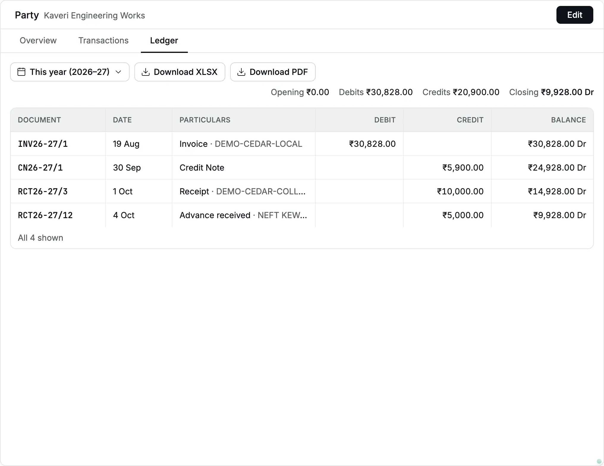
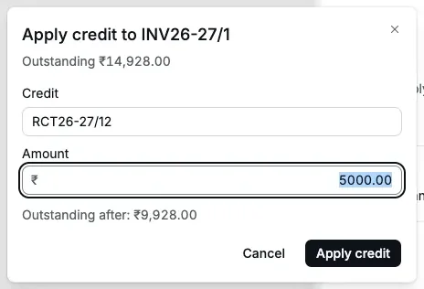
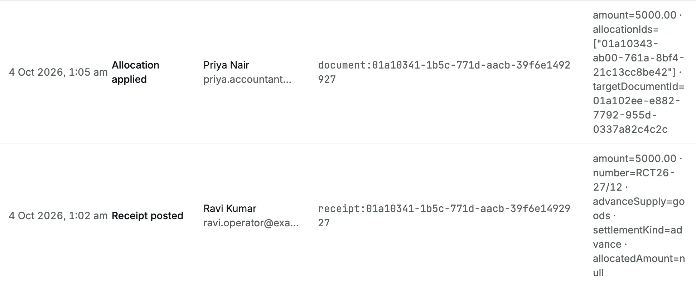

Cedar Components, a maker and trader of brass valves and motors, is growing.
On **4 Oct 2026** the owner, Ada Lovelace, brings in two people:

- **Priya Nair**, an accountant, who will keep the books (the accounting records).
- **Ravi Kumar**, a billing clerk at the front desk, who will record [invoices](/glossary#invoice)
  (bills to customers), [receipts](/glossary#receipt) (money in) and
  [payments](/glossary#payment) (money out) as an **operator**.

This story follows them from the invitation to their first entries. It uses
these pages: [Members and invitations](/administration/members),
[Getting started](/getting-started), [Roles and access](/getting-started/roles-and-access),
[Receipts](/sales/receipts) and [Apply credit](/sales/apply-credit).

## 1. Ada invites Priya and Ravi

Ada opens **Settings → Members** and clicks **Invite** twice:

| Email address                | [Role](/glossary#roles) |
| ---------------------------- | ----------------------- |
| priya.accountant@example.com | Accountant              |
| ravi.operator@example.com    | Operator                |

After each **Create invitation**, she clicks **Copy link** and sends the link to
that person on WhatsApp. Accly Books sends no email. Both invitations show
**Invited** and expire on 6 Oct 2026, 48 hours later.

<Frame caption="Pending invitations sit above the members until each person joins. (A third invitation, for the CA (Chartered Accountant), is also waiting.)">
  
</Frame>

## 2. Priya joins

Priya opens her link on her laptop. The page says "Join Cedar Components.
Invited as priya.accountant@example.com." She has no Accly Books account yet,
so she enters her **Name** and a **Password** of at least 8 characters and
clicks **Create account**.

<Frame caption="Priya creates her account from the invitation.">
  
</Frame>

The page now shows **Join**. She clicks it, and Accly Books opens Cedar
Components' **Home**.

<Frame caption="After the account step, one click on Join completes the invitation.">
  
</Frame>

:::warning
Ravi creates his account but closes the tab before he clicks **Join**. When he
signs in later, the **Join** page lists his existing organizations and asks him
to use an invitation link. His invitation is still valid: he opens the same
link again and clicks **Join**. If he lost it, Ada can copy the pending link
from **Settings → Members** and send it again.
::::

## 3. What each of them sees

Priya's sidebar and **Home** match Ada's: every register (list of one kind of
record), the reports, the
totals for **You're owed**, **You owe** and **Cash and bank**. In **Settings**
she has every tab except **Organization**, and the member list is read-only.

Ravi's sidebar is much shorter: **Invoices**, **Receipts**, **Payments**,
**Parties**, **Items** and **Chart of accounts**. **Home** shows **New
invoice**, **New receipt** and **New payment** and the invoice lists, but no
money totals.

<Frame caption="Ravi's Home: desk work only.">
  
</Frame>

|                                                                                                                                    | Priya (Accountant) | Ravi (Operator)  |
| ---------------------------------------------------------------------------------------------------------------------------------- | ------------------ | ---------------- |
| Record receipts, payments and invoices                                                                                             | Yes                | Yes              |
| Cancel a receipt, payment or invoice                                                                                               | Yes                | No               |
| [Bills](/glossary#bill), [credit notes](/glossary#credit-note), [debit notes](/glossary#debit-note), [journals](/glossary#journal) | Yes                | Cannot open them |
| Create or edit [parties](/glossary#party) (customers and suppliers) and items                                                      | Yes                | Can only view    |
| Apply an [advance](/glossary#advance) to an invoice after [posting](/glossary#post)                                                | Yes                | No               |
| Reports, party [ledgers](/glossary#ledger), bank balances                                                                          | Yes                | Cannot open them |
| [Audit log](/glossary#audit-log)                                                                                                   | Yes                | No               |
| Invite people or change roles                                                                                                      | No                 | No               |

If Ravi opens a bookmark to **Bills** or **Reports**, Accly Books takes him to
**Home** instead.

## 4. Ravi records his first receipt

At 11 am, Kaveri Engineering Works sends ₹5,000 by [NEFT](/glossary#upi-neft) (a bank-to-bank
transfer). Their accounts clerk says it is an advance (money paid before the
goods are invoiced) for the brass valves on their purchase order 118. Ravi
clicks **New receipt** and enters:

| Field                                        | Value                                   |
| -------------------------------------------- | --------------------------------------- |
| Party                                        | Kaveri Engineering Works                |
| Amount                                       | ₹5,000                                  |
| [Payment method](/glossary#payment-method)   | Bank transfer                           |
| [Settlement kind](/glossary#settlement-kind) | **Advance**                             |
| Advance for                                  | Goods                                   |
| Reference                                    | NEFT KEW-0410                           |
| [Narration](/glossary#narration)             | Advance against PO 118 for brass valves |
| Date                                         | 4 Oct 2026                              |

<Frame caption="Ravi's receipt, filled in before posting.">
  
</Frame>

He clicks **Post**. Accly Books shows "Receipt RCT26-27/12 posted". An advance
for goods carries no [GST](/glossary#gst) (Goods and Services Tax), so the books
record only the money and the advance. Dr and Cr are
[debit and credit](/glossary#debit-credit), the two equal sides of every entry:

| Account                                      | Debit     | Credit    |
| -------------------------------------------- | --------- | --------- |
| Bank Account                                 | ₹5,000.00 |           |
| Customer Advances (Kaveri Engineering Works) |           | ₹5,000.00 |

When Ravi opens the posted receipt, he sees **Print** and **Close**, but no
**Cancel receipt**. If he made a mistake, he would ask Priya to cancel it.

## 5. Priya spots an open invoice

Priya opens Kaveri Engineering Works and its **Ledger** tab, which lists every
entry for the party. The customer
already owes ₹14,928.00 on invoice **INV26-27/1** of 19 Aug 2026, which is
overdue. Ravi recorded the money as an advance, so it does not yet reduce that
invoice.

<Frame caption="Kaveri's ledger: INV26-27/1 less a credit note and a receipt, then Ravi's advance.">
  
</Frame>

Ravi can open the invoice too, but his view has only **PDF** and **Record
receipt**: no **⋯** menu, no **Apply credit**, no **Reverse**.

<Frame caption="INV26-27/1 as Ravi sees it (captured after step 6, so it already shows the applied advance). Applying credits is accountant work.">
  
</Frame>

## 6. Priya applies the advance

Priya confirms with Kaveri that the ₹5,000 is for the old invoice. She opens
**INV26-27/1**, clicks **⋯** and then **Apply credit**. She chooses **Receipt ·
RCT26-27/12 · NEFT KEW-0410** as the **Credit**. The **Amount** fills in as
₹5,000.00. She clicks **Apply credit**. This [allocation](/glossary#allocation) sets the
advance against the invoice.

<Frame caption="Applying Ravi's advance to the old invoice.">
  
</Frame>

Accly Books shows "Credit applied". The advance moves off the advance account and
settles the [receivable](/glossary#receivable), the amount the customer owes:

| Account                                        | Debit     | Credit    |
| ---------------------------------------------- | --------- | --------- |
| Customer Advances (Kaveri Engineering Works)   | ₹5,000.00 |           |
| Accounts Receivable (Kaveri Engineering Works) |           | ₹5,000.00 |

<Frame caption="INV26-27/1 now shows ₹9,928.00 outstanding, the amount still unpaid.">
  
</Frame>

### The result

|                                                         | Before        | After Ravi's receipt | After Priya's credit |
| ------------------------------------------------------- | ------------- | -------------------- | -------------------- |
| INV26-27/1 [outstanding](/glossary#outstanding)         | ₹14,928.00    | ₹14,928.00           | ₹9,928.00            |
| Kaveri's unapplied advance ([credit](/glossary#credit)) | ₹0.00         | ₹5,000.00            | ₹0.00                |
| Kaveri's party balance                                  | ₹14,928.00 Dr | ₹9,928.00 Dr         | ₹9,928.00 Dr         |
| Bank Account                                            |               | +₹5,000.00           | no change            |

The party balance changes only once, when the money arrives. Applying the
credit only matches the money to the invoice.

## 7. Ada checks the audit log

At the end of the day, Ada opens **Settings → Audit**. She sees **Member
invited** for Priya and Ravi, **Receipt posted** by Ravi Kumar for RCT26-27/12,
and **Amount applied** by Priya Nair for ₹5,000.00.

<Frame caption="Ravi's receipt and Priya's credit in the audit log, each with the person who did it.">
  
</Frame>

The log does not show when each of them joined. Ada checks that on
**Settings → Members**, where both now appear as members with their roles.

## If someone leaves

If Ravi leaves next year, Ada opens **Settings → Members**, clicks **⋯** on his
row and then **Remove from organization**. His access ends at once. His
receipts and his audit entries stay in the books. See
[Members and invitations](/administration/members#remove-a-member).
