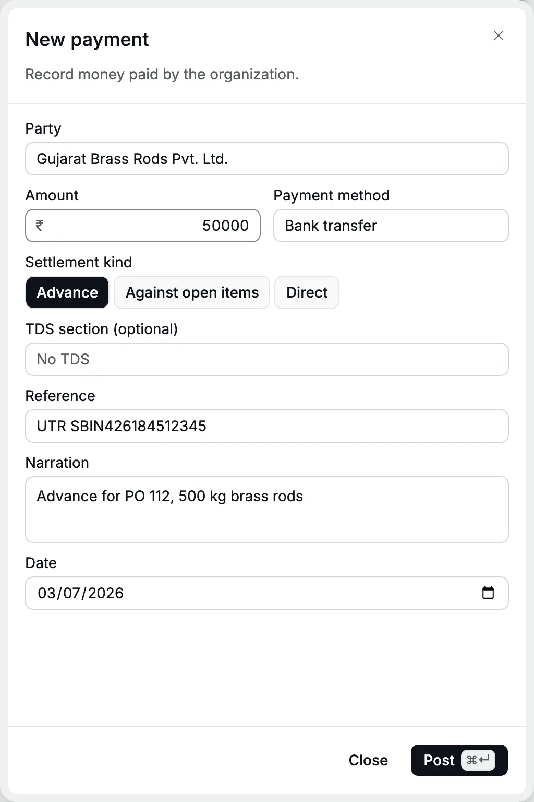
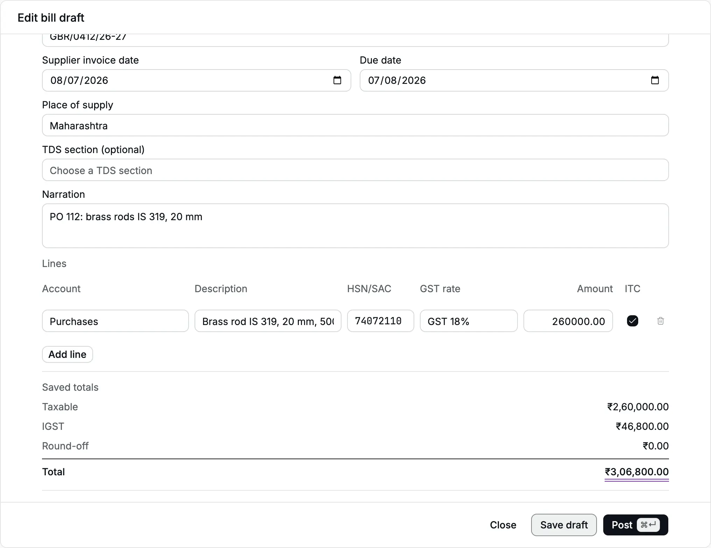
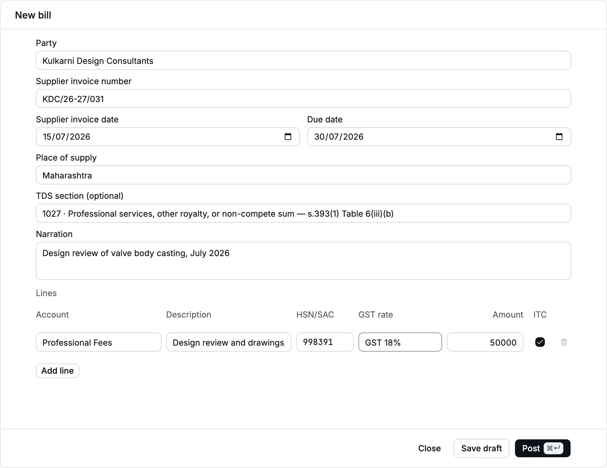
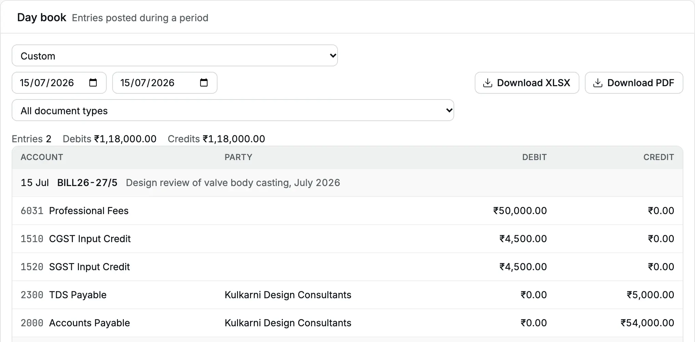
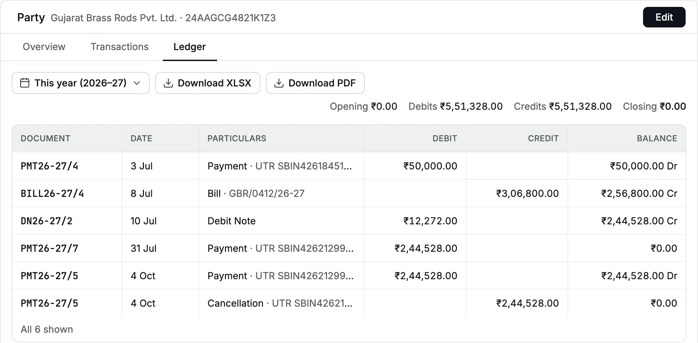
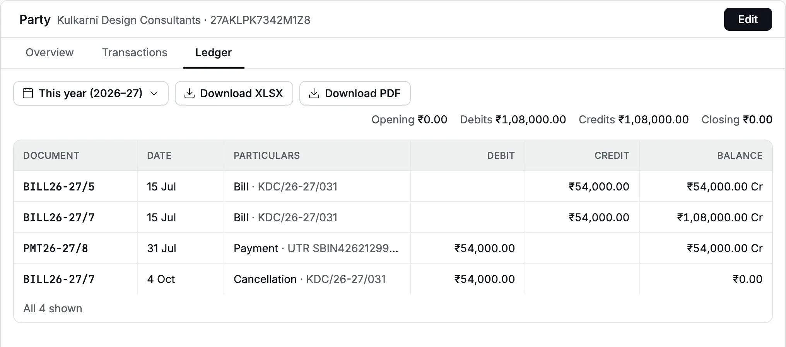
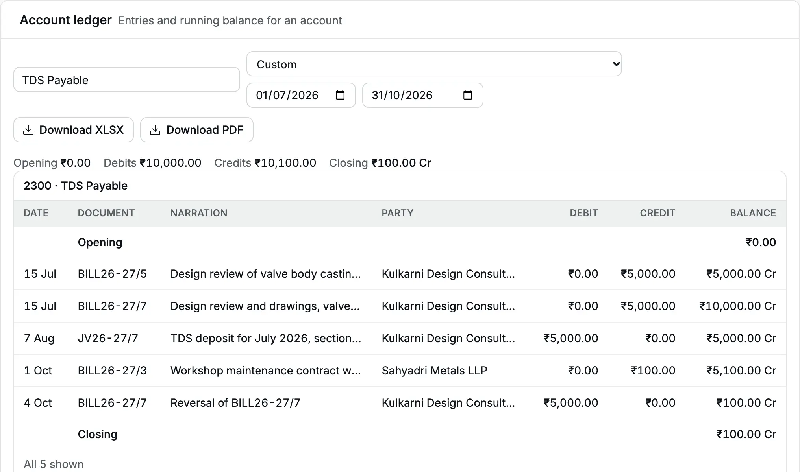

This story follows Cedar Components, a Pune manufacturer registered for
[GST](/glossary#gst) (Goods and Services Tax) in Maharashtra, through July 2026 on the
buying side. It pays an [advance](/glossary#advance) (money before the bill) for brass rod.
It books the supplier's [bill](/glossary#bill) with [input tax credit](/glossary#itc) (ITC,
the GST you paid that you may set against GST you collect). It raises a
[debit note](/glossary#debit-note), which reduces a bill, for a short supply. It books a
design consultant's bill with [TDS](/glossary#tds) (tax deducted at source, which you keep
back and pay to the government), pays both suppliers in full and deposits the TDS in
August.

Every step was done in Accly Books. The numbers below are the real results.

## The cast

| Who                          | Where                  | [GSTIN](/glossary#gstin) | Role in the story                                           |
| ---------------------------- | ---------------------- | ------------------------ | ----------------------------------------------------------- |
| Gujarat Brass Rods Pvt. Ltd. | Jamnagar, Gujarat (24) | 24AAGCG4821K1ZM          | Supplies 500 kg of brass rod, inter-state, takes an advance |
| Kulkarni Design Consultants  | Pune, Maharashtra (27) | 27AKLPK7342M1ZL          | A proprietor who bills a design review; TDS applies         |

| Account                | Type    | Used for                                      |
| ---------------------- | ------- | --------------------------------------------- |
| 6010 Purchases         | Expense | Raw material                                  |
| 6031 Professional Fees | Expense | The consultant's fee (created for this story) |
| 6800 Bank Charges      | Expense | The NEFT fee                                  |

Set these up first in [Parties](/setup/parties) (role **Vendor**, with state and GSTIN, the
15-character GST number, which carries the [PAN](/glossary#pan), the income-tax ID) and the [Chart of accounts](/setup/chart-of-accounts).

## 3 Jul: an advance to the supplier

Gujarat Brass Rods asks for ₹50,000 before it dispatches purchase order 112. In
**Payments → New**, choose the [party](/glossary#party), ₹50,000, **Bank transfer**,
[settlement kind](/glossary#settlement-kind) **Advance**, the UTR (the bank's Unique
Transaction Reference, see [UPI, NEFT and UTR](/glossary#upi-neft)) as reference and the date 3 Jul. [Post](/glossary#post) (record it for good): **PMT26-27/4**. See
[Pay an advance](/purchases/payments#pay-an-advance).

<Frame caption="The ₹50,000 advance to Gujarat Brass Rods.">
  
</Frame>

Each table below shows the entry's [debit and credit](/glossary#debit-credit) sides (Dr and
Cr), which always balance.

| Account                                | Debit      | Credit     |
| -------------------------------------- | ---------- | ---------- |
| Supplier Advances (Gujarat Brass Rods) | ₹50,000.00 |            |
| Bank Account                           |            | ₹50,000.00 |

## 8 Jul: the goods bill

The rods arrive with invoice `GBR/0412/26-27`: 500 kg at ₹520, ₹2,60,000 plus 18% IGST
([integrated GST](/glossary#cgst-sgst-igst), charged between states), due 7 Aug. In **Bills → New**, enter the supplier, the invoice number and date, the due
date, and one line: **Purchases**, HSN 74072110 (the [HSN code](/glossary#hsn-sac) that classifies the goods), **GST 18%**, ₹2,60,000, **ITC** ticked.
The supplier is in Gujarat and the [place of supply](/glossary#place-of-supply), where the
goods are delivered, is Maharashtra, so the bill takes
IGST. Click **Save draft** (a [draft](/glossary#draft) posts nothing yet) to see the totals, check them against the paper invoice, then
**Post**: **BILL26-27/4**. See [Book a bill](/purchases/bills#book-a-bill).

<Frame caption="Saved totals: IGST ₹46,800.00, total ₹3,06,800.00, matching the supplier's invoice.">
  
</Frame>

| Account                               | Debit        | Credit       |
| ------------------------------------- | ------------ | ------------ |
| Purchases                             | ₹2,60,000.00 |              |
| IGST Input Credit                     | ₹46,800.00   |              |
| Accounts Payable (Gujarat Brass Rods) |              | ₹3,06,800.00 |

Now set the advance against the bill: open BILL26-27/4, choose **⋯ → Apply credit** (an
[allocation](/glossary#allocation) that matches a credit to a bill),
pick **PMT26-27/4** and apply ₹50,000. This posts Dr Accounts Payable, Cr Supplier
Advances ₹50,000, dated the day you apply it. Apply it the same day you book the bill so
your July [balance sheet](/glossary#balance-sheet) does not show both the advance and the
full [payable](/glossary#payable) (what you owe). See
[Apply an advance](/purchases/bills#apply-an-advance).

## 10 Jul: a short supply

The stores count 480 kg, not 500. The supplier agrees to credit 20 kg. On BILL26-27/4
choose **⋯ → Debit note**, set **Note date** 10 Jul, enter ₹10,400 on the brass rod line
and the reason. Post: **DN26-27/2** for ₹12,272.00 (₹10,400 + ₹1,872 IGST). The note is
applied to the bill at once. See [Raise a debit note](/purchases/debit-notes#raise-a-debit-note).

<Frame caption="The debit note for 20 kg short supplied.">
  
</Frame>

| Account                               | Debit      | Credit     |
| ------------------------------------- | ---------- | ---------- |
| Accounts Payable (Gujarat Brass Rods) | ₹12,272.00 |            |
| Purchases                             |            | ₹10,400.00 |
| IGST Input Credit                     |            | ₹1,872.00  |

The bill is now **Part paid**: ₹3,06,800 − ₹50,000 − ₹12,272 = ₹2,44,528 [outstanding](/glossary#outstanding) (left to pay).

## 15 Jul: the consultant's bill with TDS

Kulkarni Design Consultants bills `KDC/26-27/031`: a design review of the valve body
casting, ₹50,000 plus 18% GST, due 30 Jul. Cedar expects to pay this
consultant more than the yearly threshold for professional fees this financial year, so the
fee is subject to TDS at 10% (section 194J of the 1961 Act, code 1027 from April 2026; a
[TDS section](/glossary#tds-section) sets the rate for a kind of payment). Accly Books does
not check thresholds: check with your CA whether a supplier's total for the year crosses
the limit before you deduct.

In **Bills → New**, enter the supplier and invoice details, choose **TDS section 1027 ·
Professional services…**, and one line: **Professional Fees**, SAC 998391, **GST 18%**,
₹50,000. Post: **BILL26-27/5**. See [Deduct TDS on a bill](/purchases/bills#deduct-tds-on-a-bill).

<Frame caption="The consultant's bill with TDS section 1027.">
  
</Frame>

The supplier and Cedar Components are both in Maharashtra, so the GST splits into CGST
and SGST, central and state GST of 9% each. TDS is 10% of the taxable ₹50,000, not of the GST. The [day book](/glossary#day-book), which
lists every entry by date, shows the bill's entry.

<Frame caption="The bill's entry in the day book: TDS Payable ₹5,000, Accounts Payable ₹54,000.">
  
</Frame>

| Account                                        | Debit      | Credit     |
| ---------------------------------------------- | ---------- | ---------- |
| Professional Fees                              | ₹50,000.00 |            |
| CGST Input Credit                              | ₹4,500.00  |            |
| SGST Input Credit                              | ₹4,500.00  |            |
| TDS Payable (Kulkarni Design Consultants)      |            | ₹5,000.00  |
| Accounts Payable (Kulkarni Design Consultants) |            | ₹54,000.00 |

The bill's record shows **Total** ₹59,000.00, **TDS · 1027** ₹5,000.00 and **Payable
after TDS** ₹54,000.00. The ₹5,000 sits in [TDS Payable](/glossary#tds-payable), the account
for tax you deducted and owe the government.

## 31 Jul: pay both suppliers

The bank pays both by NEFT ([NEFT](/glossary#upi-neft), the bank-to-bank transfer system) on
31 Jul.

**Gujarat Brass Rods.** In **Payments → New**, choose the party, **Against open items**,
amount ₹2,44,528, and click **Fill** on BILL26-27/4. The bank charges ₹17.70 for the
transfer: choose **Bank Charges** in **Fee expense account** and type ₹17.70. Add the
UTR and the date 31 Jul. Post: **PMT26-27/7**. See [Pay against bills](/purchases/payments#pay-against-bills).

<Frame caption="₹2,44,528 against the brass rod bill, with the ₹17.70 NEFT fee.">
  
</Frame>

| Account                               | Debit        | Credit       |
| ------------------------------------- | ------------ | ------------ |
| Accounts Payable (Gujarat Brass Rods) | ₹2,44,528.00 |              |
| Bank Charges                          | ₹17.70       |              |
| Bank Account                          |              | ₹2,44,545.70 |

The bill is now **Paid**. Its allocations show the debit note, the payment and the
advance.

<Frame caption="BILL26-27/4 paid in full by DN26-27/2, PMT26-27/7 and the advance PMT26-27/4. The cancelled PMT26-27/5 shows Reversed.">
  
</Frame>

**Kulkarni Design Consultants.** Pay ₹54,000, the amount after TDS, against
BILL26-27/5: **PMT26-27/8**. No TDS section on the payment: the bill already deducted it.

| Account                                        | Debit      | Credit     |
| ---------------------------------------------- | ---------- | ---------- |
| Accounts Payable (Kulkarni Design Consultants) | ₹54,000.00 |            |
| Bank Account                                   |            | ₹54,000.00 |

## The suppliers' ledgers

Open **Parties → Gujarat Brass Rods Pvt. Ltd. → Ledger**. The [ledger](/glossary#ledger) is
the running record of everything with this party. The advance, bill, debit note
and payment net to ₹0.00. The ledger also shows a payment first entered with the wrong
date (PMT26-27/5) and its cancellation, which cancel out. See
[Party ledger](/reports/party-ledger).

<Frame caption="Gujarat Brass Rods: closing balance ₹0.00.">
  
</Frame>

The consultant's ledger shows the bill at ₹54,000, the amount after TDS, and the payment.
It also shows a historical duplicate entry of the same invoice (BILL26-27/7),
cancelled on 4 Oct. New posts now refuse a supplier invoice number already posted
for that supplier in the same financial year, ignoring letter case and spaces at
either end. Drafts and cancelled bills do not reserve the number.

<Frame caption="Kulkarni Design Consultants: closing balance ₹0.00.">
  
</Frame>

## Deposit the TDS

TDS deducted in July must reach the government by 7 Aug. Pay the challan (the government's
tax payment form, here ITNS 281) at the bank, then record it with a
[journal](/glossary#journal), a manual entry, dated 7 Aug (see [Journals](/accounting/journals)): Dr **TDS Payable**
₹5,000 (party Kulkarni Design Consultants), Cr **Bank Account** ₹5,000, with the challan
number as reference. Here it is **JV26-27/7**.

| Account                                   | Debit     | Credit    |
| ----------------------------------------- | --------- | --------- |
| TDS Payable (Kulkarni Design Consultants) | ₹5,000.00 |           |
| Bank Account                              |           | ₹5,000.00 |

Check what is due in the [account ledger](/reports/account-ledger), the ledger of one
account, of **2300 TDS
Payable**. Use the **TDS register** in [Reports](/reports) for the return; it lists the
deduction by section, party and PAN.

<Frame caption="TDS Payable from 1 Jul to 31 Oct 2026. Kulkarni's ₹5,000 is deposited on 7 Aug.">
  
</Frame>

:::warning[The cancelled duplicate stays in July]
The duplicate bill BILL26-27/7 was cancelled on 4 Oct, so its [reversal](/glossary#reversal) (the equal and opposite entry) is dated 4 Oct.
The TDS Payable ledger for July alone shows ₹10,000.00, but only ₹5,000 was really
deducted, and the TDS register shows ₹5,000. Deposit what the TDS register shows, and
cancel wrong bills in the same month where you can. See
[Correct or cancel a bill](/purchases/bills#correct-or-cancel-a-bill).
:::

## Where July ends

| Figure                              | Amount         | How it builds up                          |
| ----------------------------------- | -------------- | ----------------------------------------- |
| Owed to Gujarat Brass Rods          | ₹0.00          | ₹3,06,800 − ₹50,000 − ₹12,272 − ₹2,44,528 |
| Owed to Kulkarni Design Consultants | ₹0.00          | ₹54,000 − ₹54,000                         |
| Purchases                           | ₹2,49,600.00   | ₹2,60,000 − ₹10,400                       |
| Professional Fees                   | ₹50,000.00     |                                           |
| IGST Input Credit                   | ₹44,928.00     | ₹46,800 − ₹1,872                          |
| CGST and SGST Input Credit          | ₹4,500.00 each |                                           |
| TDS Payable (Kulkarni)              | ₹5,000.00      | Cleared by the 7 Aug deposit              |
| Paid from the bank in July          | ₹3,48,545.70   | ₹50,000 + ₹2,44,545.70 + ₹54,000          |

## What this story used

- [Payments](/purchases/payments): advance, against open items, bank fee
- [Bills](/purchases/bills): GST, input tax credit, TDS, Apply credit, cancel
- [Debit notes](/purchases/debit-notes): a short supply
- [Journals](/accounting/journals): the TDS deposit
- [Party ledger](/reports/party-ledger), [Account ledger](/reports/account-ledger) and [Day book](/reports/day-book): checking the result
