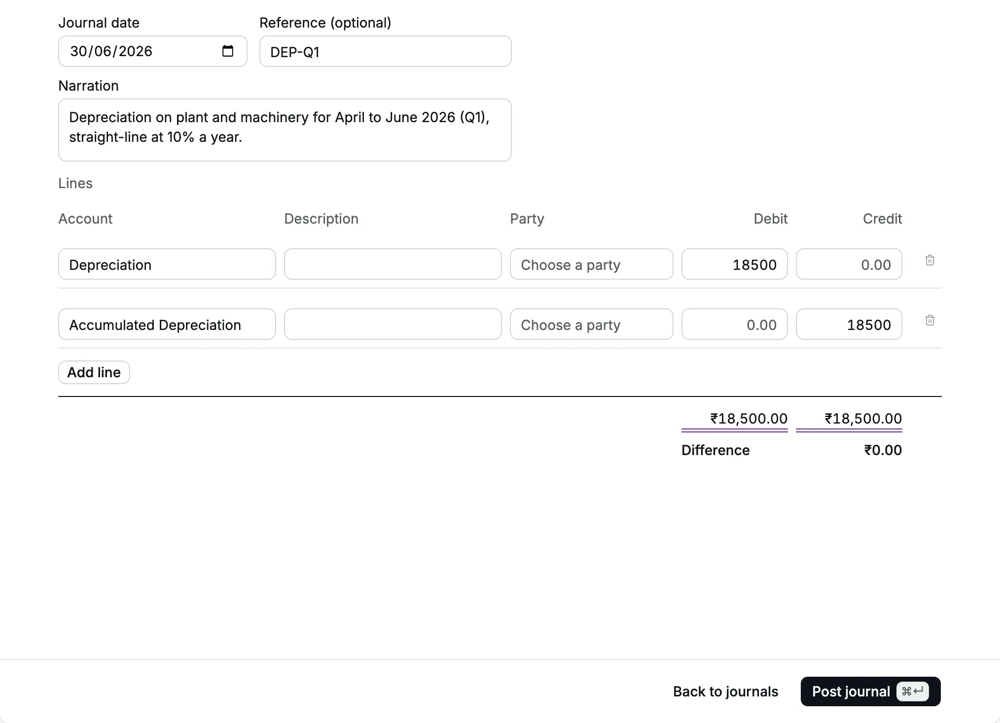
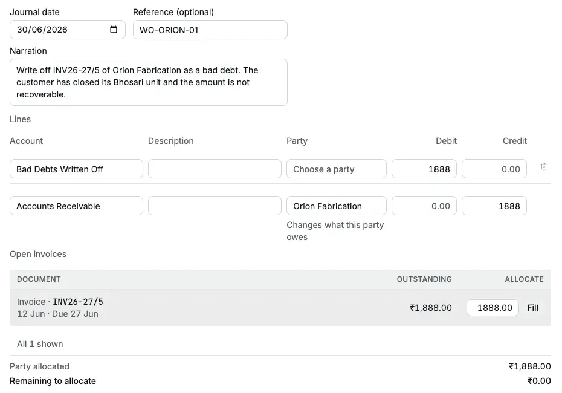
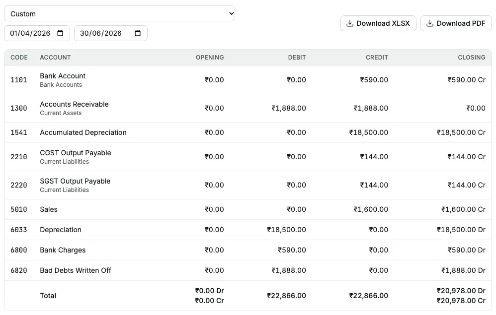
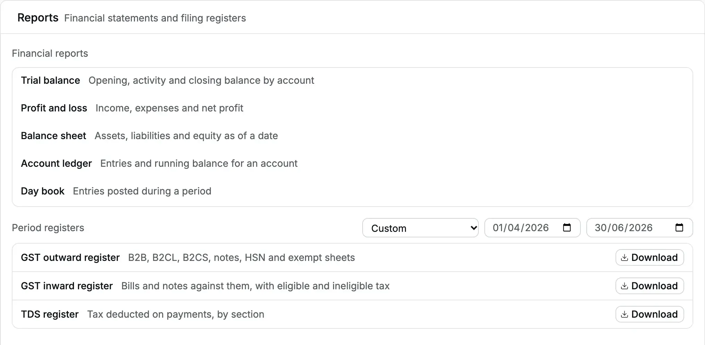
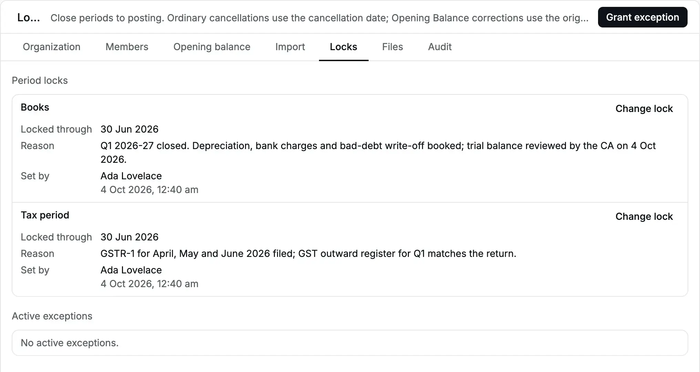
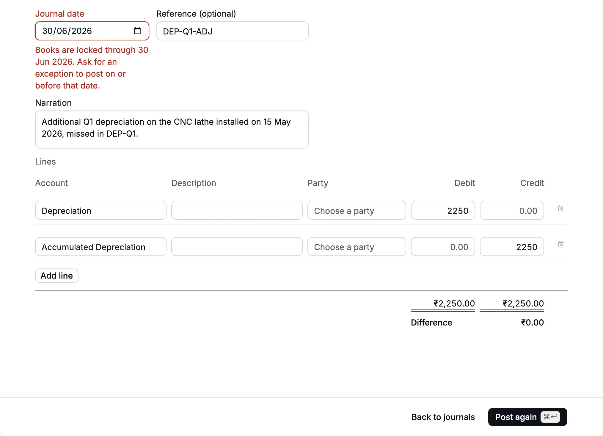
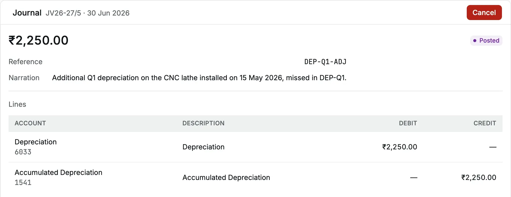
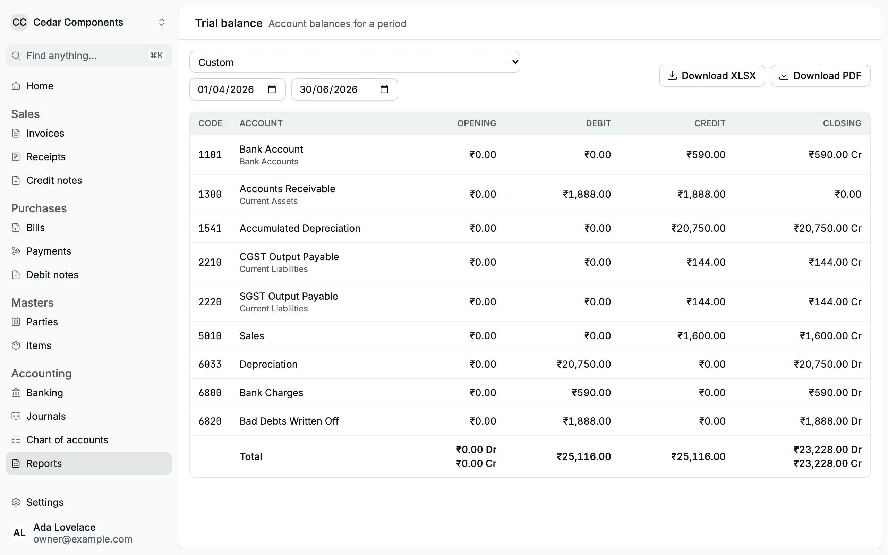

Cedar Components closes its first quarter, April to June 2026, in the first week of
October. Ada Lovelace is the owner, Priya Nair the accountant and Meera Iyer the
company's CA (Chartered Accountant). The close follows the order your CA expects:
adjusting entries first (corrections that make the period's figures complete), then
review, then a check against the [GST](/glossary#gst) (Goods and Services Tax) return
filed in July, then the
[locks](/glossary#lock), which close the period to new entries.

| Step                                                                                                                                 | Who                            | Page                                                             |
| ------------------------------------------------------------------------------------------------------------------------------------ | ------------------------------ | ---------------------------------------------------------------- |
| 1. Book [depreciation](/glossary#depreciation), bank charges and a bad-debt [write-off](/glossary#write-off)                         | Accountant                     | [Journals](/accounting/journals)                                 |
| 2. Review the [trial balance](/glossary#trial-balance) (every account's balance) for the quarter                                     | CA                             | [Trial balance](/reports/trial-balance)                          |
| 3. Check the GST outward register (the list of sales for the return) against the [GSTR-1](/glossary#gstr) filed by its due date      | Accountant, CA                 | [Reports](/reports)                                              |
| 4. Lock the books and the tax period through 30 Jun 2026                                                                             | Owner or CA                    | [Locks](/accounting/locks)                                       |
| 5. Post a late correction under a short [exception](/glossary#lock-exception) (time-limited permission to post into a locked period) | Owner grants, accountant posts | [Locks](/accounting/locks#let-one-person-post-a-late-correction) |

:::note
In this walkthrough every step was done in the app with the owner's login, which has
all of these rights. With separate logins, the accountant posts the journals, and
the owner or CA sets the locks and grants the exception.
:::

## The quarter at a glance

In April to June Cedar Components raised one [invoice](/glossary#invoice) in Accly
Books: INV26-27/5 of 12 Jun 2026 to Orion Fabrication, for two mounting brackets at
₹800 each plus 18% GST ([CGST and SGST](/glossary#cgst-sgst-igst), the central and
state halves of GST on a sale within one state, ₹144 each), ₹1,888.00 in all, due on
27 Jun 2026. Orion never paid.

## 1. Book the adjusting journals

The accountant [posts](/glossary#post) (enters for good) three
[journals](/glossary#journal), manual entries, all dated 30 Jun 2026, **before** the period is
locked. Adjusting entries go in first so that nobody needs an exception for them.

### Depreciation

Plant and machinery is depreciated at 10% a year, straight line (the same amount
each year): ₹18,500 for the quarter. Depreciation is the share of an asset's cost used
up in the period. Cedar added **Depreciation** (expense) and **Accumulated Depreciation**
(asset) in the [chart of accounts](/setup/chart-of-accounts) first. The
[chart of accounts](/glossary#chart-of-accounts) is the list of all your accounts.
In the tables below, Dr and Cr are the [debit and credit](/glossary#debit-credit), the
two equal sides of every entry.

<Frame caption="JV26-27/2: depreciation for April–June 2026.">
  
</Frame>

| JV26-27/2 · 30 Jun 2026 · `DEP-Q1` | Dr         | Cr         |
| ---------------------------------- | ---------- | ---------- |
| Depreciation                       | ₹18,500.00 |            |
| Accumulated Depreciation           |            | ₹18,500.00 |

### Bank charges

The June statement of the current account shows ₹590 for
[NEFT](/glossary#upi-neft) (bank transfers), SMS alerts and a cheque book. Cedar books it gross, without claiming the GST in it.

| JV26-27/3 · 30 Jun 2026 · `STMT-JUN-26` | Dr      | Cr      |
| --------------------------------------- | ------- | ------- |
| Bank Charges                            | ₹590.00 |         |
| Bank Account                            |         | ₹590.00 |

To claim [input tax credit](/glossary#itc) (ITC, the GST you paid that you may deduct
from the GST you collect) on bank fees, enter them as a [bill](/purchases/bills)
from the bank instead.

### Bad-debt write-off

Orion Fabrication has closed its Bhosari unit. The owner decides to write off
INV26-27/5 in full, GST included, because GST law gives no refund of
[output tax](/glossary#output-tax) (the GST charged on the sale) on a bad debt, money
a customer will never pay.

The accountant adds a line on **Accounts Receivable** (what customers owe, a
[control account](/glossary#control-account)) with **Party** Orion Fabrication (the
[party](/glossary#party) is the customer) and a credit of `1888`. The **Open invoices** grid shows INV26-27/5; she
clicks **Fill** to settle it from this journal. This [allocation](/glossary#allocation)
matches the credit to that invoice.

<Frame caption="JV26-27/4: the write-off settles Orion's invoice in the same voucher.">
  
</Frame>

| JV26-27/4 · 30 Jun 2026 · `WO-ORION-01` | Party             | Dr        | Cr        |
| --------------------------------------- | ----------------- | --------- | --------- |
| Bad Debts Written Off                   |                   | ₹1,888.00 |           |
| Accounts Receivable                     | Orion Fabrication |           | ₹1,888.00 |

INV26-27/5 now has nothing [outstanding](/glossary#outstanding) (unpaid), and
Orion's [party ledger](/reports/party-ledger), the running record of everything with
one customer, reads: invoice ₹1,888.00 Dr on 12 Jun, journal ₹1,888.00 Cr on 30 Jun, balance ₹0.00.

## 2. The CA reviews the trial balance

Meera opens [Trial balance](/reports/trial-balance) and sets **From** `01/04/2026`
and **To** `30/06/2026`. She checks each balance against the working papers and
downloads the PDF for her file.

<Frame caption="The trial balance for April–June 2026 after the three journals.">
  
</Frame>

:::note
Cedar Components' demo [Opening Balance](/glossary#opening-balance) is dated before
its receipt history, not after the quarter's ordinary documents. Include the
opening bank balance when reconciling the quarter. Older screenshots show the
previous demo cutover; check the current **As at** date in **Settings → Opening balance**.
:::

## 3. Check the GST register against GSTR-1

On [Reports](/reports), under **Period registers**, the accountant sets the dates to
`01/04/2026` and `30/06/2026` and clicks **Download** on **GST outward register**. The
workbook has the sheets **B2B**, **B2CL**, **B2CS**, **CDNR**, **CDNUR**, **HSN** and
**Exempt**. Orion has no [GSTIN](/glossary#gstin) (GST registration number) and the
supply is within Maharashtra, so INV26-27/5 is summarised in **B2CS** (sales to
unregistered buyers): [place of supply](/glossary#place-of-supply) 27 (the state
code for Maharashtra), rate 18%, taxable ₹1,600.00, CGST ₹144.00, SGST ₹144.00. The
**HSN** sheet shows the same amounts under HSN 7326 ([HSN](/glossary#hsn-sac), the
goods classification code on the invoice).

<Frame caption="The period registers set to April–June 2026.">
  
</Frame>

The CA filed GSTR-1 for the quarter on the GST portal from this workbook by its due
date (for a quarterly filer, 13 Jul 2026; check the date that applies to you with
your CA). Because the books close only in October, the accountant downloads the
register again now and checks that it still matches the return already filed.
Accly Books does not file returns itself.

## 4. Lock the books and the tax period

With the review done and GSTR-1 filed, the owner opens **Settings → Locks**:

1. **Books** → **Change lock** → **Locked through** `30/06/2026`, reason "Q1 2026-27
   closed. Depreciation, bank charges and bad-debt write-off booked; trial balance
   reviewed by the CA on 4 Oct 2026." → **Save lock**.
2. **Tax period** → **Change lock** → `30/06/2026`, reason "GSTR-1 for April, May and
   June 2026 filed; GST outward register for Q1 matches the return." → **Save lock**.

<Frame caption="Both locks through 30 Jun 2026, each with its reason and who set it.">
  
</Frame>

From now on, nobody can post a document dated on or before 30 Jun 2026. July's
work continues as normal.

## 5. A late correction

On 4 Oct 2026, while finalising the quarter's figures, Meera notices that the CNC
lathe installed on 15 May 2026 was left out of the depreciation working. The missing
charge is ₹2,250.

The accountant enters a journal dated 30 Jun 2026: Dr Depreciation ₹2,250, Cr
Accumulated Depreciation ₹2,250, reference `DEP-Q1-ADJ`. Posting is refused:

<Frame caption="The books lock refuses the correction and says what to do.">
  
</Frame>

The owner clicks **Grant exception** on **Settings → Locks**, chooses the member who
will post, and sets **Expires** a few minutes ahead, at 12:55 am on 4 Oct 2026 (India
time), with the reason "Post the missed Q1 depreciation on the CNC lathe
(DEP-Q1-ADJ), as agreed with the CA." The journal form keeps the entry, so the
accountant clicks **Post again**, and JV26-27/5 posts on 30 Jun 2026.

<Frame caption="JV26-27/5, posted into the closed quarter under the exception.">
  
</Frame>

| JV26-27/5 · 30 Jun 2026 · `DEP-Q1-ADJ` | Dr        | Cr        |
| -------------------------------------- | --------- | --------- |
| Depreciation                           | ₹2,250.00 |           |
| Accumulated Depreciation               |           | ₹2,250.00 |

At 12:55 am the exception expires by itself. A test posting dated 30 Jun a minute
later is refused again with "Books are locked through 30 Jun 2026. Ask for an
exception to post on or before that date." The grant stays in
[Settings → Audit](/administration/audit-log), the [audit log](/glossary#audit-log)
of sensitive actions, as "Lock exception granted", with the
member, expiry and reason.

The correction is a journal, which has no GST, so the tax lock did not need to move.
Had the CA found a wrong GST invoice instead, the fix would be a
[credit note](/sales/credit-notes) dated in October (a
[credit note](/glossary#credit-note) reduces an invoice you already issued), not a change to June.

## The closed quarter

<Frame caption="The final trial balance for April–June 2026.">
  
</Frame>

| Account                  | Closing Dr     | Closing Cr     |
| ------------------------ | -------------- | -------------- |
| Bank Account             |                | ₹590.00        |
| Accounts Receivable      |                |                |
| Accumulated Depreciation |                | ₹20,750.00     |
| CGST Output Payable      |                | ₹144.00        |
| SGST Output Payable      |                | ₹144.00        |
| Sales                    |                | ₹1,600.00      |
| Depreciation             | ₹20,750.00     |                |
| Bank Charges             | ₹590.00        |                |
| Bad Debts Written Off    | ₹1,888.00      |                |
| **Total**                | **₹23,228.00** | **₹23,228.00** |

Accounts Receivable is ₹0.00: the June invoice and its write-off cancel out. The
quarter's income is ₹1,600.00 and its expenses ₹23,228.00, a loss of ₹21,628.00 on
these entries.

## What to remember

- Post adjusting journals before you lock, so the lock never needs an exception for
  routine work.
- Lock the tax period only after the return is filed, and correct a filed GST
  document with a credit note or a [debit note](/glossary#debit-note) (the purchase-side
  adjustment) in the open period.
- Keep exceptions short and specific. They open every date before the books lock
  for that member until they expire.
- The reasons you type on locks and exceptions are your close file. Write them for
  the auditor who reads them next year.

Related: [Journals](/accounting/journals), [Locks](/accounting/locks),
[Trial balance](/reports/trial-balance).
