Ridgeview Academy is a school run by Ridgeview Education Trust. On 4 Oct 2026 the
fee counter collects Term 2 fees from three parents, takes Term 3 fees in [advance](/glossary#advance) (money paid before the service)
from a fourth, and cancels one [receipt](/glossary#receipt) the cashier entered twice. At the end of the
day the accountant checks the [day book](/glossary#day-book) (every entry of the day) and the cash, and the principal looks at the
fee income.

The school does not raise an [invoice](/glossary#invoice) for each term. It records each payment as a
**Direct** receipt to the **Fees** income [account](/glossary#account): the
[settlement kind](/glossary#settlement-kind) that books money straight to income. Most school
education services are [exempt](/glossary#supply-class) from [GST](/glossary#gst); check with your CA
which of your fees are exempt.

:::warning[If your school is GST-registered]
The trust and society charts create **Fees** with the GST supply class **Exempt**,
so exempt school fees can use Direct receipts even when the organization has a
GSTIN. Check the class in [Edit account](/setup/chart-of-accounts#edit-an-account)
before posting. An unused account can change class; one with posted entries
cannot. If an older **Fees** account is taxable and already used, add a new exempt
income account and choose it instead. Taxable fees in a GST-registered organization
must be invoiced before they are received.
:::

**Who does it:** the cashier [posts](/glossary#post) receipts (Owner, Accountant or Operator; see [roles](/glossary#roles)). Only an
Owner or Accountant can cancel a receipt. The day-close reports need an Owner,
Accountant or Chartered Accountant.

:::note
Ridgeview's demonstration data holds about 1,05,000 earlier entries, so its balances
are large. Read the changes from today's postings, not the totals.
:::

## The day at a glance

| Receipt        | Parent       | Child            | Method     | Kind                 | Amount     |
| -------------- | ------------ | ---------------- | ---------- | -------------------- | ---------- |
| RCT26-27/51114 | Imran Sharma | Aisha, Class 6-B | Cash       | Direct to Fees       | ₹18,500.00 |
| RCT26-27/51115 | Pooja Nair   | Kabir, Class 3-A | HDFC UPI   | Direct to Fees       | ₹18,500.00 |
| RCT26-27/51116 | Farhan Jain  | Zara, Class 8-C  | ICICI NEFT | Direct to Fees       | ₹22,000.00 |
| RCT26-27/51117 | Deepa Reddy  | Rohan, Class 5-A | HDFC NEFT  | Advance for Term 3   | ₹18,500.00 |
| RCT26-27/51118 | Imran Sharma | Aisha, Class 6-B | Cash       | Duplicate, cancelled | ₹18,500.00 |

## 1. Collect a fee in cash

Imran Sharma pays ₹18,500.00 in cash for his daughter Aisha's Term 2 tuition.

<Steps>
  <Step title="Open a new receipt">Click **Receipts**, then **New**.</Step>
  <Step title="Enter the payer and amount">
    In **Party**, type "Imran Sharma" and choose him; a [party](/glossary#party) is anyone you deal
    with. In **Amount**, type 18500. **Payment method** ([payment method](/glossary#payment-method):
    how the money came in) is already **Cash**.
  </Step>
  <Step title="Choose Direct and the income account">
    Click **Direct**. In **Income account**, choose **Fees**.
  </Step>
  <Step title="Add the details">
    In **Reference**, type the fee-card number, T2-6B-014. In **Narration** (the
    [narration](/glossary#narration), a note on the document), type "Term 2 tuition fee, Aisha
    Sharma, Class 6-B". Leave **Date** as today.
  </Step>
  <Step title="Post">
    Click **Post**. The message "Receipt RCT26-27/51114 posted" appears, and the form clears for the
    next parent.
  </Step>
</Steps>

<Frame caption="A Direct receipt in cash to the Fees account.">
  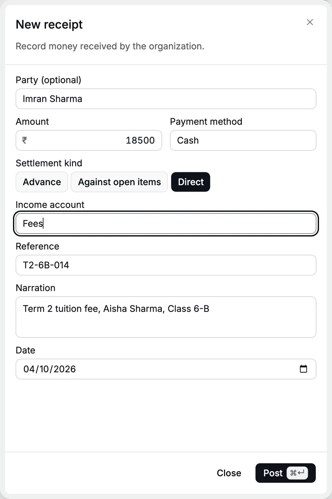
</Frame>

What happens in the books ([debit and credit](/glossary#debit-credit), the two equal sides of every entry):

| Account                        | Debit      | Credit     |
| ------------------------------ | ---------- | ---------- |
| 1001 Cash in Hand              | ₹18,500.00 |            |
| 5010 Fees (party Imran Sharma) |            | ₹18,500.00 |

See [Receipts](/sales/receipts) for every field of the form.

## 2. Collect fees by UPI and bank transfer

Pooja Nair pays ₹18,500.00 by [UPI](/glossary#upi-neft) (instant phone transfer). Farhan Jain pays ₹22,000.00, tuition and
transport, by NEFT (a bank-to-bank transfer) into the ICICI account. Post each one the same way, with two
changes:

- In **Payment method**, choose **HDFC UPI** or **ICICI NEFT**. The method decides
  the bank account: HDFC UPI lands in **HDFC Bank - Current**, ICICI NEFT in
  **ICICI Bank - Savings**.
- In **Reference**, type the UPI or UTR (the bank's transfer reference) number from the bank alert, so you can match
  it on the bank statement.

<Frame caption="A UPI fee. The UPI reference goes in Reference.">
  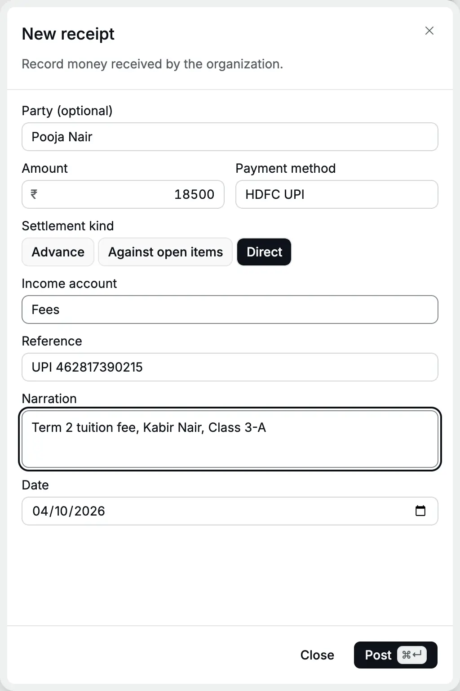
</Frame>

<Frame caption="A bank transfer into the ICICI account.">
  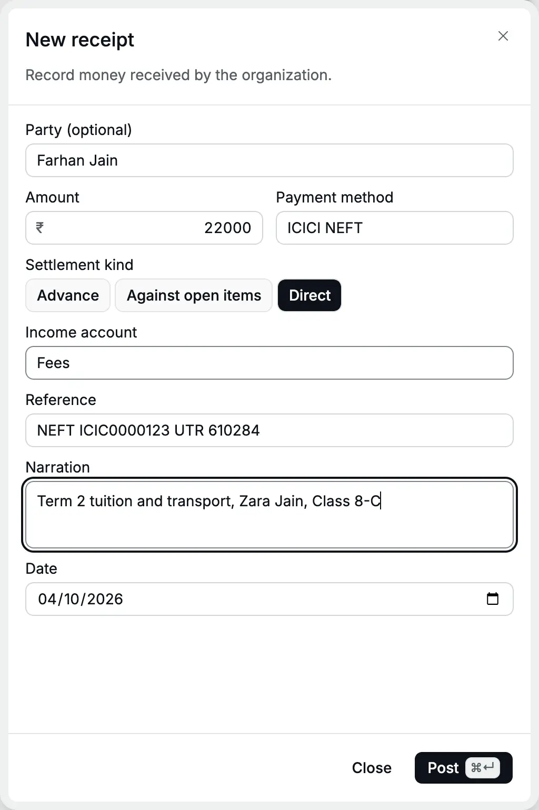
</Frame>

| Receipt        | Debit                                | Credit               |
| -------------- | ------------------------------------ | -------------------- |
| RCT26-27/51115 | 1101 HDFC Bank - Current ₹18,500.00  | 5010 Fees ₹18,500.00 |
| RCT26-27/51116 | 1102 ICICI Bank - Savings ₹22,000.00 | 5010 Fees ₹22,000.00 |

## 3. Take an advance for next term

Deepa Reddy pays Term 3 fees of ₹18,500.00 now, by NEFT. Term 3 starts in January,
so this is not this term's income yet. Record it as an advance.

<Steps>
  <Step title="Enter the payer, amount and method">
    In a new receipt, choose **Deepa Reddy**, type 18500 and choose **HDFC NEFT**.
  </Step>
  <Step title="Keep Advance">
    **Advance** is selected by default. In **Advance for**, choose **Exempt supply**, because school
    education is exempt from GST.
  </Step>
  <Step title="Add the details and post">
    Type the UTR in **Reference** and "Term 3 tuition fee paid in advance, Rohan Reddy, Class 5-A"
    in **Narration**. Click **Post**.
  </Step>
</Steps>

<Frame caption="An advance for an exempt supply carries no GST.">
  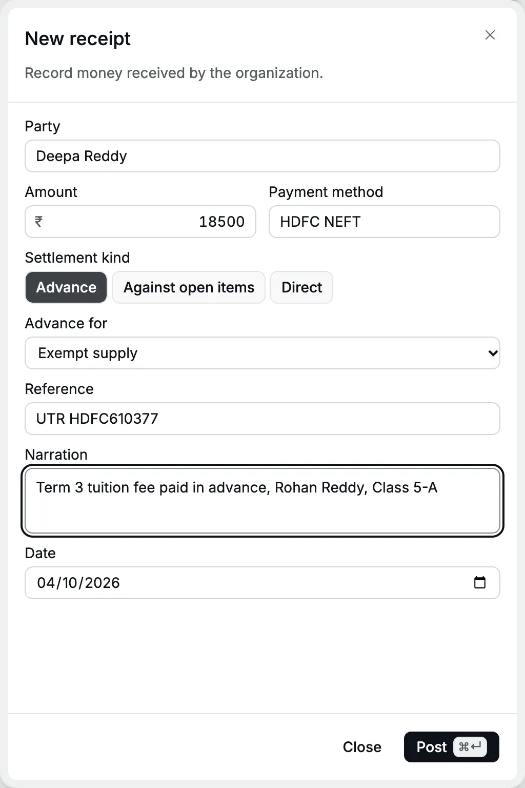
</Frame>

| Account                                    | Debit      | Credit     |
| ------------------------------------------ | ---------- | ---------- |
| 1101 HDFC Bank - Current                   | ₹18,500.00 |            |
| 2150 Customer Advances (party Deepa Reddy) |            | ₹18,500.00 |

The advance is a liability, something the school owes: the school owes Deepa Reddy a term of teaching. It does not
appear in the [profit and loss](/glossary#profit-and-loss) (P&L). Her [party ledger](/reports/party-ledger) shows it as
"Advance received" and a Cr balance.

<Frame caption="Deepa Reddy's ledger for today: the advance is a credit.">
  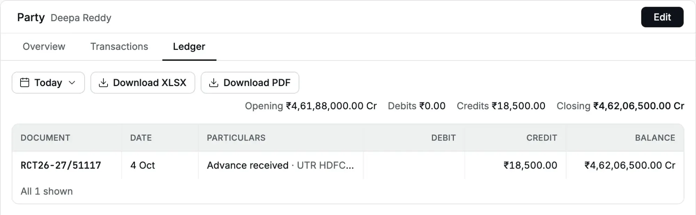
</Frame>

## 4. Cancel a duplicate receipt

The cashier posts Imran Sharma's cash fee a second time, as RCT26-27/51118. Accly
Books does not warn about the same reference. The accountant cancels the duplicate.

<Steps>
  <Step title="Open the receipt">
    In **Receipts**, click **RCT26-27/51118**. The receipt opens in a panel.
  </Step>
  <Step title="Cancel it">
    Click **Cancel receipt**. Type the reason: "Duplicate entry: the cash fee for Aisha Sharma is
    already recorded on RCT26-27/51114." The **Cancel receipt** button becomes active only after you
    type a reason. Click it.
  </Step>
</Steps>

<Frame caption="A cancellation needs a reason.">
  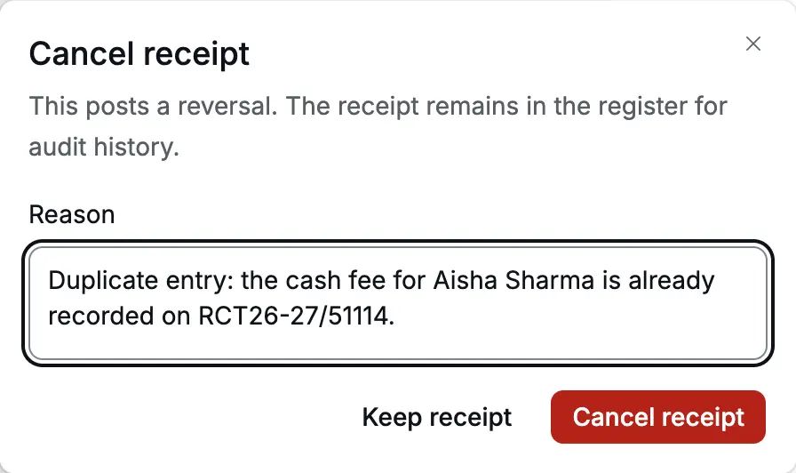
</Frame>

<Frame caption="The cancelled receipt stays in the register, struck through, with its cancellation date.">
  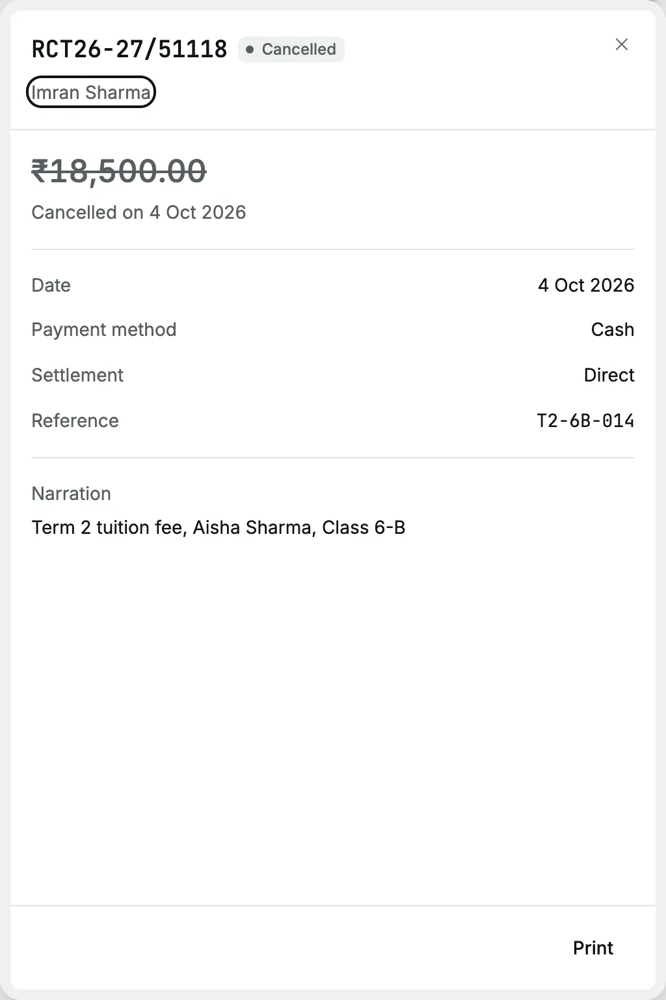
</Frame>

Accly Books keeps the receipt and posts a [reversal](/glossary#reversal), an equal and opposite entry, dated today:

| Entry                      | Account           | Debit      | Credit     |
| -------------------------- | ----------------- | ---------- | ---------- |
| RCT26-27/51118             | 1001 Cash in Hand | ₹18,500.00 |            |
|                            | 5010 Fees         |            | ₹18,500.00 |
| Reversal of RCT26-27/51118 | 5010 Fees         | ₹18,500.00 |            |
|                            | 1001 Cash in Hand |            | ₹18,500.00 |

The receipt panel shows "Cancelled on 4 Oct 2026" but not the reason. The reason is in
the [audit log](/administration/audit-log), the record of sensitive actions ([audit log](/glossary#audit-log)).

## 5. Close the day

At 5 pm the accountant checks the day's postings.

<Steps>
  <Step title="Look at today's receipts">
    Open **Receipts** and set the date filter to **Today**. The register shows the five receipts
    from this page, one marked **Cancelled**, and RCT26-27/51120, a ₹20,000.00 UPI receipt from
    Kavya Shetty that a second cashier posted the same day.
  </Step>
  <Step title="Open the day book">
    Click **Reports**, then **Day book**. It opens for **Today**. Choose **Receipts** in the
    document type list.
  </Step>
  <Step title="Count the cash">
    Open **Reports**, **Account ledger** (the [ledger](/glossary#ledger) of one account), choose
    **Cash in Hand** and **Today**. Compare the movement with the cash in the drawer.
  </Step>
</Steps>

<Frame caption="Today's receipts in the register.">
  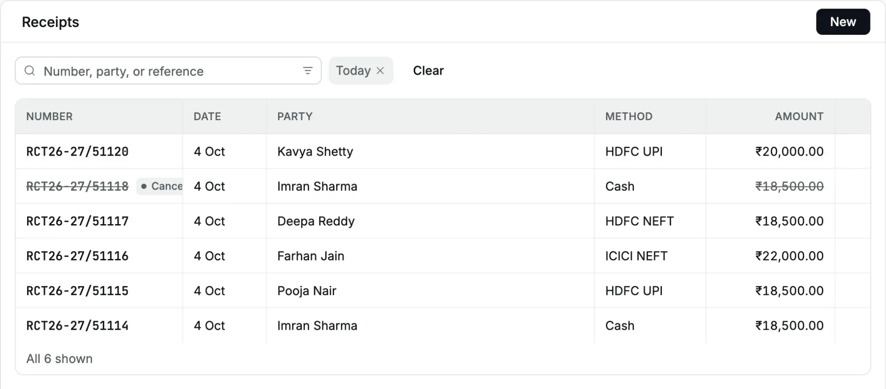
</Frame>

The day book shows seven entries: the six receipts in the register and the reversal.
**Debits** and **Credits** are both ₹1,34,500.00: ₹96,000.00 for this page's five
receipts, ₹20,000.00 for Kavya Shetty's receipt and ₹18,500.00 for the reversal. Each
entry balances on its own.

<Frame caption="The day book for today, filtered to receipts.">
  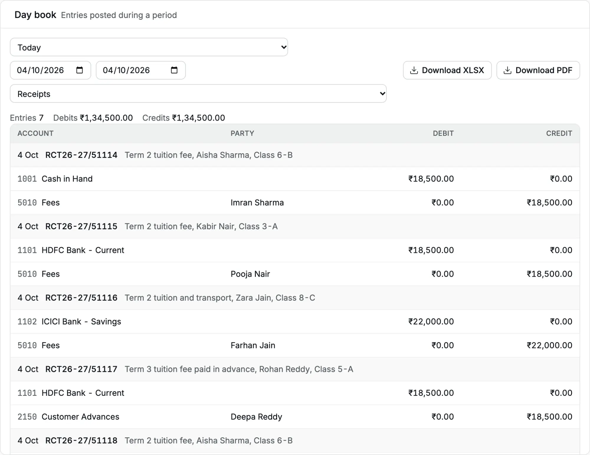
</Frame>

The Cash in Hand ledger shows **Debits** ₹37,000.00 (the fee and the duplicate) and
**Credits** ₹18,500.00 (the reversal). The cash collected today is ₹18,500.00, which
must match the drawer.

<Frame caption="Cash in Hand for today: one fee, the duplicate and its reversal.">
  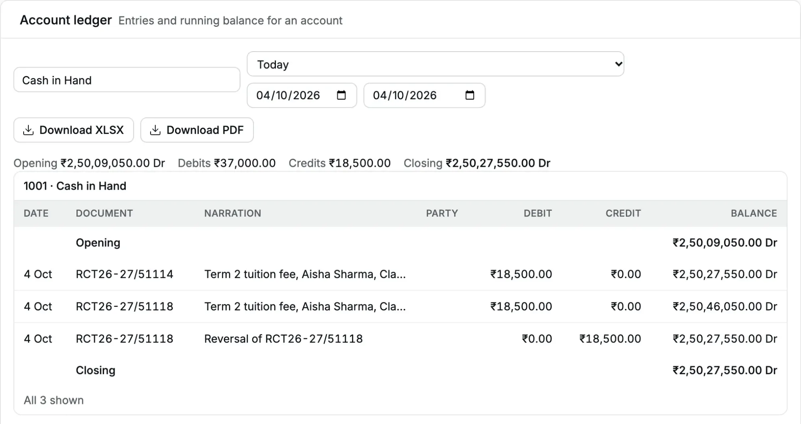
</Frame>

Collections by method from this page's receipts (add Kavya Shetty's ₹20,000.00 UPI for the whole counter):

| Method              | Account              | Amount         |
| ------------------- | -------------------- | -------------- |
| Cash                | Cash in Hand         | ₹18,500.00     |
| HDFC UPI            | HDFC Bank - Current  | ₹18,500.00     |
| ICICI NEFT          | ICICI Bank - Savings | ₹22,000.00     |
| HDFC NEFT (advance) | HDFC Bank - Current  | ₹18,500.00     |
| **Total**           |                      | **₹77,500.00** |

The day book has no total per payment method. Filter the **Receipts** register by
payment method, or open the ledger of each bank account for **Today**.

## 6. See the fee income

Open **Reports**, **Profit and loss**, and type 4 Oct 2026 in both dates.

<Frame caption="Fee income for the day: three term fees. The advance and the cancelled duplicate do not count.">
  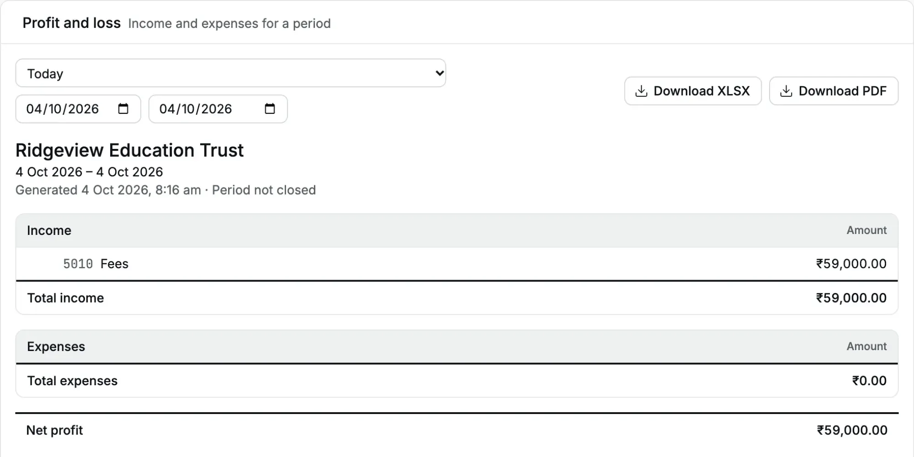
</Frame>

**Fees** shows ₹59,000.00: ₹18,500.00 + ₹18,500.00 + ₹22,000.00. The duplicate and its
reversal cancel out. Deepa Reddy's ₹18,500.00 is not income; it waits in Customer
Advances.

:::warning
A cancellation dated today reverses income from the receipt's own date. If you cancel
many receipts of earlier months in one day, that day's and that month's profit and
loss show negative fee income. Cancel mistakes the same day when you can.
:::

## Balances after the day

| Account              | Change from these receipts |
| -------------------- | -------------------------- |
| Cash in Hand         | + ₹18,500.00               |
| HDFC Bank - Current  | + ₹37,000.00               |
| ICICI Bank - Savings | + ₹22,000.00               |
| Customer Advances    | + ₹18,500.00 (Cr)          |
| Fees                 | + ₹59,000.00 (Cr)          |

## A note on parents' statements

A Direct receipt goes straight to income, so it does not appear in the parent's
[party ledger](/reports/party-ledger). To show a parent every payment, open the party
and use the **Transactions** tab, which lists every receipt naming the parent. An
advance does appear in the party ledger, because the school owes the parent until the
term starts.

## Related pages

- [Receipts](/sales/receipts)
- [Day book](/reports/day-book)
- [Account ledger](/reports/account-ledger)
- [Profit and loss](/reports/profit-and-loss)
- [Banking](/setup/banking)
