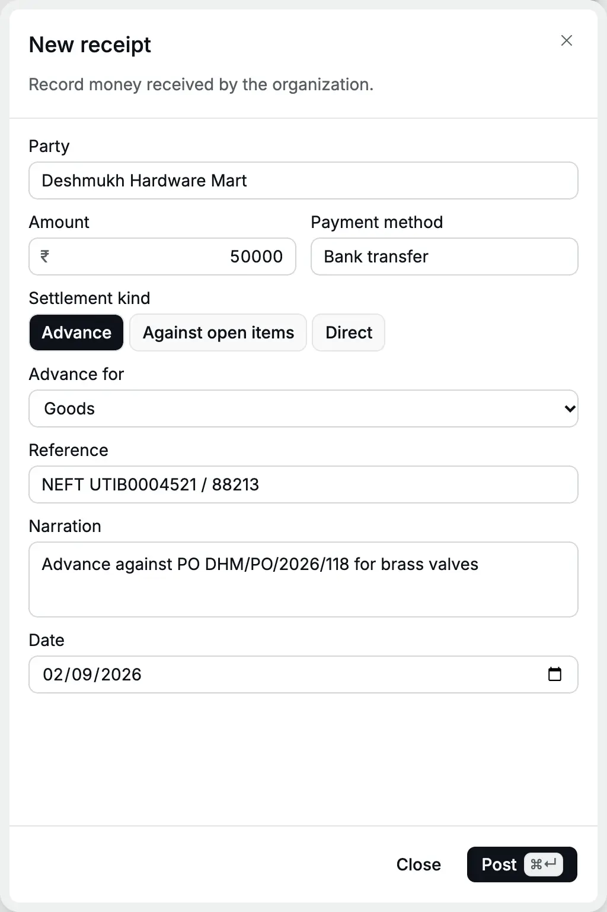
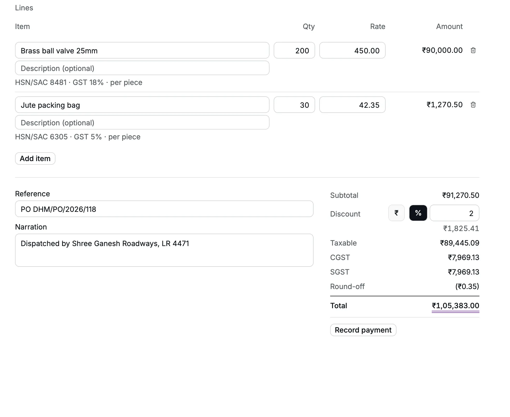
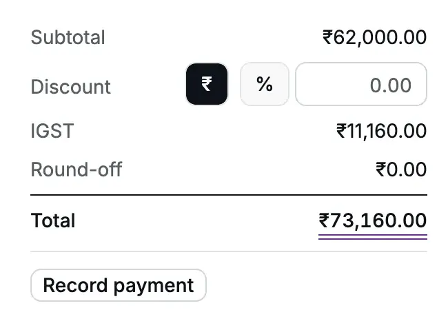
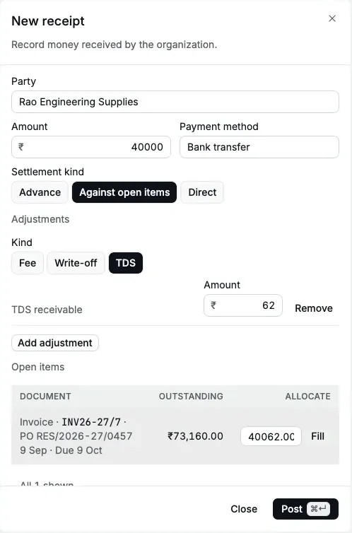
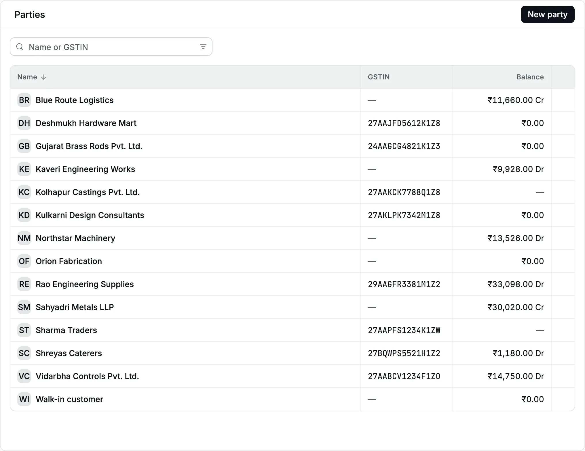
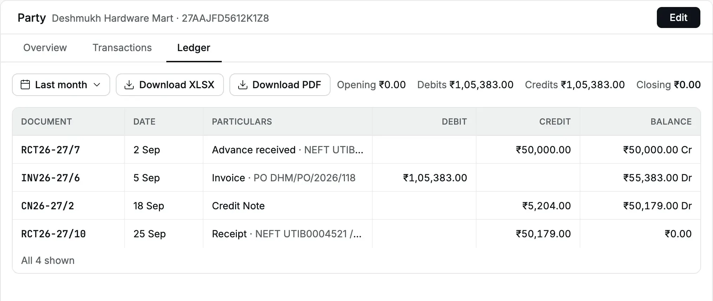
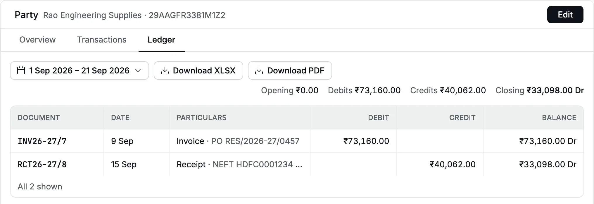

This story follows Cedar Components, a Pune trader registered for [GST](/glossary#gst) (Goods and Services Tax) in Maharashtra,
through September 2026. It takes an [advance](/glossary#advance) (money before the invoice), bills one customer in Maharashtra and one
in Karnataka, collects part payments, accepts a return, sells at the counter, and
closes the month knowing exactly who still owes what.

Every step was done in Accly Books. The numbers below are the real results.

## The cast

| Who                      | Where                     | GSTIN           | Role in the story                                       |
| ------------------------ | ------------------------- | --------------- | ------------------------------------------------------- |
| Deshmukh Hardware Mart   | Pune, Maharashtra (27)    | 27AAJFD5612K1Z8 | Pays an advance, buys valves, returns some              |
| Rao Engineering Supplies | Bengaluru, Karnataka (29) | 29AAGFR3381M1Z2 | Buys gate valves inter-state, pays part and deducts TDS |
| Walk-in customer         | Pune, Maharashtra         | Unregistered    | Buys at the counter and returns one valve               |

| Item                  | HSN  | Rate              | GST |
| --------------------- | ---- | ----------------- | --- |
| Brass ball valve 25mm | 8481 | ₹450.00 a piece   | 18% |
| Gate valve 50mm       | 8481 | ₹1,240.00 a piece | 18% |
| Jute packing bag      | 6305 | ₹42.35 a piece    | 5%  |

[GSTIN](/glossary#gstin) is the GST registration number. [HSN](/glossary#hsn-sac) is the
GST classification code for goods. [TDS](/glossary#tds) is tax deducted at source: the
customer keeps part of the payment and pays it to the government for you. Set these up
first in [Parties](/setup/parties) and [Items](/setup/items).

## 2 Sep: an advance arrives

Deshmukh Hardware Mart sends ₹50,000 by [NEFT](/glossary#upi-neft) (a bank transfer) against its purchase order DHM/PO/2026/118.
No goods have left yet, so this is an advance.

In **Receipts → New**, choose the party, ₹50,000, **Bank transfer**, [settlement kind](/glossary#settlement-kind)
**Advance**, **Advance for: Goods**, the UTR (the transfer's reference number) as reference, and the date 2 Sep. Post:
**RCT26-27/7**. See [Record an advance](/sales/receipts#record-an-advance).

<Frame caption="The advance from Deshmukh Hardware Mart.">
  
</Frame>

Books: Dr Bank Account ₹50,000 / Cr Customer Advances ₹50,000 (Dr and Cr are
[debit and credit](/glossary#debit-credit), the two equal sides of every entry). Deshmukh's balance is
₹50,000 Cr: Cedar Components holds the customer's money.

## 5 Sep: an intra-state invoice with CGST and SGST

The goods go out: 200 valves and 30 packing bags, with a 2% trade discount (a price cut on the invoice). Deshmukh
is in Maharashtra, like Cedar Components, so the [place of supply](/glossary#place-of-supply) is Maharashtra and the
invoice carries [CGST and SGST](/glossary#cgst-sgst-igst) (central and state GST, half the
rate each).

In **Invoices → New**, choose Deshmukh, set the due date to 20 Sep, add both lines,
choose **%** and type 2. Save a [draft](/glossary#draft) first if someone must check it, then [**Post**](/glossary#post):
**INV26-27/6**. See [Create an invoice](/sales/invoices#create-an-invoice).

<Frame caption="Subtotal ₹91,270.50, discount ₹1,825.41, CGST and SGST ₹7,969.13 each, total ₹1,05,383.00.">
  
</Frame>

|                 | Valves (18%) | Bags (5%) | Invoice          |
| --------------- | ------------ | --------- | ---------------- |
| Quantity × rate | ₹90,000.00   | ₹1,270.50 | ₹91,270.50       |
| Discount 2%     | ₹1,800.00    | ₹25.41    | ₹1,825.41        |
| Taxable         | ₹88,200.00   | ₹1,245.09 | ₹89,445.09       |
| CGST            | ₹7,938.00    | ₹31.13    | ₹7,969.13        |
| SGST            | ₹7,938.00    | ₹31.13    | ₹7,969.13        |
| Round-off       |              |           | (₹0.35)          |
| **Total**       |              |           | **₹1,05,383.00** |

Books: Dr Accounts Receivable (the [receivable](/glossary#receivable) account) ₹1,05,383.00 and Round Off ₹0.35 / Cr Sales ₹89,445.09,
CGST Output ₹7,969.13, SGST Output ₹7,969.13.

## 9 Sep: an inter-state invoice with IGST

Rao Engineering Supplies orders 50 gate valves, delivered to its site store at
Doddaballapur. Rao is in Karnataka, so the place of supply is Karnataka and the
invoice carries IGST (integrated GST, charged on sales to another state).

Choose Rao, tick **Ship to a different address** and type the site address, set the
due date to 9 Oct (30 days), and add 50 gate valves. Post: **INV26-27/7** for
₹62,000.00 + IGST ₹11,160.00 = **₹73,160.00**.

<Frame caption="IGST at 18% replaces CGST and SGST.">
  
</Frame>

## 15 Sep: a part payment with TDS

Rao pays ₹40,000 by NEFT and deducts ₹62 TDS under [section](/glossary#tds-section) 393(1) Table 8(ii), TDS code 1031
(purchase of goods, formerly section 194Q): 0.1% of ₹62,000. Rao deducts it because its
turnover and its purchases from Cedar Components this year are above the legal limits.
Check with your CA before you assume a customer must deduct it.

In **Receipts → New**, choose Rao, ₹40,000, **Bank transfer**, **Against open items**.
Click **Add adjustment**, choose **TDS**, type 62. Click **Fill** on INV26-27/7: it
allocates ₹40,062.00. Post: **RCT26-27/8**. See
[Fees, write-offs and TDS](/sales/receipts#fees-write-offs-and-tds).

<Frame caption="₹40,000 received and ₹62 TDS settle ₹40,062 of the invoice.">
  
</Frame>

Books: Dr Bank ₹40,000 and TDS Receivable ₹62 / Cr Accounts Receivable ₹40,062.
INV26-27/7 is now **Part paid** with ₹33,098.00 [outstanding](/glossary#outstanding).

## Apply the advance

Deshmukh's ₹50,000 advance should now pay part of INV26-27/6. Open the invoice,
click **⋯ → Apply credit** (an [allocation](/glossary#allocation), matching the advance to
the invoice), choose **RCT26-27/7**, keep ₹50,000.00 and click **Apply
credit**. Outstanding falls to ₹55,383.00. See [Apply credit](/sales/apply-credit).

<Frame caption="The advance applied to INV26-27/6.">
  
</Frame>

:::warning
Accly Books dates this match on the day you apply it. In this run the advance was
applied on 4 Oct 2026, so its entry (Dr Customer Advances ₹50,000 / Cr Accounts
Receivable ₹50,000) falls in October. In your own books, apply advances as soon as
the invoice is posted, so the month closes clean.
:::

## 18 Sep: a sales return by credit note

A [credit note](/glossary#credit-note) reduces a posted invoice. Deshmukh returns 10 valves that failed a leak test. Open INV26-27/6, click **⋯ →
Credit note**, set the note date to 18 Sep, and type the taxable value (before GST) on the valve
line: 10 × ₹441 (₹450 less 2%) = **4410**. Give the reason with the customer's return
note number and click **Post note**: **CN26-27/2**. See
[Post a credit note](/sales/credit-notes#post-a-credit-note).

<Frame caption="Crediting ₹4,410 of the valve line.">
  
</Frame>

The note is ₹4,410.00 + CGST ₹396.90 + SGST ₹396.90 = ₹5,203.80, rounded to
**₹5,204.00**. It applies itself to INV26-27/6, which now owes ₹50,179.00.

## 20 Sep: a counter sale

A walk-in buyer takes 5 valves and pays by [UPI](/glossary#upi-neft) (an instant phone
payment): a [counter sale](/glossary#counter-sale). In **Invoices → New**, choose
**Walk-in customer**, add 5 valves (₹2,250.00 + CGST ₹202.50 + SGST ₹202.50 =
₹2,655.00), click **Record payment**, choose **UPI** and type the UPI reference. Post:
**INV26-27/8** and its receipt **RCT26-27/9**, in one step. See
[Counter sale](/sales/invoices#counter-sale-paid-now).

<Frame caption="The invoice and the UPI payment post together.">
  
</Frame>

Two days later the buyer returns one unused valve. A credit note against INV26-27/8
(**CN26-27/3**, ₹450.00 + ₹81.00 GST = ₹531.00) stays unapplied because the invoice
is paid, so Cedar Components refunds it by UPI (**PMT26-27/6**). See
[Refund the customer](/sales/credit-notes#refund-the-customer).

## 25 Sep: the balance from Deshmukh

Deshmukh pays the rest. Open INV26-27/6 and click **Record receipt**: the form fills
₹50,179.00 against the invoice. Add the UTR and the date 25 Sep, and post:
**RCT26-27/10**. The invoice is **Paid**.

## Month end: who owes what

Open **Parties**. The balance column shows each customer's position.

<Frame caption="Party balances: Deshmukh and the walk-in customer are settled; Rao owes ₹33,098.00.">
  
</Frame>

Open a party and its **Ledger** tab (its [ledger](/glossary#ledger), the running list of
entries) to see every document (see
[Party ledger](/reports/party-ledger)).

<Frame caption="Deshmukh Hardware Mart: advance, invoice, return and final payment net to zero.">
  
</Frame>

<Frame caption="Rao Engineering Supplies, 1 to 21 Sep: ₹73,160.00 billed, ₹40,062.00 settled, ₹33,098.00 Dr.">
  
</Frame>

| Customer                        | Billed       | Credited  | Received (incl. TDS) | Refunded | Balance        |
| ------------------------------- | ------------ | --------- | -------------------- | -------- | -------------- |
| Deshmukh Hardware Mart          | ₹1,05,383.00 | ₹5,204.00 | ₹1,00,179.00         |          | ₹0.00          |
| Rao Engineering Supplies        | ₹73,160.00   |           | ₹40,062.00           |          | ₹33,098.00 Dr  |
| Walk-in customer                | ₹2,655.00    | ₹531.00   | ₹2,655.00            | ₹531.00  | ₹0.00          |
| **Receivables from this story** |              |           |                      |          | **₹33,098.00** |

To chase the open amount, filter **Invoices** by **Status → Open**: INV26-27/7 is
**Part paid**, due 9 Oct.

### The month in the books

The Output Payable accounts hold the [output tax](/glossary#output-tax), the GST collected
and owed to the government. TDS Receivable holds tax customers deducted that you can claim
back.

| Account             | Movement from this story                                                    |
| ------------------- | --------------------------------------------------------------------------- |
| Sales               | ₹1,48,835.09 Cr (₹89,445.09 + ₹62,000.00 + ₹2,250.00 − ₹4,410.00 − ₹450.00) |
| CGST Output Payable | ₹7,734.23 Cr (₹7,969.13 + ₹202.50 − ₹396.90 − ₹40.50)                       |
| SGST Output Payable | ₹7,734.23 Cr                                                                |
| IGST Output Payable | ₹11,160.00 Cr                                                               |
| TDS Receivable      | ₹62.00 Dr                                                                   |
| Bank Account        | ₹1,42,303.00 Dr (₹50,000 + ₹40,000 + ₹2,655 + ₹50,179 − ₹531)               |
| Accounts Receivable | ₹33,098.00 Dr, once the advance is applied                                  |

:::note[Why September's receivables look higher]
Because the advance was applied on 4 Oct, the September [trial balance](/glossary#trial-balance) (the list of every account's
balance) shows
Deshmukh's ₹50,000 twice: as a receivable and as a customer advance. The two cancel
out on 4 Oct. The party ledger, which lists documents rather than matches, shows
Deshmukh at ₹0.00 throughout. Apply advances in the same month to avoid this.
:::

## Pages used in this story

- [Receipts](/sales/receipts)
- [Invoices](/sales/invoices)
- [Apply credit](/sales/apply-credit)
- [Credit notes](/sales/credit-notes)
- [Party ledger](/reports/party-ledger)
