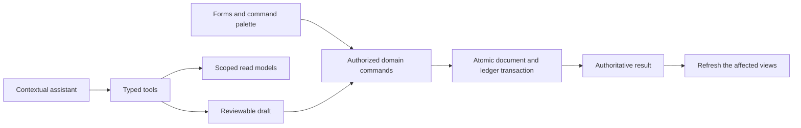

# Client experience and AI-native patterns: what to match, what nobody has built

Date: 2026-09-09. Status: canonical for the client spec ([client-patterns.md](../specs/client-patterns.md)) and for the first AI interactions. Merged from two same-day investigations (entry speed with pinned-commit inventories; AI-native patterns with Zoho demo and Midday API inspection); both earlier files are superseded by this one. Complements [ledger-architecture.md](./ledger-architecture.md), which owns the posting and storage conclusions and is not repeated here.

Source labels: [official] vendor help; [source] code at a pinned commit; [community] forum or issue tracker; [inference] our reading, not observed.

## Question

What do sfab-starter, Frappe Books, Midday, Zoho Books and ERPNext do for entry speed, user experience and AI-assisted work, what does TallyPrime's keyboard model actually cost in keystrokes, and where can a two-person team match Tally and offer a better experience than the cloud tools while staying production grade?

## Answer

1. **Tally's speed is a keystroke floor, and it is measurable.** From the Gateway, a bank receipt against one bill with a UTR is about 35 keystrokes, 15 of them navigation; a two-line GST sales invoice is about 44, 17 navigation. The floor comes from one modal screen per voucher, filter-as-you-type ledger lists, inline sub-screens closed by Ctrl+A, and inline master creation with Alt+C. No published measurement compares Tally with any cloud tool; every speed claim in the market is qualitative.
2. **Nobody in the field, open or closed, has built the keyboard entry grid.** Frappe Books' grid ignores Tab, its autocomplete does not select on Tab, and its 2022 "100 percent keyboard" issue closed unfulfilled in 2025. Midday, at 15,000 stars, is pointer-first: Enter is swallowed form-wide, product pick is the only keyboard path. Zoho ships module-jump shortcuts and quick-create but no row or field shortcuts, and users still request them. ERPNext's forum proposed a "Fast Voucher Entry" workspace in July 2026 because Tally and Busy users find entry slower. The gap is real, but the founder's call is to close most of it with a command palette and conventional fast forms, and to measure before building a shortcut grammar.
3. **The reusable patterns are few and specific.** From Midday: URL-opened sheets, snapshot rollback on optimistic updates, skeletons from real column definitions, a virtualized infinite table, scoped hotkeys with kbd hints, snapshot-diff autosave. From Frappe Books: a context-scoped shortcut registry, "Create <typed text>" as the last option of a link field, HSN and tax inheritance. From sfab-starter: integer minor-unit money input helpers and nothing else. All are patterns to re-implement on our stack; none is code to paste (Midday and Frappe Books are both AGPL-3.0; see answer 7).
4. **Integrity is the second differentiator and Tally's own users already understand it.** Tally edits any saved voucher in place from the Day Book; the Edit Log is permanent only in a separate edition; automatic numbering renumbers on insert unless a Release 3.0 option is set. An always-on append-only ledger with a per-role back-date limit expressed the way Tally expresses it (days allowed plus a cut-off date) is familiar to every CA and absent from both cloud tools' marketing.
5. **Pricing frame.** Zoho Books India charges per organization, Standard at 899 rupees a month; a three-entity owner pays three times. Per-organization pricing is the norm to bundle against.
6. **AI belongs in the workflow, through the same commands as the UI.** Midday's assistant is a bounded tool loop with team and scope context assembled server-side, streamed structured messages, a rate limiter, and client invalidation of affected query families after tool output. sfab-starter's agent tools take organization context from the runtime, never from model arguments, and hand money mutations back to product screens. For Books: the palette and the assistant both resolve to `orgProcedure` commands; the assistant reads scoped models and prepares reviewable drafts; it never owns a second accounting implementation.
7. **Licensing is more nuanced than "AGPL, so copy".** Frappe Books is AGPL-3.0-only, not GPL-3. Midday's LICENSE is standard AGPL-3.0 but its README says "for non-commercial use" and asks commercial users for a commercial license; those statements conflict, so resolve Midday's intended grant before copying its source. sfab-starter is MIT.
8. **"Unmatched by any accounting software" has no defensible basis yet.** The incumbents already have the obvious features: Tally's F-keys and in-context masters, Zoho's customizable shortcuts, Frappe's Awesome Bar. A defensible claim names the workflow, the users, the version and a measured result.

## Evidence

### TallyPrime [official]

| Claim                                                                                                                                                                                                                       | Source                                                                                                                      |
| --------------------------------------------------------------------------------------------------------------------------------------------------------------------------------------------------------------------------- | --------------------------------------------------------------------------------------------------------------------------- |
| Receipt: Gateway > Vouchers > F6; fields Account, Particulars, Amount, Bank Allocations, Bill-wise Details, Narration; Ctrl+A saves. TallyPrime 7.1 banner.                                                                 | https://help.tallysolutions.com/payments-and-receipts-tally/                                                                |
| Receipt against invoice: Bill-wise "Agst Ref", pick the sales voucher; Bank Allocation asks transaction type and instrument number.                                                                                         | https://help.tallysolutions.com/sales-receipts-additional-charges-discounts-free-items/                                     |
| Sales item invoice: F8, party, Dispatch Details sub-screen, sales ledger, item, quantity, rate; Alt+C creates a stock item inline.                                                                                          | https://help.tallysolutions.com/tally-prime/sales-process/sales-of-goods-services/                                          |
| Shortcuts (page dated 4 Aug 2025): Alt+G go to, Alt+C create master, Ctrl+A accept, Esc back, Alt+D delete, Alt+2 duplicate, Alt+X cancel, Alt+I insert, Ctrl+Enter alter master during entry, F2 date, Ctrl+H change mode. | https://tallysolutions.com/tally/shortcut-keys-in-tally-prime/                                                              |
| Day Book: Enter opens any voucher in alteration; cancel keeps the number, delete removes it, insert renumbers under automatic numbering.                                                                                    | https://help.tallysolutions.com/day-book-tally/                                                                             |
| Numbering methods: Automatic (renumber on insert or delete unless "Retain Original Voucher No.", Release 3.0), Manual, Multi-user Auto, None.                                                                               | https://help.tallysolutions.com/use-voucher-numbering-methods/, https://help.tallysolutions.com/release-notes-tallyprime-3/ |
| Per-role "Days allowed for Back Dated vouchers" default 0 and "Cut-off date for Backdated vouchers".                                                                                                                        | https://help.tallysolutions.com/manage-users-in-tallyprime/                                                                 |
| Edit Log (Release 2.1) logs user, time, version, changed fields; in regular TallyPrime it can be disabled and erased; permanent only in the "TallyPrime Edit Log" edition.                                                  | https://help.tallysolutions.com/edit-log-in-tallyprime-faq/                                                                 |
| CA view: Mark modified vouchers and the Marked Voucher Register; deleted vouchers are not listed.                                                                                                                           | https://help.tallysolutions.com/tally-prime/accounting/mark-changed-vouchers-tally/                                         |

Filter-as-you-type on the List of Ledgers is not documented on any help page; the counts below treat it as known behaviour.

### Keystroke counts, desk-derived from the help pages

Assumptions: company open at the Gateway; date already correct; Single Entry and Item Invoice modes persist; three typed letters make the target the first match; Enter accepts a prefilled field.

Receipt of 25,000 rupees from Sharma Traders into HDFC Bank by transfer, UTR entered, against one bill:

| Step                                           | Keys                        |
| ---------------------------------------------- | --------------------------- |
| V, F6                                          | 2                           |
| Account HDF Enter                              | 4                           |
| Particulars SHA Enter                          | 4                           |
| Amount 25000 Enter                             | 6                           |
| Bill-wise: Agst Ref, bill, amount, Ctrl+A      | 4                           |
| Bank allocation: type, UTR123456, date, Ctrl+A | 14                          |
| Ctrl+A save                                    | 1                           |
| Total                                          | 35 (15 navigation, 20 data) |

Two-line sales invoice, party Sharma Traders, items 10 x 500 and 5 x 1200, CGST plus SGST:

| Step                                          | Keys                        |
| --------------------------------------------- | --------------------------- |
| V, F8                                         | 2                           |
| Party SHA Enter, Dispatch Ctrl+A              | 5                           |
| Sales ledger SAL Enter                        | 4                           |
| Item 1: ITE Enter, 10 Enter, 500 Enter, Enter | 12                          |
| Item 2: same shape                            | 13                          |
| Enter on blank item line                      | 1                           |
| CG Enter, SG Enter                            | 6                           |
| Ctrl+A                                        | 1                           |
| Total                                         | 44 (17 navigation, 27 data) |

### Zoho Books India [official unless labelled]

| Claim                                                                                                                                                                                                                                                                                                                                                                                                                                                                                                                | Source                                                                                                               |
| -------------------------------------------------------------------------------------------------------------------------------------------------------------------------------------------------------------------------------------------------------------------------------------------------------------------------------------------------------------------------------------------------------------------------------------------------------------------------------------------------------------------- | -------------------------------------------------------------------------------------------------------------------- |
| Pricing per organization per month, fetched 2026-09-09: Free (revenue up to 25 lakh), Standard 899 (749 annual), Professional 1,799, Premium 3,599, Elite 5,999, Ultimate 9,599; extra user 180.                                                                                                                                                                                                                                                                                                                     | https://www.zoho.com/in/books/pricing/                                                                               |
| Invoice is one page: customer dropdown with inline "+ New Customer", auto number, dates, item table with "+ Add New Item" and "+ Add New Row".                                                                                                                                                                                                                                                                                                                                                                       | https://www.zoho.com/us/books/help/invoice/                                                                          |
| Payment form is one page: customer, amount, date, mode, deposit account, reference, invoice list with "Pay in full".                                                                                                                                                                                                                                                                                                                                                                                                 | https://www.zoho.com/us/books/help/payments-received/                                                                |
| Shortcuts: "/" search, Shift+letter module jumps, N new, C+I new invoice, C+1 new payment, Option+S save and send; no shortcut for add row, field jump, or save as draft.                                                                                                                                                                                                                                                                                                                                            | https://www.zoho.com/in/books/help/getting-started/keyboard-shortcuts.html                                           |
| "Keyboard shortcut for Invoices & Bills" user request exists (page 404 today). [community]                                                                                                                                                                                                                                                                                                                                                                                                                           | https://zohofinance.uservoice.com/forums/283818-zoho-books/suggestions/41162479-keyboard-shortcut-for-invoices-bills |
| Web app cannot be used offline (Zoho Invoice KB); Zoho Books offline requests unanswered.                                                                                                                                                                                                                                                                                                                                                                                                                            | https://www.zoho.com/invoice/kb/general/zoho-invoice-offline.html                                                    |
| Demo driven in a browser (second investigation): Payments Received > New shows customer, amount received, bank charges, date, payment number, method, deposit account, reference, deductions, unpaid invoices, applied total and excess amount; Enter selects the highlighted customer, Tab moves to amount, selecting the customer loads unpaid invoices, cancel prompts before discarding. A TDS label appeared on the US demo; that is a demo label, not edition evidence. No payment saved, no latency measured. | https://www.zoho.com/us/books/accounting-software-demo/#/paymentsreceived/new                                        |

### ERPNext [official unless labelled]

| Claim                                                                                                                                 | Source                                                                                                |
| ------------------------------------------------------------------------------------------------------------------------------------- | ----------------------------------------------------------------------------------------------------- |
| Sales Invoice is a full form; save the draft, then Submit to affect the books.                                                        | https://docs.frappe.io/erpnext/user/manual/en/sales-invoice                                           |
| Naming series such as ACC-SINV-.YYYY.- (updated 2026-03-04).                                                                          | https://docs.frappe.io/erpnext/user/manual/en/naming-series                                           |
| Awesomebar opens any doctype, report or new record (updated 2026-08-14).                                                              | https://docs.frappe.io/erpnext/awesomebar-global-search                                               |
| No official shortcut page; 2017 forum: no option to configure it. [community]                                                         | https://discuss.frappe.io/t/accessing-sales-invoice-using-keyboard-shortcut-instead-of-mouse/29831    |
| 8 Jul 2026 thread: accountants from Busy or Tally find voucher entry slower; asks for keyboard-first single-screen entry. [community] | https://discuss.frappe.io/t/should-erpnext-have-a-fast-voucher-entry-workspace-for-accountants/163489 |
| #14624 (2018): "5 seconds to add row" past 30 to 50 rows. #36891 (2023): submit about 4 s at 89,109 invoices. [community]             | https://github.com/frappe/erpnext/issues/14624, https://github.com/frappe/erpnext/issues/36891        |

### Frappe Books [source, commit a79a1e3, v0.37.0, 2026-09-06]

| Claim                                                                                                                                                                                                                                                  | Source                                                                                                                     |
| ------------------------------------------------------------------------------------------------------------------------------------------------------------------------------------------------------------------------------------------------------ | -------------------------------------------------------------------------------------------------------------------------- |
| Context-scoped shortcut registry keyed by `KeyboardEvent.code`, newest context wins, keys ignored inside inputs unless a modifier is held.                                                                                                             | `src/utils/shortcuts.ts:25-79`, `src/utils/vueUtils.ts:33-64`                                                              |
| Shortcuts: Cmd/Ctrl+S save or submit, Cmd/Ctrl+Backspace cancel or delete, Cmd/Ctrl+N new, Cmd/Ctrl+K search, Escape closes panels.                                                                                                                    | `src/utils/vueUtils.ts:162-163`, `src/pages/ListView/ListView.vue:197-201`, `src/components/SearchBar.vue:363-396`         |
| Link field appends "Create" using the typed text and opens a schema-declared quick-edit side panel.                                                                                                                                                    | `src/components/Controls/Link.vue:128-173`                                                                                 |
| Autocomplete: Enter selects; Tab and Esc only close, never select. Grid: Enter on the add-row button only; no Tab handling.                                                                                                                            | `src/components/Controls/AutoComplete.vue:33-41`, `src/components/Controls/Table.vue:175-187`                              |
| Save and submit are synchronous but not wrapped in a transaction; number series is read-modify-write without a lock.                                                                                                                                   | `fyo/model/doc.ts:883-954, 1012-1023`, `models/Transactional/LedgerPosting.ts:157-165`, `fyo/models/NumberSeries.ts:44-64` |
| GST: per-item template GST-x or IGST-x, no intra or inter-state switch from party state; HSN inherits group to item to line.                                                                                                                           | `src/regional/in/in.ts:9-48`, `models/baseModels/Item/Item.ts:71-84`                                                       |
| Issues: #451 "near 100 percent keyboard" (2022, closed 2025 unfulfilled), #1401 Tab skips a field (Dec 2025, open), #413 sync (open since 2022), #819 and #815 incorrect P&L and trial balance. [community]                                            | https://github.com/frappe/books/issues/451, /1401, /413, /819, /815                                                        |
| The pinned commit itself fixes a nested quick-edit case where the parent component was destroyed before the created value was written back: inline create needs correct state ownership through nested creation and cancellation, not merely a drawer. | https://github.com/frappe/books/commit/a79a1e3b03f424805ad094e2fd8731d04f84d36f                                            |
| Document shortcuts are removed when the view deactivates or unmounts; save versus submit is chosen from document state.                                                                                                                                | `src/utils/vueUtils.ts:112-191`                                                                                            |
| The ledger report converts amounts to floating point for display; our bigint-to-export precision requirement is not satisfied by copying their reports.                                                                                                | `reports/LedgerReport.ts:100-112`                                                                                          |
| License: AGPL-3.0-only.                                                                                                                                                                                                                                | `package.json:98`, `LICENSE`                                                                                               |

### Midday dashboard [source, commit 5158731, 2026-06-13, AGPL-3.0, 14,971 stars]

| Claim                                                                                                                                                                                                              | Source                                                                                                                                        |
| ------------------------------------------------------------------------------------------------------------------------------------------------------------------------------------------------------------------ | --------------------------------------------------------------------------------------------------------------------------------------------- |
| Next.js 16, tRPC v11 over TanStack Query v5, nuqs for every sheet and filter URL param, zustand for UI-only state, shadcn on Radix, react-hotkeys-hook.                                                            | `apps/dashboard/package.json:17-90`                                                                                                           |
| 22 global sheets opened only by URL params and pre-mounted with dynamic import.                                                                                                                                    | `src/components/sheets/global-sheets.tsx:27-64`, `src/hooks/use-transaction-params.ts:4-15`                                                   |
| Hotkeys scoped with `enabled:`; ⌘K search, ⌘S focus filter, ↑/↓ step the open sheet through rows, ⌘M mark and advance.                                                                                             | `src/components/search/search-modal.tsx:9-30`, `tables/transactions/data-table.tsx:522-544`, `src/components/transaction-shortcuts.tsx:30-75` |
| Optimistic rollback: cancel queries, snapshot detail and infinite list, set both, restore both on error.                                                                                                           | `src/components/forms/transaction-edit-form.tsx:83-168`                                                                                       |
| Virtualized infinite table, 45 px rows, overscan 10, next page within 50 rows of the end; skeleton from real column defs.                                                                                          | `data-table.tsx:480-485`, `src/hooks/use-infinite-scroll.ts:40-59`, `tables/transactions/loading.tsx:14-30`                                   |
| Invoice editor: 500 ms debounced autosave that diffs a JSON snapshot and commits the snapshot only on success; number is INV- max plus one per team with a live duplicate check.                                   | `src/components/invoice/form.tsx:214-302`, `packages/db/src/queries/invoices.ts:641-696`                                                      |
| Enter swallowed form-wide; product autocomplete handles ↑/↓/Enter/Esc, Tab only closes; no Enter-to-add-line, no cell flow.                                                                                        | `invoice/form.tsx:417-422`, `invoice/product-autocomplete.tsx:279-334`                                                                        |
| Assistant (API app): chat route assembles team, user and scope context, streams structured UI messages, applies a rate limiter; the runtime is a bounded tool loop.                                                | `apps/api/src/rest/routers/chat.ts:35-167`, `apps/api/src/chat/assistant-runtime.ts:19-83`                                                    |
| Client invalidates affected query families after tool output arrives.                                                                                                                                              | `apps/dashboard/src/components/chat/chat-invalidation.ts:91-195`                                                                              |
| Inbox: explicit accept and decline controls for suggested matches, plus an automatic matching path that copies extracted tax fields onto an existing transaction. Not all AI-derived changes are reviewed there.   | `src/components/inbox/suggested-match.tsx:55-105`, `packages/db/src/queries/inbox-matching.ts:53-87`                                          |
| Filtered and review requests ask for up to 10,000 rows; virtualization bounds rendered rows, not download size or query cost.                                                                                      | `data-table.tsx:120-153`                                                                                                                      |
| License: LICENSE is standard AGPL-3.0 (Copyright 2023-present Midday Labs AB); README section "License" says AGPL-3.0 "for non-commercial use" and asks commercial users to contact them for a commercial license. | `LICENSE:1-29`, `README.md:80-89`                                                                                                             |

### sfab-starter [source, commit b26ed0d, 2026-09-06, MIT, 7 stars, one maintainer]

Cloudflare template (TanStack Start, Hono RPC, Drizzle on D1, Better Auth organization plugin, shadcn on Base UI) whose real subject is an AI organization agent. Forms are dialog plus react-hook-form; the line editor is button-opened with a mouse-first select and only Escape wired (`draft-line-editor.tsx:137-149`); saved rows commit on blur with toast-only errors (`line-item-row.tsx:43-61`). Organization scope is read from the session's active organization with a first-membership fallback (`_protected.tsx:25-50`), which contradicts our Hard Rule 2. No hotkeys, no loaders, no virtualization, no offline. Reusable: integer minor-unit input helpers (`packages/ui/src/lib/money.ts:36-66`) and a Strict-Mode-safe callback-ref autofocus. Its agent tools take organization context from the runtime rather than model arguments and a guard checks the caller's current role for writes; money mutations are handed back to product screens (`packages/agent/src/tool-parts/transaction/payments.ts:28-52`, `packages/agent/src/tools/guard.ts:6-26`). Its finalizer writes the event log after the database batch and the comment accepts losing the event on a crash between the two writes (`packages/core/src/transaction/finalize.ts:170`); its reporting module is a placeholder type (`packages/core/src/reporting/index.ts`). Neither is acceptable for financial history.

## What this proves, and does not

- Proves: the keystroke floor of Tally from official field sequences; the absence of a keyboard entry grid in Frappe Books, Midday, and sfab-starter from source; Zoho's shortcut set and pricing from official pages; the ERPNext speed complaint from a 2026 first-party forum thread.
- Does not prove: seconds per voucher in any tool (no timed run exists anywhere we looked); Zoho's actual keystroke path (the demo is a shell and the help pages describe fields, not keys); ERPNext number assignment timing (docs silent); adoption or willingness to switch (out of scope here, owned by the validation packet).
- Keystroke counts are desk-derived. They are a floor to design against, not a benchmark to publish.
- Not established by any source: Tally parity, lower error rates, better accessibility, faster onboarding, accountant acceptance, willingness to switch, or the cost of supporting external customers. Source inspection cannot settle those; observed operator work and the validation packet can.

## What this means for us

Founder direction, 2026-09-09: the references are for patterns and architecture (AI-native, modern, excellent UI and UX, production grade). A command palette is the entry surface; a bespoke shortcut grammar is not built early.

1. **Command palette first.** One cmdk-style palette on Base UI, opened by ⌘K or Ctrl+K and by "/", is the single keyboard surface: go to any document or master, create any document, run any action on the open document. This is what Zoho (module jumps plus quick-create), ERPNext (Awesomebar) and Midday (⌘K search that opens sheets) all converged on. Frappe Books' rule applies: keys are ignored inside inputs unless a modifier is held.
2. **Forms stay conventional and fast: Enter advances, Tab selects the highlighted match, Esc backs out.** That is the default behaviour of Base UI fields and combobox plus two small rules, not a shortcut system. No F-keys, no Alt chords, no shortcut customizer. The Tally grammar in the evidence above is a measurement reference, not a build list.
3. **Masters cached on the client.** Party, Item, Account and Payment Method lists live in the query cache with long staleness and are filtered locally; the server round-trip is on post only. This is the single architectural fact behind Tally's feel, per ledger-architecture.md section 4, and it costs nothing in UI.
4. **Production patterns to re-implement on our stack, from Midday:** create and edit overlays opened by router search params on `$orgSlug` routes; snapshot rollback for optimistic updates on detail plus list; skeletons built from real column definitions; one virtualized infinite table primitive; snapshot-diff autosave for drafts; server-side PDF. From Frappe Books: "Create <typed text>" as the last option in every link field, opening a quick-edit panel that returns the value; print templates as data. Do not add zustand, nuqs, Radix, framer-motion, tRPC or react-hotkeys-hook; TanStack Router search params, TanStack Query, Base UI and CSS own that ground already.
5. **AI-native, what the references actually show.** sfab-starter's real subject is an organization agent: every write tool is listed in an invalidation registry keyed by tool name, asserted at startup, so agent writes refresh the query cache like user writes (`lib/agent-tool-invalidation-registry.ts:27-64`). That one pattern transfers directly to our command log: an agent action is a named command, so it is idempotent, audited and invalidates the same keys. Midday's assistant and inbox matching were outside the inspected checkout (`apps/api`) and are not evidenced here. The accounting-core spec already reserves the read model and change feed for a later spec; nothing in these references argues for an agent that writes the ledger directly.
6. **Integrity expressed in Tally's words.** Per-role back-date days and a cut-off date map onto Period Lock and Lock Exception; the Marked Voucher Register maps onto a "changed since" report over reversals for the CA. Product copy: no voucher is ever altered; corrections are new vouchers.
7. **Two-person scope.** Palette, link field with inline create, overlay by URL, one table primitive, one form pattern. Build each once for Receipt in slice 2, then reuse. The keystroke targets below are a measurement to run, not a feature to ship; if the measured gap is inside 10 percent with a palette and conventional forms, the shortcut grammar is never built.
8. **Pricing.** One price for the owner across all Organizations, positioned against Zoho Standard times entity count. Validation packet H6 already gates this.

### The experience, as observable behaviour

A proposed product contract for the client spec, not a description of current code:

1. **Stay in the task.** Find or create a Party and return to the receipt with entered values intact. Optional detail sits behind deliberate expansion; nothing needed to decide what the money represents is hidden.
2. **Make repetition effortless.** Predictable focus order, an explicit post action, post-and-next returning focus to the next receipt. Carry only safe context within the session, such as date and payment method; never the previous Party or amount.
3. **Tell the truth about state.** Draft, posting, posted and failed are distinct. The final number and final print exist only after the authoritative commit. A lost response is recoverable through the same command id.
4. **Keep review connected.** Preserve list filter, position and selected record. Show the receipt, its source evidence, allocations and accounting effect together. A correction explains what reverses and what remains due.
5. **Make the handover complete.** Report totals trace to documents; outstanding amounts are explainable; exports open cleanly. A fresh report is never presented as a reconciled or closed period.

### AI in the workflow

The palette finds records and opens actions without a model. The assistant handles ambiguous language, extraction and explanation. Both resolve to the same `orgProcedure` commands; a tool annotation or system prompt is never an authorization check. Model output is untrusted input, like an imported file; uploaded instructions cannot grant access.

| AI interaction                    | Useful behaviour                                                           | Acceptance boundary                                                                             |
| --------------------------------- | -------------------------------------------------------------------------- | ----------------------------------------------------------------------------------------------- |
| Explain a balance                 | Answer with period, Organization and links to the documents used           | Values come from scoped queries; an unclosed period is named; no invented numbers               |
| Prepare a Bill from an upload     | Extracted fields beside their source, missing or conflicting facts flagged | The user corrects the draft; deterministic rules compute and validate amounts and tax           |
| Find a receipt or invoice         | Natural-language search opens the actual record                            | Permission-filtered; selection keeps the current task context                                   |
| Suggest an allocation or category | A concrete proposal with its evidence                                      | Outstanding and permissions are revalidated on apply; a posted record is never silently changed |
| Carry out a requested action      | Target, proposed change and outcome shown in ordinary product UI           | The existing command, stable retry id, explicit post action                                     |

Start with one read interaction and one preparation interaction once the read model exists (a later spec per the accounting core). No general agent platform, autonomous close, or integration catalogue.

### Production grade means demonstrable recovery

| Property                  | Required observable result                                                                                                                                  |
| ------------------------- | ----------------------------------------------------------------------------------------------------------------------------------------------------------- |
| Financial integrity       | Documents, numbering, journals and history commit together; concurrent posting and retries never duplicate money                                            |
| Tenant and role isolation | The same action is denied through forms, palette, assistant and integrations when the caller lacks permission                                               |
| Honest UI                 | Draft, processing, failed and posted are distinct; a dropped response cannot look like a rejection                                                          |
| AI failure containment    | Provider timeout, invalid extraction or an unavailable model leaves ordinary accounting usable, with the source kept and a clear next action                |
| Bounded operation         | Time, token and tool-step budgets; background retries with stable ids; failed jobs exposed, not hidden                                                      |
| Restore and release       | Database and object restore, compatible migrations, private files and usable printing demonstrated with production-like artifacts, per the Operations owner |
| AI quality                | A small set of representative documents and questions with accountant-approved expected results, re-run on every model or prompt change                     |

Where the core spec or Operations already owns a property, link to it rather than restating it. Measure immediate response, confirmed save and whole-task completion separately; the core's 30 ms posting and 100 ms reporting targets are server targets, not Tally parity. Interaction to Next Paint's good threshold is 200 ms at the 75th percentile.

### Two people, deliberately

One person owns the financial core, imports and reconciliation; the other owns entry, review, printing and operator observation. Both review every money or tenancy change. One operator workflow and one pilot entity at a time, with the other entities as checks against domain coupling. Reserve explicit weekly capacity for verification, release, support and restore checks; if support grows, cut feature work rather than normalising manual repair. AGPL reuse reduces implementation work and removes no responsibility for tax rules, hosting, migration, security or correctness.

## Next falsification

- Time ten receipts and ten two-line invoices in TallyPrime with a stopwatch and a keystroke logger to convert the floor to seconds (validation packet H4). Then time the same ten in the slice 2 Receipt form with the palette and conventional forms only. Pass within 10 percent, kill over 25 percent slower; only a kill reopens the shortcut question.
- Verify filter-as-you-type behaviour in Tally during that run, since no help page documents it.
- Watch one accountant record a day's receipts in Tally before designing any sub-screen flow; the desk-derived counts assume expert habits.
- Prove one complete Receipt interaction: palette access, inline Party creation, distinct posting state, print, return to the list, on desktop and mobile in both themes. Observe operators doing the same work in Books and their incumbent; record task time, waiting, errors and recovery.
- Once the read model exists, answer one question such as "why is this Party's balance this amount" with linked source records; compare with the deterministic report and the CA's expectation; check an empty result, a forbidden Organization and a model timeout.
- Demonstrate retry after a lost post response and a production-like restore before broadening AI or feature scope.
- Resolve Midday's licence intent in writing before copying any of its source.

## Sources

Second investigation, verified 2026-09-09: Tally [keyboard shortcuts](https://help.tallysolutions.com/tally/keyboard-shortcuts-tally-prime/) and [working with reports](https://help.tallysolutions.com/working-with-reports/); Zoho [keyboard shortcuts](https://www.zoho.com/us/books/help/getting-started/keyboard-shortcuts.html) and the [payment entry demo](https://www.zoho.com/us/books/accounting-software-demo/#/paymentsreceived/new); Frappe Framework [keyboard shortcuts](https://docs.frappe.io/framework/keyboard-shortcuts) and [May 2026 product update](https://frappe.io/blog/product-updates/product-updates-for-may-2026); Midday [chat route](https://github.com/midday-ai/midday/blob/51587319f26a0ffaa9dfccab1920373cb65689b7/apps/api/src/rest/routers/chat.ts#L35-L167), [assistant runtime](https://github.com/midday-ai/midday/blob/51587319f26a0ffaa9dfccab1920373cb65689b7/apps/api/src/chat/assistant-runtime.ts#L19-L83), [chat invalidation](https://github.com/midday-ai/midday/blob/51587319f26a0ffaa9dfccab1920373cb65689b7/apps/dashboard/src/components/chat/chat-invalidation.ts#L91-L195), [inbox matching](https://github.com/midday-ai/midday/blob/51587319f26a0ffaa9dfccab1920373cb65689b7/packages/db/src/queries/inbox-matching.ts#L53-L87), [LICENSE](https://github.com/midday-ai/midday/blob/51587319f26a0ffaa9dfccab1920373cb65689b7/LICENSE) and [README licence wording](https://github.com/midday-ai/midday/blob/51587319f26a0ffaa9dfccab1920373cb65689b7/README.md#L80-L89); sfab-starter [agent guard](https://github.com/sfab-oss/sfab-starter/blob/b26ed0d96413a5019c444f9fc36052ecf08c5fdf/packages/agent/src/tools/guard.ts#L6-L26) and [finalize](https://github.com/sfab-oss/sfab-starter/blob/b26ed0d96413a5019c444f9fc36052ecf08c5fdf/packages/core/src/transaction/finalize.ts#L156-L181); Frappe Books [LedgerReport](https://github.com/frappe/books/blob/a79a1e3b03f424805ad094e2fd8731d04f84d36f/reports/LedgerReport.ts#L100-L112) and [package.json licence](https://github.com/frappe/books/blob/a79a1e3b03f424805ad094e2fd8731d04f84d36f/package.json); [web.dev INP](https://web.dev/articles/inp); [GNU licence FAQ on selling](https://www.gnu.org/licenses/gpl-faq.en.html#DoesTheGPLAllowMoney). Local prior art: `apps/web/src/components/opd-customer-picker.tsx` (bounded search, inline create, focus return), `apps/web/src/lib/domain-invalidation.ts`, `apps/web/src/hooks/use-zod-form.ts`, `docs/development.md#react-and-forms`.

First investigation. Official: TallyPrime help and shortcut pages, Zoho Books India pricing and help, docs.frappe.io ERPNext manual, Zoho Invoice KB, as linked above. Source: frappe/books at a79a1e3, midday-ai/midday at 5158731, sfab-oss/sfab-starter at b26ed0d, inspected 2026-09-09. Community: frappe/books issues #451, #1401, #413, #819, #815; frappe/erpnext issues #14624, #36891; discuss.frappe.io threads of 2017 and July 2026; Zoho UserVoice title. Not found anywhere: a timed or keystroke-counted comparison of Tally against any cloud tool; an official Zoho Books offline page; an official ERPNext shortcut list.
